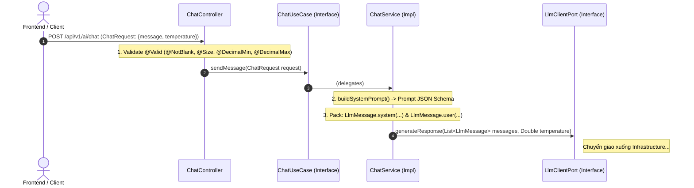
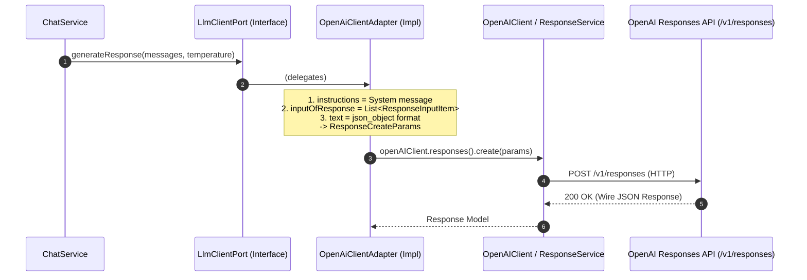
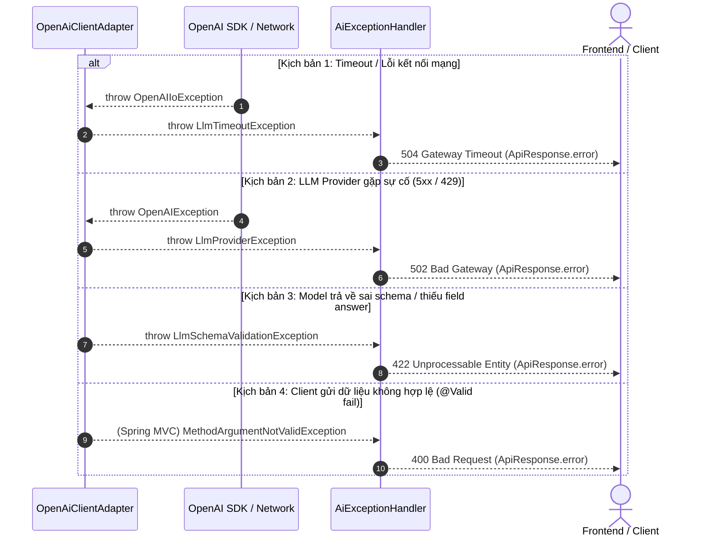

# Module AI (Customer Support Platform)

Module `com.platform.app.ai` chịu trách nhiệm cung cấp khả năng AI Assistant cho nền tảng Customer Support. Module được thiết kế theo kiến trúc **Clean Architecture / Ports & Adapters (Hexagonal Architecture)** nhằm đảm bảo tính độc lập, khả năng kiểm thử cao và dễ dàng hoán đổi hoặc mở rộng các nhà cung cấp mô hình ngôn ngữ lớn (LLM Providers).

> **Vai trò trong tiến trình Agentic**: Slice 1 được thiết kế dưới dạng một **Atomic Execution Step (hàm suy luận đơn nguyên tử)**. Thiết kế cô lập này đảm bảo khi tiến lên **Slice 4 (Agentic Loop)**, hệ thống chỉ việc tái sử dụng Slice 1 làm Execution Node bên trong vòng lặp ReAct / State Machine mà không phải chỉnh sửa logic gọi mô hình.

---

## 1. Kiến trúc tổng quan (Architecture Overview)

Module tuân thủ nghiêm ngặt quy tắc phân tầng và chiều phụ thuộc hướng tâm (Dependency Inversion):

```
                        ┌───────────────────────────────────────────┐
                        │                 API Layer                 │
                        │             (Inbound Adapter)             │
                        │    ChatController, AiExceptionHandler    │
                        └─────────────────────┬─────────────────────┘
                                              │ calls
                                              ▼
                        ┌───────────────────────────────────────────┐
                        │             APPLICATION Layer             │
                        │       ChatUseCase (Inbound Port)          │
                        │       ChatService (Orchestrator)          │
                        │       LlmClientPort (Outbound Port)       │
                        └──────────────┬─────────────┬──────────────┘
                         implements    │             │ uses
                                       ▼             ▼
  ┌──────────────────────────────────────────┐     ┌──────────────────────────────────────────┐
  │           INFRASTRUCTURE Layer           │     │               DOMAIN Layer               │
  │            (Outbound Adapter)            │     │              (Pure Java/DDD)             │
  │ OpenAiClientAdapter, LlmConfig/Properties│     │ AssistantResponse, Confidence, LlmMessage│
  │ (Ollama, Claude, vLLM Adapters...)       │     │ LlmTimeoutException, LlmProviderException│
  └──────────────────────────────────────────┘     └──────────────────────────────────────────┘
```

### Chi tiết các tầng

| Tầng               | Package                                                          | Vai trò                                                                                                                | Ràng buộc kỹ thuật                                                          |
| :----------------- | :--------------------------------------------------------------- | :--------------------------------------------------------------------------------------------------------------------- | :-------------------------------------------------------------------------- |
| **Domain**         | `domain.model`<br>`domain.exception`                             | Chứa các thực thể, Value Objects, Enums và Domain Exceptions cốt lõi.                                                  | Pure Java, tuyệt đối **không phụ thuộc framework** (Spring, Jackson, v.v.). |
| **Application**    | `application.port`<br>`application.service`<br>`application.dto` | Định nghĩa Use Case (Inbound Port), giao tiếp hạ tầng (Outbound Port) và điều phối luồng nghiệp vụ (`ChatService`).    | Phụ thuộc vào Domain, không phụ thuộc chi tiết kỹ thuật ở Infrastructure.   |
| **Infrastructure** | `infrastructure.client`<br>`infrastructure.config`               | Triển khai các Outbound Port (`LlmClientPort`) kết nối với API bên ngoài (OpenAI, Ollama...), cấu hình HTTP Client.    | Chứa logic serialization, network timeout, retry, sanitize dữ liệu.         |
| **API**            | `api`                                                            | Inbound REST Controller nhận HTTP request, xác thực dữ liệu đầu vào và chuyển đổi Exception thành HTTP Response chuẩn. | Sử dụng Jakarta Validation (`@Valid`) và `ApiResponse<T>`.                  |

---

## 2. Flow tương tác giữa các thành phần (Component Interaction Flow)

Để dễ theo dõi và bảo trì, luồng thực thi được phân rã thành **4 sub-flow độc lập** tương ứng với từng giai đoạn và kịch bản trong hệ thống:

---

### Flow 1: Tiếp nhận Request & Điều phối nghiệp vụ (Inbound & Application Layer)

Tập trung vào việc tiếp nhận HTTP Request, kiểm thực dữ liệu đầu vào và chuyển đổi thành Domain Message:



---

### Flow 2: Giao tiếp hạ tầng với OpenAI Responses API (Infrastructure Layer)

Tập trung vào việc chuyển đổi Domain Model sang chuẩn OpenAI Responses API và gọi upstream:



---

### Flow 3: Tiền xử lý, Parse JSON Schema & Mapping kết quả (Sanitization & Mapping)

Tập trung vào khâu làm sạch output text từ model, parse JSON schema và chuyển đổi dữ liệu trả về cho client:

````mermaid
sequenceDiagram
    autonumber
    participant Adapter as OpenAiClientAdapter
    participant Sanitizer as sanitizeJsonContent()
    participant Mapper as ObjectMapper
    participant Service as ChatService
    participant Controller as ChatController
    actor Client as Frontend / Client

    Note over Adapter: 1. Extract text from ResponseOutputText
    Adapter->>Sanitizer: sanitizeJsonContent(rawContent)
    Note over Sanitizer: Strip Markdown fences (```json ... ```)
    Sanitizer-->>Adapter: Clean JSON string

    Adapter->>Mapper: readValue(cleanJson, OpenAiStructuredOutputPayload.class)
    Mapper-->>Adapter: OpenAiStructuredOutputPayload (answer, confidence)

    Note over Adapter: 2. Extract token usage (input/output tokens)<br/>3. Build AssistantResponse (Domain Model)
    Adapter-->>Service: AssistantResponse

    Note over Service: 4. Map AssistantResponse -> ChatResponse (DTO)
    Service-->>Controller: ChatResponse
    Controller-->>Client: 200 OK - ApiResponse.ok(ChatResponse)
````

---

### Flow 4: Luồng xử lý và Chuẩn hóa ngoại lệ (Exception Handling Flow)

Tập trung vào việc bắt các lỗi từ hạ tầng, chuyển thành Domain Exception và map sang HTTP Status chuẩn:



---

### 2.2. Vòng đời chuyển đổi dữ liệu (Data Transformation Lifecycle)

```
[HTTP Request Body]
       │
       ▼
ChatRequest (Application DTO: message, temperature)
       │
       ▼  (ChatService builds System Prompt & maps)
List<LlmMessage> (Domain Value Object: SYSTEM, USER)
       │
       ▼  (OpenAiClientAdapter builds ResponseCreateParams)
ResponseCreateParams (OpenAI SDK Request: instructions, inputOfResponse, json_object)
       │
       ▼  (OpenAI Responses API executes via HTTP)
Response (OpenAI SDK Response: output text, usage tokens)
       │
       ▼  (OpenAiClientAdapter sanitizes & Jackson deserializes)
OpenAiStructuredOutputPayload (Infrastructure DTO: answer, confidence)
       │
       ▼  (OpenAiClientAdapter validates & maps to Domain)
AssistantResponse (Domain Model: answer, confidence, token metrics)
       │
       ▼  (ChatService maps to Application Response)
ChatResponse (Application DTO: answer, confidence, token metrics)
       │
       ▼  (ChatController wraps in ApiResponse)
ApiResponse<ChatResponse> (Standard HTTP Response Body)
```

---

## 3. Cấu trúc thư mục (Directory Structure)

```text
com.platform.app.ai/
├── api/                                      # [Inbound Adapter]
│   ├── ChatController.java                  # REST endpoint: POST /api/v1/ai/chat
│   └── AiExceptionHandler.java              # Controller Advice chuẩn hóa lỗi Domain -> HTTP Status
│
├── application/                              # [Application Layer]
│   ├── dto/
│   │   ├── request/ChatRequest.java         # DTO đầu vào kèm Jakarta Validation
│   │   └── response/ChatResponse.java       # DTO trả về cho Client
│   ├── port/
│   │   ├── in/ChatUseCase.java              # Inbound Port interface
│   │   └── out/LlmClientPort.java           # Outbound Port interface
│   └── service/
│       └── ChatService.java                 # Use case implementation & prompt orchestration
│
├── domain/                                   # [Domain Layer - Zero Framework Coupling]
│   ├── model/
│   │   ├── AssistantResponse.java           # Record chứa phản hồi đã cấu trúc (answer, confidence, tokens)
│   │   ├── Confidence.java                  # Enum: LOW, MEDIUM, HIGH
│   │   ├── LlmMessage.java                  # Value object: role (SYSTEM/USER/ASSISTANT) & content
│   │   └── LlmRole.java                     # Enum định danh vai trò tin nhắn
│   └── exception/
│       ├── LlmTimeoutException.java         # Bắn ra khi request gọi LLM quá thời gian quy định
│       ├── LlmProviderException.java        # Bắn ra khi nhà cung cấp LLM trả lỗi (5xx, 429...)
│       └── LlmSchemaValidationException.java# Bắn ra khi LLM trả về sai schema JSON quy định
│
└── infrastructure/                           # [Outbound Adapter]
    ├── client/
    │   ├── dto/                             # Payload schema parsing (OpenAiStructuredOutputPayload)
    │   └── OpenAiClientAdapter.java         # Implementation của LlmClientPort sử dụng Official OpenAI Java SDK (Responses API)
    └── config/
        ├── LlmProperties.java               # Type-safe Properties (prefix: app.ai.llm)
        └── LlmConfig.java                   # Cấu hình Bean OpenAIClient với Timeouts & Retries
```

---

## 4. Các nguyên tắc kỹ thuật (Core Principles)

### 4.1. Phân tách nhà mạng LLM qua Outbound Port (`LlmClientPort`)

Toàn bộ nghiệp vụ trong `ChatService` chỉ tương tác với `LlmClientPort`. Core application không biết và không quan tâm API thực tế đằng sau là OpenAI, Anthropic Claude, Ollama hay vLLM.

```
                 ┌── OpenAiClientAdapter (Hiện tại)
LlmClientPort ───┼── OllamaClientAdapter (Mở rộng Local LLM)
                 ├── ClaudeClientAdapter (Mở rộng Anthropic)
                 └── VllmClientAdapter   (Mở rộng Private Cloud)
```

### 4.2. Structured Outputs & Schema Enforcement (Probabilistic Failure Modes)

- **JSON Mode Enforcement**: Model được cấu hình trả về định dạng JSON bắt buộc (`text.format: json_object`).
- **Markdown Sanitization**: `OpenAiClientAdapter` thực hiện tiền xử lý làm sạch markdown fences (`json ... `) trước khi deserialize về `AssistantResponse`.
- **Probabilistic Semantic Validation**: Trong AI Engineering, LLM không chỉ sinh sai JSON syntax (thiếu ngoặc, sai kiểu dữ liệu), mà còn sinh JSON đúng cú pháp nhưng **sai ngữ nghĩa** (_Semantic Invalidation / Hallucinated Enums / Out-of-range Confidence_). Tầng Validation không chỉ dừng ở việc parse JSON, mà cần kiểm tra tính hợp lệ về mặt **miền giá trị (Domain Value Range)**:
  - Trường `answer` không được để trống (`isBlank()`).
  - Trường `confidence` phải thuộc whitelist enum định sẵn (`LOW`, `MEDIUM`, `HIGH`) hoặc nằm trong miền giá trị hợp lệ.
- Trường hợp payload thiếu trường bắt buộc, sai định dạng hoặc vi phạm miền giá trị, hệ thống ném `LlmSchemaValidationException` để tầng API trả về mã `422 Unprocessable Entity`.

### 4.3. Cơ chế chịu lỗi & Quản trị Độ trễ (Resilience & Latency SLA)

- **Timeout Boundaries**: Thiết lập `connectTimeout` và `requestTimeout` nghiêm ngặt qua cấu hình `app.ai.llm.timeout` nhằm tránh tình trạng treo thread server khi upstream phản hồi chậm.
- **Built-in SDK Retry**: Tự động thử lại khi gặp các lỗi tạm thời (I/O timeout, mã `5xx` / `429` từ LLM provider) theo số lần cấu hình trong `app.ai.llm.max-retries`.
- **Phân tách Latency SLA (Synchronous vs Streaming SSE)**: Nhận diện rõ hạn chế của mô hình Synchronous Request-Response (Blocking I/O) ở Slice 1: Phù hợp cho batch processing / internal service-to-service calls, nhưng là tiền đề để mở rộng sang **Server-Sent Events (SSE / Streaming)** ở các slice sau nhằm tối ưu hóa chỉ số **Time-To-First-Token (TTFT)** cho trải nghiệm người dùng và tránh nguy cơ bị Proxy / API Gateway timeout khi mô hình suy luận kéo dài.

### 4.4. Chuẩn hóa mã lỗi HTTP (Error Mapping)

| Domain Exception                  | HTTP Status Code           | Diễn giải                                                    |
| :-------------------------------- | :------------------------- | :----------------------------------------------------------- |
| `LlmTimeoutException`             | `504 Gateway Timeout`      | Hết thời gian chờ kết nối hoặc đọc dữ liệu từ LLM API        |
| `LlmProviderException`            | `502 Bad Gateway`          | LLM Provider gặp sự cố nội bộ hoặc từ chối phục vụ           |
| `LlmSchemaValidationException`    | `422 Unprocessable Entity` | LLM trả về cấu trúc không hợp lệ hoặc thiếu dữ liệu bắt buộc |
| `MethodArgumentNotValidException` | `400 Bad Request`          | Payload gửi lên từ client vi phạm ràng buộc validation       |

---

## 5. Cấu hình (Configuration Reference)

Các tham số cấu hình trong `application.yaml`:

```yaml
app:
  ai:
    llm:
      api-key: ${LLM_API_KEY:your-api-key}
      base-url: ${LLM_BASE_URL:https://api.openai.com/v1}
      model: ${LLM_MODEL:gpt-4o-mini}
      temperature: ${LLM_TEMPERATURE:0.2}
      timeout: ${LLM_TIMEOUT:10s}
      max-retries: ${LLM_MAX_RETRIES:3}
      retry-delay: ${LLM_RETRY_DELAY:500ms}
```

---

## 6. Tài liệu API (API Endpoints)

### `POST /api/v1/ai/chat`

Gửi tin nhắn yêu cầu tới AI Assistant và nhận về câu trả lời có cấu trúc.

**Headers:**

```http
Content-Type: application/json
Authorization: Bearer <JWT_ACCESS_TOKEN>
```

**Request Body:**

```json
{
  "message": "Làm thế nào để đổi mật khẩu tài khoản?",
  "temperature": 0.3
}
```

**Response (200 OK):**

```json
{
  "success": true,
  "message": "Message processed successfully",
  "data": {
    "answer": "Bạn có thể đổi mật khẩu bằng cách truy cập mục Cài đặt tài khoản > Đổi mật khẩu.",
    "confidence": "HIGH",
    "promptTokens": 65,
    "completionTokens": 32
  },
  "timestamp": "2026-08-17T11:20:00Z"
}
```

---

## 7. Mở rộng (Extensibility)

### Thêm một LLM Provider mới (Ví dụ: Ollama cho Local AI)

1. Tạo class `OllamaClientAdapter` trong `infrastructure.client` implement `LlmClientPort`.
2. Sử dụng `@ConditionalOnProperty(prefix = "app.ai.llm", name = "provider", havingValue = "ollama")`.
3. Không cần chỉnh sửa bất kỳ dòng code nào trong tầng `domain` hay `application`.

### Lộ trình tích hợp các Slice tiếp theo

- **Slice 2 (Conversation State)**: Bổ sung `ChatHistoryPort` (outbound) và `ConversationSession` trong `application/service` để lưu trữ ngữ cảnh hội thoại vào PostgreSQL.
- **Slice 3 (RAG / Knowledge Base)**: Bổ sung `KnowledgeRetrieverPort` (outbound) để truy vấn vector embedding từ pgvector và inject evidence vào context của prompt.
- **Slice 4 (Tool Calling / Agent Loop)**: Bổ sung `ToolRegistryPort` và điều phối vòng lặp tool execution trong `application`.

---

## 8. Chiến lược kiểm thử (Testing Strategy)

- **Unit Test**: Kiểm thử độc lập logic của `ChatService` và `OpenAiClientAdapter` bằng Mockito (mock `LlmClientPort`, mock `ResponseService`).
- **Integration Test**: Sử dụng `ChatControllerTest` kết hợp `@SpringBootTest` + `MockMvc` và `@MockitoBean` để kiểm thử toàn diện từ API endpoint, Authentication/Authorization, Request Validation cho đến Exception Handler.

Chạy toàn bộ test suite:

```bash
./gradlew.bat test --tests "com.platform.app.ai.*"
```

---

## 9. Knowledge in Big Process (Bức tranh tổng thể AI Application Engineering)

### 9.1. Vị trí của Slice 1 trong toàn bộ hệ thống

Trong hành trình xây dựng một nền tảng **Enterprise AI Application** (Customer Support Platform), Slice 1 đóng vai trò là **Lớp nền tảng (Foundational Substrate Layer)**. Toàn bộ lộ trình 9 Vertical Slices được cấu trúc như sau:

```
┌───────────────────────────────────────────────────────────────────────────────────┐
│                     Enterprise Customer Support AI Platform                       │
├───────────────────────────────────────────────────────────────────────────────────┤
│ [Slice 9] Production Scaling, Semantic Caching & Rate Limiting                    │
│ [Slice 8] Security Guardrails, Prompt Injection & Red Teaming                     │
│ [Slice 7] Observability, Tracing & Token Cost Tracking (FinOps)                   │
│ [Slice 6] Multi-turn Workflow Orchestration & Human-in-the-loop                   │
│ [Slice 5] Automated Evaluation, Faithfulness & Ground-Truth Testing               │
│ [Slice 4] Deterministic Routing, Tool Calling & Agentic Loop                      │
│ [Slice 3] RAG, pgvector Embeddings, Multi-Tenant ACL & Citation                   │
│ [Slice 2] Conversation State, Sliding Window Memory (PostgreSQL)                  │
├───────────────────────────────────────────────────────────────────────────────────┤
│ ★ [Slice 1 - HIỆN TẠI] LLM Foundations, Responses API & Port-Adapter Isolation    │
└───────────────────────────────────────────────────────────────────────────────────┘
```

---

### 9.2. Những bài học kỹ thuật cốt lõi thu nạp từ Slice 1

Sau khi hoàn thành Slice 1, những nguyên lý và bài toán lớn trong kỹ thuật phần mềm AI đã được làm sáng tỏ:

#### 1. Xem LLM như một Unreliable External Dependency (Tư duy Ports & Adapters)

- **Vấn đề thực tế**: Trong thực tế, nhiều hệ thống AI gặp thất bại vì phụ thuộc chặt chẽ vào các thư viện bọc (LangChain, framework trung gian) hoặc gọi trực tiếp API của một nhà cung cấp bên trong tầng nghiệp vụ. Khi nhà cung cấp đổi SDK, sập mạng hoặc dự án cần chuyển sang mô hình nội bộ (On-premise / Local LLM như Ollama/vLLM), toàn bộ codebase bị phá vỡ.
- **Giải pháp thu nạp**: Xem LLM như một hệ thống I/O bên ngoài không đáng tin cậy (tương tự cổng thanh toán bên thứ ba). Việc đóng gói toàn bộ logic gọi mô hình đằng sau Outbound Port `LlmClientPort` giúp Domain và Application Layer hoàn toàn độc lập với OpenAI, Anthropic hay Ollama.

#### 2. Chuẩn mới OpenAI Responses API vs Legacy Chat Completion

- **Vấn đề thực tế**: `/v1/chat/completions` cũ trộn lẫn `system`, `user`, `assistant` vào một mảng duy nhất, gây khó khăn cho việc phân tách rõ ràng giữa _chỉ thị của nhà phát triển (developer instructions)_ và _lượt trò chuyện của người dùng_, đồng thời cơ chế schema output còn lỏng lẻo.
- **Giải pháp thu nạp**: Ứng dụng trực tiếp chuẩn **Responses API** (`/v1/responses`):
  - `instructions`: Nơi đặt chỉ thị của hệ thống (Developer Prompt).
  - `inputOfResponse`: Quản lý danh sách các lượt hội thoại (`EasyInputMessage`).
  - `text.format`: Ép cấu trúc JSON chuẩn (`json_object`).

#### 3. Xử lý tính Bất định & Lỗi Ngữ nghĩa (Probabilistic Failure Modes & Structured Outputs)

- **Vấn đề thực tế**: LLM có bản chất sinh từ xác suất (probabilistic). Mô hình không chỉ sinh sai cú pháp JSON (thiếu ngoặc, thừa markdown fences), mà còn có thể sinh JSON đúng cú pháp nhưng sai ngữ nghĩa (_Semantic Invalidation_, sinh ra enum không tồn tại hoặc điểm confidence ngoài phạm vi).
- **Giải pháp thu nạp**:
  - Ép model trả về JSON và định nghĩa schema rõ ràng (`answer`, `confidence`).
  - Xây dựng cơ chế tiền xử lý khử markdown fence (`json ... `).
  - Kiểm tra tính hợp lệ về mặt **miền giá trị (Domain Value Range)**: `confidence` phải thuộc whitelist enum định sẵn (`LOW`, `MEDIUM`, `HIGH`), trường `answer` không được để trống.
  - Bắt lỗi và ném `LlmSchemaValidationException` $\rightarrow$ `422 Unprocessable Entity` thay vì để ứng dụng nhận dữ liệu rác.

#### 4. Quản trị Ranh giới Độ trễ & Chịu lỗi (Latency SLA & Fault Tolerance Boundaries)

- **Vấn đề thực tế**: Các API thông thường phản hồi trong $5 - 50\text{ms}$, nhưng một lệnh gọi LLM thường mất $1 - 10\text{s}+$. Nếu không có timeout cứng và retry thông minh, server sẽ nhanh chóng bị cạn kiệt Thread Pool và treo toàn bộ hệ thống. Bên cạnh đó, giữ kết nối HTTP Blocking quá lâu sẽ làm giảm trải nghiệm người dùng hoặc bị Proxy Gateway ngắt kết nối.
- **Giải pháp thu nạp**:
  - Cấu hình Timeout nghiêm ngặt ở tầng hạ tầng.
  - Phân loại lỗi chính xác: Lỗi mạng/Timeout $\rightarrow$ `504 Gateway Timeout`; Lỗi nhà mạng 5xx/429 $\rightarrow$ `502 Bad Gateway`; Lỗi dữ liệu đầu vào $\rightarrow$ `400 Bad Request`.
  - Tích hợp Exponential Backoff Retry đối với các lỗi tạm thời.
  - Nhận diện rõ vai trò của mô hình **Synchronous Request-Response (Blocking I/O)** ở Slice 1 là nền móng cho batch processing / internal service calls, đồng thời định hướng mở rộng sang **Server-Sent Events (SSE / Streaming)** ở các slice sau nhằm tối ưu hóa chỉ số **Time-To-First-Token (TTFT)** cho người dùng cuối.

#### 5. Token Economics & Nền tảng FinOps

- **Vấn đề thực tế**: Chi phí LLM tăng tuyến tính theo số lượng token đầu vào (prompt) và đầu ra (completion). Nếu không theo dõi token từ ngày đầu, hệ thống sẽ mất kiểm soát chi phí khi mở rộng sang RAG và Agent.
- **Giải pháp thu nạp**: Thu thập `promptTokens` và `completionTokens` từ `ResponseUsage` ngay tại tầng Adapter và đưa vào `AssistantResponse`. Dữ liệu này là tiền đề trực tiếp để:
  - Tính toán cửa sổ ngữ cảnh (Context Window Trimming) trong **Slice 2**.
  - Tối ưu hóa chi phí và thiết lập ngân sách token (Token FinOps) trong **Slice 7**.
