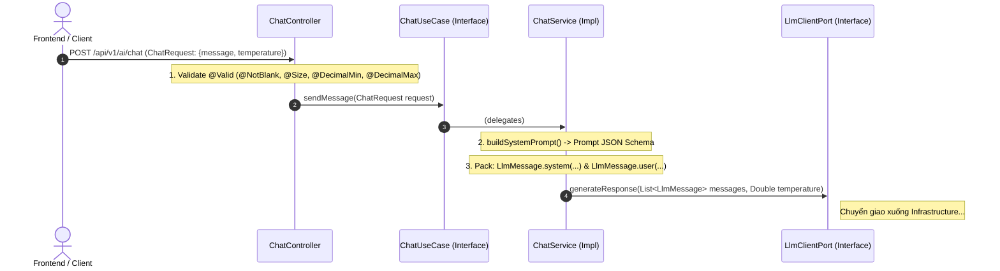
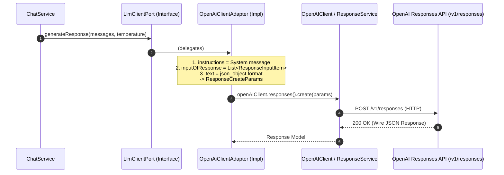
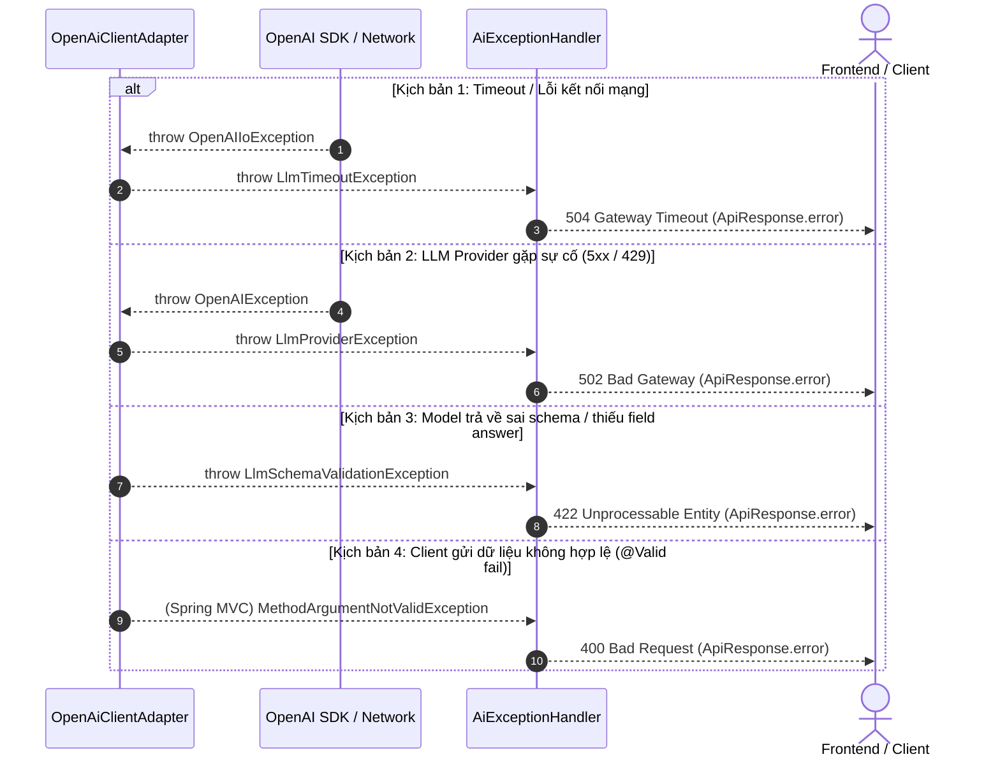

# AI Module Architecture

Tài liệu này mô tả chi tiết kiến trúc của module `com.platform.app.ai`.

---

## 1. Architectural Style

Module tuân thủ kiến trúc **Hexagonal Architecture** (còn gọi là **Ports & Adapters**), kết hợp với các nguyên lý thiết kế **Domain-Driven Design (DDD)** và **Clean Architecture**.

```
                         ┌───────────────────────────────────────────┐
                         │                 API Layer                 │
                         │             (Inbound Adapter)             │
                         │    ChatController, AiExceptionHandler    │
                         └─────────────────────┬─────────────────────┘
                                               │ calls
                                               ▼
                         ┌───────────────────────────────────────────┐
                         │             APPLICATION Layer             │
                         │       ChatUseCase (Inbound Port)          │
                         │       ChatService (Orchestrator)          │
                         │       LlmClientPort (Outbound Port)       │
                         └──────────────┬─────────────┬──────────────┘
                          implements    │             │ uses
                                        ▼             ▼
   ┌──────────────────────────────────────────┐     ┌──────────────────────────────────────────┐
   │           INFRASTRUCTURE Layer           │     │               DOMAIN Layer               │
   │            (Outbound Adapter)            │     │              (Pure Java/DDD)             │
   │ OpenAiClientAdapter, LlmConfig/Properties│     │ AssistantResponse, Confidence, LlmMessage│
   │ (Ollama, Claude, vLLM Adapters...)       │     │ LlmTimeoutException, LlmProviderException│
   └──────────────────────────────────────────┘     └──────────────────────────────────────────┘
```

---

## 2. Dependency Rules

1. **Chiều phụ thuộc hướng tâm**: Tất cả các tầng đều hướng về Domain. Domain tuyệt đối không phụ thuộc vào bất kỳ tầng nào khác hay thư viện bên ngoài (Spring, Jackson, v.v.).
2. **Không kết nối trực tiếp đến hạ tầng**: Application Layer chỉ tương tác với các Port (Interface). Các Adapter (Implementation ở Infrastructure) chịu trách nhiệm giao tiếp cụ thể với các dịch vụ bên ngoài (OpenAI, pgvector, etc.).

---

## 3. Component Responsibilities

- **Domain Layer (`domain/`)**: Định nghĩa mô hình nghiệp vụ lõi (`LlmMessage`, `AssistantResponse`, `Confidence`) và các Exception đặc tả (`LlmTimeoutException`, `LlmProviderException`, `LlmSchemaValidationException`).
- **Application Layer (`application/`)**: Điều phối luồng nghiệp vụ (`ChatService`), định nghĩa các cổng giao tiếp vào (`ChatUseCase`) và ra (`LlmClientPort`).
- **Infrastructure Layer (`infrastructure/`)**: Thực thi Adapter cụ thể để gọi LLM Provider (`OpenAiClientAdapter`), xử lý parse/serialize dữ liệu raw, cấu hình kết nối HTTP Client.
- **API Layer (`api/`)**: REST Controller tiếp nhận request từ client (`ChatController`), kiểm thực dữ liệu đầu vào và bắt/chuẩn hóa lỗi (`AiExceptionHandler`).

---

## 4. Request Lifecycle

Vòng đời của một request đi qua các tầng được phân rã thành **3 sub-flow độc lập** dưới đây:

### Flow 1: Tiếp nhận Request & Điều phối nghiệp vụ (Inbound & Application Layer)

Tập trung vào việc tiếp nhận HTTP Request, kiểm thực dữ liệu đầu vào và chuyển đổi thành Domain Message:



### Flow 2: Giao tiếp hạ tầng với OpenAI Responses API (Infrastructure Layer)

Tập trung vào việc chuyển đổi Domain Model sang chuẩn OpenAI Responses API và gọi upstream:



### Flow 3: Tiền xử lý, Parse JSON Schema & Mapping kết quả (Sanitization & Mapping)

Tập trung vào khâu làm sạch output text từ model, parse JSON schema và chuyển đổi dữ liệu trả về cho client:

````mermaid
sequenceDiagram
    autonumber
    participant Adapter as OpenAiClientAdapter
    participant Sanitizer as sanitizeJsonContent()
    participant Mapper as ObjectMapper
    participant Service as ChatService
    participant Controller as ChatController
    actor Client as Frontend / Client

    Note over Adapter: 1. Extract text from ResponseOutputText
    Adapter->>Sanitizer: sanitizeJsonContent(rawContent)
    Note over Sanitizer: Strip Markdown fences (```json ... ```)
    Sanitizer-->>Adapter: Clean JSON string

    Adapter->>Mapper: readValue(cleanJson, OpenAiStructuredOutputPayload.class)
    Mapper-->>Adapter: OpenAiStructuredOutputPayload (answer, confidence)

    Note over Adapter: 2. Extract token usage (input/output tokens)<br/>3. Build AssistantResponse (Domain Model)
    Adapter-->>Service: AssistantResponse

    Note over Service: 4. Map AssistantResponse -> ChatResponse (DTO)
    Service-->>Controller: ChatResponse
    Controller-->>Client: 200 OK - ApiResponse.ok(ChatResponse)
````

---

## 5. Data Transformation

Sơ đồ dưới đây thể hiện vòng đời biến đổi dữ liệu (Data Transformation Lifecycle) từ HTTP Request đầu vào đến HTTP Response đầu ra:

```
[HTTP Request Body]
       │
       ▼
ChatRequest (Application DTO: message, temperature)
       │
       ▼  (ChatService builds System Prompt & maps)
List<LlmMessage> (Domain Value Object: SYSTEM, USER)
       │
       ▼  (OpenAiClientAdapter builds ResponseCreateParams)
ResponseCreateParams (OpenAI SDK Request: instructions, inputOfResponse, json_object)
       │
       ▼  (OpenAI Responses API executes via HTTP)
Response (OpenAI SDK Response: output text, usage tokens)
       │
       ▼  (OpenAiClientAdapter sanitizes & Jackson deserializes)
OpenAiStructuredOutputPayload (Infrastructure DTO: answer, confidence)
       │
       ▼  (OpenAiClientAdapter validates & maps to Domain)
AssistantResponse (Domain Model: answer, confidence, token metrics)
       │
       ▼  (ChatService maps to Application Response)
ChatResponse (Application DTO: answer, confidence, token metrics)
       │
       ▼  (ChatController wraps in ApiResponse)
ApiResponse<ChatResponse> (Standard HTTP Response Body)
```

---

## 6. Error Flow

Sơ đồ mô tả luồng bắt và chuẩn hóa ngoại lệ (Exception Handling Flow) từ hạ tầng về HTTP Status chuẩn:



| Domain Exception                  | HTTP Status Code           | Diễn giải                                                    |
| :-------------------------------- | :------------------------- | :----------------------------------------------------------- |
| `LlmTimeoutException`             | `504 Gateway Timeout`      | Hết thời gian chờ kết nối hoặc đọc dữ liệu từ LLM API        |
| `LlmProviderException`            | `502 Bad Gateway`          | LLM Provider gặp sự cố nội bộ hoặc từ chối phục vụ           |
| `LlmSchemaValidationException`    | `422 Unprocessable Entity` | LLM trả về cấu trúc không hợp lệ hoặc thiếu dữ liệu bắt buộc |
| `MethodArgumentNotValidException` | `400 Bad Request`          | Payload gửi lên từ client vi phạm ràng buộc validation       |

---

## 7. LLM Provider Boundary

Toàn bộ nghiệp vụ điều phối prompt và điều khiển hội thoại nằm trong `ChatService` và giao tiếp với thế giới ngoài chỉ thông qua cổng `LlmClientPort`. Biên giới này đảm bảo lõi logic độc lập hoàn toàn với API cụ thể của nhà mạng LLM.

---

## 8. Extension Points

- **Thêm LLM Adapter**: Xem tài liệu [README.md](../README.md#8-extension) về cách thêm một adapter mới kế thừa từ `LlmClientPort`.
- **Thêm Cấu hình / Khả năng Mới**: Bằng cách mở rộng `LlmClientPort` hoặc khai báo thêm các outbound ports ở Application Layer (như `ChatHistoryPort` lưu session database ở Slice 2).
