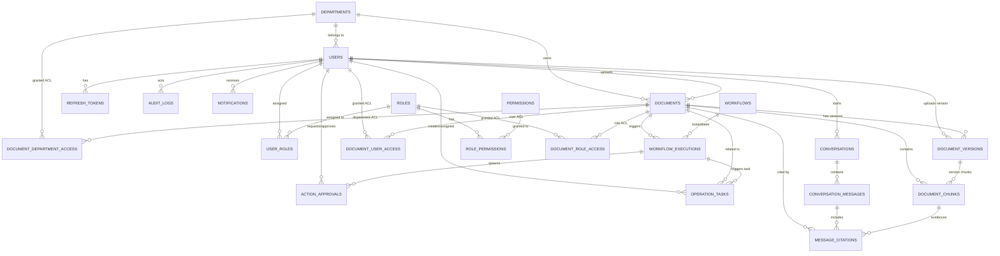

# Thiết Kế Cơ Sở Dữ Liệu Khởi Tạo (Database Schema Specification V1)

> **Dự án:** Nền tảng quản lý tài liệu nội bộ và tự động hóa nghiệp vụ (*Document Knowledge & Operations Platform*)  
> **Tài liệu tham chiếu:** Báo cáo đề tài PBL4 ([`report.docx`](file:///home/phuqy/Develop/Document-Knowledge-Operations-Platform/docs/report/report.docx)), Kiến trúc hệ thống ([`architecture.md`](file:///home/phuqy/Develop/Document-Knowledge-Operations-Platform/docs/architecture.md)), AI Engineering Roadmap ([`draft.md`](file:///home/phuqy/Develop/Document-Knowledge-Operations-Platform/docs/draft.md)).  
> **Tệp đặc tả DBML chính:** [`docs/database/schema.dbml`](file:///home/phuqy/Develop/Document-Knowledge-Operations-Platform/docs/database/schema.dbml) *(Trực quan hóa trên [dbdiagram.io](https://dbdiagram.io))*.  
> **Thư mục các module DBML tách rời:** [`docs/database/modules/`](file:///home/phuqy/Develop/Document-Knowledge-Operations-Platform/docs/database/modules/)  
> **Hệ quản trị CSDL đích:** PostgreSQL 16 + Extension `pgvector`, `uuid-ossp`, `pg_trgm`.  
> **Lưu trữ nhị phân (Object Storage):** Amazon S3 (mô phỏng cục bộ bởi Floci).  

---

## 1. Tổng Quan Kiến Trúc Dữ Liệu (Data Architecture Overview)

Hệ thống được thiết kế theo hướng tiếp cận **Domain-Driven Design (DDD) & Modular Bounded Contexts**, đảm bảo tính mở rộng cao và phân tách rõ ràng trách nhiệm giữa các phân hệ:

```text
                                +-----------------------------------------+
                                |  Document Knowledge Operations Platform |
                                +-----------------------------------------+
                                                     |
         +-------------------+-----------------------+-----------------------+-------------------+
         |                   |                       |                       |                   |
         v                   v                       v                       v                   v
+------------------+ +-------------------+ +-------------------+ +-------------------+ +-------------------+
| IAM_Organization | |Document_Management| | AI_Knowledge_RAG  | | Conversational_AI | |Workflow_Automation|
| (Users, Depts,   | | (Docs, S3 Meta,   | |(Chunks, pgvector, | |(Sessions, Messages| |(Workflows, Execs, |
|  Roles, Perms)   | |  Versions, ACL)   | |  tsvector Hybrid) | | Citations, Tokens)| | Steps, Pipeline)  |
+------------------+ +-------------------+ +-------------------+ +-------------------+ +-------------------+
                                                                                                 |
                                                                     +---------------------------+---------------------------+
                                                                     |                                                       |
                                                                     v                                                       v
                                                            +--------------------+                                  +--------------------+
                                                            |  Operations_HITL   |                                  |    Audit_System    |
                                                            | (Action Approvals, |                                  | (Immutable Logs,   |
                                                            |  Operation Tasks)  |                                  |   Notifications)   |
                                                            +--------------------+                                  +--------------------+
```

### 7 Bounded Contexts (TableGroups)
1. **`IAM_Organization`**: Quản lý phòng ban (`departments`), tài khoản người dùng (`users`), vai trò (`roles`), quyền hạn chức năng (`permissions`), bảng gán vai trò (`user_roles`), bảng gán quyền (`role_permissions`) và phiên đăng nhập (`refresh_tokens`).
2. **`Document_Management`**: Lưu trữ thông tin tài liệu (`documents`), lịch sử các phiên bản tệp S3 (`document_versions`), và ma trận phân quyền truy cập chi tiết (`document_user_access`, `document_department_access`, `document_role_access`).
3. **`AI_Knowledge_RAG`**: Lưu trữ các phân đoạn văn bản trích xuất theo phiên bản (`document_chunks`) tích hợp vector embedding 1536 chiều với chỉ mục HNSW (`pgvector`) và chỉ mục Full-Text Search (`tsvector`) phục vụ Hybrid Search (RRF).
4. **`Conversational_AI`**: Quản lý phiên hội thoại (`conversations`), lịch sử tin nhắn (`conversation_messages`), và bảng trích dẫn đối chiếu bằng chứng chuẩn hóa (`message_citations`).
5. **`Workflow_Automation`**: Định nghĩa các luồng tự động hóa xử lý tài liệu (`workflows`) và nhật ký từng phiên thực thi (`workflow_executions`).
6. **`Operations_HITL` (Human-In-The-Loop)**: Chốt chặn an toàn phê duyệt 2 pha (`action_approvals`: Prepare/Diff Preview $\rightarrow$ Waiting Approval $\rightarrow$ Commit) kèm khóa chống lặp (`idempotency_key`), và quản lý tác vụ nghiệp vụ cần con người can thiệp (`operation_tasks`).
7. **`Audit_System`**: Ghi vết nhật ký kiểm toán bất biến (`audit_logs`) và hệ thống thông báo trạng thái (`notifications`).

### Nguyên Tắc Lưu Trữ File & Metadata
- **Không lưu tệp nhị phân (BLOB) vào PostgreSQL:** Tệp tài liệu gốc (PDF, DOCX, TXT, XLSX) được đẩy trực tiếp lên Amazon S3 / Floci Object Storage.
- **PostgreSQL chỉ lưu metadata:** Bucket, Object Key, Dung lượng, SHA-256 Checksum, Số trang, MIME Type, phân quyền và vector embeddings.

---

## 2. Sơ Đồ Thực Thể Quan Hệ (Mermaid ERD Diagram)



---

## 3. Từ Điển Dữ Liệu Chi Tiết (Data Dictionary & Relationships)

Tất cả 22 bảng trong hệ thống được thiết kế tuân thủ nghiêm ngặt các chuẩn chuẩn hóa **1NF, 2NF, 3NF**, loại bỏ polymorphic foreign keys và dữ liệu mảng không nguyên tử.

---

### 3.1. Bounded Context: `IAM_Organization`

#### Bảng `departments` (Phòng ban / Đơn vị tổ chức)
- **Mục đích:** Quản lý cơ cấu phòng ban và đơn vị tổ chức trong doanh nghiệp, đóng vai trò xác định quyền sở hữu tài liệu (`document ownership`) và phạm vi truy cập dữ liệu (`department-level scoping`).
- **Quan hệ (Relationships):**
  - **1-N với `users`:** Một phòng ban có nhiều nhân viên trực thuộc (`users.department_id` $\rightarrow$ `departments.id`).
  - **1-N với `documents`:** Một phòng ban sở hữu nhiều tài liệu (`documents.department_id` $\rightarrow$ `departments.id`).
  - **1-N với `document_department_access`:** Nhận quyền truy cập tài liệu theo phòng ban (`document_department_access.department_id` $\rightarrow$ `departments.id`).

| Cột | Kiểu Dữ Liệu | Null | Mặc Định | Ràng Buộc / Khóa | Mô Tả |
| :--- | :--- | :--- | :--- | :--- | :--- |
| `id` | `BIGSERIAL` | NO | Auto | **PK** | Khóa chính định danh phòng ban |
| `code` | `VARCHAR(50)` | NO | | **UNIQUE** | Mã viết tắt duy nhất (e.g. `HR`, `FIN`, `IT`, `LEGAL`) |
| `name` | `VARCHAR(255)` | NO | | | Tên phòng ban đầy đủ |
| `description` | `TEXT` | YES | | | Mô tả chức năng, phạm vi phụ trách |
| `created_at` | `TIMESTAMPTZ` | NO | `CURRENT_TIMESTAMP` | | Thời điểm tạo bản ghi |
| `updated_at` | `TIMESTAMPTZ` | NO | `CURRENT_TIMESTAMP` | | Thời điểm cập nhật cuối cùng |

---

#### Bảng `users` (Tài khoản người dùng)
- **Mục đích:** Lưu trữ định danh, thông tin xác thực mật khẩu băm, phòng ban trực thuộc và cờ phân loại nhân viên nội bộ (`is_internal`) phục vụ chính sách bảo mật.
- **Quan hệ (Relationships):**
  - **N-1 với `departments`:** Thuộc về một phòng ban (`department_id` $\rightarrow$ `departments.id`).
  - **1-N với `user_roles`:** Một người dùng có thể được gán nhiều vai trò (`user_roles.user_id` $\rightarrow$ `users.id`).
  - **1-N với `refresh_tokens`:** Sở hữu các phiên JWT refresh token (`refresh_tokens.user_id` $\rightarrow$ `users.id`).
  - **1-N với `documents`:** Tải lên các tài liệu (`documents.uploaded_by_user_id` $\rightarrow$ `users.id`).
  - **1-N với `conversations`:** Khởi tạo các phiên hỏi đáp AI (`conversations.user_id` $\rightarrow$ `users.id`).
  - **1-N với `operation_tasks`:** Là người tạo hoặc nhân viên xử lý tác vụ (`operation_tasks.creator_id`, `assignee_id` $\rightarrow$ `users.id`).

| Cột | Kiểu Dữ Liệu | Null | Mặc Định | Ràng Buộc / Khóa | Mô Tả |
| :--- | :--- | :--- | :--- | :--- | :--- |
| `id` | `BIGSERIAL` | NO | Auto | **PK** | Khóa chính định danh người dùng |
| `email` | `VARCHAR(255)` | NO | | **UNIQUE** | Email đăng nhập duy nhất |
| `password_hash` | `VARCHAR(255)` | NO | | | Mật khẩu đã mã hóa BCrypt |
| `full_name` | `VARCHAR(255)` | NO | | | Họ và tên hiển thị |
| `department_id` | `BIGINT` | YES | | **FK** $\rightarrow$ `departments(id)` | Phòng ban trực thuộc (NULL nếu là khách hàng ngoài) |
| `enabled` | `BOOLEAN` | NO | `TRUE` | | Trạng thái kích hoạt tài khoản |
| `is_internal` | `BOOLEAN` | NO | `TRUE` | | Cờ phân biệt nhân viên nội bộ hay đối tác/khách hàng |
| `created_at` | `TIMESTAMPTZ` | NO | `CURRENT_TIMESTAMP` | | Thời điểm tạo tài khoản |
| `updated_at` | `TIMESTAMPTZ` | NO | `CURRENT_TIMESTAMP` | | Thời điểm cập nhật cuối cùng |

---

#### Bảng `roles` (Vai trò hệ thống RBAC)
- **Mục đích:** Định nghĩa các vai trò chuẩn trong hệ thống (e.g. `ROLE_ADMIN`, `ROLE_MANAGER`, `ROLE_STAFF`, `ROLE_CUSTOMER`, `ROLE_SYSTEM`).
- **Quan hệ (Relationships):**
  - **1-N với `user_roles`:** Được gán cho nhiều người dùng (`user_roles.role_id` $\rightarrow$ `roles.id`).
  - **1-N với `role_permissions`:** Chứa nhiều quyền hạn chức năng (`role_permissions.role_id` $\rightarrow$ `roles.id`).
  - **1-N với `document_role_access`:** Nhận quyền truy cập tài liệu theo vai trò (`document_role_access.role_id` $\rightarrow$ `roles.id`).

| Cột | Kiểu Dữ Liệu | Null | Mặc Định | Ràng Buộc / Khóa | Mô Tả |
| :--- | :--- | :--- | :--- | :--- | :--- |
| `id` | `BIGSERIAL` | NO | Auto | **PK** | Khóa chính vai trò |
| `code` | `VARCHAR(50)` | NO | | **UNIQUE** | Mã vai trò duy nhất (e.g. `ROLE_ADMIN`) |
| `name` | `VARCHAR(100)` | NO | | | Tên vai trò hiển thị |
| `description` | `TEXT` | YES | | | Mô tả phạm vi và quyền hạn vai trò |
| `created_at` | `TIMESTAMPTZ` | NO | `CURRENT_TIMESTAMP` | | Thời điểm tạo vai trò |

---

#### Bảng `permissions` (Quyền hạn chức năng mức hạt mịn)
- **Mục đích:** Định nghĩa các quyền thao tác chức năng cụ thể theo từng phân hệ (e.g. `read:documents`, `write:documents`, `approve:actions`).
- **Quan hệ (Relationships):**
  - **1-N với `role_permissions`:** Được gán cho nhiều vai trò (`role_permissions.permission_id` $\rightarrow$ `permissions.id`).

| Cột | Kiểu Dữ Liệu | Null | Mặc Định | Ràng Buộc / Khóa | Mô Tả |
| :--- | :--- | :--- | :--- | :--- | :--- |
| `id` | `BIGSERIAL` | NO | Auto | **PK** | Khóa chính quyền hạn |
| `code` | `VARCHAR(100)` | NO | | **UNIQUE** | Chuỗi định danh quyền (e.g. `write:documents`) |
| `name` | `VARCHAR(150)` | NO | | | Tên hiển thị quyền hạn |
| `module` | `VARCHAR(50)` | NO | | | Tên phân hệ nghiệp vụ (`DOCUMENTS`, `WORKFLOWS`,...) |
| `description` | `TEXT` | YES | | | Mô tả chi tiết quyền thao tác |
| `created_at` | `TIMESTAMPTZ` | NO | `CURRENT_TIMESTAMP` | | Thời điểm tạo |

---

#### Bảng `user_roles` (Bảng trung gian Gán vai trò người dùng)
- **Mục đích:** Bảng liên kết Nhiều-Nhiều (N-N) giữa `users` và `roles` (chuẩn hóa 2NF/3NF, tối ưu chỉ mục khóa chính composite).
- **Quan hệ (Relationships):**
  - **N-1 với `users`:** (`user_id` $\rightarrow$ `users.id`, `ON DELETE CASCADE`).
  - **N-1 với `roles`:** (`role_id` $\rightarrow$ `roles.id`, `ON DELETE CASCADE`).

| Cột | Kiểu Dữ Liệu | Null | Mặc Định | Ràng Buộc / Khóa | Mô Tả |
| :--- | :--- | :--- | :--- | :--- | :--- |
| `user_id` | `BIGINT` | NO | | **PK, FK** $\rightarrow$ `users(id)` | ID người dùng |
| `role_id` | `BIGINT` | NO | | **PK, FK** $\rightarrow$ `roles(id)` | ID vai trò gán |
| `assigned_at` | `TIMESTAMPTZ` | NO | `CURRENT_TIMESTAMP` | | Thời điểm gán vai trò |

---

#### Bảng `role_permissions` (Bảng trung gian Gán quyền cho vai trò)
- **Mục đích:** Bảng liên kết Nhiều-Nhiều (N-N) giữa `roles` và `permissions` (chuẩn hóa 2NF/3NF).
- **Quan hệ (Relationships):**
  - **N-1 với `roles`:** (`role_id` $\rightarrow$ `roles.id`, `ON DELETE CASCADE`).
  - **N-1 với `permissions`:** (`permission_id` $\rightarrow$ `permissions.id`, `ON DELETE CASCADE`).

| Cột | Kiểu Dữ Liệu | Null | Mặc Định | Ràng Buộc / Khóa | Mô Tả |
| :--- | :--- | :--- | :--- | :--- | :--- |
| `role_id` | `BIGINT` | NO | | **PK, FK** $\rightarrow$ `roles(id)` | ID vai trò |
| `permission_id` | `BIGINT` | NO | | **PK, FK** $\rightarrow$ `permissions(id)` | ID quyền hạn gán |
| `granted_at` | `TIMESTAMPTZ` | NO | `CURRENT_TIMESTAMP` | | Thời điểm cấp quyền |

---

#### Bảng `refresh_tokens` (Phiên làm việc JWT)
- **Mục đích:** Lưu trữ và quản lý vòng đời refresh token cho xác thực không trạng thái (stateless JWT authentication), hỗ trợ cơ chế thu hồi token tức thì.
- **Quan hệ (Relationships):**
  - **N-1 với `users`:** Thuộc sở hữu của một tài khoản người dùng (`user_id` $\rightarrow$ `users.id`, `ON DELETE CASCADE`).

| Cột | Kiểu Dữ Liệu | Null | Mặc Định | Ràng Buộc / Khóa | Mô Tả |
| :--- | :--- | :--- | :--- | :--- | :--- |
| `id` | `BIGSERIAL` | NO | Auto | **PK** | Khóa chính bản ghi token |
| `user_id` | `BIGINT` | NO | | **FK** $\rightarrow$ `users(id)` | Người dùng sở hữu token |
| `token` | `VARCHAR(512)` | NO | | **UNIQUE** | Chuỗi Refresh Token ngẫu nhiên bảo mật |
| `expiry_date` | `TIMESTAMPTZ` | NO | | | Thời điểm hết hạn của phiên |
| `revoked` | `BOOLEAN` | NO | `FALSE` | | Trạng thái thu hồi phiên đăng nhập |
| `created_at` | `TIMESTAMPTZ` | NO | `CURRENT_TIMESTAMP` | | Thời điểm phát hành |

---

### 3.2. Bounded Context: `Document_Management`

#### Bảng `documents` (Tài liệu trung tâm & Snapshot S3)
- **Mục đích:** Quản lý metadata tài liệu, lưu giữ con trỏ/snapshot của phiên bản active mới nhất (`current_version`, `storage_bucket`, `storage_key`, `checksum_sha256`, `file_size_bytes`) để tối ưu tốc độ đọc, đồng thời kiểm soát mức độ bảo mật mặc định (`access_level`).
- **Quan hệ (Relationships):**
  - **N-1 với `departments`:** Phòng ban sở hữu tài liệu (`department_id` $\rightarrow$ `departments.id`).
  - **N-1 với `users`:** Người tải lên (`uploaded_by_user_id` $\rightarrow$ `users.id`).
  - **1-N với `document_versions`:** Lịch sử các phiên bản (`document_versions.document_id` $\rightarrow$ `documents.id`).
  - **1-N với `document_user_access` / `document_department_access` / `document_role_access`:** Danh sách quyền truy cập chi tiết (ACL).
  - **1-N với `document_chunks`:** Các đoạn văn bản trích xuất (`document_chunks.document_id` $\rightarrow$ `documents.id`).

| Cột | Kiểu Dữ Liệu | Null | Mặc Định | Ràng Buộc / Khóa | Mô Tả |
| :--- | :--- | :--- | :--- | :--- | :--- |
| `id` | `VARCHAR(64)` | NO | | **PK** | Mã tài liệu duy nhất (UUID v4 / KSUID) |
| `original_file_name` | `VARCHAR(255)` | NO | | | Tên tệp gốc khi tải lên |
| `title` | `VARCHAR(255)` | NO | | | Tiêu đề nghiệp vụ của tài liệu |
| `description` | `TEXT` | YES | | | Tóm tắt hoặc mô tả nội dung |
| `file_type` | `VARCHAR(50)` | NO | | `Enum document_file_type` | `PDF`, `DOCX`, `TXT`, `XLSX`, `IMAGE`, `OTHER` |
| `mime_type` | `VARCHAR(100)` | NO | | | Chuỗi MIME Type (e.g. `application/pdf`) |
| `file_size_bytes` | `BIGINT` | NO | | | Dung lượng tệp hiện tại (bytes) |
| `checksum_sha256` | `VARCHAR(64)` | NO | | | Mã băm SHA-256 xác minh tính toàn vẹn |
| `storage_bucket` | `VARCHAR(128)` | NO | | | Tên Bucket trên Amazon S3 / Floci |
| `storage_key` | `VARCHAR(512)` | NO | | | Đường dẫn Object Key trên S3 |
| `processing_status` | `VARCHAR(50)` | NO | `'PENDING'` | `Enum document_processing_status` | `PENDING`, `PARSING`, `CHUNKED`, `INDEXED`, `FAILED` |
| `current_version` | `INT` | NO | `1` | | Số hiệu phiên bản active hiện tại |
| `department_id` | `BIGINT` | YES | | **FK** $\rightarrow$ `departments(id)` | Phòng ban chủ quản tài liệu |
| `uploaded_by_user_id` | `BIGINT` | NO | | **FK** $\rightarrow$ `users(id)` | Người tải lên tài liệu |
| `access_level` | `VARCHAR(50)` | NO | `'INTERNAL'` | `Enum access_level` | `PUBLIC`, `INTERNAL`, `RESTRICTED`, `CONFIDENTIAL` |
| `metadata` | `JSONB` | NO | `'{}'` | | Metadata động (tác giả, số trang, nhãn tag) |
| `created_at` | `TIMESTAMPTZ` | NO | `CURRENT_TIMESTAMP` | | Thời điểm tải lên |
| `updated_at` | `TIMESTAMPTZ` | NO | `CURRENT_TIMESTAMP` | | Thời điểm cập nhật cuối cùng |
| `deleted_at` | `TIMESTAMPTZ` | YES | | **Soft Delete Index** | Thời điểm xóa mềm (NULL nếu đang hoạt động) |

---

#### Bảng `document_versions` (Lịch sử các phiên bản tệp S3)
- **Mục đích:** Lưu trữ lịch sử bất biến của mọi phiên bản tệp tài liệu từng được cập nhật, cho phép khôi phục hoặc tra cứu tài liệu trong quá khứ.
- **Quan hệ (Relationships):**
  - **N-1 với `documents`:** Thuộc về tài liệu (`document_id` $\rightarrow$ `documents.id`, `ON DELETE CASCADE`).
  - **N-1 với `users`:** Người tải lên phiên bản này (`uploaded_by_user_id` $\rightarrow$ `users.id`).
  - **1-N với `document_chunks`:** Các đoạn văn bản sinh ra từ phiên bản này (`document_chunks.document_version_id` $\rightarrow$ `document_versions.id`).

| Cột | Kiểu Dữ Liệu | Null | Mặc Định | Ràng Buộc / Khóa | Mô Tả |
| :--- | :--- | :--- | :--- | :--- | :--- |
| `id` | `BIGSERIAL` | NO | Auto | **PK** | Khóa chính phiên bản |
| `document_id` | `VARCHAR(64)` | NO | | **FK** $\rightarrow$ `documents(id)` | ID tài liệu cha |
| `version_number` | `INT` | NO | | **UNIQUE (`document_id`, `version_number`)** | Số thứ tự phiên bản (1, 2, 3,...) |
| `storage_bucket` | `VARCHAR(128)` | NO | | | Bucket lưu trữ phiên bản này trên S3 |
| `storage_key` | `VARCHAR(512)` | NO | | | Object key trên S3 cho phiên bản này |
| `file_size_bytes` | `BIGINT` | NO | | | Dung lượng tệp phiên bản này |
| `checksum_sha256` | `VARCHAR(64)` | NO | | | Mã SHA-256 của phiên bản này |
| `change_summary` | `VARCHAR(500)` | YES | | | Ghi chú tóm tắt nội dung thay đổi |
| `uploaded_by_user_id` | `BIGINT` | NO | | **FK** $\rightarrow$ `users(id)` | Người tải lên phiên bản này |
| `created_at` | `TIMESTAMPTZ` | NO | `CURRENT_TIMESTAMP` | | Thời điểm tạo phiên bản |

---

#### Bảng `document_user_access` (ACL cấp quyền theo người dùng)
- **Mục đích:** Phân quyền chi tiết (VIEW, EDIT, ADMIN) cho từng tài khoản người dùng cụ thể đối với tài liệu (chuẩn hóa 3NF, thay thế polymorphic anti-pattern).
- **Quan hệ (Relationships):**
  - **N-1 với `documents`:** (`document_id` $\rightarrow$ `documents.id`, `ON DELETE CASCADE`).
  - **N-1 với `users`:** (`user_id` $\rightarrow$ `users.id`, `ON DELETE CASCADE`).

| Cột | Kiểu Dữ Liệu | Null | Mặc Định | Ràng Buộc / Khóa | Mô Tả |
| :--- | :--- | :--- | :--- | :--- | :--- |
| `id` | `BIGSERIAL` | NO | Auto | **PK** | Khóa chính phân quyền |
| `document_id` | `VARCHAR(64)` | NO | | **FK** $\rightarrow$ `documents(id)` | ID tài liệu mục tiêu |
| `user_id` | `BIGINT` | NO | | **FK** $\rightarrow$ `users(id)` | ID người dùng được cấp quyền |
| `permission_level` | `VARCHAR(50)` | NO | `'VIEW'` | `Enum permission_level` | Mức quyền: `VIEW`, `EDIT`, `ADMIN` |
| `created_at` | `TIMESTAMPTZ` | NO | `CURRENT_TIMESTAMP` | | Thời điểm cấp quyền |

---

#### Bảng `document_department_access` (ACL cấp quyền theo phòng ban)
- **Mục đích:** Cấp quyền truy cập tài liệu hàng loạt cho toàn thể nhân viên thuộc một phòng ban.
- **Quan hệ (Relationships):**
  - **N-1 với `documents`:** (`document_id` $\rightarrow$ `documents.id`, `ON DELETE CASCADE`).
  - **N-1 với `departments`:** (`department_id` $\rightarrow$ `departments.id`, `ON DELETE CASCADE`).

| Cột | Kiểu Dữ Liệu | Null | Mặc Định | Ràng Buộc / Khóa | Mô Tả |
| :--- | :--- | :--- | :--- | :--- | :--- |
| `id` | `BIGSERIAL` | NO | Auto | **PK** | Khóa chính phân quyền |
| `document_id` | `VARCHAR(64)` | NO | | **FK** $\rightarrow$ `documents(id)` | ID tài liệu mục tiêu |
| `department_id` | `BIGINT` | NO | | **FK** $\rightarrow$ `departments(id)` | ID phòng ban được cấp quyền |
| `permission_level` | `VARCHAR(50)` | NO | `'VIEW'` | `Enum permission_level` | Mức quyền: `VIEW`, `EDIT`, `ADMIN` |
| `created_at` | `TIMESTAMPTZ` | NO | `CURRENT_TIMESTAMP` | | Thời điểm cấp quyền |

---

#### Bảng `document_role_access` (ACL cấp quyền theo vai trò)
- **Mục đích:** Cấp quyền truy cập tài liệu cho tất cả người dùng nắm giữ vai trò tương ứng.
- **Quan hệ (Relationships):**
  - **N-1 với `documents`:** (`document_id` $\rightarrow$ `documents.id`, `ON DELETE CASCADE`).
  - **N-1 với `roles`:** (`role_id` $\rightarrow$ `roles.id`, `ON DELETE CASCADE`).

| Cột | Kiểu Dữ Liệu | Null | Mặc Định | Ràng Buộc / Khóa | Mô Tả |
| :--- | :--- | :--- | :--- | :--- | :--- |
| `id` | `BIGSERIAL` | NO | Auto | **PK** | Khóa chính phân quyền |
| `document_id` | `VARCHAR(64)` | NO | | **FK** $\rightarrow$ `documents(id)` | ID tài liệu mục tiêu |
| `role_id` | `BIGINT` | NO | | **FK** $\rightarrow$ `roles(id)` | ID vai trò được cấp quyền |
| `permission_level` | `VARCHAR(50)` | NO | `'VIEW'` | `Enum permission_level` | Mức quyền: `VIEW`, `EDIT`, `ADMIN` |
| `created_at` | `TIMESTAMPTZ` | NO | `CURRENT_TIMESTAMP` | | Thời điểm cấp quyền |

---

### 3.3. Bounded Context: `AI_Knowledge_RAG`

#### Bảng `document_chunks` (Phân đoạn văn bản, Vector Embedding & Full-Text Search)
- **Mục đích:** Lưu trữ các đoạn văn bản trích xuất theo từng phiên bản tài liệu (`document_version_id`), tích hợp vector embedding 1536 chiều (đánh chỉ mục HNSW vector cosine) và chỉ mục Full-Text Search tsvector (đánh chỉ mục GIN) phục vụ thuật toán tìm kiếm kết hợp Hybrid RAG (Reciprocal Rank Fusion - RRF).
- **Quan hệ (Relationships):**
  - **N-1 với `documents`:** Thuộc tài liệu (`document_id` $\rightarrow$ `documents.id`, `ON DELETE CASCADE`).
  - **N-1 với `document_versions`:** Thuộc phiên bản tài liệu cụ thể (`document_version_id` $\rightarrow$ `document_versions.id`, `ON DELETE CASCADE`).
  - **1-N với `message_citations`:** Làm bằng chứng trích dẫn cho câu trả lời của AI (`message_citations.chunk_id` $\rightarrow$ `document_chunks.id`).

| Cột | Kiểu Dữ Liệu | Null | Mặc Định | Ràng Buộc / Khóa | Mô Tả |
| :--- | :--- | :--- | :--- | :--- | :--- |
| `id` | `VARCHAR(64)` | NO | | **PK** | Mã chunk duy nhất (e.g. `docId_v1_c0`) |
| `document_id` | `VARCHAR(64)` | NO | | **FK** $\rightarrow$ `documents(id)` | ID tài liệu gốc |
| `document_version_id`| `BIGINT` | NO | | **FK** $\rightarrow$ `document_versions(id)` | ID phiên bản tài liệu cụ thể của chunk |
| `chunk_index` | `INT` | NO | `0` | | Vị trí thứ tự đoạn trong tài liệu |
| `page_number` | `INT` | YES | | | Trang tài liệu gốc chứa đoạn văn bản |
| `content` | `TEXT` | NO | | | Nội dung văn bản thô đã làm sạch |
| `token_count` | `INT` | NO | `0` | | Số lượng token của đoạn văn bản |
| `metadata` | `JSONB` | NO | `'{}'` | **GIN Index** | Metadata cấu trúc (tiêu đề mục, bounding box) |
| `embedding` | `vector(1536)` | YES | | **HNSW Index (`vector_cosine_ops`)** | Vector nhúng ngữ nghĩa (OpenAI / BGE-M3) |
| `tsv` | `tsvector` | NO | | **GIN Index** | Dữ liệu vector tìm kiếm toàn văn FTS |
| `created_at` | `TIMESTAMPTZ` | NO | `CURRENT_TIMESTAMP` | | Thời điểm xử lý chunk |

---

### 3.4. Bounded Context: `Conversational_AI`

#### Bảng `conversations` (Phiên hội thoại hỏi đáp AI)
- **Mục đích:** Quản lý các phiên trao đổi tra cứu tài liệu giữa người dùng và AI Assistant.
- **Quan hệ (Relationships):**
  - **N-1 với `users`:** Người khởi tạo phiên chat (`user_id` $\rightarrow$ `users.id`, `ON DELETE CASCADE`).
  - **1-N với `conversation_messages`:** Chứa danh sách các tin nhắn (`conversation_messages.conversation_id` $\rightarrow$ `conversations.id`).

| Cột | Kiểu Dữ Liệu | Null | Mặc Định | Ràng Buộc / Khóa | Mô Tả |
| :--- | :--- | :--- | :--- | :--- | :--- |
| `id` | `VARCHAR(64)` | NO | | **PK** | Mã phiên hội thoại |
| `user_id` | `BIGINT` | NO | | **FK** $\rightarrow$ `users(id)` | Người dùng sở hữu phiên chat |
| `title` | `VARCHAR(255)` | NO | `'New Conversation'` | | Tiêu đề hiển thị phiên hội thoại |
| `status` | `VARCHAR(50)` | NO | `'ACTIVE'` | `Enum conversation_status` | `ACTIVE`, `ARCHIVED`, `DELETED` |
| `created_at` | `TIMESTAMPTZ` | NO | `CURRENT_TIMESTAMP` | | Thời điểm bắt đầu phiên |
| `updated_at` | `TIMESTAMPTZ` | NO | `CURRENT_TIMESTAMP` | | Thời điểm có tin nhắn mới nhất |

---

#### Bảng `conversation_messages` (Tin nhắn trong phiên hội thoại)
- **Mục đích:** Lưu trữ lịch sử tin nhắn hỏi-đáp, vai trò người gửi (`USER`, `ASSISTANT`, `SYSTEM`, `TOOL`), số lượng token tiêu thụ và độ tin cậy của câu trả lời.
- **Quan hệ (Relationships):**
  - **N-1 với `conversations`:** Thuộc phiên chat (`conversation_id` $\rightarrow$ `conversations.id`, `ON DELETE CASCADE`).
  - **1-N với `message_citations`:** Có các trích dẫn bằng chứng nguồn (`message_citations.message_id` $\rightarrow$ `conversation_messages.id`).

| Cột | Kiểu Dữ Liệu | Null | Mặc Định | Ràng Buộc / Khóa | Mô Tả |
| :--- | :--- | :--- | :--- | :--- | :--- |
| `id` | `VARCHAR(64)` | NO | | **PK** | Mã tin nhắn duy nhất |
| `conversation_id` | `VARCHAR(64)` | NO | | **FK** $\rightarrow$ `conversations(id)` | Phiên hội thoại cha |
| `role` | `VARCHAR(50)` | NO | | `Enum message_role` | `USER`, `ASSISTANT`, `SYSTEM`, `TOOL` |
| `content` | `TEXT` | NO | | | Nội dung văn bản tin nhắn |
| `confidence` | `VARCHAR(50)` | YES | | `Enum confidence_level` | Độ tin cậy AI: `LOW`, `MEDIUM`, `HIGH` |
| `prompt_tokens` | `INT` | NO | `0` | | Số lượng token đầu vào (prompt) |
| `completion_tokens`| `INT` | NO | `0` | | Số lượng token đầu ra (completion) |
| `created_at` | `TIMESTAMPTZ` | NO | `CURRENT_TIMESTAMP` | | Thời điểm gửi tin nhắn |

---

#### Bảng `message_citations` (Bảng trích dẫn nguồn bằng chứng)
- **Mục đích:** Bảng đối chiếu quan hệ chuẩn hóa 3NF liên kết câu trả lời của AI với đúng tài liệu nguồn và đoạn văn bản trích xuất làm bằng chứng, kèm điểm tương đồng ngữ nghĩa.
- **Quan hệ (Relationships):**
  - **N-1 với `conversation_messages`:** Tin nhắn chứa trích dẫn (`message_id` $\rightarrow$ `conversation_messages.id`, `ON DELETE CASCADE`).
  - **N-1 với `documents`:** Tài liệu được trích dẫn (`document_id` $\rightarrow$ `documents.id`, `ON DELETE CASCADE`).
  - **N-1 với `document_chunks`:** Đoạn chunk cụ thể làm căn cứ (`chunk_id` $\rightarrow$ `document_chunks.id`, `ON DELETE CASCADE`).

| Cột | Kiểu Dữ Liệu | Null | Mặc Định | Ràng Buộc / Khóa | Mô Tả |
| :--- | :--- | :--- | :--- | :--- | :--- |
| `id` | `BIGSERIAL` | NO | Auto | **PK** | Khóa chính bản ghi trích dẫn |
| `message_id` | `VARCHAR(64)` | NO | | **FK** $\rightarrow$ `conversation_messages(id)` | Tin nhắn AI chứa câu trả lời |
| `document_id` | `VARCHAR(64)` | NO | | **FK** $\rightarrow$ `documents(id)` | Tài liệu nguồn được trích dẫn |
| `chunk_id` | `VARCHAR(64)` | NO | | **FK** $\rightarrow$ `document_chunks(id)` | Đoạn chunk văn bản cụ thể |
| `relevance_score` | `FLOAT` | NO | `0.0` | | Điểm số liên quan / tương đồng ngữ nghĩa |
| `snippet` | `TEXT` | YES | | | Trích đoạn nguyên văn bằng chứng |
| `created_at` | `TIMESTAMPTZ` | NO | `CURRENT_TIMESTAMP` | | Thời điểm ghi nhận trích dẫn |

---

### 3.5. Bounded Context: `Workflow_Automation`

#### Bảng `workflows` (Mẫu quy trình tự động hóa)
- **Mục đích:** Định nghĩa cấu hình và các bước thực thi của quy trình xử lý tự động khi có sự kiện tài liệu xảy ra.
- **Quan hệ (Relationships):**
  - **1-N với `workflow_executions`:** Khởi tạo các phiên chạy quy trình (`workflow_executions.workflow_id` $\rightarrow$ `workflows.id`).

| Cột | Kiểu Dữ Liệu | Null | Mặc Định | Ràng Buộc / Khóa | Mô Tả |
| :--- | :--- | :--- | :--- | :--- | :--- |
| `id` | `VARCHAR(64)` | NO | | **PK** | Mã quy trình (e.g. `wf_doc_indexing`) |
| `name` | `VARCHAR(255)` | NO | | | Tên quy trình tự động hóa |
| `description` | `TEXT` | YES | | | Mô tả mục đích và luồng xử lý |
| `trigger_event` | `VARCHAR(100)` | NO | | `Enum workflow_trigger_event` | `ON_DOCUMENT_UPLOADED`, `ON_DOCUMENT_INDEXED`, `MANUAL_TRIGGER`, `SCHEDULED` |
| `is_active` | `BOOLEAN` | NO | `TRUE` | | Cờ kích hoạt quy trình |
| `config_schema` | `JSONB` | NO | `'{}'` | | Cấu hình các bước (steps) và điều kiện rẽ nhánh |
| `created_at` | `TIMESTAMPTZ` | NO | `CURRENT_TIMESTAMP` | | Thời điểm tạo quy trình |
| `updated_at` | `TIMESTAMPTZ` | NO | `CURRENT_TIMESTAMP` | | Thời điểm sửa quy trình |

---

#### Bảng `workflow_executions` (Phiên thực thi quy trình tự động)
- **Mục đích:** Ghi nhận trạng thái thực thi thời gian thực, payload đầu vào, kết quả từng bước và log lỗi của từng phiên chạy workflow.
- **Quan hệ (Relationships):**
  - **N-1 với `workflows`:** Thuộc mẫu quy trình nào (`workflow_id` $\rightarrow$ `workflows.id`, `ON DELETE CASCADE`).
  - **N-1 với `documents`:** Tài liệu mục tiêu đang được xử lý (`document_id` $\rightarrow$ `documents.id`, `ON DELETE SET NULL`).
  - **1-N với `action_approvals`:** Phát sinh các bước cần con người phê duyệt (`action_approvals.execution_id` $\rightarrow$ `workflow_executions.id`).
  - **1-N với `operation_tasks`:** Phát sinh tác vụ khi gặp lỗi ngoại lệ (`operation_tasks.execution_id` $\rightarrow$ `workflow_executions.id`).

| Cột | Kiểu Dữ Liệu | Null | Mặc Định | Ràng Buộc / Khóa | Mô Tả |
| :--- | :--- | :--- | :--- | :--- | :--- |
| `id` | `VARCHAR(64)` | NO | | **PK** | Mã phiên chạy quy trình |
| `workflow_id` | `VARCHAR(64)` | NO | | **FK** $\rightarrow$ `workflows(id)` | Quy trình được thực thi |
| `document_id` | `VARCHAR(64)` | YES | | **FK** $\rightarrow$ `documents(id)` | Tài liệu được xử lý trong lượt chạy |
| `status` | `VARCHAR(50)` | NO | `'PENDING'` | `Enum workflow_execution_status` | `PENDING`, `RUNNING`, `WAITING_APPROVAL`, `COMPLETED`, `FAILED`, `CANCELLED` |
| `current_step` | `VARCHAR(100)` | YES | | | Bước đang thực hiện hiện tại |
| `input_payload` | `JSONB` | NO | `'{}'` | | Dữ liệu tham số đầu vào |
| `step_results` | `JSONB` | NO | `'{}'` | | Kết quả và trạng thái từng bước đã qua |
| `error_message` | `TEXT` | YES | | | Chi tiết lỗi nếu phiên chạy thất bại |
| `started_at` | `TIMESTAMPTZ` | NO | `CURRENT_TIMESTAMP` | | Thời điểm bắt đầu chạy |
| `completed_at` | `TIMESTAMPTZ` | YES | | | Thời điểm hoàn tất quy trình |

---

### 3.6. Bounded Context: `Operations_HITL`

#### Bảng `action_approvals` (Yêu cầu phê duyệt thao tác nhạy cảm - 2 Pha)
- **Mục đích:** Chốt chặn an toàn Human-In-The-Loop: Bắt buộc người có thẩm quyền ký duyệt thao tác thay đổi dữ liệu lớn (chuẩn bị payload diff preview $\rightarrow$ chờ duyệt $\rightarrow$ commit vào CSDL), tích hợp khóa chống trùng lặp `idempotency_key`.
- **Quan hệ (Relationships):**
  - **N-1 với `workflow_executions`:** Bắt nguồn từ phiên workflow nào (`execution_id` $\rightarrow$ `workflow_executions.id`, `ON DELETE SET NULL`).
  - **N-1 với `users` (Requested by):** Người hoặc tác nhân yêu cầu (`requested_by_user_id` $\rightarrow$ `users.id`).
  - **N-1 với `users` (Reviewed by):** Quản lý hoặc người có thẩm quyền phê duyệt (`reviewed_by_user_id` $\rightarrow$ `users.id`).

| Cột | Kiểu Dữ Liệu | Null | Mặc Định | Ràng Buộc / Khóa | Mô Tả |
| :--- | :--- | :--- | :--- | :--- | :--- |
| `id` | `VARCHAR(64)` | NO | | **PK** | Mã yêu cầu phê duyệt |
| `execution_id` | `VARCHAR(64)` | YES | | **FK** $\rightarrow$ `workflow_executions(id)` | Phiên workflow phát sinh yêu cầu |
| `action_type` | `VARCHAR(100)` | NO | | | Loại thao tác cần duyệt (e.g. `PUBLISH_DOC`, `DELETE_DOC`) |
| `status` | `VARCHAR(50)` | NO | `'PENDING'` | `Enum action_approval_status` | `PENDING`, `APPROVED`, `REJECTED`, `COMMITTED`, `EXPIRED` |
| `idempotency_key` | `VARCHAR(128)` | NO | | **UNIQUE** | Khóa chống thực thi trùng lặp 2 lần |
| `preview_payload` | `JSONB` | NO | `'{}'` | | Dữ liệu Diff preview / Dry-run thay đổi |
| `execution_result`| `JSONB` | NO | `'{}'` | | Kết quả trả về sau khi commit thành công |
| `requested_by_user_id`| `BIGINT` | YES | | **FK** $\rightarrow$ `users(id)` | Người hoặc bot đề xuất thao tác |
| `reviewed_by_user_id` | `BIGINT` | YES | | **FK** $\rightarrow$ `users(id)` | Người ra quyết định phê duyệt |
| `review_notes` | `TEXT` | YES | | | Ghi chú phản hồi / lý do từ chối |
| `requested_at` | `TIMESTAMPTZ` | NO | `CURRENT_TIMESTAMP` | | Thời điểm gửi yêu cầu |
| `reviewed_at` | `TIMESTAMPTZ` | YES | | | Thời điểm phê duyệt/từ chối |
| `committed_at` | `TIMESTAMPTZ` | YES | | | Thời điểm commit thay đổi vào CSDL |

---

#### Bảng `operation_tasks` (Tác vụ nghiệp vụ cần can thiệp)
- **Mục đích:** Quản lý danh sách các tác vụ công việc nghiệp vụ phát sinh cần con người can thiệp (ví dụ: kiểm tra OCR lỗi, bổ sung chữ ký hợp đồng, rà soát dữ liệu tài liệu).
- **Quan hệ (Relationships):**
  - **N-1 với `users` (Creator):** Người hoặc hệ thống tạo tác vụ (`creator_id` $\rightarrow$ `users.id`, `ON DELETE RESTRICT`).
  - **N-1 với `users` (Assignee):** Nhân viên được phân công xử lý (`assignee_id` $\rightarrow$ `users.id`, `ON DELETE SET NULL`).
  - **N-1 với `documents`:** Tài liệu liên quan trực tiếp (`document_id` $\rightarrow$ `documents.id`, `ON DELETE SET NULL`).
  - **N-1 với `workflow_executions`:** Phiên workflow phát sinh tác vụ (`execution_id` $\rightarrow$ `workflow_executions.id`, `ON DELETE SET NULL`).

| Cột | Kiểu Dữ Liệu | Null | Mặc Định | Ràng Buộc / Khóa | Mô Tả |
| :--- | :--- | :--- | :--- | :--- | :--- |
| `id` | `VARCHAR(64)` | NO | | **PK** | Mã tác vụ (UUID / KSUID) |
| `title` | `VARCHAR(255)` | NO | | | Tiêu đề tác vụ |
| `description` | `TEXT` | YES | | | Mô tả chi tiết yêu cầu công việc |
| `status` | `VARCHAR(50)` | NO | `'PENDING'` | `Enum task_status` | `PENDING`, `IN_PROGRESS`, `COMPLETED`, `CANCELLED` |
| `priority` | `VARCHAR(50)` | NO | `'MEDIUM'` | `Enum task_priority` | `LOW`, `MEDIUM`, `HIGH`, `URGENT` |
| `creator_id` | `BIGINT` | NO | | **FK** $\rightarrow$ `users(id)` | Người hoặc bot tạo tác vụ |
| `assignee_id` | `BIGINT` | YES | | **FK** $\rightarrow$ `users(id)` | Nhân viên được giao xử lý |
| `document_id` | `VARCHAR(64)` | YES | | **FK** $\rightarrow$ `documents(id)` | Tài liệu liên quan |
| `execution_id` | `VARCHAR(64)` | YES | | **FK** $\rightarrow$ `workflow_executions(id)` | Phiên workflow phát sinh tác vụ |
| `metadata` | `JSONB` | NO | `'{}'` | | Dữ liệu mở rộng (SLA deadline, error logs) |
| `created_at` | `TIMESTAMPTZ` | NO | `CURRENT_TIMESTAMP` | | Thời điểm tạo |
| `updated_at` | `TIMESTAMPTZ` | NO | `CURRENT_TIMESTAMP` | | Thời điểm cập nhật cuối cùng |

---

### 3.7. Bounded Context: `Audit_System`

#### Bảng `audit_logs` (Nhật ký kiểm toán bất biến)
- **Mục đích:** Ghi nhận chuỗi nhật ký kiểm toán bất biến (Append-only) phục vụ an toàn thông tin, giám sát bảo mật và tuân thủ quy chuẩn giải trình.
- **Quan hệ (Relationships):**
  - **N-1 với `users`:** Người thực hiện hành động (`user_id` $\rightarrow$ `users.id`, `ON DELETE SET NULL`, NULL nếu là tác nhân tự động của hệ thống).

| Cột | Kiểu Dữ Liệu | Null | Mặc Định | Ràng Buộc / Khóa | Mô Tả |
| :--- | :--- | :--- | :--- | :--- | :--- |
| `id` | `BIGSERIAL` | NO | Auto | **PK** | Khóa chính tự tăng bản ghi nhật ký |
| `user_id` | `BIGINT` | YES | | **FK** $\rightarrow$ `users(id)` | Người thực hiện hành động (NULL: Hệ thống) |
| `action` | `VARCHAR(100)` | NO | | | Tên hành động (e.g. `LOGIN`, `UPLOAD_DOC`, `APPROVE_ACTION`) |
| `resource_type`| `VARCHAR(100)` | NO | | | Loại tài nguyên bị tác động (`DOCUMENT`, `USER`, `WORKFLOW`) |
| `resource_id` | `VARCHAR(64)` | YES | | | ID định danh của tài nguyên bị tác động |
| `ip_address` | `VARCHAR(45)` | YES | | | Địa chỉ IP của máy khách (IPv4 hoặc IPv6) |
| `user_agent` | `TEXT` | YES | | | Thiết bị và trình duyệt gửi yêu cầu |
| `status` | `VARCHAR(50)` | NO | `'SUCCESS'` | `Enum audit_status` | `SUCCESS`, `FAILED` |
| `details` | `JSONB` | NO | `'{}'` | | Chi tiết snapshot dữ liệu trước/sau thay đổi |
| `created_at` | `TIMESTAMPTZ` | NO | `CURRENT_TIMESTAMP` | | Thời điểm ghi nhật ký |

---

#### Bảng `notifications` (Thông báo người dùng)
- **Mục đích:** Gửi thông báo trong ứng dụng và thông báo đẩy (push notifications) cho người dùng về tiến độ tài liệu, yêu cầu phê duyệt và tác vụ được giao.
- **Quan hệ (Relationships):**
  - **N-1 với `users`:** Người nhận thông báo (`user_id` $\rightarrow$ `users.id`, `ON DELETE CASCADE`).

| Cột | Kiểu Dữ Liệu | Null | Mặc Định | Ràng Buộc / Khóa | Mô Tả |
| :--- | :--- | :--- | :--- | :--- | :--- |
| `id` | `BIGSERIAL` | NO | Auto | **PK** | Khóa chính thông báo |
| `user_id` | `BIGINT` | NO | | **FK** $\rightarrow$ `users(id)` | Người nhận thông báo |
| `title` | `VARCHAR(255)` | NO | | | Tiêu đề thông báo |
| `message` | `TEXT` | NO | | | Nội dung chi tiết thông báo |
| `type` | `VARCHAR(50)` | NO | `'INFO'` | `Enum notification_type` | `INFO`, `SUCCESS`, `WARNING`, `ACTION_REQUIRED` |
| `is_read` | `BOOLEAN` | NO | `FALSE` | | Cờ trạng thái đã đọc |
| `reference_type`| `VARCHAR(100)` | YES | | | Loại đối tượng liên quan (`DOCUMENT`, `TASK`, `APPROVAL`) |
| `reference_id` | `VARCHAR(64)` | YES | | | ID đối tượng liên quan |
| `created_at` | `TIMESTAMPTZ` | NO | `CURRENT_TIMESTAMP` | | Thời điểm phát thông báo |

---

## 4. Kịch Bản Khởi Tạo Cơ Sở Dữ Liệu PostgreSQL 16 (DDL Script)

Dưới đây là kịch bản SQL DDL hoàn chỉnh tương thích với PostgreSQL 16 và extension `pgvector`:

```sql
CREATE EXTENSION IF NOT EXISTS vector;
CREATE EXTENSION IF NOT EXISTS "uuid-ossp";
CREATE EXTENSION IF NOT EXISTS pg_trgm;

CREATE OR REPLACE FUNCTION update_timestamp_column()
RETURNS TRIGGER AS $$
BEGIN
    NEW.updated_at = CURRENT_TIMESTAMP;
    RETURN NEW;
END;
$$ language 'plpgsql';

-- 1. IAM & Organization
CREATE TABLE IF NOT EXISTS departments (
    id BIGSERIAL PRIMARY KEY,
    code VARCHAR(50) UNIQUE NOT NULL,
    name VARCHAR(255) NOT NULL,
    description TEXT,
    created_at TIMESTAMPTZ NOT NULL DEFAULT CURRENT_TIMESTAMP,
    updated_at TIMESTAMPTZ NOT NULL DEFAULT CURRENT_TIMESTAMP
);

CREATE TABLE IF NOT EXISTS users (
    id BIGSERIAL PRIMARY KEY,
    email VARCHAR(255) UNIQUE NOT NULL,
    password_hash VARCHAR(255) NOT NULL,
    full_name VARCHAR(255) NOT NULL,
    department_id BIGINT REFERENCES departments(id) ON DELETE SET NULL,
    enabled BOOLEAN NOT NULL DEFAULT TRUE,
    is_internal BOOLEAN NOT NULL DEFAULT TRUE,
    created_at TIMESTAMPTZ NOT NULL DEFAULT CURRENT_TIMESTAMP,
    updated_at TIMESTAMPTZ NOT NULL DEFAULT CURRENT_TIMESTAMP
);

CREATE TABLE IF NOT EXISTS roles (
    id BIGSERIAL PRIMARY KEY,
    code VARCHAR(50) UNIQUE NOT NULL,
    name VARCHAR(100) NOT NULL,
    description TEXT,
    created_at TIMESTAMPTZ NOT NULL DEFAULT CURRENT_TIMESTAMP
);

CREATE TABLE IF NOT EXISTS permissions (
    id BIGSERIAL PRIMARY KEY,
    code VARCHAR(100) UNIQUE NOT NULL,
    name VARCHAR(150) NOT NULL,
    module VARCHAR(50) NOT NULL,
    description TEXT,
    created_at TIMESTAMPTZ NOT NULL DEFAULT CURRENT_TIMESTAMP
);

CREATE TABLE IF NOT EXISTS user_roles (
    user_id BIGINT NOT NULL REFERENCES users(id) ON DELETE CASCADE,
    role_id BIGINT NOT NULL REFERENCES roles(id) ON DELETE CASCADE,
    assigned_at TIMESTAMPTZ NOT NULL DEFAULT CURRENT_TIMESTAMP,
    PRIMARY KEY (user_id, role_id)
);

CREATE TABLE IF NOT EXISTS role_permissions (
    role_id BIGINT NOT NULL REFERENCES roles(id) ON DELETE CASCADE,
    permission_id BIGINT NOT NULL REFERENCES permissions(id) ON DELETE CASCADE,
    granted_at TIMESTAMPTZ NOT NULL DEFAULT CURRENT_TIMESTAMP,
    PRIMARY KEY (role_id, permission_id)
);

CREATE TABLE IF NOT EXISTS refresh_tokens (
    id BIGSERIAL PRIMARY KEY,
    user_id BIGINT NOT NULL REFERENCES users(id) ON DELETE CASCADE,
    token VARCHAR(512) UNIQUE NOT NULL,
    expiry_date TIMESTAMPTZ NOT NULL,
    revoked BOOLEAN NOT NULL DEFAULT FALSE,
    created_at TIMESTAMPTZ NOT NULL DEFAULT CURRENT_TIMESTAMP
);

CREATE INDEX IF NOT EXISTS idx_users_email ON users(email);
CREATE INDEX IF NOT EXISTS idx_users_department ON users(department_id);
CREATE INDEX IF NOT EXISTS idx_roles_code ON roles(code);
CREATE INDEX IF NOT EXISTS idx_permissions_code ON permissions(code);
CREATE INDEX IF NOT EXISTS idx_permissions_module ON permissions(module);
CREATE INDEX IF NOT EXISTS idx_user_roles_role ON user_roles(role_id);
CREATE INDEX IF NOT EXISTS idx_role_permissions_perm ON role_permissions(permission_id);
CREATE INDEX IF NOT EXISTS idx_refresh_tokens_user ON refresh_tokens(user_id);
CREATE INDEX IF NOT EXISTS idx_refresh_tokens_token ON refresh_tokens(token);

-- 2. Document Management & Object Storage
CREATE TABLE IF NOT EXISTS documents (
    id VARCHAR(64) PRIMARY KEY,
    original_file_name VARCHAR(255) NOT NULL,
    title VARCHAR(255) NOT NULL,
    description TEXT,
    file_type VARCHAR(50) NOT NULL CHECK (file_type IN ('PDF', 'DOCX', 'TXT', 'XLSX', 'IMAGE', 'OTHER')),
    mime_type VARCHAR(100) NOT NULL,
    file_size_bytes BIGINT NOT NULL,
    checksum_sha256 VARCHAR(64) NOT NULL,
    storage_bucket VARCHAR(128) NOT NULL,
    storage_key VARCHAR(512) NOT NULL,
    processing_status VARCHAR(50) NOT NULL DEFAULT 'PENDING'
        CHECK (processing_status IN ('PENDING', 'PARSING', 'CHUNKED', 'INDEXED', 'FAILED')),
    current_version INT NOT NULL DEFAULT 1,
    department_id BIGINT REFERENCES departments(id) ON DELETE SET NULL,
    uploaded_by_user_id BIGINT NOT NULL REFERENCES users(id) ON DELETE RESTRICT,
    access_level VARCHAR(50) NOT NULL DEFAULT 'INTERNAL'
        CHECK (access_level IN ('PUBLIC', 'INTERNAL', 'RESTRICTED', 'CONFIDENTIAL')),
    metadata JSONB NOT NULL DEFAULT '{}'::jsonb,
    created_at TIMESTAMPTZ NOT NULL DEFAULT CURRENT_TIMESTAMP,
    updated_at TIMESTAMPTZ NOT NULL DEFAULT CURRENT_TIMESTAMP,
    deleted_at TIMESTAMPTZ
);

CREATE TABLE IF NOT EXISTS document_versions (
    id BIGSERIAL PRIMARY KEY,
    document_id VARCHAR(64) NOT NULL REFERENCES documents(id) ON DELETE CASCADE,
    version_number INT NOT NULL,
    storage_bucket VARCHAR(128) NOT NULL,
    storage_key VARCHAR(512) NOT NULL,
    file_size_bytes BIGINT NOT NULL,
    checksum_sha256 VARCHAR(64) NOT NULL,
    change_summary VARCHAR(500),
    uploaded_by_user_id BIGINT NOT NULL REFERENCES users(id) ON DELETE RESTRICT,
    created_at TIMESTAMPTZ NOT NULL DEFAULT CURRENT_TIMESTAMP,
    CONSTRAINT uq_document_version UNIQUE (document_id, version_number)
);

CREATE TABLE IF NOT EXISTS document_user_access (
    id BIGSERIAL PRIMARY KEY,
    document_id VARCHAR(64) NOT NULL REFERENCES documents(id) ON DELETE CASCADE,
    user_id BIGINT NOT NULL REFERENCES users(id) ON DELETE CASCADE,
    permission_level VARCHAR(50) NOT NULL DEFAULT 'VIEW' CHECK (permission_level IN ('VIEW', 'EDIT', 'ADMIN')),
    created_at TIMESTAMPTZ NOT NULL DEFAULT CURRENT_TIMESTAMP,
    CONSTRAINT uq_doc_user_access UNIQUE (document_id, user_id)
);

CREATE TABLE IF NOT EXISTS document_department_access (
    id BIGSERIAL PRIMARY KEY,
    document_id VARCHAR(64) NOT NULL REFERENCES documents(id) ON DELETE CASCADE,
    department_id BIGINT NOT NULL REFERENCES departments(id) ON DELETE CASCADE,
    permission_level VARCHAR(50) NOT NULL DEFAULT 'VIEW' CHECK (permission_level IN ('VIEW', 'EDIT', 'ADMIN')),
    created_at TIMESTAMPTZ NOT NULL DEFAULT CURRENT_TIMESTAMP,
    CONSTRAINT uq_doc_dept_access UNIQUE (document_id, department_id)
);

CREATE TABLE IF NOT EXISTS document_role_access (
    id BIGSERIAL PRIMARY KEY,
    document_id VARCHAR(64) NOT NULL REFERENCES documents(id) ON DELETE CASCADE,
    role_id BIGINT NOT NULL REFERENCES roles(id) ON DELETE CASCADE,
    permission_level VARCHAR(50) NOT NULL DEFAULT 'VIEW' CHECK (permission_level IN ('VIEW', 'EDIT', 'ADMIN')),
    created_at TIMESTAMPTZ NOT NULL DEFAULT CURRENT_TIMESTAMP,
    CONSTRAINT uq_doc_role_access UNIQUE (document_id, role_id)
);

CREATE INDEX IF NOT EXISTS idx_documents_status ON documents(processing_status);
CREATE INDEX IF NOT EXISTS idx_documents_uploaded_by ON documents(uploaded_by_user_id);
CREATE INDEX IF NOT EXISTS idx_documents_department ON documents(department_id);
CREATE INDEX IF NOT EXISTS idx_documents_checksum ON documents(checksum_sha256);
CREATE INDEX IF NOT EXISTS idx_documents_metadata ON documents USING gin(metadata);
CREATE INDEX IF NOT EXISTS idx_documents_dept_status ON documents(department_id, processing_status);
CREATE INDEX IF NOT EXISTS idx_documents_deleted_at ON documents(deleted_at) WHERE deleted_at IS NULL;
CREATE INDEX IF NOT EXISTS idx_document_versions_uploaded_by ON document_versions(uploaded_by_user_id);
CREATE INDEX IF NOT EXISTS idx_doc_user_access_user ON document_user_access(user_id);
CREATE INDEX IF NOT EXISTS idx_doc_dept_access_dept ON document_department_access(department_id);
CREATE INDEX IF NOT EXISTS idx_doc_role_access_role ON document_role_access(role_id);

-- 3. AI Knowledge & pgvector RAG
CREATE TABLE IF NOT EXISTS document_chunks (
    id VARCHAR(64) PRIMARY KEY,
    document_id VARCHAR(64) NOT NULL REFERENCES documents(id) ON DELETE CASCADE,
    document_version_id BIGINT NOT NULL REFERENCES document_versions(id) ON DELETE CASCADE,
    chunk_index INT NOT NULL DEFAULT 0,
    page_number INT,
    content TEXT NOT NULL,
    token_count INT NOT NULL DEFAULT 0,
    metadata JSONB NOT NULL DEFAULT '{}'::jsonb,
    embedding vector(1536),
    tsv tsvector NOT NULL,
    created_at TIMESTAMPTZ NOT NULL DEFAULT CURRENT_TIMESTAMP
);

CREATE INDEX IF NOT EXISTS idx_document_chunks_doc_id ON document_chunks(document_id);
CREATE INDEX IF NOT EXISTS idx_document_chunks_version_id ON document_chunks(document_version_id);
CREATE INDEX IF NOT EXISTS idx_chunks_embedding_hnsw ON document_chunks USING hnsw (embedding vector_cosine_ops);
CREATE INDEX IF NOT EXISTS idx_document_chunks_tsv ON document_chunks USING gin(tsv);
CREATE INDEX IF NOT EXISTS idx_document_chunks_metadata ON document_chunks USING gin(metadata);

-- 4. Conversational AI & Citations
CREATE TABLE IF NOT EXISTS conversations (
    id VARCHAR(64) PRIMARY KEY,
    user_id BIGINT NOT NULL REFERENCES users(id) ON DELETE CASCADE,
    title VARCHAR(255) NOT NULL DEFAULT 'New Conversation',
    status VARCHAR(50) NOT NULL DEFAULT 'ACTIVE' CHECK (status IN ('ACTIVE', 'ARCHIVED', 'DELETED')),
    created_at TIMESTAMPTZ NOT NULL DEFAULT CURRENT_TIMESTAMP,
    updated_at TIMESTAMPTZ NOT NULL DEFAULT CURRENT_TIMESTAMP
);

CREATE TABLE IF NOT EXISTS conversation_messages (
    id VARCHAR(64) PRIMARY KEY,
    conversation_id VARCHAR(64) NOT NULL REFERENCES conversations(id) ON DELETE CASCADE,
    role VARCHAR(50) NOT NULL CHECK (role IN ('USER', 'ASSISTANT', 'SYSTEM', 'TOOL')),
    content TEXT NOT NULL,
    confidence VARCHAR(50) CHECK (confidence IN ('LOW', 'MEDIUM', 'HIGH')),
    prompt_tokens INT NOT NULL DEFAULT 0,
    completion_tokens INT NOT NULL DEFAULT 0,
    created_at TIMESTAMPTZ NOT NULL DEFAULT CURRENT_TIMESTAMP
);

CREATE TABLE IF NOT EXISTS message_citations (
    id BIGSERIAL PRIMARY KEY,
    message_id VARCHAR(64) NOT NULL REFERENCES conversation_messages(id) ON DELETE CASCADE,
    document_id VARCHAR(64) NOT NULL REFERENCES documents(id) ON DELETE CASCADE,
    chunk_id VARCHAR(64) NOT NULL REFERENCES document_chunks(id) ON DELETE CASCADE,
    relevance_score FLOAT NOT NULL DEFAULT 0.0,
    snippet TEXT,
    created_at TIMESTAMPTZ NOT NULL DEFAULT CURRENT_TIMESTAMP
);

CREATE INDEX IF NOT EXISTS idx_conversations_user ON conversations(user_id, updated_at DESC);
CREATE INDEX IF NOT EXISTS idx_messages_conversation ON conversation_messages(conversation_id, created_at ASC);
CREATE INDEX IF NOT EXISTS idx_citations_message ON message_citations(message_id);
CREATE INDEX IF NOT EXISTS idx_citations_document ON message_citations(document_id);
CREATE INDEX IF NOT EXISTS idx_citations_chunk ON message_citations(chunk_id);

-- 5. Workflow Automation
CREATE TABLE IF NOT EXISTS workflows (
    id VARCHAR(64) PRIMARY KEY,
    name VARCHAR(255) NOT NULL,
    description TEXT,
    trigger_event VARCHAR(100) NOT NULL
        CHECK (trigger_event IN ('ON_DOCUMENT_UPLOADED', 'ON_DOCUMENT_INDEXED', 'MANUAL_TRIGGER', 'SCHEDULED')),
    is_active BOOLEAN NOT NULL DEFAULT TRUE,
    config_schema JSONB NOT NULL DEFAULT '{}'::jsonb,
    created_at TIMESTAMPTZ NOT NULL DEFAULT CURRENT_TIMESTAMP,
    updated_at TIMESTAMPTZ NOT NULL DEFAULT CURRENT_TIMESTAMP
);

CREATE TABLE IF NOT EXISTS workflow_executions (
    id VARCHAR(64) PRIMARY KEY,
    workflow_id VARCHAR(64) NOT NULL REFERENCES workflows(id) ON DELETE CASCADE,
    document_id VARCHAR(64) REFERENCES documents(id) ON DELETE SET NULL,
    status VARCHAR(50) NOT NULL DEFAULT 'PENDING'
        CHECK (status IN ('PENDING', 'RUNNING', 'WAITING_APPROVAL', 'COMPLETED', 'FAILED', 'CANCELLED')),
    current_step VARCHAR(100),
    input_payload JSONB NOT NULL DEFAULT '{}'::jsonb,
    step_results JSONB NOT NULL DEFAULT '{}'::jsonb,
    error_message TEXT,
    started_at TIMESTAMPTZ NOT NULL DEFAULT CURRENT_TIMESTAMP,
    completed_at TIMESTAMPTZ
);

CREATE INDEX IF NOT EXISTS idx_workflows_trigger ON workflows(trigger_event);
CREATE INDEX IF NOT EXISTS idx_workflows_active ON workflows(is_active);
CREATE INDEX IF NOT EXISTS idx_executions_workflow ON workflow_executions(workflow_id);
CREATE INDEX IF NOT EXISTS idx_executions_document ON workflow_executions(document_id);
CREATE INDEX IF NOT EXISTS idx_executions_status ON workflow_executions(status);
CREATE INDEX IF NOT EXISTS idx_executions_started_at ON workflow_executions(started_at DESC);

-- 6. Operations & Human-In-The-Loop
CREATE TABLE IF NOT EXISTS action_approvals (
    id VARCHAR(64) PRIMARY KEY,
    execution_id VARCHAR(64) REFERENCES workflow_executions(id) ON DELETE SET NULL,
    action_type VARCHAR(100) NOT NULL,
    status VARCHAR(50) NOT NULL DEFAULT 'PENDING'
        CHECK (status IN ('PENDING', 'APPROVED', 'REJECTED', 'COMMITTED', 'EXPIRED')),
    idempotency_key VARCHAR(128) UNIQUE NOT NULL,
    preview_payload JSONB NOT NULL DEFAULT '{}'::jsonb,
    execution_result JSONB NOT NULL DEFAULT '{}'::jsonb,
    requested_by_user_id BIGINT REFERENCES users(id) ON DELETE SET NULL,
    reviewed_by_user_id BIGINT REFERENCES users(id) ON DELETE SET NULL,
    review_notes TEXT,
    requested_at TIMESTAMPTZ NOT NULL DEFAULT CURRENT_TIMESTAMP,
    reviewed_at TIMESTAMPTZ,
    committed_at TIMESTAMPTZ
);

CREATE TABLE IF NOT EXISTS operation_tasks (
    id VARCHAR(64) PRIMARY KEY,
    title VARCHAR(255) NOT NULL,
    description TEXT,
    status VARCHAR(50) NOT NULL DEFAULT 'PENDING'
        CHECK (status IN ('PENDING', 'IN_PROGRESS', 'COMPLETED', 'CANCELLED')),
    priority VARCHAR(50) NOT NULL DEFAULT 'MEDIUM'
        CHECK (priority IN ('LOW', 'MEDIUM', 'HIGH', 'URGENT')),
    creator_id BIGINT NOT NULL REFERENCES users(id) ON DELETE RESTRICT,
    assignee_id BIGINT REFERENCES users(id) ON DELETE SET NULL,
    document_id VARCHAR(64) REFERENCES documents(id) ON DELETE SET NULL,
    execution_id VARCHAR(64) REFERENCES workflow_executions(id) ON DELETE SET NULL,
    metadata JSONB NOT NULL DEFAULT '{}'::jsonb,
    created_at TIMESTAMPTZ NOT NULL DEFAULT CURRENT_TIMESTAMP,
    updated_at TIMESTAMPTZ NOT NULL DEFAULT CURRENT_TIMESTAMP
);

CREATE INDEX IF NOT EXISTS idx_approvals_status ON action_approvals(status);
CREATE INDEX IF NOT EXISTS idx_approvals_idempotency ON action_approvals(idempotency_key);
CREATE INDEX IF NOT EXISTS idx_approvals_status_req ON action_approvals(status, requested_at DESC);
CREATE INDEX IF NOT EXISTS idx_tasks_status ON operation_tasks(status);
CREATE INDEX IF NOT EXISTS idx_tasks_creator ON operation_tasks(creator_id);
CREATE INDEX IF NOT EXISTS idx_tasks_assignee ON operation_tasks(assignee_id);
CREATE INDEX IF NOT EXISTS idx_tasks_status_priority ON operation_tasks(status, priority);

-- 7. Audit Logs & Notifications
CREATE TABLE IF NOT EXISTS audit_logs (
    id BIGSERIAL PRIMARY KEY,
    user_id BIGINT REFERENCES users(id) ON DELETE SET NULL,
    action VARCHAR(100) NOT NULL,
    resource_type VARCHAR(100) NOT NULL,
    resource_id VARCHAR(64),
    ip_address VARCHAR(45),
    user_agent TEXT,
    status VARCHAR(50) NOT NULL DEFAULT 'SUCCESS' CHECK (status IN ('SUCCESS', 'FAILED')),
    details JSONB NOT NULL DEFAULT '{}'::jsonb,
    created_at TIMESTAMPTZ NOT NULL DEFAULT CURRENT_TIMESTAMP
);

CREATE TABLE IF NOT EXISTS notifications (
    id BIGSERIAL PRIMARY KEY,
    user_id BIGINT NOT NULL REFERENCES users(id) ON DELETE CASCADE,
    title VARCHAR(255) NOT NULL,
    message TEXT NOT NULL,
    type VARCHAR(50) NOT NULL DEFAULT 'INFO'
        CHECK (type IN ('INFO', 'SUCCESS', 'WARNING', 'ACTION_REQUIRED')),
    is_read BOOLEAN NOT NULL DEFAULT FALSE,
    reference_type VARCHAR(100),
    reference_id VARCHAR(64),
    created_at TIMESTAMPTZ NOT NULL DEFAULT CURRENT_TIMESTAMP
);

CREATE INDEX IF NOT EXISTS idx_audit_logs_user ON audit_logs(user_id);
CREATE INDEX IF NOT EXISTS idx_audit_logs_resource ON audit_logs(resource_type, resource_id);
CREATE INDEX IF NOT EXISTS idx_audit_logs_created_at ON audit_logs(created_at DESC);
CREATE INDEX IF NOT EXISTS idx_audit_logs_user_time ON audit_logs(user_id, created_at DESC);
CREATE INDEX IF NOT EXISTS idx_notifications_user_read ON notifications(user_id, is_read);
CREATE INDEX IF NOT EXISTS idx_notifications_created_at ON notifications(created_at DESC);

-- 8. Updated_at Triggers
CREATE TRIGGER trg_departments_updated_at BEFORE UPDATE ON departments
    FOR EACH ROW EXECUTE FUNCTION update_timestamp_column();

CREATE TRIGGER trg_users_updated_at BEFORE UPDATE ON users
    FOR EACH ROW EXECUTE FUNCTION update_timestamp_column();

CREATE TRIGGER trg_documents_updated_at BEFORE UPDATE ON documents
    FOR EACH ROW EXECUTE FUNCTION update_timestamp_column();

CREATE TRIGGER trg_conversations_updated_at BEFORE UPDATE ON conversations
    FOR EACH ROW EXECUTE FUNCTION update_timestamp_column();

CREATE TRIGGER trg_workflows_updated_at BEFORE UPDATE ON workflows
    FOR EACH ROW EXECUTE FUNCTION update_timestamp_column();

CREATE TRIGGER trg_operation_tasks_updated_at BEFORE UPDATE ON operation_tasks
    FOR EACH ROW EXECUTE FUNCTION update_timestamp_column();

-- 9. Seed Data
INSERT INTO departments (id, code, name, description)
VALUES
    (1, 'IT_ADMIN', 'Bộ phận Công nghệ & Quản trị', 'Quản trị hệ thống và hạ tầng kỹ thuật'),
    (2, 'HR', 'Phòng Hành chính - Nhân sự', 'Quản lý quy trình nội bộ, văn bản và chính sách nhân sự'),
    (3, 'LEGAL', 'Phòng Pháp chế & Hợp đồng', 'Quản lý hợp đồng, quy chế pháp lý và văn bản quy phạm')
ON CONFLICT (id) DO NOTHING;

INSERT INTO users (id, email, password_hash, full_name, department_id, enabled)
VALUES
    (1, 'admin@platform.internal', '$2a$10$wKz0bB41l4yvF4sU0eF5ue4dK2.qMhUj9E6Z/9lY20Pj8rLwK8O2m', 'System Administrator', 1, TRUE),
    (2, 'manager.hr@platform.internal', '$2a$10$wKz0bB41l4yvF4sU0eF5ue4dK2.qMhUj9E6Z/9lY20Pj8rLwK8O2m', 'HR Manager', 2, TRUE),
    (3, 'staff.it@platform.internal', '$2a$10$wKz0bB41l4yvF4sU0eF5ue4dK2.qMhUj9E6Z/9lY20Pj8rLwK8O2m', 'IT Staff Member', 1, TRUE)
ON CONFLICT (id) DO NOTHING;

INSERT INTO roles (id, code, name, description)
VALUES
    (1, 'ROLE_ADMIN', 'Quản trị viên hệ thống', 'Toàn quyền quản trị hệ thống'),
    (2, 'ROLE_MANAGER', 'Quản lý phòng ban', 'Quản lý tài liệu và nhân viên phòng ban'),
    (3, 'ROLE_STAFF', 'Nhân viên nghiệp vụ', 'Tra cứu và xử lý tác vụ tài liệu')
ON CONFLICT (id) DO NOTHING;

INSERT INTO user_roles (user_id, role_id)
VALUES
    (1, 1),
    (2, 2),
    (3, 3)
ON CONFLICT (user_id, role_id) DO NOTHING;

INSERT INTO workflows (id, name, description, trigger_event, is_active, config_schema)
VALUES
    ('wf_auto_indexing', 'Quy trình Trích xuất & Lập chỉ mục RAG Tự động', 'Tự động gửi tài liệu mới đến AI Service để phân tách đoạn và sinh embeddings vector', 'ON_DOCUMENT_UPLOADED', TRUE, '{"steps": ["extract_text", "chunk_text", "generate_embeddings", "index_vector"]}'::jsonb),
    ('wf_approval_task', 'Quy trình Duyệt Thay Đổi Tài Liệu Nhạy Cảm', 'Yêu cầu quản lý phòng ban phê duyệt trước khi cập nhật hoặc phát hành tài liệu mật', 'ON_DOCUMENT_INDEXED', TRUE, '{"require_approval": true, "approver_role": "ROLE_MANAGER"}'::jsonb)
ON CONFLICT (id) DO NOTHING;
```

