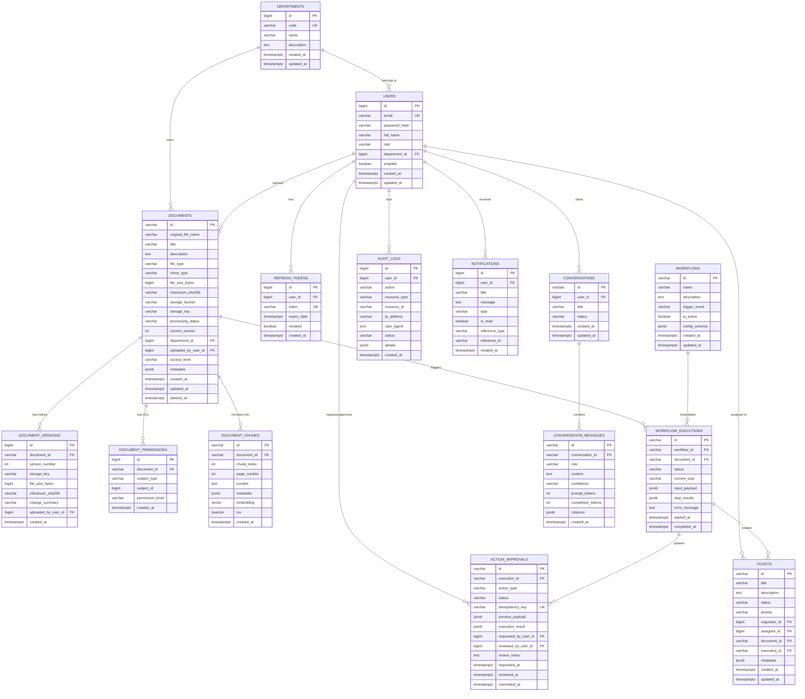

# Thiết Kế Cơ Sở Dữ Liệu Khởi Tạo (Database Schema Specification V1)

> **Dự án:** Nền tảng quản lý tài liệu nội bộ và tự động hóa nghiệp vụ (*Document Knowledge & Operations Platform*)
> **Tài liệu tham chiếu:** Báo cáo đề tài PBL4 ([`report.docx`](file:///home/phuqy/Develop/Document-Knowledge-Operations-Platform/docs/report/report.docx)), Kiến trúc hệ thống ([`architecture.md`](file:///home/phuqy/Develop/Document-Knowledge-Operations-Platform/docs/architecture.md)), AI Engineering Roadmap ([`draft.md`](file:///home/phuqy/Develop/Document-Knowledge-Operations-Platform/docs/draft.md)).
> **Ngôn ngữ thiết kế:** **DBML (Database Markup Language)** chuẩn quốc tế, độc lập hoàn toàn với codebase hiện tại.
> **Tệp mã nguồn DBML độc lập:** [`docs/database/schema.dbml`](file:///home/phuqy/Develop/Document-Knowledge-Operations-Platform/docs/database/schema.dbml) *(Có thể import trực tiếp vào [dbdiagram.io](https://dbdiagram.io))*.
> **Hệ quản trị CSDL đích:** PostgreSQL 16 + Extension `pgvector`, `uuid-ossp`, `pg_trgm`.
> **Lưu trữ nhị phân (Object Storage):** Amazon S3 (mô phỏng cục bộ bởi Floci).

---

## 1. Tổng Quan Kiến Trúc Dữ Liệu (Data Architecture Overview)

Hệ thống được thiết kế theo hướng tiếp cận **Domain-Driven Design (DDD) & Modular Bounded Contexts**, đảm bảo tính mở rộng cao và phân tách rõ ràng trách nhiệm giữa các phân hệ:

```text
                                +-----------------------------------------+
                                |  Document Knowledge Operations Platform |
                                +-----------------------------------------+
                                                     |
         +-------------------+-----------------------+-----------------------+-------------------+
         |                   |                       |                       |                   |
         v                   v                       v                       v                   v
+------------------+ +-------------------+ +-------------------+ +-------------------+ +-------------------+
| IAM_Organization | |Document_Management| | AI_Knowledge_RAG  | | Conversational_AI | |Workflow_Automation|
| (Users, Depts,   | | (Docs, S3 Meta,   | |(Chunks, pgvector, | |(Sessions, Messages| |(Workflows, Execs, |
|  Refresh Tokens) | |  Versions, ACL)   | |  tsvector Hybrid) | | Citations, Tokens)| | Steps, Pipeline)  |
+------------------+ +-------------------+ +-------------------+ +-------------------+ +-------------------+
                                                                                                 |
                                                                     +---------------------------+---------------------------+
                                                                     |                                                       |
                                                                     v                                                       v
                                                            +--------------------+                                  +--------------------+
                                                            |  Operations_HITL   |                                  |    Audit_System    |
                                                            | (Action Approvals, |                                  | (Immutable Logs,   |
                                                            |  Preview, Tickets) |                                  |   Notifications)   |
                                                            +--------------------+                                  +--------------------+
```

### 7 Bounded Contexts (TableGroups)
1. **`IAM_Organization`**: Quản lý phòng ban (`departments`), tài khoản người dùng (`users`), phân quyền Role-Based Access Control (`user_role`), và phiên đăng nhập (`refresh_tokens`).
2. **`Document_Management`**: Lưu trữ thông tin tài liệu (`documents`), lịch sử phiên bản (`document_versions`), và ma trận phân quyền chi tiết (`document_permissions` - ACL).
3. **`AI_Knowledge_RAG`**: Lưu trữ các phân đoạn văn bản (`document_chunks`) tích hợp vector embedding 1536 chiều (`pgvector`) và chỉ mục Full-Text Search (`tsvector`) phục vụ Hybrid Search (RRF).
4. **`Conversational_AI`**: Quản lý phiên hội thoại (`conversations`), lịch sử tin nhắn (`conversation_messages`), độ tin cậy và nguồn trích dẫn bằng chứng (`citations` JSONB).
5. **`Workflow_Automation`**: Định nghĩa các luồng tự động hóa khi tài liệu được tải lên hoặc index (`workflows`) và nhật ký từng phiên thực thi (`workflow_executions`).
6. **`Operations_HITL` (Human-In-The-Loop)**: Chốt chặn an toàn phê duyệt 2 pha (`action_approvals`: Prepare/Diff Preview $\rightarrow$ Waiting Approval $\rightarrow$ Commit) kèm khóa chống lặp (`idempotency_key`), và phiếu xử lý tác vụ (`tickets`).
7. **`Audit_System`**: Ghi vết nhật ký kiểm toán bất biến (`audit_logs`) và thông báo trạng thái (`notifications`).

### Nguyên Tắc Lưu Trữ File & Metadata
- **Không lưu tệp nhị phân (BLOB) vào PostgreSQL:** Tệp tài liệu gốc (PDF, DOCX, TXT, XLSX) được đẩy trực tiếp lên Amazon S3 / Floci Object Storage.
- **PostgreSQL chỉ lưu metadata:** Bucket, Object Key, Dung lượng, SHA-256 Checksum, Số trang, MIME Type và thông tin phân quyền.

---

## 2. Đặc Tả Mã Nguồn DBML Hoàn Chỉnh (Database Markup Language)

Dưới đây là toàn bộ mã nguồn DBML của hệ thống. Bạn có thể copy trực tiếp đoạn mã này dán vào **[dbdiagram.io](https://dbdiagram.io)** hoặc lưu tại [`schema.dbml`](file:///home/phuqy/Develop/Document-Knowledge-Operations-Platform/docs/database/schema.dbml).

```dbml
// =============================================================================
// DATABASE MARKUP LANGUAGE (DBML) SCHEMA SPECIFICATION V1.0
// Project: Document Knowledge & Operations Platform
// Compatible with: dbdiagram.io, dbdocs.io, @dbml/cli
// =============================================================================

// =============================================================================
// ENUMS
// =============================================================================

Enum user_role {
  ADMIN [note: 'Quản trị viên toàn hệ thống']
  MANAGER [note: 'Quản lý phòng ban']
  STAFF [note: 'Nhân viên nghiệp vụ']
  CUSTOMER [note: 'Khách hàng / Người dùng ngoài']
  SYSTEM [note: 'Tài khoản dịch vụ nội bộ hệ thống']
}

Enum document_file_type {
  PDF [note: 'Tài liệu định dạng PDF']
  DOCX [note: 'Tài liệu Microsoft Word']
  TXT [note: 'Tệp văn bản thuần']
  XLSX [note: 'Bảng tính Excel']
  IMAGE [note: 'Tệp hình ảnh / Quét scan']
  OTHER [note: 'Định dạng khác']
}

Enum document_processing_status {
  PENDING [note: 'Mới tải lên, chờ đưa vào hàng đợi xử lý']
  PARSING [note: 'Đang trích xuất cấu trúc và văn bản']
  CHUNKED [note: 'Đã hoàn thành phân đoạn văn bản']
  INDEXED [note: 'Đã tạo embedding vector và lập chỉ mục tìm kiếm']
  FAILED [note: 'Xử lý thất bại, có kèm lỗi']
}

Enum access_level {
  PUBLIC [note: 'Công khai cho mọi người dùng']
  INTERNAL [note: 'Nội bộ tổ chức / công ty']
  RESTRICTED [note: 'Chỉ các phòng ban liên quan']
  CONFIDENTIAL [note: 'Tối mật, chỉ người được cấp quyền chỉ định']
}

Enum permission_subject_type {
  USER [note: 'Phân quyền theo từng người dùng cá nhân']
  DEPARTMENT [note: 'Phân quyền theo cả phòng ban']
  ROLE [note: 'Phân quyền theo vai trò hệ thống']
}

Enum permission_level {
  VIEW [note: 'Chỉ có quyền xem và tra cứu RAG']
  EDIT [note: 'Có quyền chỉnh sửa metadata và tải phiên bản mới']
  ADMIN [note: 'Toàn quyền quản trị, xóa và phân quyền tài liệu']
}

Enum conversation_status {
  ACTIVE [note: 'Phiên hội thoại đang hoạt động']
  ARCHIVED [note: 'Đã lưu trữ vào lịch sử']
  DELETED [note: 'Đã xóa bởi người dùng']
}

Enum message_role {
  USER [note: 'Tin nhắn gửi từ người dùng']
  ASSISTANT [note: 'Phản hồi từ AI Assistant']
  SYSTEM [note: 'Chỉ dẫn hệ thống (System Prompt)']
  TOOL [note: 'Kết quả trả về từ công cụ ngoài']
}

Enum confidence_level {
  LOW [note: 'Độ tin cậy thấp / Có thể cần tra cứu thêm']
  MEDIUM [note: 'Độ tin cậy trung bình']
  HIGH [note: 'Độ tin cậy cao, có đầy đủ căn cứ tài liệu']
}

Enum workflow_trigger_event {
  ON_DOCUMENT_UPLOADED [note: 'Kích hoạt ngay khi tài liệu vừa tải lên S3']
  ON_DOCUMENT_INDEXED [note: 'Kích hoạt sau khi tài liệu đã tạo vector RAG']
  MANUAL_TRIGGER [note: 'Kích hoạt thủ công bởi người dùng hoặc API']
  SCHEDULED [note: 'Kích hoạt định kỳ theo lịch cron']
}

Enum workflow_execution_status {
  PENDING [note: 'Đang chờ tới lượt xử lý']
  RUNNING [note: 'Đang thực thi các bước trong pipeline']
  WAITING_APPROVAL [note: 'Tạm dừng chờ con người phê duyệt (HITL)']
  COMPLETED [note: 'Hoàn thành toàn bộ các bước thành công']
  FAILED [note: 'Thực thi thất bại']
  CANCELLED [note: 'Bị hủy bỏ']
}

Enum action_approval_status {
  PENDING [note: 'Đang chờ người có thẩm quyền xét duyệt']
  APPROVED [note: 'Đã được duyệt, sẵn sàng commit']
  REJECTED [note: 'Bị từ chối phê duyệt']
  COMMITTED [note: 'Đã thực thi commit mutation thành công']
  EXPIRED [note: 'Hết hạn phê duyệt']
}

Enum ticket_status {
  OPEN [note: 'Phiếu mới tạo, chưa có người tiếp nhận']
  IN_PROGRESS [note: 'Đang trong quá trình xử lý']
  RESOLVED [note: 'Đã giải quyết xong']
  CLOSED [note: 'Đã đóng phiếu']
  CANCELLED [note: 'Hủy bỏ phiếu']
}

Enum ticket_priority {
  LOW [note: 'Ưu tiên thấp']
  MEDIUM [note: 'Ưu tiên tiêu chuẩn']
  HIGH [note: 'Ưu tiên cao']
  URGENT [note: 'Khẩn cấp cần xử lý ngay']
}

Enum audit_status {
  SUCCESS [note: 'Thao tác thực thi thành công']
  FAILED [note: 'Thao tác thất bại hoặc bị từ chối']
}

Enum notification_type {
  INFO [note: 'Thông tin chung']
  SUCCESS [note: 'Thông báo hoàn thành nhiệm vụ']
  WARNING [note: 'Cảnh báo hệ thống']
  ACTION_REQUIRED [note: 'Yêu cầu người dùng hành động / duyệt tác vụ']
}

// =============================================================================
// BOUNDED CONTEXT 1: IAM & ORGANIZATION
// =============================================================================

Table departments as D {
  id bigint [pk, increment, note: 'Mã định danh phòng ban']
  code varchar(50) [unique, not null, note: 'Mã viết tắt duy nhất (HR, FIN, IT, LEGAL)']
  name varchar(255) [not null, note: 'Tên phòng ban đầy đủ']
  description text [null, note: 'Mô tả chức năng nhiệm vụ phòng ban']
  created_at timestamptz [not null, default: `CURRENT_TIMESTAMP`]
  updated_at timestamptz [not null, default: `CURRENT_TIMESTAMP`]

  indexes {
    code [name: 'idx_departments_code']
  }
  Note: 'Phòng ban và đơn vị tổ chức phục vụ kiểm soát phạm vi truy cập tài liệu'
}

Table users as U {
  id bigint [pk, increment, note: 'Mã định danh người dùng']
  email varchar(255) [unique, not null, note: 'Email tài khoản dùng đăng nhập']
  password_hash varchar(255) [not null, note: 'Mật khẩu đã được mã hóa BCrypt']
  full_name varchar(255) [not null, note: 'Họ và tên đầy đủ']
  department_id bigint [null, note: 'Phòng ban trực thuộc']
  enabled boolean [not null, default: true, note: 'Trạng thái hoạt động của tài khoản']
  is_internal boolean [not null, default: true, note: 'Đánh dấu nhân viên nội bộ tổ chức (truy cập tài liệu INTERNAL)']
  created_at timestamptz [not null, default: `CURRENT_TIMESTAMP`]
  updated_at timestamptz [not null, default: `CURRENT_TIMESTAMP`]

  indexes {
    email [name: 'idx_users_email']
    department_id [name: 'idx_users_department']
  }
  Note: 'Tài khoản người dùng và thông tin định danh hệ thống'
}

Table roles as R {
  id bigint [pk, increment, note: 'Mã định danh vai trò']
  code varchar(50) [unique, not null, note: 'Mã vai trò chuẩn RBAC (ROLE_ADMIN, ROLE_MANAGER, ROLE_STAFF, ROLE_AUDITOR)']
  name varchar(100) [not null, note: 'Tên hiển thị của vai trò']
  description text [null, note: 'Mô tả phạm vi trách nhiệm của vai trò']
  created_at timestamptz [not null, default: `CURRENT_TIMESTAMP`]

  indexes {
    code [name: 'idx_roles_code']
  }
  Note: 'Danh mục vai trò hệ thống phục vụ RBAC đa tầng'
}

Table permissions as P {
  id bigint [pk, increment, note: 'Mã định danh quyền hạn chức năng']
  code varchar(100) [unique, not null, note: 'Mã quyền hạn chuẩn hạt mịn (read:documents, write:documents, delete:documents, approve:actions)']
  name varchar(150) [not null, note: 'Tên hiển thị quyền hạn']
  module varchar(50) [not null, note: 'Phân hệ chức năng (DOCUMENTS, WORKFLOWS, USERS, RAG, AUDIT)']
  description text [null, note: 'Mô tả chi tiết tác vụ được phép thực thi']
  created_at timestamptz [not null, default: `CURRENT_TIMESTAMP`]

  indexes {
    code [name: 'idx_permissions_code']
    module [name: 'idx_permissions_module']
  }
  Note: 'Danh mục quyền hạn chức năng mức hạt mịn (Fine-grained Authorities)'
}

Table user_roles as UR {
  user_id bigint [not null, note: 'ID người dùng']
  role_id bigint [not null, note: 'ID vai trò được cấp (Multiple Roles per User)']

  indexes {
    (user_id, role_id) [pk]
    user_id [name: 'idx_user_roles_user']
    role_id [name: 'idx_user_roles_role']
  }
  Note: 'Bảng gán nhiều vai trò cho người dùng (Quan hệ N - N)'
}

Table role_permissions as RP {
  role_id bigint [not null, note: 'ID vai trò']
  permission_id bigint [not null, note: 'ID quyền hạn chức năng']

  indexes {
    (role_id, permission_id) [pk]
    role_id [name: 'idx_role_permissions_role']
    permission_id [name: 'idx_role_permissions_perm']
  }
  Note: 'Bảng gán danh sách quyền hạn cho từng vai trò (Quan hệ N - N)'
}

Table refresh_tokens as RT {
  id bigint [pk, increment, note: 'Mã định danh token']
  user_id bigint [not null, note: 'Người dùng sở hữu']
  token varchar(512) [unique, not null, note: 'Chuỗi refresh token ngẫu nhiên an toàn']
  expiry_date timestamptz [not null, note: 'Thời điểm hết hạn token']
  revoked boolean [not null, default: false, note: 'Đánh dấu token đã bị thu hồi']
  created_at timestamptz [not null, default: `CURRENT_TIMESTAMP`]

  indexes {
    user_id [name: 'idx_refresh_tokens_user']
    token [name: 'idx_refresh_tokens_token']
  }
  Note: 'Quản lý vòng đời Refresh Token cho cơ chế xác thực JWT'
}

// =============================================================================
// BOUNDED CONTEXT 2: DOCUMENT MANAGEMENT & S3 STORAGE
// =============================================================================

Table documents as DOC {
  id varchar(64) [pk, note: 'Mã định danh tài liệu (UUID v4 / KSUID)']
  original_file_name varchar(255) [not null, note: 'Tên tệp gốc khi tải lên']
  title varchar(255) [not null, note: 'Tiêu đề quản lý của tài liệu']
  description text [null, note: 'Mô tả nội dung tóm tắt']
  file_type document_file_type [not null, note: 'Định dạng tài liệu (PDF, DOCX, TXT...)']
  mime_type varchar(100) [not null, note: 'MIME type chuẩn (e.g. application/pdf)']
  file_size_bytes bigint [not null, note: 'Dung lượng tệp tính bằng bytes']
  checksum_sha256 varchar(64) [not null, note: 'Mã băm SHA-256 xác thực toàn vẹn']
  storage_bucket varchar(128) [not null, note: 'Tên bucket trên S3 / Floci']
  storage_key varchar(512) [not null, note: 'Đường dẫn Object Key lưu trữ trên S3 / Floci']
  processing_status document_processing_status [not null, default: 'PENDING', note: 'Trạng thái xử lý nội dung & RAG']
  current_version int [not null, default: 1, note: 'Phiên bản hiện tại của tài liệu']
  department_id bigint [null, note: 'Phòng ban sở hữu tài liệu']
  uploaded_by_user_id bigint [not null, note: 'Người dùng tải tệp lên']
  access_level access_level [not null, default: 'INTERNAL', note: 'Cấp độ bảo mật truy cập tài liệu']
  metadata jsonb [not null, default: `'{}'`, note: 'Metadata bổ sung (tác giả, tags, số trang, OCR, language)']
  created_at timestamptz [not null, default: `CURRENT_TIMESTAMP`]
  updated_at timestamptz [not null, default: `CURRENT_TIMESTAMP`]
  deleted_at timestamptz [null, note: 'Thời điểm xóa mềm (Soft delete)']

  indexes {
    processing_status [name: 'idx_documents_status']
    uploaded_by_user_id [name: 'idx_documents_uploaded_by']
    department_id [name: 'idx_documents_department']
    checksum_sha256 [name: 'idx_documents_checksum']
    metadata [type: gin, name: 'idx_documents_metadata']
    (department_id, processing_status) [name: 'idx_documents_dept_status']
  }
  Note: 'Bảng trung tâm quản lý metadata tài liệu và tham chiếu Object Storage S3'
}

Table document_versions as DV {
  id bigint [pk, increment, note: 'Mã định danh bản ghi phiên bản']
  document_id varchar(64) [not null, note: 'Mã tài liệu cha']
  version_number int [not null, note: 'Số thứ tự phiên bản (1, 2, 3...)']
  storage_key varchar(512) [not null, note: 'Đường dẫn S3 Key của phiên bản này']
  file_size_bytes bigint [not null, note: 'Dung lượng tệp của phiên bản']
  checksum_sha256 varchar(64) [not null, note: 'Mã băm SHA-256 của phiên bản']
  change_summary varchar(500) [null, note: 'Ghi chú tóm tắt lý do cập nhật']
  uploaded_by_user_id bigint [not null, note: 'Người thực hiện cập nhật phiên bản']
  created_at timestamptz [not null, default: `CURRENT_TIMESTAMP`]

  indexes {
    (document_id, version_number) [unique, name: 'uq_document_version']
  }
  Note: 'Lịch sử các phiên bản tệp tin được cập nhật theo thời gian'
}

Table document_permissions as DP {
  id bigint [pk, increment, note: 'Mã định danh quyền']
  document_id varchar(64) [not null, note: 'Tài liệu được phân quyền']
  subject_type permission_subject_type [not null, note: 'Loại đối tượng (USER, DEPARTMENT, ROLE)']
  subject_id bigint [not null, note: 'ID của user hoặc department được trao quyền']
  permission_level permission_level [not null, default: 'VIEW', note: 'Mức quyền hạn (VIEW, EDIT, ADMIN)']
  created_at timestamptz [not null, default: `CURRENT_TIMESTAMP`]

  indexes {
    (document_id, subject_type, subject_id) [unique, name: 'uq_doc_permission']
    (subject_type, subject_id) [name: 'idx_doc_perm_subject']
  }
  Note: 'Danh sách kiểm soát quyền truy cập chi tiết (ACL) cho từng tài liệu'
}

// =============================================================================
// BOUNDED CONTEXT 3: AI KNOWLEDGE & PGVECTOR RAG
// =============================================================================

Table document_chunks as DC {
  id varchar(64) [pk, note: 'Mã định danh chunk (e.g. docId_chunkIdx)']
  document_id varchar(64) [not null, note: 'Mã tài liệu gốc']
  chunk_index int [not null, default: 0, note: 'Thứ tự xuất hiện của đoạn trong tài liệu']
  page_number int [null, note: 'Số trang trong tài liệu gốc']
  content text [not null, note: 'Nội dung văn bản thuần của đoạn']
  metadata jsonb [not null, default: `'{}'`, note: 'Metadata phân vùng ACL, doc_title, token_count']
  embedding "vector(1536)" [null, note: 'Vector embedding đa chiều (OpenAI/bge-m3)']
  tsv tsvector [not null, note: 'Cột phát sinh tự động phục vụ Full-Text Search']
  created_at timestamptz [not null, default: `CURRENT_TIMESTAMP`]

  indexes {
    document_id [name: 'idx_document_chunks_doc_id']
    embedding [name: 'idx_document_chunks_embedding', note: 'HNSW vector_cosine_ops Index']
    tsv [type: gin, name: 'idx_document_chunks_tsv']
    metadata [type: gin, name: 'idx_document_chunks_metadata']
  }
  Note: 'Lưu trữ các đoạn trích xuất tài liệu phục vụ tìm kiếm ngữ nghĩa Hybrid RAG (pgvector + FTS)'
}

// =============================================================================
// BOUNDED CONTEXT 4: CONVERSATIONAL AI & CITATIONS
// =============================================================================

Table conversations as C {
  id varchar(64) [pk, note: 'Mã định danh cuộc trò chuyện']
  user_id bigint [not null, note: 'Người dùng sở hữu phiên hội thoại']
  title varchar(255) [not null, default: 'Cuộc trò chuyện mới', note: 'Tiêu đề cuộc trò chuyện']
  status conversation_status [not null, default: 'ACTIVE', note: 'Trạng thái phiên chat']
  created_at timestamptz [not null, default: `CURRENT_TIMESTAMP`]
  updated_at timestamptz [not null, default: `CURRENT_TIMESTAMP`]

  indexes {
    (user_id, updated_at) [name: 'idx_conversations_user']
  }
  Note: 'Phiên hỏi đáp tra cứu kiến thức tài liệu của người dùng'
}

Table conversation_messages as CM {
  id varchar(64) [pk, note: 'Mã định danh tin nhắn']
  conversation_id varchar(64) [not null, note: 'Cuộc trò chuyện chứa tin nhắn']
  role message_role [not null, note: 'Vai trò người gửi (USER, ASSISTANT, SYSTEM, TOOL)']
  content text [not null, note: 'Nội dung văn bản tin nhắn']
  confidence confidence_level [null, note: 'Mức độ tự tin câu trả lời sinh bởi AI']
  prompt_tokens int [not null, default: 0, note: 'Số lượng token đầu vào']
  completion_tokens int [not null, default: 0, note: 'Số lượng token đầu ra']
  citations jsonb [not null, default: `'[]'`, note: 'Danh sách bằng chứng trích dẫn [{doc_id, chunk_id, score, text}]']
  created_at timestamptz [not null, default: `CURRENT_TIMESTAMP`]

  indexes {
    (conversation_id, created_at) [name: 'idx_messages_conversation']
  }
  Note: 'Lịch sử từng tin nhắn trong phiên hội thoại kèm trích dẫn bằng chứng RAG'
}

// =============================================================================
// BOUNDED CONTEXT 5: WORKFLOW AUTOMATION
// =============================================================================

Table workflows as WF {
  id varchar(64) [pk, note: 'Mã định danh workflow']
  name varchar(255) [not null, note: 'Tên quy trình tự động hóa']
  description text [null, note: 'Mô tả chi tiết các bước trong quy trình']
  trigger_event workflow_trigger_event [not null, note: 'Sự kiện kích hoạt workflow']
  is_active boolean [not null, default: true, note: 'Trạng thái kích hoạt của quy trình']
  config_schema jsonb [not null, default: `'{}'`, note: 'Cấu hình pipeline các bước và điều kiện']
  created_at timestamptz [not null, default: `CURRENT_TIMESTAMP`]
  updated_at timestamptz [not null, default: `CURRENT_TIMESTAMP`]

  indexes {
    trigger_event [name: 'idx_workflows_trigger']
    is_active [name: 'idx_workflows_active']
  }
  Note: 'Định nghĩa các quy trình tự động hóa xử lý tài liệu và nghiệp vụ'
}

Table workflow_executions as WFE {
  id varchar(64) [pk, note: 'Mã phiên thực thi (Execution Run ID)']
  workflow_id varchar(64) [not null, note: 'Quy trình mẫu được thực thi']
  document_id varchar(64) [null, note: 'Tài liệu liên quan trực tiếp đến phiên chạy']
  status workflow_execution_status [not null, default: 'PENDING', note: 'Trạng thái phiên chạy']
  current_step varchar(100) [null, note: 'Bước nghiệp vụ hiện đang xử lý']
  input_payload jsonb [not null, default: `'{}'`, note: 'Dữ liệu đầu vào của lần chạy']
  step_results jsonb [not null, default: `'{}'`, note: 'Kết quả trung gian của từng bước']
  error_message text [null, note: 'Chi tiết thông báo lỗi nếu bước thực thi thất bại']
  started_at timestamptz [not null, default: `CURRENT_TIMESTAMP`]
  completed_at timestamptz [null, note: 'Thời điểm hoàn thành thực thi']

  indexes {
    workflow_id [name: 'idx_executions_workflow']
    document_id [name: 'idx_executions_document']
    status [name: 'idx_executions_status']
    started_at [name: 'idx_executions_started_at']
  }
  Note: 'Lịch sử và trạng thái từng phiên chạy thực tế của các workflow tự động'
}

// =============================================================================
// BOUNDED CONTEXT 6: OPERATIONS & HUMAN-IN-THE-LOOP (HITL)
// =============================================================================

Table action_approvals as AA {
  id varchar(64) [pk, note: 'Mã định danh yêu cầu phê duyệt']
  execution_id varchar(64) [null, note: 'Phiên workflow phát sinh yêu cầu']
  action_type varchar(100) [not null, note: 'Tên hành động cần duyệt (UPDATE_DOC, CREATE_TICKET...)']
  status action_approval_status [not null, default: 'PENDING', note: 'Trạng thái phê duyệt']
  idempotency_key varchar(128) [unique, not null, note: 'Khóa ngăn chặn thực thi trùng lặp']
  preview_payload jsonb [not null, default: `'{}'`, note: 'Bản xem trước dữ liệu thay đổi (Diff Preview / Dry-run)']
  execution_result jsonb [not null, default: `'{}'`, note: 'Kết quả sau khi commit mutation']
  requested_by_user_id bigint [null, note: 'Người dùng hoặc AI Agent đề xuất']
  reviewed_by_user_id bigint [null, note: 'Người có thẩm quyền bấm duyệt hoặc từ chối']
  review_notes text [null, note: 'Ghi chú lý do phê duyệt / từ chối']
  requested_at timestamptz [not null, default: `CURRENT_TIMESTAMP`]
  reviewed_at timestamptz [null, note: 'Thời điểm người phê duyệt ra quyết định']
  committed_at timestamptz [null, note: 'Thời điểm hệ thống hoàn tất thay đổi vào CSDL']

  indexes {
    status [name: 'idx_approvals_status']
    idempotency_key [name: 'idx_approvals_idempotency']
    (status, requested_at) [name: 'idx_approvals_status_req']
  }
  Note: 'Chốt chặn Human-in-the-loop: Phê duyệt 2 pha an toàn trước khi thực hiện hành động thay đổi dữ liệu'
}

Table tickets as T {
  id varchar(64) [pk, note: 'Mã định danh phiếu công việc']
  title varchar(255) [not null, note: 'Tiêu đề yêu cầu / sự vụ']
  description text [null, note: 'Chi tiết nội dung yêu cầu']
  status ticket_status [not null, default: 'OPEN', note: 'Trạng thái xử lý phiếu']
  priority ticket_priority [not null, default: 'MEDIUM', note: 'Mức độ ưu tiên']
  requester_id bigint [not null, note: 'Người tạo yêu cầu']
  assignee_id bigint [null, note: 'Nhân viên phụ trách xử lý']
  document_id varchar(64) [null, note: 'Tài liệu liên quan']
  execution_id varchar(64) [null, note: 'Workflow execution phát sinh ticket']
  metadata jsonb [not null, default: `'{}'`, note: 'Dữ liệu tùy biến mở rộng']
  created_at timestamptz [not null, default: `CURRENT_TIMESTAMP`]
  updated_at timestamptz [not null, default: `CURRENT_TIMESTAMP`]

  indexes {
    status [name: 'idx_tickets_status']
    requester_id [name: 'idx_tickets_requester']
    assignee_id [name: 'idx_tickets_assignee']
    (status, priority) [name: 'idx_tickets_status_priority']
  }
  Note: 'Quản lý phiếu yêu cầu công việc hoặc sự vụ nội bộ được tạo tự động bởi AI hoặc thủ công'
}

// =============================================================================
// BOUNDED CONTEXT 7: AUDIT TRAIL & NOTIFICATIONS
// =============================================================================

Table audit_logs as AL {
  id bigint [pk, increment, note: 'Mã định danh bản ghi kiểm toán']
  user_id bigint [null, note: 'Người thực hiện (NULL nếu do hệ thống)']
  action varchar(100) [not null, note: 'Tên hành động (LOGIN, UPLOAD_DOC, APPROVE_ACTION...)']
  resource_type varchar(100) [not null, note: 'Loại tài nguyên bị tác động (DOCUMENT, USER, WORKFLOW)']
  resource_id varchar(64) [null, note: 'ID của tài nguyên bị tác động']
  ip_address varchar(45) [null, note: 'Địa chỉ IP nguồn (IPv4 hoặc IPv6)']
  user_agent text [null, note: 'Thông tin thiết bị và trình duyệt']
  status audit_status [not null, default: 'SUCCESS', note: 'Kết quả thao tác']
  details jsonb [not null, default: `'{}'`, note: 'Chi tiết dữ liệu thay đổi (Payload / Request parameters)']
  created_at timestamptz [not null, default: `CURRENT_TIMESTAMP`]

  indexes {
    user_id [name: 'idx_audit_logs_user']
    (resource_type, resource_id) [name: 'idx_audit_logs_resource']
    created_at [name: 'idx_audit_logs_created_at']
    (user_id, created_at) [name: 'idx_audit_logs_user_time']
  }
  Note: 'Nhật ký kiểm toán bất biến (Append-only) phục vụ giám sát bảo mật và giải trình'
}

Table notifications as N {
  id bigint [pk, increment, note: 'Mã định danh thông báo']
  user_id bigint [not null, note: 'Người nhận thông báo']
  title varchar(255) [not null, note: 'Tiêu đề thông báo']
  message text [not null, note: 'Nội dung thông báo chi tiết']
  type notification_type [not null, default: 'INFO', note: 'Phân loại mức độ thông báo']
  is_read boolean [not null, default: false, note: 'Đã đọc hay chưa']
  reference_type varchar(100) [null, note: 'Loại đối tượng liên quan (DOCUMENT, TICKET, APPROVAL)']
  reference_id varchar(64) [null, note: 'ID đối tượng liên quan']
  created_at timestamptz [not null, default: `CURRENT_TIMESTAMP`]

  indexes {
    (user_id, is_read) [name: 'idx_notifications_user_read']
    created_at [name: 'idx_notifications_created_at']
  }
  Note: 'Thông báo đẩy gửi tới người dùng về tiến độ xử lý tài liệu, workflow và yêu cầu phê duyệt'
}

// =============================================================================
// RELATIONSHIPS & FOREIGN KEYS
// =============================================================================

// IAM Relationships
Ref: users.department_id > departments.id [delete: set null]
Ref: refresh_tokens.user_id > users.id [delete: cascade]
Ref: user_roles.user_id > users.id [delete: cascade]
Ref: user_roles.role_id > roles.id [delete: cascade]
Ref: role_permissions.role_id > roles.id [delete: cascade]
Ref: role_permissions.permission_id > permissions.id [delete: cascade]

// Document Relationships
Ref: documents.department_id > departments.id [delete: set null]
Ref: documents.uploaded_by_user_id > users.id [delete: restrict]
Ref: document_versions.document_id > documents.id [delete: cascade]
Ref: document_versions.uploaded_by_user_id > users.id [delete: restrict]
Ref: document_permissions.document_id > documents.id [delete: cascade]

// AI Knowledge / RAG Relationships
Ref: document_chunks.document_id > documents.id [delete: cascade]

// Conversation Relationships
Ref: conversations.user_id > users.id [delete: cascade]
Ref: conversation_messages.conversation_id > conversations.id [delete: cascade]

// Workflow Relationships
Ref: workflow_executions.workflow_id > workflows.id [delete: cascade]
Ref: workflow_executions.document_id > documents.id [delete: set null]

// Operations & HITL Relationships
Ref: action_approvals.execution_id > workflow_executions.id [delete: set null]
Ref: action_approvals.requested_by_user_id > users.id [delete: set null]
Ref: action_approvals.reviewed_by_user_id > users.id [delete: set null]
Ref: tickets.requester_id > users.id [delete: restrict]
Ref: tickets.assignee_id > users.id [delete: set null]
Ref: tickets.document_id > documents.id [delete: set null]
Ref: tickets.execution_id > workflow_executions.id [delete: set null]

// Audit & Notification Relationships
Ref: audit_logs.user_id > users.id [delete: set null]
Ref: notifications.user_id > users.id [delete: cascade]

// =============================================================================
// TABLE GROUPS (BOUNDED CONTEXTS VISUALIZATION)
// =============================================================================

TableGroup IAM_Organization {
  departments
  users
  roles
  permissions
  user_roles
  role_permissions
  refresh_tokens
}

TableGroup Document_Management {
  documents
  document_versions
  document_permissions
}

TableGroup AI_Knowledge_RAG {
  document_chunks
}

TableGroup Conversational_AI {
  conversations
  conversation_messages
}

TableGroup Workflow_Automation {
  workflows
  workflow_executions
}

TableGroup Operations_HITL {
  action_approvals
  tickets
}

TableGroup Audit_System {
  audit_logs
  notifications
}
```

---

## 3. Sơ Đồ Thực Thể Quan Hệ (Mermaid ERD Diagram)



---

## 4. Từ Điển Dữ Liệu Chi Tiết (Data Dictionary)

### 4.1. Bounded Context: `IAM_Organization`

#### Bảng `departments` (Phòng ban / Đơn vị tổ chức)
| Cột | Kiểu | Null | Mặc định | Khóa / Ràng buộc | Mô tả |
| :--- | :--- | :--- | :--- | :--- | :--- |
| `id` | `BIGSERIAL` | NO | Auto | **PK** | Khóa chính tự tăng |
| `code` | `VARCHAR(50)` | NO | | **UNIQUE** | Mã viết tắt (e.g. `HR`, `IT`, `LEGAL`) |
| `name` | `VARCHAR(255)` | NO | | | Tên phòng ban đầy đủ |
| `description` | `TEXT` | YES | | | Chức năng nhiệm vụ |
| `created_at` | `TIMESTAMPTZ` | NO | `CURRENT_TIMESTAMP` | | Ngày tạo |
| `updated_at` | `TIMESTAMPTZ` | NO | `CURRENT_TIMESTAMP` | | Ngày cập nhật |

#### Bảng `users` (Tài khoản người dùng)
| Cột | Kiểu | Null | Mặc định | Khóa / Ràng buộc | Mô tả |
| :--- | :--- | :--- | :--- | :--- | :--- |
| `id` | `BIGSERIAL` | NO | Auto | **PK** | Khóa chính tự tăng |
| `email` | `VARCHAR(255)` | NO | | **UNIQUE** | Email đăng nhập |
| `password_hash` | `VARCHAR(255)` | NO | | | Mật khẩu mã hóa BCrypt |
| `full_name` | `VARCHAR(255)` | NO | | | Họ tên người dùng |
| `role` | `VARCHAR(50)` | NO | `'STAFF'` | `Enum user_role` | Vai trò hệ thống (`ADMIN`, `MANAGER`, `STAFF`, `CUSTOMER`, `SYSTEM`) |
| `department_id` | `BIGINT` | YES | | **FK** $\rightarrow$ `departments(id)` | Phòng ban trực thuộc |
| `enabled` | `BOOLEAN` | NO | `TRUE` | | Kích hoạt |
| `created_at` | `TIMESTAMPTZ` | NO | `CURRENT_TIMESTAMP` | | Ngày tạo |
| `updated_at` | `TIMESTAMPTZ` | NO | `CURRENT_TIMESTAMP` | | Ngày sửa |

#### Bảng `refresh_tokens` (Phiên làm việc JWT)
| Cột | Kiểu | Null | Mặc định | Khóa / Ràng buộc | Mô tả |
| :--- | :--- | :--- | :--- | :--- | :--- |
| `id` | `BIGSERIAL` | NO | Auto | **PK** | Khóa chính tự tăng |
| `user_id` | `BIGINT` | NO | | **FK** $\rightarrow$ `users(id)` | Người dùng |
| `token` | `VARCHAR(512)` | NO | | **UNIQUE** | Chuỗi token ngẫu nhiên |
| `expiry_date` | `TIMESTAMPTZ` | NO | | | Thời điểm hết hạn |
| `revoked` | `BOOLEAN` | NO | `FALSE` | | Thu hồi |
| `created_at` | `TIMESTAMPTZ` | NO | `CURRENT_TIMESTAMP` | | Ngày tạo |

---

### 4.2. Bounded Context: `Document_Management`

#### Bảng `documents` (Tài liệu & S3 Reference)
| Cột | Kiểu | Null | Mặc định | Khóa / Ràng buộc | Mô tả |
| :--- | :--- | :--- | :--- | :--- | :--- |
| `id` | `VARCHAR(64)` | NO | | **PK** (UUID) | Mã định danh tài liệu |
| `original_file_name` | `VARCHAR(255)` | NO | | | Tên tệp gốc |
| `title` | `VARCHAR(255)` | NO | | | Tiêu đề nghiệp vụ |
| `description` | `TEXT` | YES | | | Mô tả tóm tắt |
| `file_type` | `VARCHAR(50)` | NO | | `Enum document_file_type` | Loại file (`PDF`, `DOCX`, `TXT`, `XLSX`...) |
| `mime_type` | `VARCHAR(100)` | NO | | | MIME Type chuẩn |
| `file_size_bytes` | `BIGINT` | NO | | | Kích thước file (bytes) |
| `checksum_sha256` | `VARCHAR(64)` | NO | | | Mã băm SHA-256 xác thực file |
| `storage_bucket` | `VARCHAR(128)` | NO | | | Tên bucket trên S3 / Floci |
| `storage_key` | `VARCHAR(512)` | NO | | | Object Key trên S3 / Floci |
| `processing_status` | `VARCHAR(50)` | NO | `'PENDING'` | `Enum document_processing_status` | Trạng thái (`PENDING`, `PARSING`, `CHUNKED`, `INDEXED`, `FAILED`) |
| `current_version` | `INT` | NO | `1` | | Phiên bản hiện hành |
| `department_id` | `BIGINT` | YES | | **FK** $\rightarrow$ `departments(id)` | Phòng ban sở hữu |
| `uploaded_by_user_id`| `BIGINT` | NO | | **FK** $\rightarrow$ `users(id)` | Người tải lên |
| `access_level` | `VARCHAR(50)` | NO | `'INTERNAL'` | `Enum access_level` | Mức bảo mật (`PUBLIC`, `INTERNAL`, `RESTRICTED`, `CONFIDENTIAL`) |
| `metadata` | `JSONB` | NO | `'{}'` | | Dữ liệu mở rộng (tags, author, OCR, pages) |
| `created_at` | `TIMESTAMPTZ` | NO | `CURRENT_TIMESTAMP` | | Ngày tạo |
| `updated_at` | `TIMESTAMPTZ` | NO | `CURRENT_TIMESTAMP` | | Ngày sửa |
| `deleted_at` | `TIMESTAMPTZ` | YES | | | Soft delete |

#### Bảng `document_versions` (Lịch sử phiên bản file)
| Cột | Kiểu | Null | Mặc định | Khóa / Ràng buộc | Mô tả |
| :--- | :--- | :--- | :--- | :--- | :--- |
| `id` | `BIGSERIAL` | NO | Auto | **PK** | Khóa chính tự tăng |
| `document_id` | `VARCHAR(64)` | NO | | **FK** $\rightarrow$ `documents(id)` | Tài liệu cha |
| `version_number` | `INT` | NO | | | Thứ tự phiên bản |
| `storage_key` | `VARCHAR(512)` | NO | | | S3 Key tệp snapshot |
| `file_size_bytes` | `BIGINT` | NO | | | Dung lượng tệp phiên bản |
| `checksum_sha256` | `VARCHAR(64)` | NO | | | SHA-256 phiên bản |
| `change_summary` | `VARCHAR(500)` | YES | | | Lý do thay đổi |
| `uploaded_by_user_id`| `BIGINT` | NO | | **FK** $\rightarrow$ `users(id)` | Người cập nhật |
| `created_at` | `TIMESTAMPTZ` | NO | `CURRENT_TIMESTAMP` | | Ngày tải lên |

#### Bảng `document_permissions` (Ma trận phân quyền ACL)
| Cột | Kiểu | Null | Mặc định | Khóa / Ràng buộc | Mô tả |
| :--- | :--- | :--- | :--- | :--- | :--- |
| `id` | `BIGSERIAL` | NO | Auto | **PK** | Khóa chính tự tăng |
| `document_id` | `VARCHAR(64)` | NO | | **FK** $\rightarrow$ `documents(id)` | Tài liệu |
| `subject_type` | `VARCHAR(50)` | NO | | `Enum permission_subject_type` | `USER`, `DEPARTMENT`, `ROLE` |
| `subject_id` | `BIGINT` | NO | | | ID đối tượng |
| `permission_level`| `VARCHAR(50)` | NO | `'VIEW'` | `Enum permission_level` | `VIEW`, `EDIT`, `ADMIN` |
| `created_at` | `TIMESTAMPTZ` | NO | `CURRENT_TIMESTAMP` | | Ngày cấp quyền |

---

### 4.3. Bounded Context: `AI_Knowledge_RAG`

#### Bảng `document_chunks` (Đoạn văn bản & Vector Embedding)
| Cột | Kiểu | Null | Mặc định | Khóa / Ràng buộc | Mô tả |
| :--- | :--- | :--- | :--- | :--- | :--- |
| `id` | `VARCHAR(64)` | NO | | **PK** | Mã chunk (`docId_idx`) |
| `document_id` | `VARCHAR(64)` | NO | | **FK** $\rightarrow$ `documents(id)` | Tài liệu gốc |
| `chunk_index` | `INT` | NO | `0` | | Vị trí đoạn |
| `page_number` | `INT` | YES | | | Số trang gốc |
| `content` | `TEXT` | NO | | | Nội dung văn bản |
| `metadata` | `JSONB` | NO | `'{}'` | | JSONB lọc ACL & metadata |
| `embedding` | `vector(1536)` | YES | | | Vector đa chiều (pgvector) |
| `tsv` | `tsvector` | NO | Generated | `to_tsvector('english', content)` | Cột tính toán Full-Text Search |
| `created_at` | `TIMESTAMPTZ` | NO | `CURRENT_TIMESTAMP` | | Ngày tạo chunk |

---

### 4.4. Bounded Context: `Conversational_AI`

#### Bảng `conversations` (Phiên hội thoại)
| Cột | Kiểu | Null | Mặc định | Khóa / Ràng buộc | Mô tả |
| :--- | :--- | :--- | :--- | :--- | :--- |
| `id` | `VARCHAR(64)` | NO | | **PK** | Mã hội thoại |
| `user_id` | `BIGINT` | NO | | **FK** $\rightarrow$ `users(id)` | Người sở hữu |
| `title` | `VARCHAR(255)` | NO | `'Cuộc trò chuyện mới'` | | Tiêu đề phiên |
| `status` | `VARCHAR(50)` | NO | `'ACTIVE'` | `Enum conversation_status` | `ACTIVE`, `ARCHIVED`, `DELETED` |
| `created_at` | `TIMESTAMPTZ` | NO | `CURRENT_TIMESTAMP` | | Ngày bắt đầu |
| `updated_at` | `TIMESTAMPTZ` | NO | `CURRENT_TIMESTAMP` | | Tin nhắn cuối |

#### Bảng `conversation_messages` (Chi tiết tin nhắn & Bằng chứng RAG)
| Cột | Kiểu | Null | Mặc định | Khóa / Ràng buộc | Mô tả |
| :--- | :--- | :--- | :--- | :--- | :--- |
| `id` | `VARCHAR(64)` | NO | | **PK** | Mã tin nhắn |
| `conversation_id` | `VARCHAR(64)` | NO | | **FK** $\rightarrow$ `conversations(id)` | Cuộc trò chuyện |
| `role` | `VARCHAR(50)` | NO | | `Enum message_role` | `USER`, `ASSISTANT`, `SYSTEM`, `TOOL` |
| `content` | `TEXT` | NO | | | Nội dung |
| `confidence` | `VARCHAR(50)` | YES | | `Enum confidence_level` | `LOW`, `MEDIUM`, `HIGH` |
| `prompt_tokens` | `INT` | NO | `0` | | Token đầu vào |
| `completion_tokens`| `INT` | NO | `0` | | Token đầu ra |
| `citations` | `JSONB` | NO | `'[]'` | | Trích dẫn nguồn chunk |
| `created_at` | `TIMESTAMPTZ` | NO | `CURRENT_TIMESTAMP` | | Ngày gửi |

---

### 4.5. Bounded Context: `Workflow_Automation`

#### Bảng `workflows` (Định nghĩa quy trình tự động)
| Cột | Kiểu | Null | Mặc định | Khóa / Ràng buộc | Mô tả |
| :--- | :--- | :--- | :--- | :--- | :--- |
| `id` | `VARCHAR(64)` | NO | | **PK** | Mã quy trình |
| `name` | `VARCHAR(255)` | NO | | | Tên quy trình |
| `description` | `TEXT` | YES | | | Mô tả |
| `trigger_event` | `VARCHAR(100)` | NO | | `Enum workflow_trigger_event` | Sự kiện kích hoạt |
| `is_active` | `BOOLEAN` | NO | `TRUE` | | Kích hoạt |
| `config_schema` | `JSONB` | NO | `'{}'` | | Cấu hình pipeline steps |
| `created_at` | `TIMESTAMPTZ` | NO | `CURRENT_TIMESTAMP` | | Ngày tạo |
| `updated_at` | `TIMESTAMPTZ` | NO | `CURRENT_TIMESTAMP` | | Ngày sửa |

#### Bảng `workflow_executions` (Lịch sử thực thi workflow)
| Cột | Kiểu | Null | Mặc định | Khóa / Ràng buộc | Mô tả |
| :--- | :--- | :--- | :--- | :--- | :--- |
| `id` | `VARCHAR(64)` | NO | | **PK** | Mã phiên chạy |
| `workflow_id` | `VARCHAR(64)` | NO | | **FK** $\rightarrow$ `workflows(id)` | Quy trình |
| `document_id` | `VARCHAR(64)` | YES | | **FK** $\rightarrow$ `documents(id)` | Tài liệu tác động |
| `status` | `VARCHAR(50)` | NO | `'PENDING'` | `Enum workflow_execution_status` | `PENDING`, `RUNNING`, `WAITING_APPROVAL`, `COMPLETED`, `FAILED` |
| `current_step` | `VARCHAR(100)` | YES | | | Bước đang chạy |
| `input_payload` | `JSONB` | NO | `'{}'` | | Dữ liệu đầu vào |
| `step_results` | `JSONB` | NO | `'{}'` | | Kết quả các bước |
| `error_message` | `TEXT` | YES | | | Lỗi nếu có |
| `started_at` | `TIMESTAMPTZ` | NO | `CURRENT_TIMESTAMP` | | Bắt đầu |
| `completed_at` | `TIMESTAMPTZ` | YES | | | Hoàn tất |

---

### 4.6. Bounded Context: `Operations_HITL` (Human-In-The-Loop)

#### Bảng `action_approvals` (Phê duyệt thay đổi trạng thái an toàn 2 pha)
| Cột | Kiểu | Null | Mặc định | Khóa / Ràng buộc | Mô tả |
| :--- | :--- | :--- | :--- | :--- | :--- |
| `id` | `VARCHAR(64)` | NO | | **PK** | Mã phê duyệt |
| `execution_id` | `VARCHAR(64)` | YES | | **FK** $\rightarrow$ `workflow_executions(id)` | Workflow phát sinh |
| `action_type` | `VARCHAR(100)` | NO | | | Hành động mutation |
| `status` | `VARCHAR(50)` | NO | `'PENDING'` | `Enum action_approval_status` | `PENDING`, `APPROVED`, `REJECTED`, `COMMITTED`, `EXPIRED` |
| `idempotency_key` | `VARCHAR(128)` | NO | | **UNIQUE** | Khóa chống lặp 2 lần |
| `preview_payload` | `JSONB` | NO | `'{}'` | | Diff preview / Dry-run |
| `execution_result`| `JSONB` | NO | `'{}'` | | Kết quả sau commit |
| `requested_by_user_id`| `BIGINT`| YES | | **FK** $\rightarrow$ `users(id)` | Người đề xuất |
| `reviewed_by_user_id` | `BIGINT`| YES | | **FK** $\rightarrow$ `users(id)` | Người duyệt |
| `review_notes` | `TEXT` | YES | | | Ghi chú duyệt/từ chối |
| `requested_at` | `TIMESTAMPTZ` | NO | `CURRENT_TIMESTAMP` | | Ngày yêu cầu |
| `reviewed_at` | `TIMESTAMPTZ` | YES | | | Ngày duyệt |
| `committed_at` | `TIMESTAMPTZ` | YES | | | Ngày commit CSDL |

#### Bảng `tickets` (Phiếu sự vụ & Tác vụ)
| Cột | Kiểu | Null | Mặc định | Khóa / Ràng buộc | Mô tả |
| :--- | :--- | :--- | :--- | :--- | :--- |
| `id` | `VARCHAR(64)` | NO | | **PK** | Mã phiếu |
| `title` | `VARCHAR(255)` | NO | | | Tiêu đề việc |
| `description` | `TEXT` | YES | | | Mô tả chi tiết |
| `status` | `VARCHAR(50)` | NO | `'OPEN'` | `Enum ticket_status` | `OPEN`, `IN_PROGRESS`, `RESOLVED`, `CLOSED` |
| `priority` | `VARCHAR(50)` | NO | `'MEDIUM'` | `Enum ticket_priority` | `LOW`, `MEDIUM`, `HIGH`, `URGENT` |
| `requester_id` | `BIGINT` | NO | | **FK** $\rightarrow$ `users(id)` | Người yêu cầu |
| `assignee_id` | `BIGINT` | YES | | **FK** $\rightarrow$ `users(id)` | Người xử lý |
| `document_id` | `VARCHAR(64)` | YES | | **FK** $\rightarrow$ `documents(id)` | Tài liệu liên quan |
| `execution_id` | `VARCHAR(64)` | YES | | **FK** $\rightarrow$ `workflow_executions(id)` | Workflow liên quan |
| `metadata` | `JSONB` | NO | `'{}'` | | Dữ liệu tùy biến |
| `created_at` | `TIMESTAMPTZ` | NO | `CURRENT_TIMESTAMP` | | Ngày tạo |
| `updated_at` | `TIMESTAMPTZ` | NO | `CURRENT_TIMESTAMP` | | Ngày sửa |

---

### 4.7. Bounded Context: `Audit_System`

#### Bảng `audit_logs` (Nhật ký kiểm toán bất biến)
| Cột | Kiểu | Null | Mặc định | Khóa / Ràng buộc | Mô tả |
| :--- | :--- | :--- | :--- | :--- | :--- |
| `id` | `BIGSERIAL` | NO | Auto | **PK** | Khóa chính tự tăng |
| `user_id` | `BIGINT` | YES | | **FK** $\rightarrow$ `users(id)` | Người thao tác |
| `action` | `VARCHAR(100)` | NO | | | Tên hành vi |
| `resource_type` | `VARCHAR(100)` | NO | | | Loại tài nguyên |
| `resource_id` | `VARCHAR(64)` | YES | | | ID tài nguyên |
| `ip_address` | `VARCHAR(45)` | YES | | | IP Client |
| `user_agent` | `TEXT` | YES | | | Browser / Thiết bị |
| `status` | `VARCHAR(50)` | NO | `'SUCCESS'` | `Enum audit_status` | `SUCCESS`, `FAILED` |
| `details` | `JSONB` | NO | `'{}'` | | Chi tiết payload / diff |
| `created_at` | `TIMESTAMPTZ` | NO | `CURRENT_TIMESTAMP` | | Thời điểm log |

#### Bảng `notifications` (Thông báo người dùng)
| Cột | Kiểu | Null | Mặc định | Khóa / Ràng buộc | Mô tả |
| :--- | :--- | :--- | :--- | :--- | :--- |
| `id` | `BIGSERIAL` | NO | Auto | **PK** | Khóa chính tự tăng |
| `user_id` | `BIGINT` | NO | | **FK** $\rightarrow$ `users(id)` | Người nhận |
| `title` | `VARCHAR(255)` | NO | | | Tiêu đề |
| `message` | `TEXT` | NO | | | Nội dung |
| `type` | `VARCHAR(50)` | NO | `'INFO'` | `Enum notification_type` | `INFO`, `SUCCESS`, `WARNING`, `ACTION_REQUIRED` |
| `is_read` | `BOOLEAN` | NO | `FALSE` | | Đã đọc |
| `reference_type`| `VARCHAR(100)` | YES | | | Loại liên kết |
| `reference_id` | `VARCHAR(64)` | YES | | | ID liên kết |
| `created_at` | `TIMESTAMPTZ` | NO | `CURRENT_TIMESTAMP` | | Ngày gửi |

---

## 5. Script DDL SQL Khởi Tạo CSDL (PostgreSQL 16 + pgvector)

```sql
-- =============================================================================
-- POSTGRESQL 16 + PGVECTOR DDL INITIALIZATION SCRIPT
-- Generated from DBML Specification V1.0
-- =============================================================================

CREATE EXTENSION IF NOT EXISTS "uuid-ossp";
CREATE EXTENSION IF NOT EXISTS "vector";
CREATE EXTENSION IF NOT EXISTS "pg_trgm";

CREATE OR REPLACE FUNCTION update_timestamp_column()
RETURNS TRIGGER AS $$
BEGIN
    NEW.updated_at = CURRENT_TIMESTAMP;
    RETURN NEW;
END;
$$ LANGUAGE plpgsql;

-- 1. IAM & ORGANIZATION
CREATE TABLE IF NOT EXISTS departments (
    id BIGSERIAL PRIMARY KEY,
    code VARCHAR(50) NOT NULL UNIQUE,
    name VARCHAR(255) NOT NULL,
    description TEXT,
    created_at TIMESTAMPTZ NOT NULL DEFAULT CURRENT_TIMESTAMP,
    updated_at TIMESTAMPTZ NOT NULL DEFAULT CURRENT_TIMESTAMP
);

CREATE TABLE IF NOT EXISTS users (
    id BIGSERIAL PRIMARY KEY,
    email VARCHAR(255) NOT NULL UNIQUE,
    password_hash VARCHAR(255) NOT NULL,
    full_name VARCHAR(255) NOT NULL,
    role VARCHAR(50) NOT NULL DEFAULT 'STAFF' CHECK (role IN ('ADMIN', 'MANAGER', 'STAFF', 'CUSTOMER', 'SYSTEM')),
    department_id BIGINT REFERENCES departments(id) ON DELETE SET NULL,
    enabled BOOLEAN NOT NULL DEFAULT TRUE,
    created_at TIMESTAMPTZ NOT NULL DEFAULT CURRENT_TIMESTAMP,
    updated_at TIMESTAMPTZ NOT NULL DEFAULT CURRENT_TIMESTAMP
);

CREATE TABLE IF NOT EXISTS refresh_tokens (
    id BIGSERIAL PRIMARY KEY,
    user_id BIGINT NOT NULL REFERENCES users(id) ON DELETE CASCADE,
    token VARCHAR(512) NOT NULL UNIQUE,
    expiry_date TIMESTAMPTZ NOT NULL,
    revoked BOOLEAN NOT NULL DEFAULT FALSE,
    created_at TIMESTAMPTZ NOT NULL DEFAULT CURRENT_TIMESTAMP
);

CREATE INDEX IF NOT EXISTS idx_users_email ON users(email);
CREATE INDEX IF NOT EXISTS idx_users_department ON users(department_id);
CREATE INDEX IF NOT EXISTS idx_refresh_tokens_user ON refresh_tokens(user_id);
CREATE INDEX IF NOT EXISTS idx_refresh_tokens_token ON refresh_tokens(token);

-- 2. DOCUMENT MANAGEMENT
CREATE TABLE IF NOT EXISTS documents (
    id VARCHAR(64) PRIMARY KEY,
    original_file_name VARCHAR(255) NOT NULL,
    title VARCHAR(255) NOT NULL,
    description TEXT,
    file_type VARCHAR(50) NOT NULL,
    mime_type VARCHAR(100) NOT NULL,
    file_size_bytes BIGINT NOT NULL,
    checksum_sha256 VARCHAR(64) NOT NULL,
    storage_bucket VARCHAR(128) NOT NULL,
    storage_key VARCHAR(512) NOT NULL,
    processing_status VARCHAR(50) NOT NULL DEFAULT 'PENDING'
        CHECK (processing_status IN ('PENDING', 'PARSING', 'CHUNKED', 'INDEXED', 'FAILED')),
    current_version INT NOT NULL DEFAULT 1,
    department_id BIGINT REFERENCES departments(id) ON DELETE SET NULL,
    uploaded_by_user_id BIGINT NOT NULL REFERENCES users(id) ON DELETE RESTRICT,
    access_level VARCHAR(50) NOT NULL DEFAULT 'INTERNAL'
        CHECK (access_level IN ('PUBLIC', 'INTERNAL', 'RESTRICTED', 'CONFIDENTIAL')),
    metadata JSONB NOT NULL DEFAULT '{}'::jsonb,
    created_at TIMESTAMPTZ NOT NULL DEFAULT CURRENT_TIMESTAMP,
    updated_at TIMESTAMPTZ NOT NULL DEFAULT CURRENT_TIMESTAMP,
    deleted_at TIMESTAMPTZ
);

CREATE TABLE IF NOT EXISTS document_versions (
    id BIGSERIAL PRIMARY KEY,
    document_id VARCHAR(64) NOT NULL REFERENCES documents(id) ON DELETE CASCADE,
    version_number INT NOT NULL,
    storage_key VARCHAR(512) NOT NULL,
    file_size_bytes BIGINT NOT NULL,
    checksum_sha256 VARCHAR(64) NOT NULL,
    change_summary VARCHAR(500),
    uploaded_by_user_id BIGINT NOT NULL REFERENCES users(id) ON DELETE RESTRICT,
    created_at TIMESTAMPTZ NOT NULL DEFAULT CURRENT_TIMESTAMP,
    CONSTRAINT uq_document_version UNIQUE (document_id, version_number)
);

CREATE TABLE IF NOT EXISTS document_permissions (
    id BIGSERIAL PRIMARY KEY,
    document_id VARCHAR(64) NOT NULL REFERENCES documents(id) ON DELETE CASCADE,
    subject_type VARCHAR(50) NOT NULL CHECK (subject_type IN ('USER', 'DEPARTMENT', 'ROLE')),
    subject_id BIGINT NOT NULL,
    permission_level VARCHAR(50) NOT NULL DEFAULT 'VIEW' CHECK (permission_level IN ('VIEW', 'EDIT', 'ADMIN')),
    created_at TIMESTAMPTZ NOT NULL DEFAULT CURRENT_TIMESTAMP,
    CONSTRAINT uq_doc_permission UNIQUE (document_id, subject_type, subject_id)
);

CREATE INDEX IF NOT EXISTS idx_documents_status ON documents(processing_status);
CREATE INDEX IF NOT EXISTS idx_documents_uploaded_by ON documents(uploaded_by_user_id);
CREATE INDEX IF NOT EXISTS idx_documents_department ON documents(department_id);
CREATE INDEX IF NOT EXISTS idx_documents_checksum ON documents(checksum_sha256);
CREATE INDEX IF NOT EXISTS idx_documents_metadata ON documents USING gin(metadata);
CREATE INDEX IF NOT EXISTS idx_documents_dept_status ON documents(department_id, processing_status);
CREATE INDEX IF NOT EXISTS idx_doc_perm_subject ON document_permissions(subject_type, subject_id);

-- 3. AI KNOWLEDGE & PGVECTOR RAG
CREATE TABLE IF NOT EXISTS document_chunks (
    id VARCHAR(64) PRIMARY KEY,
    document_id VARCHAR(64) NOT NULL REFERENCES documents(id) ON DELETE CASCADE,
    chunk_index INT NOT NULL DEFAULT 0,
    page_number INT,
    content TEXT NOT NULL,
    metadata JSONB NOT NULL DEFAULT '{}'::jsonb,
    embedding vector(1536),
    tsv tsvector GENERATED ALWAYS AS (to_tsvector('english', content)) STORED,
    created_at TIMESTAMPTZ NOT NULL DEFAULT CURRENT_TIMESTAMP
);

CREATE INDEX IF NOT EXISTS idx_document_chunks_embedding
    ON document_chunks USING hnsw (embedding vector_cosine_ops);
CREATE INDEX IF NOT EXISTS idx_document_chunks_tsv
    ON document_chunks USING gin (tsv);
CREATE INDEX IF NOT EXISTS idx_document_chunks_metadata
    ON document_chunks USING gin (metadata jsonb_path_ops);
CREATE INDEX IF NOT EXISTS idx_document_chunks_doc_id
    ON document_chunks (document_id);

-- 4. CONVERSATIONAL AI
CREATE TABLE IF NOT EXISTS conversations (
    id VARCHAR(64) PRIMARY KEY,
    user_id BIGINT NOT NULL REFERENCES users(id) ON DELETE CASCADE,
    title VARCHAR(255) NOT NULL DEFAULT 'Cuộc trò chuyện mới',
    status VARCHAR(50) NOT NULL DEFAULT 'ACTIVE' CHECK (status IN ('ACTIVE', 'ARCHIVED', 'DELETED')),
    created_at TIMESTAMPTZ NOT NULL DEFAULT CURRENT_TIMESTAMP,
    updated_at TIMESTAMPTZ NOT NULL DEFAULT CURRENT_TIMESTAMP
);

CREATE TABLE IF NOT EXISTS conversation_messages (
    id VARCHAR(64) PRIMARY KEY,
    conversation_id VARCHAR(64) NOT NULL REFERENCES conversations(id) ON DELETE CASCADE,
    role VARCHAR(50) NOT NULL CHECK (role IN ('USER', 'ASSISTANT', 'SYSTEM', 'TOOL')),
    content TEXT NOT NULL,
    confidence VARCHAR(50) CHECK (confidence IN ('LOW', 'MEDIUM', 'HIGH')),
    prompt_tokens INT NOT NULL DEFAULT 0,
    completion_tokens INT NOT NULL DEFAULT 0,
    citations JSONB NOT NULL DEFAULT '[]'::jsonb,
    created_at TIMESTAMPTZ NOT NULL DEFAULT CURRENT_TIMESTAMP
);

CREATE INDEX IF NOT EXISTS idx_conversations_user ON conversations(user_id, updated_at DESC);
CREATE INDEX IF NOT EXISTS idx_messages_conversation ON conversation_messages(conversation_id, created_at ASC);

-- 5. WORKFLOW AUTOMATION
CREATE TABLE IF NOT EXISTS workflows (
    id VARCHAR(64) PRIMARY KEY,
    name VARCHAR(255) NOT NULL,
    description TEXT,
    trigger_event VARCHAR(100) NOT NULL
        CHECK (trigger_event IN ('ON_DOCUMENT_UPLOADED', 'ON_DOCUMENT_INDEXED', 'MANUAL_TRIGGER', 'SCHEDULED')),
    is_active BOOLEAN NOT NULL DEFAULT TRUE,
    config_schema JSONB NOT NULL DEFAULT '{}'::jsonb,
    created_at TIMESTAMPTZ NOT NULL DEFAULT CURRENT_TIMESTAMP,
    updated_at TIMESTAMPTZ NOT NULL DEFAULT CURRENT_TIMESTAMP
);

CREATE TABLE IF NOT EXISTS workflow_executions (
    id VARCHAR(64) PRIMARY KEY,
    workflow_id VARCHAR(64) NOT NULL REFERENCES workflows(id) ON DELETE CASCADE,
    document_id VARCHAR(64) REFERENCES documents(id) ON DELETE SET NULL,
    status VARCHAR(50) NOT NULL DEFAULT 'PENDING'
        CHECK (status IN ('PENDING', 'RUNNING', 'WAITING_APPROVAL', 'COMPLETED', 'FAILED', 'CANCELLED')),
    current_step VARCHAR(100),
    input_payload JSONB NOT NULL DEFAULT '{}'::jsonb,
    step_results JSONB NOT NULL DEFAULT '{}'::jsonb,
    error_message TEXT,
    started_at TIMESTAMPTZ NOT NULL DEFAULT CURRENT_TIMESTAMP,
    completed_at TIMESTAMPTZ
);

CREATE INDEX IF NOT EXISTS idx_executions_workflow ON workflow_executions(workflow_id);
CREATE INDEX IF NOT EXISTS idx_executions_document ON workflow_executions(document_id);
CREATE INDEX IF NOT EXISTS idx_executions_status ON workflow_executions(status);
CREATE INDEX IF NOT EXISTS idx_executions_started_at ON workflow_executions(started_at DESC);

-- 6. HUMAN-IN-THE-LOOP & OPERATIONS TICKETS
CREATE TABLE IF NOT EXISTS action_approvals (
    id VARCHAR(64) PRIMARY KEY,
    execution_id VARCHAR(64) REFERENCES workflow_executions(id) ON DELETE SET NULL,
    action_type VARCHAR(100) NOT NULL,
    status VARCHAR(50) NOT NULL DEFAULT 'PENDING'
        CHECK (status IN ('PENDING', 'APPROVED', 'REJECTED', 'COMMITTED', 'EXPIRED')),
    idempotency_key VARCHAR(128) NOT NULL UNIQUE,
    preview_payload JSONB NOT NULL DEFAULT '{}'::jsonb,
    execution_result JSONB NOT NULL DEFAULT '{}'::jsonb,
    requested_by_user_id BIGINT REFERENCES users(id) ON DELETE SET NULL,
    reviewed_by_user_id BIGINT REFERENCES users(id) ON DELETE SET NULL,
    review_notes TEXT,
    requested_at TIMESTAMPTZ NOT NULL DEFAULT CURRENT_TIMESTAMP,
    reviewed_at TIMESTAMPTZ,
    committed_at TIMESTAMPTZ
);

CREATE TABLE IF NOT EXISTS tickets (
    id VARCHAR(64) PRIMARY KEY,
    title VARCHAR(255) NOT NULL,
    description TEXT,
    status VARCHAR(50) NOT NULL DEFAULT 'OPEN'
        CHECK (status IN ('OPEN', 'IN_PROGRESS', 'RESOLVED', 'CLOSED', 'CANCELLED')),
    priority VARCHAR(50) NOT NULL DEFAULT 'MEDIUM'
        CHECK (priority IN ('LOW', 'MEDIUM', 'HIGH', 'URGENT')),
    requester_id BIGINT NOT NULL REFERENCES users(id) ON DELETE RESTRICT,
    assignee_id BIGINT REFERENCES users(id) ON DELETE SET NULL,
    document_id VARCHAR(64) REFERENCES documents(id) ON DELETE SET NULL,
    execution_id VARCHAR(64) REFERENCES workflow_executions(id) ON DELETE SET NULL,
    metadata JSONB NOT NULL DEFAULT '{}'::jsonb,
    created_at TIMESTAMPTZ NOT NULL DEFAULT CURRENT_TIMESTAMP,
    updated_at TIMESTAMPTZ NOT NULL DEFAULT CURRENT_TIMESTAMP
);

CREATE INDEX IF NOT EXISTS idx_approvals_status ON action_approvals(status);
CREATE INDEX IF NOT EXISTS idx_approvals_idempotency ON action_approvals(idempotency_key);
CREATE INDEX IF NOT EXISTS idx_approvals_status_req ON action_approvals(status, requested_at DESC);
CREATE INDEX IF NOT EXISTS idx_tickets_status ON tickets(status);
CREATE INDEX IF NOT EXISTS idx_tickets_requester ON tickets(requester_id);
CREATE INDEX IF NOT EXISTS idx_tickets_assignee ON tickets(assignee_id);
CREATE INDEX IF NOT EXISTS idx_tickets_status_priority ON tickets(status, priority);

-- 7. AUDIT LOGS & NOTIFICATIONS
CREATE TABLE IF NOT EXISTS audit_logs (
    id BIGSERIAL PRIMARY KEY,
    user_id BIGINT REFERENCES users(id) ON DELETE SET NULL,
    action VARCHAR(100) NOT NULL,
    resource_type VARCHAR(100) NOT NULL,
    resource_id VARCHAR(64),
    ip_address VARCHAR(45),
    user_agent TEXT,
    status VARCHAR(50) NOT NULL DEFAULT 'SUCCESS' CHECK (status IN ('SUCCESS', 'FAILED')),
    details JSONB NOT NULL DEFAULT '{}'::jsonb,
    created_at TIMESTAMPTZ NOT NULL DEFAULT CURRENT_TIMESTAMP
);

CREATE TABLE IF NOT EXISTS notifications (
    id BIGSERIAL PRIMARY KEY,
    user_id BIGINT NOT NULL REFERENCES users(id) ON DELETE CASCADE,
    title VARCHAR(255) NOT NULL,
    message TEXT NOT NULL,
    type VARCHAR(50) NOT NULL DEFAULT 'INFO'
        CHECK (type IN ('INFO', 'SUCCESS', 'WARNING', 'ACTION_REQUIRED')),
    is_read BOOLEAN NOT NULL DEFAULT FALSE,
    reference_type VARCHAR(100),
    reference_id VARCHAR(64),
    created_at TIMESTAMPTZ NOT NULL DEFAULT CURRENT_TIMESTAMP
);

CREATE INDEX IF NOT EXISTS idx_audit_logs_user ON audit_logs(user_id);
CREATE INDEX IF NOT EXISTS idx_audit_logs_resource ON audit_logs(resource_type, resource_id);
CREATE INDEX IF NOT EXISTS idx_audit_logs_created_at ON audit_logs(created_at DESC);
CREATE INDEX IF NOT EXISTS idx_audit_logs_user_time ON audit_logs(user_id, created_at DESC);
CREATE INDEX IF NOT EXISTS idx_notifications_user_read ON notifications(user_id, is_read);
CREATE INDEX IF NOT EXISTS idx_notifications_created_at ON notifications(created_at DESC);

-- TRIGGERS CẬP NHẬT UPDATED_AT
CREATE TRIGGER trg_departments_updated_at BEFORE UPDATE ON departments
    FOR EACH ROW EXECUTE FUNCTION update_timestamp_column();

CREATE TRIGGER trg_users_updated_at BEFORE UPDATE ON users
    FOR EACH ROW EXECUTE FUNCTION update_timestamp_column();

CREATE TRIGGER trg_documents_updated_at BEFORE UPDATE ON documents
    FOR EACH ROW EXECUTE FUNCTION update_timestamp_column();

CREATE TRIGGER trg_conversations_updated_at BEFORE UPDATE ON conversations
    FOR EACH ROW EXECUTE FUNCTION update_timestamp_column();

CREATE TRIGGER trg_workflows_updated_at BEFORE UPDATE ON workflows
    FOR EACH ROW EXECUTE FUNCTION update_timestamp_column();

CREATE TRIGGER trg_tickets_updated_at BEFORE UPDATE ON tickets
    FOR EACH ROW EXECUTE FUNCTION update_timestamp_column();

-- SEED DATA
INSERT INTO departments (id, code, name, description)
VALUES
    (1, 'IT_ADMIN', 'Bộ phận Công nghệ & Quản trị', 'Quản trị hệ thống và hạ tầng kỹ thuật'),
    (2, 'HR', 'Phòng Hành chính - Nhân sự', 'Quản lý quy trình nội bộ, văn bản và chính sách nhân sự'),
    (3, 'LEGAL', 'Phòng Pháp chế & Hợp đồng', 'Quản lý hợp đồng, quy chế pháp lý và văn bản quy phạm')
ON CONFLICT (id) DO NOTHING;

INSERT INTO users (id, email, password_hash, full_name, role, department_id, enabled)
VALUES
    (1, 'admin@platform.internal', '$2a$10$wKz0bB41l4yvF4sU0eF5ue4dK2.qMhUj9E6Z/9lY20Pj8rLwK8O2m', 'System Administrator', 'ADMIN', 1, TRUE),
    (2, 'manager.hr@platform.internal', '$2a$10$wKz0bB41l4yvF4sU0eF5ue4dK2.qMhUj9E6Z/9lY20Pj8rLwK8O2m', 'HR Manager', 'MANAGER', 2, TRUE),
    (3, 'staff.it@platform.internal', '$2a$10$wKz0bB41l4yvF4sU0eF5ue4dK2.qMhUj9E6Z/9lY20Pj8rLwK8O2m', 'IT Staff Member', 'STAFF', 1, TRUE)
ON CONFLICT (id) DO NOTHING;

INSERT INTO workflows (id, name, description, trigger_event, is_active, config_schema)
VALUES
    ('wf_auto_indexing', 'Quy trình Trích xuất & Lập chỉ mục RAG Tự động', 'Tự động gửi tài liệu mới đến AI Service để phân tách đoạn và sinh embeddings vector', 'ON_DOCUMENT_UPLOADED', TRUE, '{"steps": ["extract_text", "chunk_text", "generate_embeddings", "index_vector"]}'::jsonb),
    ('wf_approval_ticket', 'Quy trình Duyệt Thay Đổi Tài Liệu Nhạy Cảm', 'Yêu cầu quản lý phòng ban phê duyệt trước khi cập nhật hoặc phát hành tài liệu mật', 'ON_DOCUMENT_INDEXED', TRUE, '{"require_approval": true, "approver_role": "MANAGER"}'::jsonb)
ON CONFLICT (id) DO NOTHING;
```

---

## 6. Hướng Dẫn Sử Dụng & Trực Quan Hóa DBML

### 1. Xem và sửa sơ đồ tương tác trực tuyến
- Truy cập **[dbdiagram.io](https://dbdiagram.io)**.
- Dán toàn bộ nội dung từ tệp [`docs/database/schema.dbml`](file:///home/phuqy/Develop/Document-Knowledge-Operations-Platform/docs/database/schema.dbml) vào khung soạn thảo.
- Hệ thống sẽ tự động vẽ sơ đồ ERD trực quan 7 Bounded Contexts, hiển thị rõ liên kết khoá ngoại, kiểu dữ liệu và chú thích.

### 2. Sinh mã DDL tự động bằng công cụ CLI
Nếu cài đặt `@dbml/cli` qua Node.js / npm:
```bash
# Cài đặt công cụ CLI DBML
npm install -g @dbml/cli

# Chuyển đổi file DBML sang PostgreSQL DDL script
dbml2sql docs/database/schema.dbml --postgres -o docs/database/schema.sql

# Hoặc sinh tài liệu web tĩnh
dbdocs build docs/database/schema.dbml
```
