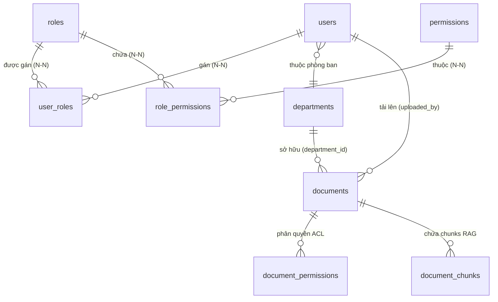

# Kiến Trúc Phân Quyền Đa Tầng & Kiểm Soát Truy Cập Tài Liệu Trong RAG

> **Tài liệu tham chiếu:** [`docs/database/schema.dbml`](file:///home/phuqy/Develop/Document-Knowledge-Operations-Platform/docs/database/schema.dbml), [`docs/database/V1__init.md`](file:///home/phuqy/Develop/Document-Knowledge-Operations-Platform/docs/database/V1__init.md), [`docs/architecture.md`](file:///home/phuqy/Develop/Document-Knowledge-Operations-Platform/docs/architecture.md).  
> **Phạm vi áp dụng:** Phân hệ Định danh & Phân quyền (IAM Backend / Spring Boot 3) và Phân hệ Trí tuệ nhân tạo (AI Assistant & RAG Service / Python FastAPI + pgvector).

---

## 1. Tổng Quan Kiến Trúc Phân Quyền (Authorization Architecture)

Hệ thống triển khai mô hình phân quyền **2 tầng độc lập nhưng liên kết chặt chẽ**:

```text
                                  [ Client HTTP Request + JWT Bearer ]
                                                   │
                                                   ▼
┌────────────────────────────────────────────────────────────────────────────────────────────────────────┐
│ TẦNG 1: FUNCTIONAL RBAC (Spring Security & API Gateway)                                                │
│ - Xác thực người dùng (Authentication) qua JWT Token.                                                  │
│ - Kiểm tra quyền thao tác chức năng (Authorization): User có quyền `read:documents` không?             │
│ - Chặn ngay `403 Forbidden` tại Controller nếu không đủ quyền.                                         │
└──────────────────────────────────────────────────┬─────────────────────────────────────────────────────┘
                                                   │ Cho phép đi tiếp (Forward context)
                                                   ▼
┌────────────────────────────────────────────────────────────────────────────────────────────────────────┐
│ TẦNG 2: RESOURCE-LEVEL ACL & SECURE RAG RETRIEVAL (PostgreSQL pgvector)                                 │
│ - User được phép đọc CỤ THỂ TÀI LIỆU NÀO?                                                              │
│ - Ma trận 4 cấp độ: PUBLIC, INTERNAL, RESTRICTED (theo Department), CONFIDENTIAL (theo ACL).           │
│ - RAG Pre-filtering: Chỉ tìm kiếm vector trên các chunk thuộc tài liệu User được phép đọc.            │
└────────────────────────────────────────────────────────────────────────────────────────────────────────┘
```

---

## 2. Thiết Kế Cơ Sở Dữ Liệu Phân Quyền (IAM & Document ACL)

### 2.1. Cấu Trúc Bảng IAM (Multiple Roles + Fine-Grained Permissions)



1. **`users`**: Lưu thông tin định danh, trạng thái `enabled`, cờ `is_internal` (nhân viên nội bộ), và `department_id`.
2. **`roles`**: Danh mục vai trò nghiệp vụ (ví dụ: `ROLE_ADMIN`, `ROLE_MANAGER`, `ROLE_STAFF`, `ROLE_LEGAL_AUDITOR`).
3. **`permissions`**: Danh mục quyền hạn mức hạt mịn dạng `<action>:<resource>`:
   - `read:documents`: Quyền tra cứu và đọc tài liệu / hỏi RAG.
   - `write:documents`: Quyền tải lên và cập nhật phiên bản tài liệu.
   - `delete:documents`: Quyền xóa tài liệu.
   - `manage:permissions`: Quyền chia sẻ / cấp quyền tài liệu cho người khác.
   - `approve:actions`: Quyền phê duyệt tác vụ HITL.
4. **`user_roles`**: Cho phép một người dùng sở hữu **nhiều vai trò cùng lúc (Multiple Roles)**.
5. **`role_permissions`**: Gán danh sách permissions tương ứng cho từng vai trò.

### 2.2. Ma Trận Quyền Truy Cập Tài Liệu (Document Access Matrix)

Một tài liệu $D$ được phép đọc bởi người dùng $U$ nếu thỏa mãn **ít nhất 1 điều kiện**:

| Cấp độ bảo mật (`access_level`) | Điều kiện người dùng $U$ được phép đọc / RAG retrieve |
| :--- | :--- |
| **`PUBLIC`** | Mọi người dùng có quyền `read:documents` đều được đọc. |
| **`INTERNAL`** | Người dùng có cờ `is_internal = true` (thuộc tổ chức). |
| **`RESTRICTED`** | Người dùng có cùng phòng ban: `U.department_id = D.department_id`. |
| **`CONFIDENTIAL`** / Bất kỳ | Thỏa mãn một trong các điều kiện ACL tường minh:<br>1. $U$ là tác giả tải lên (`D.uploaded_by_user_id = U.id`).<br>2. Có bản ghi trong `document_permissions` khớp `subject_type = 'USER'` và `subject_id = U.id`.<br>3. Có bản ghi trong `document_permissions` khớp `subject_type = 'DEPARTMENT'` và `subject_id = U.department_id`.<br>4. Có bản ghi trong `document_permissions` khớp `subject_type = 'ROLE'` và `subject_id IN (U.role_ids)`. |

---

## 3. Áp Dụng Với Spring Security (Backend Java)

### 3.1. UserPrincipal & GrantedAuthority Mapping

Khi người dùng đăng nhập hoặc gửi JWT Token, `CustomUserDetailsService` tổng hợp tất cả **Roles** và **Permissions** thành danh sách `GrantedAuthority`:

```java
package com.platform.app.shared.config.security;

import com.platform.app.iam.domain.User;
import org.springframework.security.core.GrantedAuthority;
import org.springframework.security.core.authority.SimpleGrantedAuthority;
import org.springframework.security.core.userdetails.UserDetails;

import java.util.Collection;
import java.util.HashSet;
import java.util.Set;

public class UserPrincipal implements UserDetails {

    private final Long userId;
    private final String email;
    private final String password;
    private final Long departmentId;
    private final boolean isInternal;
    private final Set<Long> roleIds;
    private final Collection<? extends GrantedAuthority> authorities;

    public static UserPrincipal create(User user) {
        Set<GrantedAuthority> authorities = new HashSet<>();
        Set<Long> roleIds = new HashSet<>();

        // 1. Thêm Roles (e.g. ROLE_STAFF, ROLE_MANAGER)
        user.getRoles().forEach(role -> {
            roleIds.add(role.getId());
            authorities.add(new SimpleGrantedAuthority(role.getCode()));

            // 2. Thêm Permissions hạt mịn từ Role (e.g. read:documents, write:documents)
            role.getPermissions().forEach(permission -> {
                authorities.add(new SimpleGrantedAuthority(permission.getCode()));
            });
        });

        return new UserPrincipal(
                user.getId(),
                user.getEmail(),
                user.getPassword(),
                user.getDepartmentId(),
                user.isInternal(),
                roleIds,
                authorities
        );
    }

    // Getters và UserDetails methods...
    public Long getUserId() { return userId; }
    public Long getDepartmentId() { return departmentId; }
    public boolean isInternal() { return isInternal; }
    public Set<Long> getRoleIds() { return roleIds; }
    @Override public Collection<? extends GrantedAuthority> getAuthorities() { return authorities; }
    @Override public String getUsername() { return email; }
    @Override public String getPassword() { return password; }
    @Override public boolean isEnabled() { return true; }
    @Override public boolean isAccountNonExpired() { return true; }
    @Override public boolean isAccountNonLocked() { return true; }
    @Override public boolean isCredentialsNonExpired() { return true; }
}
```

### 3.2. Bảo Vệ API Endpoint Bằng `@PreAuthorize`

```java
package com.platform.app.ai.api;

import com.platform.app.ai.api.dto.AskRequest;
import com.platform.app.ai.api.dto.AskResponse;
import com.platform.app.ai.application.port.GenerateResponseUseCase;
import com.platform.app.shared.config.security.UserPrincipal;
import jakarta.validation.Valid;
import lombok.RequiredArgsConstructor;
import org.springframework.http.ResponseEntity;
import org.springframework.security.access.prepost.PreAuthorize;
import org.springframework.security.core.annotation.AuthenticationPrincipal;
import org.springframework.web.bind.annotation.*;

@RestController
@RequestMapping("/api/v1/ai")
@RequiredArgsConstructor
public class AiRagController {

    private final GenerateResponseUseCase generateResponseUseCase;

    @PostMapping("/ask")
    @PreAuthorize("hasAuthority('read:documents')")
    public ResponseEntity<AskResponse> askRag(
            @Valid @RequestBody AskRequest request,
            @AuthenticationPrincipal UserPrincipal currentUser
    ) {
        // Đóng gói Context phân quyền của người dùng chuyển sang AI Service
        UserSecurityContext securityContext = UserSecurityContext.builder()
                .userId(currentUser.getUserId())
                .departmentId(currentUser.getDepartmentId())
                .roleIds(currentUser.getRoleIds())
                .isInternal(currentUser.isInternal())
                .build();

        AskResponse response = generateResponseUseCase.handleAsk(request, securityContext);
        return ResponseEntity.ok(response);
    }
}
```

---

## 4. Áp Dụng Với AI / RAG Service (Python FastAPI & pgvector)

### 4.1. Cấu Trúc Payload Context Phân Quyền

Khi Backend gọi sang AI Service (hoặc khi AI Service truy vấn trực tiếp CSDL), payload gửi kèm thông tin định danh:

```json
{
  "query": "Quy định về thời gian phê duyệt hồ sơ thầu dự án là bao lâu?",
  "top_k": 5,
  "user_context": {
    "user_id": 1024,
    "department_id": 3,
    "role_ids": [2, 5],
    "is_internal": true
  }
}
```

### 4.2. Pre-filtered Hybrid Vector Search trong `PgVectorStore`

Trong [`PgVectorStore`](file:///home/phuqy/Develop/Document-Knowledge-Operations-Platform/ai/src/ai/infrastructure/vector_store/pgvector_store.py), câu truy vấn kết hợp khoảng cách Vector Cosine (`<=>`) và lọc phân quyền tài liệu trong **duy nhất 1 câu SQL thực thi trên PostgreSQL**:

```python
from dataclasses import dataclass
from typing import Any
import json
import psycopg
from ai.domain.model.chunk import Chunk
from ai.domain.model.search_result import SearchResult

@dataclass
class UserSecurityContext:
    user_id: int
    department_id: int | None
    role_ids: list[int]
    is_internal: bool = True

class SecurePgVectorStore:
    def similarity_search_with_acl(
        self,
        query_vector: list[float],
        user_context: UserSecurityContext,
        top_k: int = 5,
    ) -> list[SearchResult]:
        """
        Tìm kiếm vector có kiểm soát phân quyền tài liệu (Pre-filtered Retrieval).
        Tuyệt đối không trả về chunk của tài liệu mà user không có quyền xem.
        """
        sql = """
        SELECT 
            c.id,
            c.document_id,
            c.chunk_index,
            c.content,
            c.metadata,
            1 - (c.embedding <=> %s::vector) AS similarity_score
        FROM document_chunks c
        JOIN documents d ON c.document_id = d.id
        WHERE d.deleted_at IS NULL
          AND d.processing_status = 'INDEXED'
          AND c.embedding IS NOT NULL
          AND (
            -- 1. Tài liệu Public: Ai có quyền đọc đều xem được
            d.access_level = 'PUBLIC'
            
            -- 2. Tài liệu Nội bộ: User thuộc nội bộ công ty
            OR (d.access_level = 'INTERNAL' AND %s = TRUE)
            
            -- 3. Tài liệu Restricted theo phòng ban
            OR (d.access_level = 'RESTRICTED' AND d.department_id = %s)
            
            -- 4. Người tạo tài liệu
            OR (d.uploaded_by_user_id = %s)
            
            -- 5. Cấp quyền tường minh qua ACL document_permissions
            OR EXISTS (
                SELECT 1 FROM document_permissions dp
                WHERE dp.document_id = d.id
                  AND (
                    (dp.subject_type = 'USER' AND dp.subject_id = %s)
                    OR (dp.subject_type = 'DEPARTMENT' AND dp.subject_id = %s)
                    OR (dp.subject_type = 'ROLE' AND dp.subject_id = ANY(%s))
                  )
            )
          )
        ORDER BY c.embedding <=> %s::vector
        LIMIT %s;
        """

        role_ids_array = user_context.role_ids if user_context.role_ids else [-1]

        params = [
            query_vector,
            user_context.is_internal,
            user_context.department_id,
            user_context.user_id,
            user_context.user_id,
            user_context.department_id,
            role_ids_array,
            query_vector,
            top_k,
        ]

        with self._get_connection() as conn, conn.cursor() as cur:
            cur.execute(sql, params)
            rows = cur.fetchall()

            results = []
            for row in rows:
                chunk = Chunk(
                    id=str(row[0]),
                    document_id=str(row[1]),
                    chunk_index=int(row[2]),
                    content=str(row[3]),
                    metadata=row[4] if isinstance(row[4], dict) else json.loads(row[4]),
                )
                score = max(0.0, float(row[5]))
                results.append(SearchResult(chunk=chunk, score=score))
            return results
```

### 4.3. Xử Lý Phản Hồi Khi Không Có Tài Liệu Khả Dụng (Anti-Hallucination)

Nếu câu truy vấn sau khi lọc phân quyền trả về **0 chunks**:
1. RAG Pipeline **không gửi context rỗng** cho LLM bịa câu trả lời.
2. Trả về thông điệp tiêu chuẩn kèm mã trạng thái `NO_ACCESSIBLE_KNOWLEDGE`:
   > *"Hệ thống không tìm thấy tài liệu phù hợp trong phạm vi quyền hạn được cấp của bạn để trả lời câu hỏi này."*
3. Ghi vết vào `audit_logs` sự kiện tra cứu thất bại do phạm vi quyền.

---

## 5. Tối Ưu Chỉ Mục CSDL (Database Indexing for Performance)

Để đảm bảo câu truy vấn Vector Search kèm ACL JOIN thực thi dưới 20ms:

```sql
-- 1. Index hỗ trợ JOIN và lọc trạng thái tài liệu
CREATE INDEX IF NOT EXISTS idx_documents_acl_lookup 
ON documents (id, access_level, department_id, uploaded_by_user_id) 
WHERE deleted_at IS NULL AND processing_status = 'INDEXED';

-- 2. Index hỗ trợ bảng phân quyền chi tiết
CREATE INDEX IF NOT EXISTS idx_doc_permissions_composite 
ON document_permissions (document_id, subject_type, subject_id);

-- 3. HNSW Index cho embedding đa chiều
CREATE INDEX IF NOT EXISTS idx_document_chunks_hnsw 
ON document_chunks USING hnsw (embedding vector_cosine_ops);
```

---

## 6. Tổng Kết Danh Mục Kiểm Tra (Verification Checklist)

- [x] Đã chuẩn hóa CSDL sang mô hình Multiple Roles (`users` $\leftrightarrow$ `user_roles` $\leftrightarrow$ `roles` $\leftrightarrow$ `role_permissions` $\leftrightarrow$ `permissions`).
- [x] Đã cập nhật [`docs/database/schema.dbml`](file:///home/phuqy/Develop/Document-Knowledge-Operations-Platform/docs/database/schema.dbml) và [`docs/database/V1__init.md`](file:///home/phuqy/Develop/Document-Knowledge-Operations-Platform/docs/database/V1__init.md).
- [x] Đã cấu hình phân quyền chức năng hạt mịn `read:documents` với Spring Security `@PreAuthorize`.
- [x] Đã thiết kế cơ chế **Pre-filtered Retrieval** trên `pgvector`, loại bỏ hoàn toàn rủi ro rò rỉ dữ liệu hoặc lỗi Recall Collapse của Post-filtering.
- [x] Đã định nghĩa cơ chế từ chối trả lời an toàn khi không tìm thấy tài liệu trong phạm vi quyền hạn.
