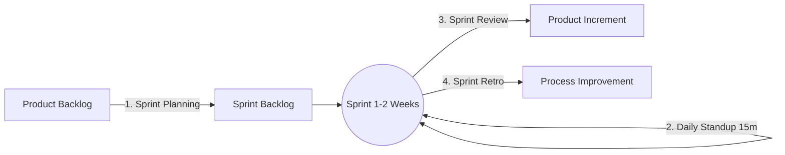

# Agile Scrum & Kanban Engineering Workflow Guide

> **Purpose:** A concise, practical, and comprehensive guide to software development workflows using **Agile Scrum**, **Kanban Card operations**, and the **INVEST** story splitting standard to prevent architectural fragmentation (**Horizontal Silos**).

---

## 1. Overview & Quick Comparison: Scrum vs. Kanban

```text
┌──────────────────────────────────────────────┐    ┌──────────────────────────────────────────────┐
│                    SCRUM                     │    │                    KANBAN                    │
│ - Time-boxed iterations (1-2 week Sprints)   │    │ - Continuous flow delivery                   │
│ - Fixed scope committed per Sprint           │    │ - Flexible on-demand pull system             │
│ - Prescribed roles, events, and artifacts    │    │ - No prescribed roles; focuses on WIP Limits │
└──────────────────────────────────────────────┘    └──────────────────────────────────────────────┘
```

> [!TIP]
> **Industry Standard (Scrumban):** Combines the structured planning and periodic ceremonies of **Scrum** with the visual board and Work-In-Progress (WIP) limits of **Kanban**.

---

## 2. Agile Scrum Framework

Scrum operates in short, time-boxed cycles called **Sprints** (typically 1 to 2 weeks).



### 2.1. Core Roles
1. **Product Owner (PO)**: Defines business requirements, manages, and prioritizes the *Product Backlog*.
2. **Scrum Master (SM)**: Facilitates the Scrum process and proactively removes blockers for the engineering team.
3. **Development Team (Engineers, QA, Designers)**: Cross-functional team responsible for designing, building, testing, and shipping increments.

### 2.2. Core Scrum Ceremonies
| Ceremony | Duration | Primary Objective | Key Output |
| :--- | :--- | :--- | :--- |
| **1. Sprint Planning** | 1 - 2 hours (per 1-2 week Sprint) | Align on *What can be delivered* and *How will it be built*. | Sprint Goal & Sprint Backlog |
| **2. Daily Standup** | 15 minutes (daily morning) | Synchronize progress using 3 standard questions:<br>1. What did I complete yesterday?<br>2. What will I work on today?<br>3. Are there any blockers or impediments? | Early blocker identification |
| **3. Sprint Review** | 30 - 60 minutes (end of Sprint) | Live product demo to PO and stakeholders for validation and feedback. | Accepted user stories & feedback |
| **4. Sprint Retrospective** | 30 - 45 minutes (post-Review) | Team internal review:<br>- What went well?<br>- What could be improved?<br>- Action items for the next Sprint. | Concrete process improvements |

---

## 3. Kanban Workflow & Card Mechanics

Kanban visualizes work states, prevents bottlenecks, and optimizes delivery lead/cycle time.

### 3.1. Standard Kanban Board Layout

```text
┌─────────────────┬─────────────────┬──────────────────┬──────────────────┬─────────────────┐
│     BACKLOG     │   READY / TODO  │   IN PROGRESS    │  IN REVIEW / QA  │      DONE       │
│   (Prioritized) │   (Ready to Do) │  (Active Build)  │  (Verification)  │   (Shipped/DoD) │
├─────────────────┼─────────────────┼──────────────────┼──────────────────┼─────────────────┤
│ [Card 4]        │ [Card 2]        │ [Card 1]         │ [Card 0]         │ [Card A]        │
│ [Card 5]        │ [Card 3]        │                  │                  │ [Card B]        │
│                 │                 │ (WIP Limit: 3)   │ (WIP Limit: 2)   │                 │
└─────────────────┴─────────────────┴──────────────────┴──────────────────┴─────────────────┘
```

> [!IMPORTANT]
> **Golden Rule - WIP Limits (Work In Progress Limits):**
> - Strictly cap the maximum number of active cards allowed in *In Progress* and *In Review* simultaneously (e.g., max 3 cards).
> - **Objective:** Eliminate context switching and focus on completing tasks (*"Stop starting, start finishing"*).

---

### 3.2. Standard Kanban Card / User Story Anatomy

Every work item must include structured, unambiguous metadata:

```markdown
### [TASK-101] Allow Users to Authenticate via Email and Password

- **Type:** Feature / Bug / Chore / Spike
- **Priority:** High / Medium / Low
- **Estimate:** 3 Story Points (or 4 hours)
- **Assignee:** @dev_name
- **Reviewer:** @lead_name

#### 1. User Story Format:
> As a **Registered System User**,  
> I want to **log in using my email and password**,  
> So that **I can securely access my private document workspace**.

#### 2. Acceptance Criteria (AC):
- [ ] Valid credentials -> Returns HTTP 200 with JWT Access & Refresh tokens.
- [ ] Invalid password -> Returns HTTP 401 with structured error payload.
- [ ] Account locked after 5 consecutive failed login attempts.
- [ ] Unit & integration tests pass with >= 80% branch coverage.
```

---

## 4. Story Splitting: INVEST Criteria & Vertical Slicing

### 4.1. The INVEST Quality Standard
A well-structured User Story must meet all **INVEST** criteria before entering Sprint planning:

| Attribute | Principle | Definition & Application |
| :---: | :--- | :--- |
| **I** | **Independent** | Deliverable independently without hard cross-story dependencies that cause execution bottlenecks. |
| **N** | **Negotiable** | Not an unalterable contract; technical implementation details are flexibly refined between PO and Dev. |
| **V** | **Valuable** | Delivers measurable, tangible business or functional value to the end user. |
| **E** | **Estimable** | Clear enough in scope for the team to accurately estimate effort and complexity (Story Points). |
| **S** | **Small** | Sized to finish within 1 to 3 engineering days (never exceeding half a Sprint). |
| **T** | **Testable** | Possesses clear Acceptance Criteria (AC) allowing QA/PO to verify pass/fail states objectively. |

---

### 4.2. Vertical Slicing vs. Avoiding Horizontal Silos

> [!CAUTION]
> **Anti-Pattern (Horizontal Silos):** Splitting tasks by technical architecture layers (e.g., Task 1: Database Schema; Task 2: Backend API; Task 3: Frontend UI; Task 4: AI Model Integration).  
> **Consequences:** Each layer is finished in isolation without delivering a testable, end-to-end runnable feature, leading to high-risk late integration failures and zero demoable progress.

```text
[ANTI-PATTERN] HORIZONTAL SILOS (AVOID)                 [BEST PRACTICE] VERTICAL SLICING (RECOMMENDED)
┌──────────────────────────────────────────────┐        ┌─────────────┬─────────────┬─────────────┐
│ UI / Frontend Layer (Isolated Task)          │        │  Story 1    │  Story 2    │  Story 3    │
├──────────────────────────────────────────────┤        │ (Basic Auth │ (PDF Upload │ (Simple RAG │
│ Backend API Layer (Isolated Task)            │        │  E2E Flow)  │  E2E Flow)  │  Query E2E) │
├──────────────────────────────────────────────┤  ===>  ├─────────────┼─────────────┼─────────────┤
│ AI / RAG Engine Layer (Isolated Task)        │        │ UI          │ UI          │ UI          │
├──────────────────────────────────────────────┤        │ Backend API │ Backend API │ Backend API │
│ Database / SQL Schema (Isolated Task)        │        │ AI Engine   │ AI Engine   │ AI Engine   │
└──────────────────────────────────────────────┘        │ Database    │ Database    │ Database    │
  -> No runnable user value, late integration!          └─────────────┴─────────────┴─────────────┘
                                                          -> Shippable, testable increment every Sprint!
```

#### Practical Story Splitting Techniques:
1. **By Workflow Path (Happy Path vs. Edge Cases)**: Implement the core happy path in Story 1; implement edge cases, advanced validations, and error fallbacks in Story 2.
2. **By Data Variety**: Build ingestion for simple `.txt`/`.pdf` formats first; extend to complex scanned PDFs/OCR in a follow-up story.
3. **By Operation (CRUD)**: Separate *Create/Read* into the initial increment; deliver *Update/Delete/Complex ACL* in subsequent iterations.
4. **Spike Stories (Time-boxed Research)**: If technical feasibility is unknown (e.g., benchmarking pgvector query latency), allocate a time-boxed `Spike` (4-8 hours) before writing implementation stories.

---

## 5. Quality Control Gates: DoR and DoD

To maintain development velocity without compromising quality, teams enforce two explicit quality gates:

```text
       [Backlog] ──(Meets DoR)──> [In Progress] ──(Meets DoD)──> [Done]
```

### 5.1. Definition of Ready (DoR) — When is a task ready to PULL?
- [x] Story conforms strictly to the **INVEST** criteria.
- [x] Unambiguous **Acceptance Criteria (AC)** defined.
- [x] Complexity estimated in Story Points.
- [x] All upstream blockers resolved; external dependencies identified.

### 5.2. Definition of Done (DoD) — When is a task considered COMPLETE?
- [x] Full-stack implementation completed for the vertical slice (UI, Backend, Database).
- [x] Automated unit and integration tests passing (>= 80% coverage for newly added code).
- [x] Code reviewed and approved by at least one peer reviewer via Pull Request.
- [x] Successfully deployed and smoke-tested on Staging/Dev environment.
- [x] No regressions, lint warnings, or security vulnerabilities introduced.

---

## 6. Key Performance Metrics

1. **Velocity**: Total Story Points delivered per Sprint; used for future capacity planning.
2. **Lead Time**: Total elapsed time from story creation in the Backlog to its arrival in Done.
3. **Cycle Time**: Elapsed time from when work begins (*In Progress*) to completion (*Done*); the truest indicator of engineering throughput.
4. **Sprint Burndown**: Real-time chart tracking remaining effort day-by-day throughout the Sprint to flag delivery risks early.

---

## 7. Daily Workflow Cheat Sheet

```text
Sprint Start:     Sprint Planning -> Select DoR/INVEST compliant stories -> Commit to Sprint Goal.
Daily Cadence:    Update Kanban card status -> Daily Standup (15m) -> Pull work honoring WIP limits.
When Blocked:     Apply [BLOCKED] tag to card -> Immediately escalate to Scrum Master.
When Ready:       Open Pull Request -> Link [TASK-ID] in description -> Code Review & Merge.
Sprint End:       Demo working software at Sprint Review -> Conduct Sprint Retrospective.
```
