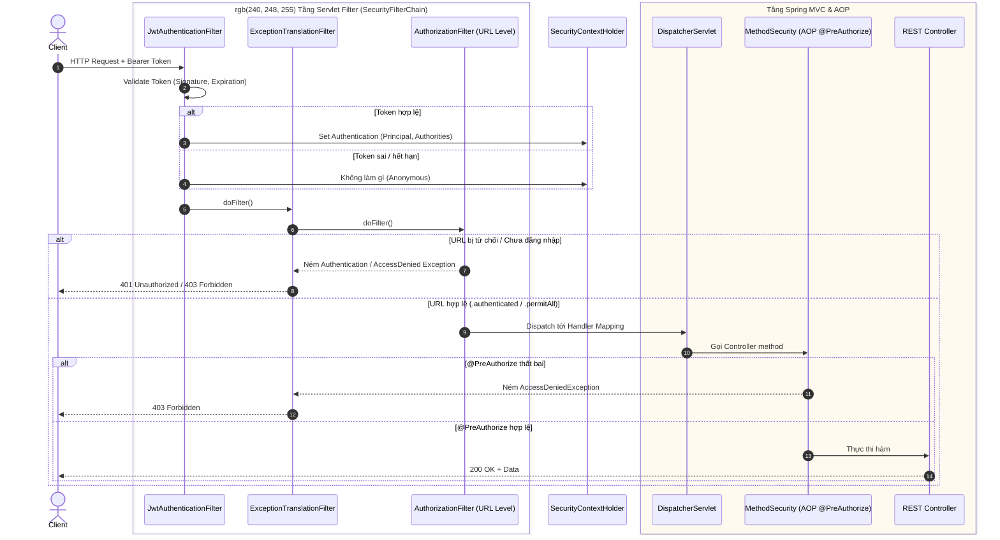
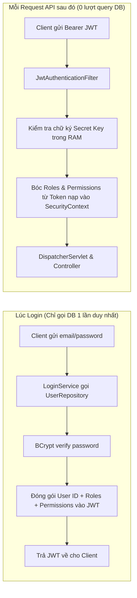

Spring Security workflow



**Wrapping into jwt when login**:
Khi user đăng nhập thành công tại LoginService.java, class JwtTokenProviderAdapter.java sẽ đưa cả roles và
permissions vào Payload của JWT:

• roles: ["ROLE_STAFF", "ROLE_ADMIN"]
• permissions: ["read:documents", "write:documents", "manage:users"]

**Tạo GrantedAuthority (interface) và SimpleGrantedAuthority (implement)**

```java
List<SimpleGrantedAuthority> authorities = new ArrayList<>();

// 1. Lấy mảng Gắn các Permission từ JWT (gửi từ client) thành Authority (hỗ trợ cả chữ hoa và chữ thường)
List<String> permissions = claims.get("permissions", List.class);
for (String perm : permissions) {
    authorities.add(new SimpleGrantedAuthority(perm));                // e.g. "write:documents"
    authorities.add(new SimpleGrantedAuthority(perm.toLowerCase()));
}

// 2. Lấy mảng Gắn các Role từ JWT (client) thành Authority (chuẩn hóa tiền tố ROLE_)
List<String> roles = claims.get("roles", List.class);
for (String role : roles) {
    if (role.startsWith("ROLE_")) {
        authorities.add(new SimpleGrantedAuthority(role));            // e.g. "ROLE_ADMIN"
        authorities.add(new SimpleGrantedAuthority(role.substring(5))); // e.g. "ADMIN"
    }
}

// 3. Đưa vào SecurityContext của Spring Security
UsernamePasswordAuthenticationToken authentication = new UsernamePasswordAuthenticationToken(userId, null, authorities); // gói vào authen token
SecurityContextHolder.getContext().setAuthentication(authentication); // nạp vào spring context
```

**Cơ chế @PreAuthorize**:

• @PreAuthorize("hasRole('ADMIN')"): Spring Security sẽ tìm trong authorities xem có giá trị ROLE_ADMIN hay
không.
• @PreAuthorize("hasAuthority('write:documents') or hasRole('ADMIN')"): Spring Security kiểm tra xem user có
quyền chức năng write:documents hoặc vai trò ROLE_ADMIN hay không.

Spring Security chỉ làm đúng một việc duy nhất:
Lấy đối tượng Authentication đang nằm trong RAM tại SecurityContextHolder.getContext().getAuthentication(), gọi
hàm getAuthorities() và so khớp chuỗi (String Matching):

• hasRole('ADMIN') → Tìm xem trong danh sách authorities có chuỗi "ROLE_ADMIN" hay không.
• hasAuthority('write:documents') → Tìm xem trong danh sách authorities có chuỗi "write:documents" hay không.

**Self-Contained Token và Clean Architecture:**

Thiết kế hiện đại hơn thay vì sử dụng UserDetails và UserDetailsService thay vì mỗi lần authen lại phải gọi lại database nhiều lần



**Cơ chế Document ACL (Access Control List) hoạt động thế nào?**

Sau khi vượt qua vòng kiểm duyệt RBAC (user được phép gọi endpoint Document), hệ thống tiến hành kiểm tra ACL để
biết user có quyền thao tác trên chính xác tài liệu đó hay không.

**A. 4 Cấp độ bảo mật tài liệu (AccessLevel)**:

Được định nghĩa tại AccessLevel.java:

1. PUBLIC: Bất kỳ nhân viên nội bộ nào đăng nhập đều có thể xem.
2. INTERNAL: Mặc định dành cho nội bộ phòng ban sở hữu tài liệu (document.department_id).
3. RESTRICTED: Bị ẩn khỏi phòng ban, bắt buộc phải có bản ghi cấp quyền cụ thể trong bảng ACL.
4. CONFIDENTIAL: Tối mật. Chỉ người tạo (Owner), Admin, hoặc người được cấp quyền đích danh trực tiếp trong
   document_user_access mới được xem.

**B. 3 Cấp độ quyền trên tài liệu (PermissionLevel)**:

Được định nghĩa tại PermissionLevel.java:

• VIEW: Chỉ xem metadata và tải nội dung.
• EDIT: Sửa metadata, upload phiên bản mới (version snapshot).
• ADMIN: Quản trị tài liệu, cấu hình ma trận quyền (ACL), xoá mềm.

Quyền được tính theo nguyên tắc bao hàm (Hierarchy):

    ADMIN ⟹ EDIT ⟹ VIEW

(Một người có quyền ADMIN trên tài liệu thì tự động thỏa mãn yêu cầu EDIT và VIEW – xem cài đặt tại
DocumentAclRepositoryAdapter.java:115-126).

**C. Ma trận gán quyền ACL (3 bảng liên kết)**:

Một tài liệu có thể được cấp quyền qua 3 kênh độc lập:

1. document_user_access: Cấp quyền riêng cho từng cá nhân (user_id).
2. document_department_access: Chia sẻ tài liệu cho toàn bộ một phòng ban khác (department_id).
3. document_role_access: Chia sẻ tài liệu cho tất cả những ai giữ vai trò cụ thể (role_id, ví dụ: nhóm
   ROLE_LEGAL_AUDITOR).

**D. Thuật toán kiểm tra quyền (Permission Evaluation Flow)**:

Khi một User thực hiện thao tác (ví dụ sửa ACL hoặc upload phiên bản mới):

    User gửi Request -> Lấy userId và danh sách roles từ SecurityContext
       │
       ├─► 1. User có phải là Owner (người tạo: document.uploadedByUserId)?
       │      └── ĐÚNG ──► CHO PHÉP (Owner luôn có toàn quyền trên tài liệu của mình)
       │
       ├─► 2. User có vai trò ROLE_ADMIN hoặc quyền manage:permissions?
       │      └── ĐÚNG ──► CHO PHÉP (Superuser Bypass)
       │
       ├─► 3. Kiểm tra AccessLevel của tài liệu:
       │      ├── Nếu CONFIDENTIAL: Bắt buộc phải có grant đích danh trong document_user_access.
       │      ├── Nếu INTERNAL: Kiểm tra user.departmentId == document.departmentId.
       │      └── Nếu RESTRICTED / Khác: Kiểm tra ma trận ACL:
       │            • Có grant trong document_user_access không?
       │            • Có grant trong document_department_access không?
       │            • Có grant trong document_role_access không?
       │
       └─► Không thỏa mãn bất kỳ điều kiện nào ──► Ném DocumentAccessDeniedException (HTTP 403)
