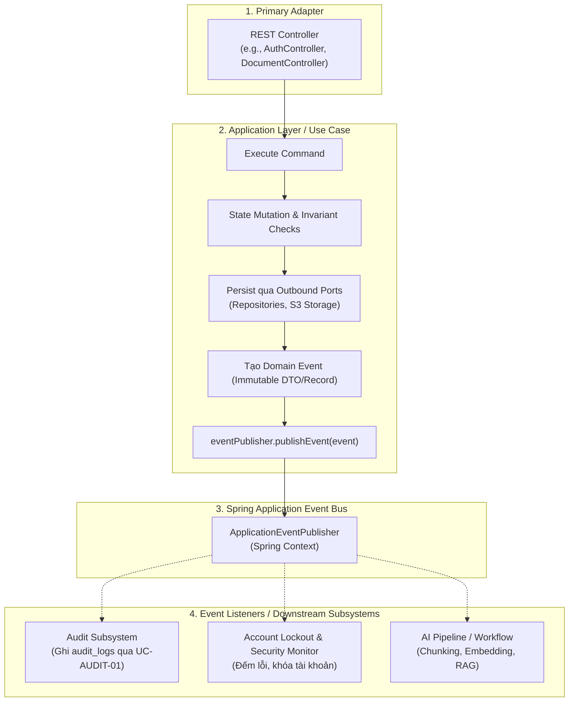

```mermaid
flowchart TD
        subgraph PrimaryAdapter [1. Primary Adapter]
            Controller["REST Controller\n(e.g., AuthController, DocumentController)"]
        end

        subgraph ApplicationLayer [2. Application Layer / Use Case]
            Command["Execute Command"] --> MutateState["State Mutation & Invariant Checks"]
            MutateState --> SaveDB["Persist qua Outbound Ports\n(Repositories, S3 Storage)"]
            SaveDB --> BuildEvent["Tạo Domain Event (Immutable DTO/Record)"]
            BuildEvent --> Publish["eventPublisher.publishEvent(event)"]
        end

        subgraph EventBus [3. Spring Application Event Bus]
            Publisher["ApplicationEventPublisher\n(Spring Context)"]
        end

        subgraph Consumers [4. Event Listeners / Downstream Subsystems]
            Audit["Audit Subsystem\n(Ghi audit_logs qua UC-AUDIT-01)"]
            Security["Account Lockout & Security Monitor\n(Đếm lỗi, khóa tài khoản)"]
            AI["AI Pipeline / Workflow\n(Chunking, Embedding, RAG)"]
        end

        Controller --> Command
        Publish --> Publisher
        Publisher -.-> Audit
        Publisher -.-> Security
        Publisher -.-> AI
```
