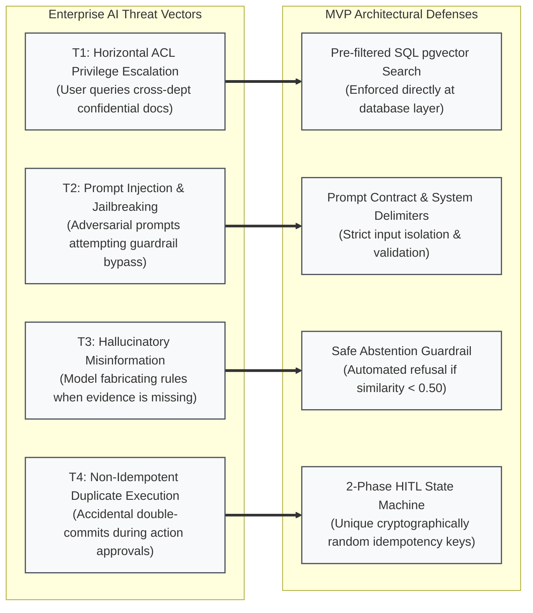
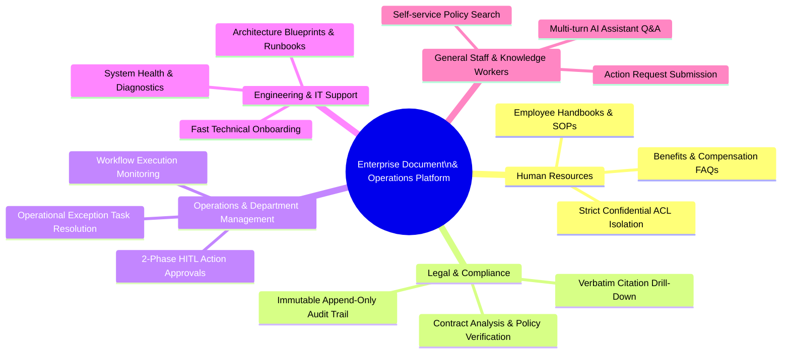

# 1. Executive Summary, Problem Scope & Business Vision
## Enterprise Document Knowledge & Operations Platform

> **Source of Truth:** Problem Definition, Quantified Pain Points, Boundaries, AI Threat Model, Business Vision, Strategic Value Streams, KPIs, Operating Invariants, and MoSCoW Framework.
> **Orchestrated by:** [`MVP.md`](MVP.md)

---

## 1. Executive Summary & Industry Context

### 1.1. Industry Context & 4 Core Enterprise Bottlenecks

In modern enterprises, the volume of internal documents—such as standard operating procedures (SOPs), policy manuals, technical specifications, financial reports, HR records, and legal contracts—is growing exponentially. However, extracting operational value from this knowledge base faces **4 critical bottlenecks**:

```text
┌─────────────────────────────────────────────────────────────────────────────────────────────────┐
│                                 4 CRITICAL ENTERPRISE BOTTLENECKS                                │
├────────────────────────────────┬────────────────────────────────┬───────────────────────────────┤
│ 1. FRAGMENTED INFORMATION      │ 2. DATA LEAKAGE & SECURITY     │ 3. AI HALLUCINATION           │
│ - Scattered across silos       │ - Off-the-shelf AI lacks ACL   │ - Ungrounded responses        │
│ - 20-30% work time lost        │ - High confidential leak risk  │ - Zero auditability/citation  │
├────────────────────────────────┴────────────────────────────────┴───────────────────────────────┤
│ 4. ACTIONLESS READ-ONLY AI: AI is passive and read-only, lacking safe Human-in-the-Loop workflows │
└─────────────────────────────────────────────────────────────────────────────────────────────────┘
```

1. **Fragmented Information & Knowledge Silos:** Institutional knowledge is scattered across cloud drives, email threads, local file servers, and internal chat platforms. Employees spend an average of 1.8 to 2.5 hours per day searching for and verifying operational information.
2. **Data Leakage & Missing Access Control (ACL) in AI:** Generic GenAI and LLM solutions lack document-level access control lists. When employees query an AI assistant, it risks retrieving and exposing confidential payroll, financial, or intellectual property data across organizational boundaries.
3. **AI Hallucination & Zero Auditability:** Language models frequently generate confident yet incorrect statements when ungrounded. Enterprises cannot rely on AI answers without verifiable, verbatim citations and exact page references for legal and operational compliance.
4. **Actionless Read-Only Bottleneck:** Existing AI assistants function purely as static question-answering engines. Enterprises lack an integrated mechanism to transform conversational insights into governed operational actions (e.g., publishing documents, executing approval workflows, modifying business records) with mandatory **Human-in-the-Loop (HITL)** safeguards.

---

## 2. MVP Scope of the Problem (Problem Scope)

### 2.1. Problem Statement & Enterprise Operational Context

Modern enterprises generate and store massive quantities of unstructured and semi-structured documents—including Standard Operating Procedures (SOPs), corporate compliance policies, technical architecture blueprints, financial records, HR contracts, and customer agreements. As organizational scale increases, this accumulated knowledge becomes an operational liability rather than an asset due to **four systemic failures**:

```text
┌──────────────────────────────────────────────────────────────────────────────────────────────────┐
│                                 THE ENTERPRISE KNOWLEDGE CRISIS                                  │
├────────────────────────────────┬────────────────────────────────┬────────────────────────────────┤
│ 1. EXPONENTIAL DOCUMENT SPRAWL │ 2. AUTHORIZATION BLINDNESS     │ 3. COGNITIVE & AUDIT VOID      │
│ - Unstructured dark data       │ - Off-the-shelf LLMs lack ACLs │ - Hallucinations & fabrications│
│ - Scattered across 5+ silos    │ - Severe data leakage risks    │ - Zero verbatim page citations │
├────────────────────────────────┴────────────────────────────────┴────────────────────────────────┤
│ 4. THE ACTION GAP: Chatbots are read-only; no governed Human-in-the-Loop workflow execution     │
└──────────────────────────────────────────────────────────────────────────────────────────────────┘
```

1. **Information Silos & Retrieval Inefficiency:** Documents are fragmented across cloud storage drives, email inboxes, chat channels, and local file systems. Employees lose an average of $1.8 \text{ to } 2.5 \text{ hours per day}$ searching for, verifying, and reconciling operational policies.
2. **Authorization Blindness & Data Leakage in AI:** Generic LLM-based assistants and naive RAG implementations retrieve document chunks without evaluating fine-grained Document Access Control Lists (ACLs). An employee querying general company policies may inadvertently receive retrieved context containing executive payroll data, confidential legal settlements, or proprietary trade secrets.
3. **AI Hallucination & Compliance Exposure:** Off-the-shelf generative models generate plausible yet factually incorrect assertions when context is ambiguous or absent. In regulated enterprise environments (e.g., ISO, GDPR, SOC 2, banking, healthcare), unverified AI outputs introduce severe legal and compliance liabilities unless grounded by verbatim, page-level evidence citations.
4. **The Actionless Read-Only Bottleneck:** Conventional enterprise search engines and AI assistants operate solely as passive question-answering systems. They cannot transition from conversational understanding to governed operational execution (such as publishing documents, updating department records, or triggering approval workflows) due to the absence of safe, verifiable **Human-in-the-Loop (HITL)** safeguards.

---

### 2.2. Quantified Enterprise Pain Points & Impact Breakdown

The operational bottlenecks directly translate into measurable productivity loss, compliance risk, and operational overhead:

| Enterprise Bottleneck | Root Cause | Impacted Stakeholders | Quantified Business Impact |
| :--- | :--- | :--- | :--- |
| **Document Fragmentation & Inefficient Search** | Unindexed documents across disparate file repositories with no semantic indexing. | All Staff, Knowledge Workers, Operations | $20\text{--}30\%$ of total work hours wasted searching for internal information; repetitive cross-department inquiries. |
| **Unauthorized Data Exposure in AI Retrieval** | Post-filtering or absence of SQL-level ACL checks before feeding context into LLM context window. | Management, Legal & Compliance, HR, Security | Catastrophic privacy and intellectual property breaches; potential regulatory fines (GDPR/HIPAA/SOC 2 non-compliance). |
| **Ungrounded AI Hallucination** | Generative models answering without strict retrieval grounding or safe abstention mechanisms. | Compliance Auditors, Legal Counsel, End Users | Erroneous decision-making based on fabricated policies; zero legal defensibility without page-level citations. |
| **Manual Workflow & Approval Friction** | Disconnected operational tools requiring manual copy-pasting from chat to business software. | Department Managers, Team Leads, Admin Staff | Multi-day delays in policy updates, document reviews, and exception resolution; risk of unvetted rogue actions. |

---

### 2.3. Problem Scope Boundaries (In-Scope vs. Out-of-Scope Problems)

To guarantee rapid execution, architectural clarity, and production stability, the MVP establishes explicit problem boundaries:

```text
┌──────────────────────────────────────────────────────────────────────────────────────────────────┐
│                                     MVP PROBLEM BOUNDARIES                                       │
├─────────────────────────────────────────┬────────────────────────────────────────────────────────┤
│ IN-SCOPE FOR MVP                        │ OUT-OF-SCOPE FOR MVP (DEFERRED TO FUTURE RELEASES)     │
├─────────────────────────────────────────┼────────────────────────────────────────────────────────┤
│ - Siloed office documents (PDF, DOCX,   │ - Multimodal non-text assets (Video, audio recordings,  │
│   XLSX, TXT) with digital text.         │   live meeting streams, binary CAD models).            │
│ - Departmental & Role-based data        │ - Federated enterprise Active Directory / LDAP         │
│   leakage during AI search.             │   single-sign-on (SSO) synchronization.                │
│ - AI hallucinations & ungrounded answers│ - Unbounded autonomous agent loops with self-directed  │
│   lacking verifiable source citations.  │   unsupervised database mutations.                     │
│ - Lack of governed Human-in-the-Loop    │ - Optical Character Recognition (OCR) for degraded,    │
│   execution for sensitive operations.   │   handwritten physical paper scans.                    │
│ - Manual document ingestion, parsing,   │ - Cross-region multi-cloud active-active data          │
│   and vector indexing pipelines.        │   replication and multi-tenant billing engines.        │
└─────────────────────────────────────────┴────────────────────────────────────────────────────────┘
```

- **In-Scope Problem Statement:** The MVP specifically solves the challenge of securely ingesting, indexing, querying, and acting upon enterprise text-based documents (PDF, DOCX, XLSX, TXT) across organizational departments without data leakage, without ungrounded hallucinations, and with strict Human-in-the-Loop operational governance.
- **Out-of-Scope Problem Statement:** The MVP intentionally excludes raw handwriting OCR, audio/video transcription, unconstrained autonomous agents, and enterprise federated directory sync, deferring these to post-MVP roadmap phases.

---

### 2.4. Enterprise Threat & Security Risk Scope

The platform's problem scope encompasses an enterprise-grade AI threat model:



1. **Horizontal & Vertical Privilege Escalation:** Attempting to retrieve chunks belonging to other departments or higher security levels. *Mitigated by SQL Pre-filtered Search.*
2. **Prompt Injection & Context Exfiltration:** User prompts designed to override system instructions or extract raw system prompts. *Mitigated by Structured Prompt Contracts and strict XML/Markdown delimiters.*
3. **Hallucinatory Misinformation:** Model inventing internal rules or numbers. *Mitigated by Zero-Shot Retrieval Grounding and automated Safe Abstention.*
4. **Duplicate & Non-Idempotent Action Execution:** Network retries or rapid double-clicking leading to duplicate document publications or records. *Mitigated by 2-Phase HITL state machine with unique database-level `idempotency_key` constraints.*

---

## 3. MVP Scope of the Business (Business Scope)

### 3.1. Strategic Business Vision & Core Objectives

The primary business vision of the **Document Knowledge & Operations Platform** is to transform static, passive enterprise document repositories into an active, intelligent, and governed **Knowledge Operating System**.

The platform is designed to achieve **4 Strategic Business Pillars**:

```text
┌──────────────────────────────────────────────────────────────────────────────────────────────────┐
│                                   4 STRATEGIC BUSINESS PILLARS                                   │
├────────────────────────────────┬────────────────────────────────┬────────────────────────────────┤
│ 1. KNOWLEDGE DEMOCRATIZATION   │ 2. IRONCLAD DATA GOVERNANCE    │ 3. EVIDENCE-BACKED COMPLIANCE  │
│ - Instant sub-second access    │ - Zero unauthorized exposure   │ - 100% verifiable citations    │
│ - Elimination of search silos  │ - 4-tier security matrix       │ - Append-only audit trail      │
├────────────────────────────────┴────────────────────────────────┴────────────────────────────────┤
│ 4. GOVERNED OPERATIONAL AGILITY: Human-in-the-Loop workflows bridging AI insights to safe action │
└──────────────────────────────────────────────────────────────────────────────────────────────────┘
```

1. **Knowledge Democratization:** Empower every authorized employee with instant, semantic search across the organization's collective intelligence, drastically cutting search time.
2. **Ironclad Data Governance:** Enforce complete data isolation and access boundary guarantees so that sensitive intellectual property, executive decisions, and HR records remain strictly compartmentalized.
3. **Evidence-Backed Compliance:** Ensure all AI-generated guidance is legally defensible and auditable through verbatim citations linking directly to verified page numbers.
4. **Governed Operational Agility:** Enable teams to transform knowledge into governed business operations through structured, 2-phase human-approved workflows.

---

### 3.2. Target Business Units & Stakeholder Personas in MVP Scope

The MVP serves five core organizational functions within the enterprise:



| Business Function | Key Operational Use Cases | Primary Stakeholder Role | Business Value Delivered |
| :--- | :--- | :--- | :--- |
| **Human Resources (HR)** | Ingesting and querying company policies, onboarding guides, benefits packages; restricting confidential executive compensation docs. | `ROLE_STAFF`, `ROLE_MANAGER` | Eliminates $80\%$ of repetitive HR support tickets while maintaining strict privacy boundaries. |
| **Legal & Compliance** | Reviewing compliance guidelines, checking regulatory clauses, verifying exact wording in source documents. | `ROLE_LEGAL_AUDITOR` | Reduces audit preparation time from weeks to hours; provides indisputable proof of source text. |
| **Department Management** | Reviewing and approving sensitive document publications, monitoring automated ingestion pipelines, assigning exception tasks. | `ROLE_MANAGER` | Gives leaders complete oversight and control before any system state changes occur. |
| **IT & Administration** | User provisioning, role and permission matrix management, department isolation configuration, system health monitoring. | `ROLE_ADMIN` | Centralized, secure administration with full operational visibility. |
| **General Knowledge Workers** | Day-to-day search for operating procedures, technical specs, project documentation, and policy clarifications. | `ROLE_STAFF` | Saves $1.5\text{--}2.0\text{ hours/day}$ per employee, accelerating cross-functional alignment. |

---

### 3.3. Core Business Value Streams & Capabilities in Scope

The MVP encompasses **5 integrated Business Value Streams**:

```text
┌──────────────────────────────────────────────────────────────────────────────────────────────────┐
│                                   5 CORE BUSINESS VALUE STREAMS                                  │
├──────────────────────────────────────────────────────────────────────────────────────────────────┤
│ VALUE STREAM 1: GOVERNED DOCUMENT LIFECYCLE MANAGEMENT                                           │
│ Raw File Upload (PDF/DOCX/XLSX) → S3 Pointer Storage → Checksum Verification → Version Snapshot │
├──────────────────────────────────────────────────────────────────────────────────────────────────┤
│ VALUE STREAM 2: ZERO-LEAKAGE HYBRID KNOWLEDGE INGESTION & RETRIEVAL                             │
│ Recursive Chunking → 1536d Embeddings → pgvector HNSW Index → Pre-filtered SQL Hybrid Search     │
├──────────────────────────────────────────────────────────────────────────────────────────────────┤
│ VALUE STREAM 3: GROUNDED CONVERSATIONAL AI WITH CITATION DRILL-DOWN                              │
│ Multi-Turn Chat → Prompt Contract → Verbatim Citations [Doc, Page] → PDF Viewer Drill-Down       │
├──────────────────────────────────────────────────────────────────────────────────────────────────┤
│ VALUE STREAM 4: GOVERNED OPERATIONS & 2-PHASE HUMAN-IN-THE-LOOP (HITL) WORKFLOWS                 │
│ Action Request → Staged Diff Preview → Pending Manager Sign-off → Idempotent Commit Execution   │
├──────────────────────────────────────────────────────────────────────────────────────────────────┤
│ VALUE STREAM 5: ENTERPRISE AUDITABILITY & REAL-TIME COLLABORATION                                │
│ Append-Only Audit Logging (User, IP, Action, Timestamp) → Real-Time In-App Notifications         │
└──────────────────────────────────────────────────────────────────────────────────────────────────┘
```

1. **Governed Document Lifecycle Management:** Secure multi-format document ingestion, AWS S3 object storage pointer persistence, SHA-256 integrity checks, immutable version history, and soft deletion.
2. **Zero-Leakage Hybrid Knowledge Ingestion & Retrieval:** Automated text extraction, recursive semantic chunking, dense vector embeddings ($1536\text{d}$), and unified Pre-filtered SQL Hybrid Search combining dense vector cosine similarity and full-text search (BM25) via Reciprocal Rank Fusion (RRF).
3. **Grounded Conversational AI with Citation Verification:** Multi-turn conversational interface backed by strict prompt contracts, inline citation badges (Document ID, Version, Page Number, Verbatim Snippet), PDF page viewer drill-down, and automatic Safe Abstention for missing evidence.
4. **Governed Operations & 2-Phase HITL Workflow Execution:** Trigger-based automated document pipelines, 2-phase action approval state machine (Prepare / Diff Preview $\rightarrow$ Waiting Approval $\rightarrow$ Idempotent Commit), and operational exception task handling.
5. **Enterprise Auditability & Real-Time Collaboration:** Append-only immutable audit trail capturing all authentication, CRUD, ACL, and HITL actions, accompanied by real-time in-app notifications.

---

### 3.4. In-Scope vs. Out-of-Scope Business Boundaries

The following matrix delineates business capabilities included in the MVP versus post-MVP and long-term roadmap phases:

| Business Domain | In-Scope (MVP Baseline) | Post-MVP Enhancements | Out-of-Scope (Future Roadmap) |
| :--- | :--- | :--- | :--- |
| **Identity & Access** | Email/Password JWT auth, Multi-Role RBAC, Department scoping, `is_internal` flag. | OAuth2/OIDC social login (Google, GitHub), MFA/2FA. | Enterprise Active Directory / LDAP sync, SCIM provisioning. |
| **Document Management** | PDF, DOCX, XLSX, TXT uploads; S3 binary storage; Versioning; 4-tier ACL Matrix. | Bulk ZIP upload, Tag management, Document expiration policies. | Real-time collaborative document editing, Watermarking. |
| **AI Knowledge & RAG** | Offline ingestion, Recursive chunking, pgvector HNSW, Pre-filtered Hybrid RRF Search. | Contextual query rewriting, Re-ranking model (Cohere Rerank). | Multimodal video/audio search, GraphRAG knowledge graphs. |
| **Conversational AI** | Multi-turn chat session, Inline citations `[1]`, PDF preview drill-down, Safe Abstention. | Conversation export to PDF/Excel, Follow-up question generator. | Voice-to-text / Text-to-voice interactive voice agent. |
| **Workflows & HITL** | Trigger-based pipeline execution, 2-Phase Action Approvals, Idempotent Commits, Task management. | Visual workflow builder (Drag-and-Drop), Scheduled cron triggers. | Unconstrained autonomous multi-agent reasoning loops. |
| **Governance & Audit** | Append-only immutable audit logs, In-app real-time alerts, Token usage tracking. | Exportable compliance audit reports (CSV/PDF), Daily summary digest. | Automated regulatory compliance certification scanning. |

---

### 3.5. Business Success Metrics & Key Performance Indicators (KPIs)

The success of the MVP deployment is evaluated against clear quantitative business KPIs:

```text
┌──────────────────────────────────────────────────────────────────────────────────────────────────┐
│                                   MVP BUSINESS SUCCESS METRICS                                   │
├─────────────────────────────────────────┬───────────────────────────┬────────────────────────────┤
│ Business KPI                            │ Industry Baseline         │ MVP Target & Guarantee     │
├─────────────────────────────────────────┼───────────────────────────┼────────────────────────────┤
│ Mean Time to Retrieve Information       │ 15--30 minutes per lookup │ < 10 seconds (via AI RAG)  │
│ Unauthorized Data Leakage Rate          │ > 15% (Generic AI / RAG)  │ 0.0% (Zero Data Leakage)   │
│ AI Citation Verification Accuracy       │ < 50% (Unlinked answers)  │ 100% Verifiable Citations  │
│ Anti-Hallucination Abstention Rate      │ < 40% (Often fabricates)  │ > 99% Safe Abstention Rate │
│ Operational Action Turnaround Time      │ 24--72 hours (Email/Jira) │ < 5 minutes (via HITL)     │
│ Audit Trail Completeness                │ Partial / Fragmented      │ 100% Append-Only Coverage  │
└─────────────────────────────────────────┴───────────────────────────┴────────────────────────────┘
```

- **Knowledge Discovery Speed:** Employees locate verified policy information in seconds rather than searching file shares for 20+ minutes.
- **Zero-Trust Security Barrier:** Under no scenario does an unauthorized employee view or retrieve context from a `RESTRICTED` or `CONFIDENTIAL` document outside their department or explicit ACL grants.
- **Operational Risk Reduction:** 100% of high-risk mutations pass through mandatory Manager Approval with Diff Previews and Idempotency guarantees, eliminating rogue or duplicate actions.
- **Audit Defensibility:** Compliance officers can reconstruct any AI interaction, document revision, or approval decision down to the millisecond with user identity, client IP, and before/after state diffs.

---

### 3.6. Business Guardrails & Operating Invariants

The MVP enforces **4 non-negotiable Business Invariants**:

> [!IMPORTANT]
> **Business Invariant 1: Pre-filtered Zero-Trust Data Retrieval**
> Under no circumstances may application code perform post-filtering of AI context. All document ACLs must be evaluated directly at the SQL database layer within the vector retrieval query before chunks are exposed to the AI microservice.

> [!IMPORTANT]
> **Business Invariant 2: Evidence-Backed Anti-Hallucination & Safe Abstention**
> The AI Assistant must never generate answers from general pre-trained weights when internal document evidence is missing or below the relevance threshold ($< 0.50$). It must return a standardized refusal code (`NO_ACCESSIBLE_KNOWLEDGE`).

> [!IMPORTANT]
> **Business Invariant 3: Human-in-the-Loop Operational Approval**
> The AI Assistant and automated workflows cannot unilaterally execute sensitive mutations (e.g., publishing documents, deleting records, altering permissions). All sensitive mutations must pause in `WAITING_APPROVAL` with a staged Diff Preview until explicitly approved by an authorized manager.

> [!IMPORTANT]
> **Business Invariant 4: Append-Only Audit Immutability**
> Security audit logs are immutable. The system architecture strictly prohibits `UPDATE`, `DELETE`, `DROP`, or `TRUNCATE` operations on the `audit_logs` table across all application database roles.

---

## 4. Value Proposition

The **Document Knowledge & Operations Platform** is an **AI-powered Knowledge Operating System and Workflow Automation Platform** delivering the following core capabilities:

- **Zero Data Leakage:** Two-tier authorization enforcement. **Pre-filtered Retrieval** filters document permissions directly at the SQL database layer before context is passed to the AI model.
- **100% Grounded & Verifiable Citations:** Every AI response is backed by exact evidence citations (Document ID, Version Number, Page Number, Verbatim Snippet, and Semantic Similarity Score).
- **Sub-25ms Hybrid Search:** Combines Dense Semantic Search (HNSW Vector Cosine) and Sparse Lexical Search (BM25 / Full-Text Search) via Reciprocal Rank Fusion (RRF), achieving high recall with retrieval latency $< 25\text{ ms}$.
- **Controlled Human-in-the-Loop Operations:** A 2-phase approval state machine (Prepare / Diff Preview $\rightarrow$ Waiting Approval $\rightarrow$ Idempotent Commit) ensures high-risk actions are executed safely and idempotently.

---

## 5. MVP Scope Definition (MoSCoW Framework)

```text
┌──────────────────────────────────────────────────────────────────────────────────────────────────┐
│                                   MVP SCOPE BY MOSCOW CATEGORY                                   │
├─────────────────────────────────────────┬────────────────────────────────────────────────────────┤
│ MUST HAVE (Core MVP Baseline)           │ SHOULD HAVE (Post-MVP Enhancements)                    │
│ - JWT Authentication & Multi-Role RBAC  │ - Contextual follow-up question suggestions            │
│ - S3 File Storage Pointer & Versioning  │ - Export conversation transcript to PDF / Excel        │
│ - 4-Tier Document ACL Matrix            │ - Advanced metadata filtering (date range, tags)       │
│ - Ingestion Pipeline & pgvector Hybrid  │ - Responsive Dark/Light UI theme toggle                │
│ - Conversational RAG with Citations     ├────────────────────────────────────────────────────────┤
│ - Safe Abstention Guardrail             │ COULD / WONT HAVE (Future Roadmap)                     │
│ - 2-Phase HITL Action Approvals         │ - Advanced OCR for scanned tables and handwritten text │
│ - Immutable Audit Logging               │ - Distributed Tracing (OpenTelemetry) & Token Budgeting│
│ - Real-time In-App Notifications        │ - Auto-scaling Kubernetes deployment on AWS ECS/Fargate│
└─────────────────────────────────────────┴────────────────────────────────────────────────────────┘
```
