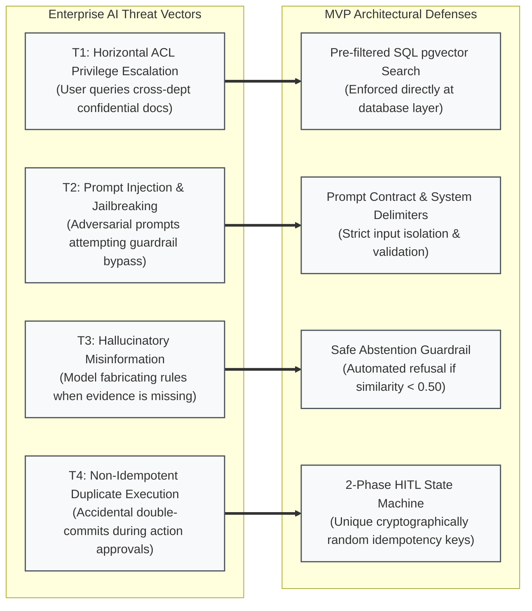
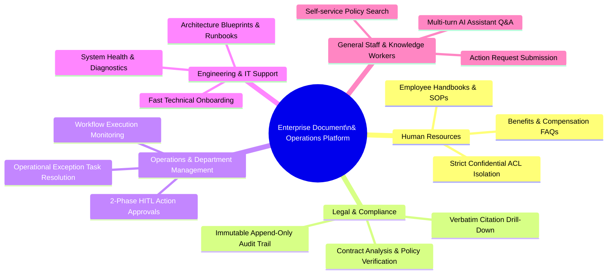

# 1. Executive Summary, Problem Scope & Business Vision
## Enterprise Document Knowledge & Operations Platform

> **Source of Truth:** Problem Definition, Quantified Pain Points, Boundaries, AI Threat Model, Business Vision, Strategic Value Streams, KPIs, Operating Invariants, and MoSCoW Framework.
> **Orchestrated by:** [`MVP.md`](MVP.md)

---

## 1. Executive Summary & Industry Context

### 1.1. Industry Context & 4 Core Enterprise Bottlenecks

In modern enterprises, the volume of internal documents—such as standard operating procedures (SOPs), policy manuals, technical specifications, financial reports, HR records, and legal contracts—is growing exponentially. However, extracting operational value from this knowledge base and deploying reliable solutions faces **4 critical bottlenecks**:

```text
┌─────────────────────────────────────────────────────────────────────────────────────────────────┐
│                                 4 CRITICAL ENTERPRISE BOTTLENECKS                                │
├────────────────────────────────┬────────────────────────────────┬───────────────────────────────┤
│ 1. FRAGMENTED INFORMATION      │ 2. CLOUD DEPLOYMENT & SECURITY │ 3. ACTIONLESS READ-ONLY GAP   │
│ - Scattered across silos       │ - Absence of production AWS    │ - Static query-answering;     │
│ - 20-30% work time lost        │   infrastructure & CI/CD       │   lacks governed 2-phase HITL │
├────────────────────────────────┴────────────────────────────────┴───────────────────────────────┤
│ 4. AI FABRICATION & LEAKAGE: Naive RAG risks data leakage; requires governed, decoupled cloud architecture │
└─────────────────────────────────────────────────────────────────────────────────────────────────┘
```

1. **Fragmented Information & Knowledge Silos:** Institutional knowledge is scattered across cloud drives, email threads, local file servers, and internal chat platforms. Employees spend an average of 1.8 to 2.5 hours per day searching for and verifying operational information.
2. **Cloud Infrastructure & Production Deployment Bottleneck:** Many enterprise prototypes remain trapped on local developer laptops or unstable ad-hoc scripts. Enterprises and academic evaluation demand production-grade, reproducible **AWS Cloud Infrastructure** (VPC, EC2, S3, Docker, automated CI/CD) with zero hardcoded credentials and high cost awareness.
3. **Actionless Read-Only Bottleneck:** Existing systems and AI assistants function purely as static question-answering engines. Enterprises lack an integrated mechanism to transform document knowledge into governed operational actions (e.g., publishing documents, executing approval workflows, modifying business records) with mandatory **Human-in-the-Loop (HITL)** safeguards.
4. **Data Leakage & AI Fabrication Risks:** Uncontrolled GenAI solutions lack document-level access control lists (ACLs) and generate hallucinations. Mitigating this requires a disciplined, decoupled RAG architecture that does not block rapid cloud platform launch.

---

## 2. MVP Scope of the Problem (Problem Scope)

### 2.1. Problem Statement & Enterprise Operational Context

Modern enterprises generate and store massive quantities of unstructured and semi-structured documents—including Standard Operating Procedures (SOPs), corporate compliance policies, technical architecture blueprints, financial records, HR contracts, and customer agreements. As organizational scale increases, this accumulated knowledge becomes an operational liability rather than an asset due to **four systemic failures**:

```text
┌──────────────────────────────────────────────────────────────────────────────────────────────────┐
│                                 THE ENTERPRISE KNOWLEDGE CRISIS                                  │
├────────────────────────────────┬────────────────────────────────┬────────────────────────────────┤
│ 1. EXPONENTIAL DOCUMENT SPRAWL │ 2. AUTHORIZATION BLINDNESS     │ 3. COGNITIVE & AUDIT VOID      │
│ - Unstructured dark data       │ - Off-the-shelf LLMs lack ACLs │ - Hallucinations & fabrications│
│ - Scattered across 5+ silos    │ - Severe data leakage risks    │ - Zero verbatim page citations │
├────────────────────────────────┴────────────────────────────────┴────────────────────────────────┤
│ 4. THE ACTION GAP: Chatbots are read-only; no governed Human-in-the-Loop workflow execution     │
└──────────────────────────────────────────────────────────────────────────────────────────────────┘
```

1. **Information Silos & Retrieval Inefficiency:** Documents are fragmented across cloud storage drives, email inboxes, chat channels, and local file systems. Employees lose an average of $1.8 \text{ to } 2.5 \text{ hours per day}$ searching for, verifying, and reconciling operational policies.
2. **Authorization Blindness & Data Leakage in AI:** Generic LLM-based assistants and naive RAG implementations retrieve document chunks without evaluating fine-grained Document Access Control Lists (ACLs). An employee querying general company policies may inadvertently receive retrieved context containing executive payroll data, confidential legal settlements, or proprietary trade secrets.
3. **AI Hallucination & Compliance Exposure:** Off-the-shelf generative models generate plausible yet factually incorrect assertions when context is ambiguous or absent. In regulated enterprise environments (e.g., ISO, GDPR, SOC 2, banking, healthcare), unverified AI outputs introduce severe legal and compliance liabilities unless grounded by verbatim, page-level evidence citations.
4. **The Actionless Read-Only Bottleneck:** Conventional enterprise search engines and AI assistants operate solely as passive question-answering systems. They cannot transition from conversational understanding to governed operational execution (such as publishing documents, updating department records, or triggering approval workflows) due to the absence of safe, verifiable **Human-in-the-Loop (HITL)** safeguards.

---

### 2.2. Quantified Enterprise Pain Points & Impact Breakdown

The operational bottlenecks directly translate into measurable productivity loss, compliance risk, and operational overhead:

| Enterprise Bottleneck | Root Cause | Impacted Stakeholders | Quantified Business Impact |
| :--- | :--- | :--- | :--- |
| **Document Fragmentation & Inefficient Search** | Unindexed documents across disparate file repositories with no semantic indexing. | All Staff, Knowledge Workers, Operations | $20\text{--}30\%$ of total work hours wasted searching for internal information; repetitive cross-department inquiries. |
| **Unauthorized Data Exposure in AI Retrieval** | Post-filtering or absence of SQL-level ACL checks before feeding context into LLM context window. | Management, Legal & Compliance, HR, Security | Catastrophic privacy and intellectual property breaches; potential regulatory fines (GDPR/HIPAA/SOC 2 non-compliance). |
| **Ungrounded AI Hallucination** | Generative models answering without strict retrieval grounding or safe abstention mechanisms. | Compliance Auditors, Legal Counsel, End Users | Erroneous decision-making based on fabricated policies; zero legal defensibility without page-level citations. |
| **Manual Workflow & Approval Friction** | Disconnected operational tools requiring manual copy-pasting from chat to business software. | Department Managers, Team Leads, Admin Staff | Multi-day delays in policy updates, document reviews, and exception resolution; risk of unvetted rogue actions. |

---

### 2.3. Problem Scope Boundaries (In-Scope vs. Out-of-Scope Problems)

To guarantee rapid execution, architectural clarity, and production stability, the MVP establishes explicit problem boundaries:

```text
┌──────────────────────────────────────────────────────────────────────────────────────────────────┐
│                                     MVP PROBLEM BOUNDARIES                                       │
├─────────────────────────────────────────┬────────────────────────────────────────────────────────┤
│ IN-SCOPE: PHASE 1 CORE CLOUD MVP        │ PHASE 2 EXTENSION & OUT-OF-SCOPE                       │
├─────────────────────────────────────────┼────────────────────────────────────────────────────────┤
│ - Production AWS Cloud Infrastructure   │ [PHASE 2 FAST-FOLLOW EXTENSION]                        │
│   (EC2, S3, Docker, Cloudflare, CI/CD). │ - Heavy recursive chunking & 1536d embeddings.         │
│ - Secure binary storage on AWS S3 with  │ - pgvector HNSW + FTS Reciprocal Rank Fusion (RRF).    │
│   SHA-256 integrity & SSE-AES256.       │ - Multi-turn conversational AI with citation badge     │
│ - Departmental & Role-based Access      │   drill-down and PDF viewer integration.               │
│   Control (4-Tier ACL Matrix).          │ ────────────────────────────────────────────────────── │
│ - 2-Phase Human-in-the-Loop (HITL)      │ [OUT-OF-SCOPE FOR ALL MVP PHASES]                      │
│   governance for operational mutations. │ - Multimodal non-text assets (Video, audio, CAD).      │
│ - Immutable append-only audit trail.    │ - Enterprise Active Directory / LDAP / SCIM sync.      │
│ - Automated GitHub Actions CI/CD.       │ - Optical Character Recognition (OCR) for handwriting. │
└─────────────────────────────────────────┴────────────────────────────────────────────────────────┘
```

- **In-Scope Problem Statement:** The primary objective of the MVP is achieving the **Fastest Path to Production on AWS Cloud**: deploying a secure, durable, and governed Document Knowledge & Operations Platform on AWS (EC2, S3, Docker, CI/CD) that enforces multi-role RBAC, 4-tier document ACLs, 2-phase HITL approvals, and immutable audit logs.
- **Phased AI Problem Statement:** To prevent technical risk and timeline slippage, advanced AI Knowledge & Hybrid RAG (pgvector HNSW, RRF re-ranking, conversational citations) is decoupled and delivered as a **Phase 2 Fast-Follow Extension**, ensuring the cloud foundation is solid, stable, and evaluated first.
- **Out-of-Scope Problem Statement:** The MVP intentionally excludes raw handwriting OCR, audio/video transcription, unconstrained autonomous agents, and enterprise federated directory sync, deferring these to future roadmap iterations.

---

### 2.4. Enterprise Threat & Security Risk Scope

The platform's problem scope encompasses an enterprise-grade AI threat model:



1. **Horizontal & Vertical Privilege Escalation:** Attempting to retrieve chunks belonging to other departments or higher security levels. *Mitigated by SQL Pre-filtered Search.*
2. **Prompt Injection & Context Exfiltration:** User prompts designed to override system instructions or extract raw system prompts. *Mitigated by Structured Prompt Contracts and strict XML/Markdown delimiters.*
3. **Hallucinatory Misinformation:** Model inventing internal rules or numbers. *Mitigated by Zero-Shot Retrieval Grounding and automated Safe Abstention.*
4. **Duplicate & Non-Idempotent Action Execution:** Network retries or rapid double-clicking leading to duplicate document publications or records. *Mitigated by 2-Phase HITL state machine with unique database-level `idempotency_key` constraints.*

---

## 3. MVP Scope of the Business (Business Scope)

### 3.1. Strategic Business Vision & Core Objectives

The primary business vision of the **Document Knowledge & Operations Platform** is to transform static, passive enterprise document repositories into an active, intelligent, and governed **Knowledge Operating System**.

The platform is designed to achieve **4 Strategic Business Pillars**:

```text
┌──────────────────────────────────────────────────────────────────────────────────────────────────┐
│                                   4 STRATEGIC BUSINESS PILLARS                                   │
├────────────────────────────────┬────────────────────────────────┬────────────────────────────────┤
│ 1. KNOWLEDGE DEMOCRATIZATION   │ 2. IRONCLAD DATA GOVERNANCE    │ 3. EVIDENCE-BACKED COMPLIANCE  │
│ - Instant sub-second access    │ - Zero unauthorized exposure   │ - 100% verifiable citations    │
│ - Elimination of search silos  │ - 4-tier security matrix       │ - Append-only audit trail      │
├────────────────────────────────┴────────────────────────────────┴────────────────────────────────┤
│ 4. GOVERNED OPERATIONAL AGILITY: Human-in-the-Loop workflows bridging AI insights to safe action │
└──────────────────────────────────────────────────────────────────────────────────────────────────┘
```

1. **Knowledge Democratization:** Empower every authorized employee with instant, semantic search across the organization's collective intelligence, drastically cutting search time.
2. **Ironclad Data Governance:** Enforce complete data isolation and access boundary guarantees so that sensitive intellectual property, executive decisions, and HR records remain strictly compartmentalized.
3. **Evidence-Backed Compliance:** Ensure all AI-generated guidance is legally defensible and auditable through verbatim citations linking directly to verified page numbers.
4. **Governed Operational Agility:** Enable teams to transform knowledge into governed business operations through structured, 2-phase human-approved workflows.

---

### 3.2. Target Business Units & Stakeholder Personas in MVP Scope

The MVP serves five core organizational functions within the enterprise:



| Business Function | Key Operational Use Cases | Primary Stakeholder Role | Business Value Delivered |
| :--- | :--- | :--- | :--- |
| **Human Resources (HR)** | Ingesting and querying company policies, onboarding guides, benefits packages; restricting confidential executive compensation docs. | `ROLE_STAFF`, `ROLE_MANAGER` | Eliminates $80\%$ of repetitive HR support tickets while maintaining strict privacy boundaries. |
| **Legal & Compliance** | Reviewing compliance guidelines, checking regulatory clauses, verifying exact wording in source documents. | `ROLE_LEGAL_AUDITOR` | Reduces audit preparation time from weeks to hours; provides indisputable proof of source text. |
| **Department Management** | Reviewing and approving sensitive document publications, monitoring automated ingestion pipelines, assigning exception tasks. | `ROLE_MANAGER` | Gives leaders complete oversight and control before any system state changes occur. |
| **IT & Administration** | User provisioning, role and permission matrix management, department isolation configuration, system health monitoring. | `ROLE_ADMIN` | Centralized, secure administration with full operational visibility. |
| **General Knowledge Workers** | Day-to-day search for operating procedures, technical specs, project documentation, and policy clarifications. | `ROLE_STAFF` | Saves $1.5\text{--}2.0\text{ hours/day}$ per employee, accelerating cross-functional alignment. |

---

#### 3.3. Core Business Value Streams & Capabilities in Scope

The platform aligns around **6 integrated Business Value Streams**, structured into two delivery milestones:

```text
┌──────────────────────────────────────────────────────────────────────────────────────────────────┐
│                                   6 CORE BUSINESS VALUE STREAMS                                  │
├──────────────────────────────────────────────────────────────────────────────────────────────────┤
│ [PHASE 1 CORE CLOUD MVP BASELINE - FASTEST PATH TO PRODUCTION]                                   │
├──────────────────────────────────────────────────────────────────────────────────────────────────┤
│ VALUE STREAM 1: PRODUCTION AWS CLOUD INFRASTRUCTURE & AUTOMATED CI/CD                           │
│ GitHub Actions Push → Automated Test/Build → Docker Container Push → AWS EC2 Zero-Downtime Deploy │
├──────────────────────────────────────────────────────────────────────────────────────────────────┤
│ VALUE STREAM 2: GOVERNED DOCUMENT LIFECYCLE MANAGEMENT (AWS S3)                                  │
│ Raw File Upload (PDF/DOCX/XLSX) → S3 Pointer Storage → Checksum Verification → Version Snapshot │
├──────────────────────────────────────────────────────────────────────────────────────────────────┤
│ VALUE STREAM 3: GOVERNED OPERATIONS & 2-PHASE HUMAN-IN-THE-LOOP (HITL) WORKFLOWS                 │
│ Action Request → Staged Diff Preview → Pending Manager Sign-off → Idempotent Commit Execution   │
├──────────────────────────────────────────────────────────────────────────────────────────────────┤
│ VALUE STREAM 4: ENTERPRISE AUDITABILITY & REAL-TIME NOTIFICATIONS                                │
│ Append-Only Audit Logging (User, IP, Action, Timestamp) → Real-Time In-App Alerts                │
├──────────────────────────────────────────────────────────────────────────────────────────────────┤
│ [PHASE 2 PLUGGABLE FAST-FOLLOW EXTENSION]                                                        │
├──────────────────────────────────────────────────────────────────────────────────────────────────┤
│ VALUE STREAM 5: ZERO-LEAKAGE HYBRID KNOWLEDGE INGESTION & RETRIEVAL                             │
│ Recursive Chunking → 1536d Embeddings → pgvector HNSW Index → Pre-filtered SQL Hybrid Search     │
├──────────────────────────────────────────────────────────────────────────────────────────────────┤
│ VALUE STREAM 6: GROUNDED CONVERSATIONAL AI WITH CITATION DRILL-DOWN                              │
│ Multi-Turn Chat → Prompt Contract → Verbatim Citations [Doc, Page] → PDF Viewer Drill-Down       │
└──────────────────────────────────────────────────────────────────────────────────────────────────┘
```

1. **Production AWS Cloud Infrastructure & Automated CI/CD:** Complete IaC/Docker setup for Ubuntu EC2, AWS S3 integration with Server-Side Encryption (AES256), Cloudflare Edge SSL termination, zero-secret environment configuration, and end-to-end GitHub Actions continuous delivery.
2. **Governed Document Lifecycle Management:** Secure multi-format document ingestion, AWS S3 binary persistence, SHA-256 integrity verification, immutable version history, and 4-tier document ACL matrix.
3. **Governed Operations & 2-Phase HITL Workflow Execution:** Trigger-based operational workflows, 2-phase action approval state machine (Prepare / Diff Preview $\rightarrow$ Waiting Approval $\rightarrow$ Idempotent Commit), and operational exception handling.
4. **Enterprise Auditability & Real-Time Collaboration:** Append-only immutable audit trail capturing 100% of authentication, CRUD, ACL, and HITL actions, accompanied by real-time in-app notifications.
5. **Zero-Leakage Hybrid Knowledge Ingestion & Retrieval (Phase 2):** Decoupled text extraction, recursive chunking, dense vector embeddings ($1536\text{d}$), and unified Pre-filtered SQL Hybrid Search combining dense vector cosine similarity and full-text search (BM25) via Reciprocal Rank Fusion (RRF).
6. **Grounded Conversational AI with Citation Verification (Phase 2):** Multi-turn conversational interface backed by strict prompt contracts, inline citation badges (Document ID, Version, Page Number, Verbatim Snippet), PDF page viewer drill-down, and automatic Safe Abstention for missing evidence.

---

### 3.4. In-Scope vs. Out-of-Scope Business Boundaries

The following matrix delineates business capabilities included in the MVP versus post-MVP and long-term roadmap phases:

| Business Domain | In-Scope (Phase 1 Core Cloud MVP) | Phase 2 Pluggable Extension | Out-of-Scope (Future Roadmap) |
| :--- | :--- | :--- | :--- |
| **AWS Cloud & DevOps** | AWS EC2 Ubuntu container stack, S3 with SSE-AES256, Cloudflare SSL/DNS, GitHub Actions CI/CD. | AWS CloudWatch custom alarms, Automated database snapshot backups. | Multi-region active-active cluster, Auto-scaling Kubernetes (EKS). |
| **Identity & Access** | Email/Password JWT auth, Multi-Role RBAC, Department scoping, `is_internal` flag. | OAuth2/OIDC social login (Google, GitHub), MFA/2FA. | Enterprise Active Directory / LDAP sync, SCIM provisioning. |
| **Document Management** | PDF, DOCX, XLSX, TXT uploads; AWS S3 storage; Versioning; 4-tier ACL Matrix. | Bulk ZIP upload, Tag management, Document expiration policies. | Real-time collaborative document editing, Watermarking. |
| **Workflows & HITL** | Trigger-based pipeline execution, 2-Phase Action Approvals, Idempotent Commits, Task management. | Visual workflow builder (Drag-and-Drop), Scheduled cron triggers. | Unconstrained autonomous multi-agent reasoning loops. |
| **Governance & Audit** | Append-only immutable audit logs, In-app real-time alerts. | Exportable compliance audit reports (CSV/PDF), Daily summary digest. | Automated regulatory compliance certification scanning. |
| **AI Knowledge & RAG** | *Decoupled/Mocked interface (Non-blocking).* | Recursive chunking, pgvector HNSW, Pre-filtered Hybrid RRF Search. | Multimodal video/audio search, GraphRAG knowledge graphs. |
| **Conversational AI** | *Direct LLM API completion (Optional baseline).* | Multi-turn chat session, Inline citations `[1]`, PDF preview drill-down, Safe Abstention. | Voice-to-text / Text-to-voice interactive voice agent. |

---

### 3.5. Business Success Metrics & Key Performance Indicators (KPIs)

The success of the MVP deployment is evaluated against clear quantitative business KPIs:

```text
┌──────────────────────────────────────────────────────────────────────────────────────────────────┐
│                                   MVP BUSINESS SUCCESS METRICS                                   │
├─────────────────────────────────────────┬───────────────────────────┬────────────────────────────┤
│ Business KPI                            │ Industry Baseline         │ MVP Target & Guarantee     │
├─────────────────────────────────────────┼───────────────────────────┼────────────────────────────┤
│ Cloud CI/CD Deployment Duration         │ Manual (hours/days)       │ < 5 minutes (Automated)    │
│ Cloud Infrastructure Uptime SLA (AWS)   │ Unmonitored / Local       │ > 99.5% Availability       │
│ Cloud Secret Exposure Violations        │ High (Hardcoded tokens)   │ 0 Violations (Zero Secret) │
│ Cloud Infrastructure Monthly Cost       │ High ($100-$300+/mo)      │ ~$0.00-$15.00/mo (Free T.) │
│ Mean Time to Upload & Secure Document   │ 2-5 minutes               │ < 3 seconds (AWS S3)       │
│ Unauthorized Data Leakage Rate          │ > 15% (Generic AI / RAG)  │ 0.0% (Zero Data Leakage)   │
│ Operational Action Turnaround Time      │ 24--72 hours (Email/Jira) │ < 5 minutes (via HITL)     │
│ Audit Trail Completeness                │ Partial / Fragmented      │ 100% Append-Only Coverage  │
│ [Phase 2] Mean Time to Retrieve Info    │ 15--30 minutes per lookup │ < 10 seconds (via RAG)     │
│ [Phase 2] AI Citation Accuracy          │ < 50% (Unlinked answers)  │ 100% Verifiable Citations  │
└─────────────────────────────────────────┴───────────────────────────┴────────────────────────────┘
```

- **Rapid Cloud Delivery & Deployment Frequency:** Engineering can deliver continuous updates to live AWS infrastructure within minutes via GitHub Actions.
- **Production Infrastructure Security:** Complete isolation of sensitive resources, zero plaintext credentials in git, and full TLS encryption from Cloudflare Edge to AWS EC2.
- **Zero-Trust Security Barrier:** Under no scenario does an unauthorized employee view or retrieve context from a `RESTRICTED` or `CONFIDENTIAL` document outside their department or explicit ACL grants.
- **Operational Risk Reduction:** 100% of high-risk mutations pass through mandatory Manager Approval with Diff Previews and Idempotency guarantees, eliminating rogue or duplicate actions.
- **Audit Defensibility:** Compliance officers can reconstruct any action, document revision, or approval decision down to the millisecond with user identity, client IP, and before/after state diffs.

---

### 3.6. Business Guardrails & Operating Invariants

The MVP enforces **6 non-negotiable Business Invariants**:

> [!IMPORTANT]
> **Business Invariant 1: Cloud Security & Zero Plaintext Secrets**
> Static AWS root keys, database passwords, or JWT secrets must NEVER be committed to version control. Infrastructure must rely on AWS IAM Instance Profiles, Docker secret files, or GitHub Actions injected environment variables.
>
> **Business Invariant 2: Production Binary Storage via AWS S3**
> Uploaded document binaries must be stored durably in AWS S3 with Server-Side Encryption (AES256) and validated via SHA-256 integrity checksums. Documents must never reside solely on ephemeral container disk storage.
>
> **Business Invariant 3: Pre-filtered Zero-Trust Data Retrieval**
> Under no circumstances may application code perform post-filtering of document access. All document ACLs must be evaluated directly at the SQL database layer before records or text chunks are returned.
>
> **Business Invariant 4: Human-in-the-Loop Operational Approval**
> Automated workflows cannot unilaterally execute sensitive mutations (e.g., publishing documents, deleting records, altering permissions). All sensitive mutations must pause in `WAITING_APPROVAL` with a staged Diff Preview until explicitly approved by an authorized manager.
>
> **Business Invariant 5: Append-Only Audit Immutability**
> Security audit logs are immutable. The system architecture strictly prohibits `UPDATE`, `DELETE`, `DROP`, or `TRUNCATE` operations on the `audit_logs` table across all application database roles.
>
> **Business Invariant 6: Automated Verifiable Deployment**
> Every merge to production-ready branches (`develop`/`main`) must trigger an automated CI/CD pipeline verifying code compilation, database migrations, unit tests, and remote deployment.

---

## 4. Value Proposition

The **Document Knowledge & Operations Platform** is a **Cloud-Native Knowledge Operating System and Workflow Automation Platform** delivering:

- **Production-Ready AWS Cloud Deployment:** Rapid, reproducible, and secure cloud deployment leveraging AWS EC2, S3, Docker Compose v2, and GitHub Actions CI/CD.
- **Durable Enterprise Document Lifecycle:** Multi-format document ingestion, version control, and instant presigned download URLs backed by AWS S3.
- **Zero Data Leakage:** Two-tier authorization enforcement evaluating document permissions directly at the SQL database layer before data is returned.
- **Controlled Human-in-the-Loop Operations:** A 2-phase approval state machine (Prepare / Diff Preview $\rightarrow$ Waiting Approval $\rightarrow$ Idempotent Commit) ensures high-risk actions are executed safely and idempotently.
- **Decoupled Pluggable AI Service:** Clean hexagonal architecture allowing AI & Hybrid RAG to plug in seamlessly as a Phase 2 extension without disrupting core cloud operations.

---

## 5. MVP Scope Definition (MoSCoW Framework)

```text
┌──────────────────────────────────────────────────────────────────────────────────────────────────┐
│                                   MVP SCOPE BY MOSCOW CATEGORY                                   │
├─────────────────────────────────────────┬────────────────────────────────────────────────────────┤
│ MUST HAVE (Phase 1 Core Cloud MVP)      │ SHOULD HAVE (Phase 2 Pluggable AI Extension)           │
│ - AWS Cloud Infrastructure (EC2, S3,    │ - AI Ingestion Pipeline (chunking & 1536d embeddings)  │
│   Docker Compose, Cloudflare SSL, VPC)  │ - pgvector HNSW + FTS Reciprocal Rank Fusion (RRF)     │
│ - Automated GitHub Actions CI/CD        │ - Conversational RAG with Verbatim Citation Drill-Down │
│ - JWT Authentication & Multi-Role RBAC  │ - Evidence-Backed Safe Abstention Guardrail            │
│ - AWS S3 File Storage & Versioning      │ - Conversation transcript export to PDF / Excel        │
│ - 4-Tier Document ACL Matrix            ├────────────────────────────────────────────────────────┤
│ - 2-Phase HITL Action Approvals         │ COULD / WONT HAVE (Future Roadmap)                     │
│ - Immutable Audit Logging               │ - Advanced OCR for scanned tables and handwriting      │
│ - Real-time In-App Notifications        │ - Auto-scaling Kubernetes deployment on AWS EKS        │
│ - Health & Diagnostic Endpoint          │ - Unconstrained autonomous multi-agent reasoning       │
└─────────────────────────────────────────┴────────────────────────────────────────────────────────┘
```
