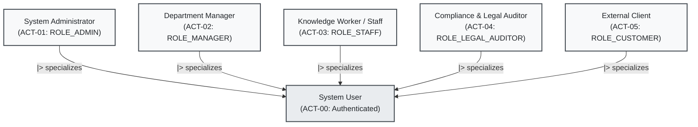

# 2. Actor Matrix & Role-Based Access Control (RBAC)
## Enterprise Document Knowledge & Operations Platform

> **Source of Truth:** Human Stakeholder Personas, Machine & System Actors, UML Actor Hierarchy, and Functional Permissions Matrix (`<action>:<resource>` vs Roles).
> **Orchestrated by:** [`MVP.md`](MVP.md)

---

## 1. Human Stakeholders & Personas

| Actor Code | Role Name | System Role (`roles`) | Responsibilities & Business Scope |
| :--- | :--- | :--- | :--- |
| **ACT-00** | **System User** | `Authenticated User` | Base abstract human actor authenticated with a valid JWT session; inherits baseline self-service profile and notification capabilities. |
| **ACT-01** | **System Administrator** | `ROLE_ADMIN` | Manages users, department hierarchy, system configurations, reviews full audit logs, and oversees high-level automated workflows. |
| **ACT-02** | **Department Manager** | `ROLE_MANAGER` | Manages department documents, reviews and approves/rejects sensitive operational actions (HITL Approvals), assigns and tracks operation tasks. |
| **ACT-03** | **Knowledge Worker / Staff** | `ROLE_STAFF` | Uploads documents, manages personal workspaces, queries the AI Assistant within granted ACL permissions, and submits action approval requests. |
| **ACT-04** | **Compliance & Legal Auditor** | `ROLE_LEGAL_AUDITOR` | Queries compliance documents, inspects verbatim AI citations against source materials, and examines immutable audit logs for compliance audits. |
| **ACT-05** | **External Client / Partner** | `ROLE_CUSTOMER` | Limited access to `PUBLIC` documents or specifically shared ACLs; prohibited from accessing internal department knowledge. |

---

## 2. Machine & Supporting System Actors

Supporting system actors are structured across the two implementation phases:

| Actor Code | System Actor Name | Technical Component | Automated Responsibilities | Delivery Phase |
| :--- | :--- | :--- | :--- | :--- |
| **EXT-03** | **AWS Cloud & Edge Platform** | AWS EC2 / S3 / Cloudflare / GitHub Actions | Hosts Docker runtime, terminates HTTPS/TLS, manages security groups, and automates CI/CD deployment. | **Phase 1 (P0)** |
| **EXT-01** | **AWS S3 Object Storage** | AWS S3 / Compatible Blob Storage | Remote cloud blob storage for binary files (PDF, DOCX, XLSX) with SSE-AES256 and presigned URLs. | **Phase 1 (P0)** |
| **SYS-03** | **Workflow Orchestrator** | `backend` (Spring Boot App Service) | Coordinates multi-step document pipelines, handles event triggers, and transitions executions into `WAITING_APPROVAL`. | **Phase 1 (P1)** |
| **SYS-04** | **Audit Subsystem** | `backend` (`@EventListener` & Interceptor)| Immutably records all authentication, CRUD mutations, ACL updates, and HITL decisions into the `audit_logs` table. | **Phase 1 (P0)** |
| **SYS-05** | **Notification Subsystem**| `backend` (Notification Service) | Dispatches real-time in-app alerts and pending approval notifications to target users. | **Phase 1 (P1)** |
| **SYS-01** | **AI Ingestion Worker** | `ai` (FastAPI Background Task) | *(Phase 2 Extension)* Ingests files, extracts text, performs chunking, computes 1536d embeddings, and indexes vectors. | **Phase 2 (P2)** |
| **SYS-02** | **Hybrid RAG Engine** | `ai` (FastAPI + pgvector + BM25 FTS) | *(Phase 2 Extension)* Executes Pre-filtered SQL hybrid retrieval, computes RRF rankings, and formats grounded citations. | **Phase 2 (P2)** |
| **EXT-02** | **Embedding & LLM API** | OpenAI / Gemini API Provider | External AI foundation models for dense vector embeddings and conversational completions. | **Phase 2 (P2)** |

---

## 3. Actor Hierarchy & Generalization

In UML standards, specialized human actors inherit general capabilities from the base `System User`:

---

## 4. Functional Permissions Matrix (Permissions vs. Roles)

Fine-grained permissions follow the standard format `<action>:<resource>` (stored in `permissions` and `role_permissions`):

| Permission Code | Business Meaning | `ADMIN` | `MANAGER` | `STAFF` | `LEGAL_AUDITOR` | `CUSTOMER` |
| :--- | :--- | :---: | :---: | :---: | :---: | :---: |
| `read:documents` | Search, view, and query available documents | Allowed | Allowed | Allowed | Allowed | Allowed *(Public)* |
| `write:documents` | Upload new documents and publish revisions | Allowed | Allowed | Allowed | - | - |
| `delete:documents` | Soft-delete documents from the workspace | Allowed | Allowed | - | - | - |
| `manage:permissions` | Grant or revoke document ACL access | Allowed | Allowed | Allowed *(Own docs)* | - | - |
| `manage:users` | Provision, deactivate, and assign user roles | Allowed | - | - | - | - |
| `manage:workflows` | Define and trigger automated workflows | Allowed | Allowed | - | - | - |
| `approve:actions` | Approve or reject sensitive HITL actions | Allowed | Allowed | - | - | - |
| `read:audit_logs` | Inspect system-wide security audit trail | Allowed | - | - | Allowed | - |
