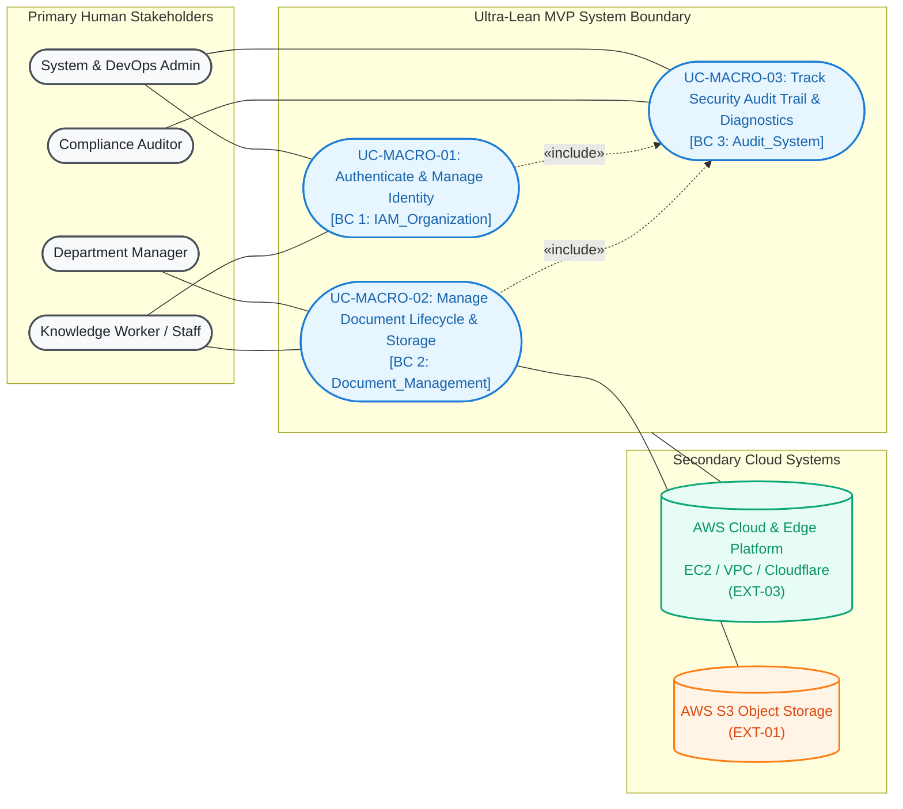
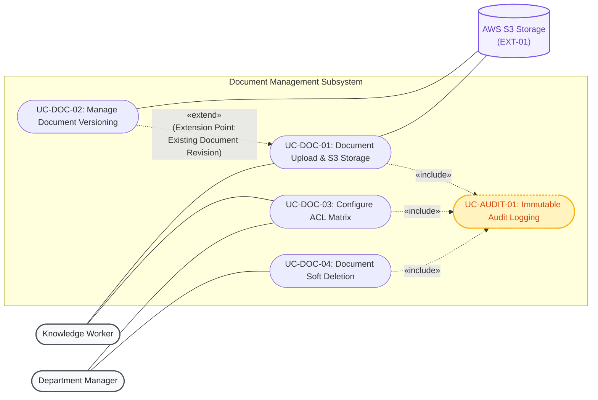
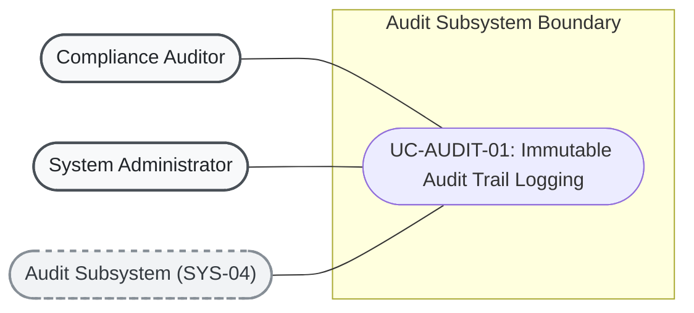

# 3. Use Case Modeling & Architectural Decomposition
## Enterprise Document Knowledge & Operations Platform
### Ultra-Lean Infrastructure-Focused MVP Specification

> **Source of Truth:** OMG UML 2.5 Modeling Standards, Macro Context Boundary, Master Decomposed Global Use Case Map, and Active Subsystem Architectural Diagrams.
> **Orchestrated by:** [`MVP.md`](MVP.md)

---

## 1. Standard UML 2.5 Use Case Conventions & Notation Reference

To ensure strict compliance with **OMG UML 2.5 Use Case Modeling Standards**, the diagrams in this specification adhere to the following semantic rules:

```text
┌────────────────────────────────────────────────────────────────────────────────────────────────────────┐
│                                   UML USE CASE RELATIONSHIP STANDARDS                                  │
├───────────────────┬──────────────────────────────────┬─────────────────────────────────────────────────┤
│ Relationship Type │ UML Visual Syntax                │ Exact Standard Semantics & Rules                │
├───────────────────┼──────────────────────────────────┼─────────────────────────────────────────────────┤
│ Association       │ Actor ──── UseCase               │ Solid line representing communication.          │
│                   │                                  │ Actors are outside the system boundary.         │
├───────────────────┼──────────────────────────────────┼─────────────────────────────────────────────────┤
│ «include»         │ BaseUseCase -. «include» .->     │ Mandatory execution. The Base Use Case ALWAYS   │
│                   │ IncludedUseCase                  │ calls the Included Use Case. Arrow points       │
│                   │                                  │ FROM Base TO Included (Base -> Included).       │
├───────────────────┼──────────────────────────────────┼─────────────────────────────────────────────────┤
│ «extend»          │ ExtensionUseCase -. «extend» .-> │ Conditional / optional execution. The Extension │
│                   │ BaseUseCase                      │ Use Case augments the Base Use Case under a     │
│                   │                                  │ specific Extension Point/Condition. Arrow points│
│                   │                                  │ FROM Extension TO Base (Extension -> Base).     │
├───────────────────┼──────────────────────────────────┼─────────────────────────────────────────────────┤
│ Generalization    │ SubActor ───|> BaseActor         │ Inheritance of roles or use cases. Solid line   │
│                   │ ChildUC ───|> ParentUC           │ with closed triangular arrow pointing to parent.│
└───────────────────┴──────────────────────────────────┴─────────────────────────────────────────────────┘
```

---

## 2. High-Level Context Use Case Diagram (Ultra-Lean MVP)

The context use case diagram captures the high-level system boundary, primary human actors, secondary external systems, and macro-level capabilities for the **Ultra-Lean MVP**:



> **Note on Deferred Modules:** Advanced macro capabilities (`UC-MACRO-04: Conversational AI`, `UC-MACRO-05: Workflow Automation`, `UC-MACRO-06: Operations HITL`) have been relocated to [`deferred/`](deferred/) for post-MVP execution.

---

## 3. Master Decomposed Use Case Map (Ultra-Lean MVP)

The macro capabilities are decomposed into **8 active functional use cases** across **3 Core Bounded Contexts**:

```mermaid
flowchart TB
    %% Human Actors
    Admin(["System Admin"]):::actor
    Manager(["Department Manager"]):::actor
    Staff(["Knowledge Worker"]):::actor
    Auditor(["Compliance Auditor"]):::actor

    %% System Actors
    AuditSub(["Audit Subsystem (SYS-04)"]):::sysactor
    S3[("AWS S3 Storage (EXT-01)")]:::sysactor

    %% Bounded Context 1: IAM
    subgraph BC_IAM ["1. Identity & Access Management (IAM)"]
        UC_IAM_01(["UC-IAM-01: User Login & JWT Session"])
        UC_IAM_02(["UC-IAM-02: Multi-Role Assignment"])
        UC_IAM_03(["UC-IAM-03: Department Scoping"])
    end

    %% Bounded Context 2: Document Management
    subgraph BC_DOC ["2. Document Management (DMS)"]
        UC_DOC_01(["UC-DOC-01: Document Upload & S3 Storage"])
        UC_DOC_02(["UC-DOC-02: Manage Document Versioning"])
        UC_DOC_03(["UC-DOC-03: Configure ACL Matrix"])
        UC_DOC_04(["UC-DOC-04: Document Soft Deletion"])
    end

    %% Bounded Context 3: Audit System
    subgraph BC_AUDIT ["3. Audit Trail Subsystem"]
        UC_AUDIT_01(["UC-AUDIT-01: Immutable Audit Trail Logging"])
    end

    %% Actor to Use Case Associations
    Admin --- UC_IAM_02
    Admin --- UC_IAM_03
    Admin --- UC_AUDIT_01

    Staff --- UC_IAM_01
    Staff --- UC_DOC_01
    Staff --- UC_DOC_03

    Manager --- UC_DOC_03
    Manager --- UC_DOC_04

    Auditor --- UC_AUDIT_01

    AuditSub --- UC_AUDIT_01
    UC_DOC_01 --- S3
    UC_DOC_02 --- S3

    %% Standard UML Include Relationships (Base -> Included)
    UC_IAM_01 -. "«include»" .-> UC_AUDIT_01
    UC_IAM_02 -. "«include»" .-> UC_AUDIT_01
    UC_IAM_03 -. "«include»" .-> UC_AUDIT_01
    UC_DOC_01 -. "«include»" .-> UC_AUDIT_01
    UC_DOC_03 -. "«include»" .-> UC_AUDIT_01
    UC_DOC_04 -. "«include»" .-> UC_AUDIT_01

    %% Standard UML Extend Relationships (Extension -> Base)
    UC_DOC_02 -. "«extend»\n(On Existing Document)" .-> UC_DOC_01

    classDef actor fill:#f8f9fa,stroke:#495057,stroke-width:2px,color:#212529;
    classDef sysactor fill:#f1f3f5,stroke:#868e96,stroke-width:2px,stroke-dasharray: 5 5,color:#343a40;
```



---

## 4. Subsystem Use Case Diagrams by Bounded Context

---

### Diagram 1: Identity & Access Management (`IAM_Organization`)


---

### Diagram 2: Document Management & Access Control (`Document_Management`)



---

### Diagram 3: Audit Trail Subsystem (`Audit_System`)


