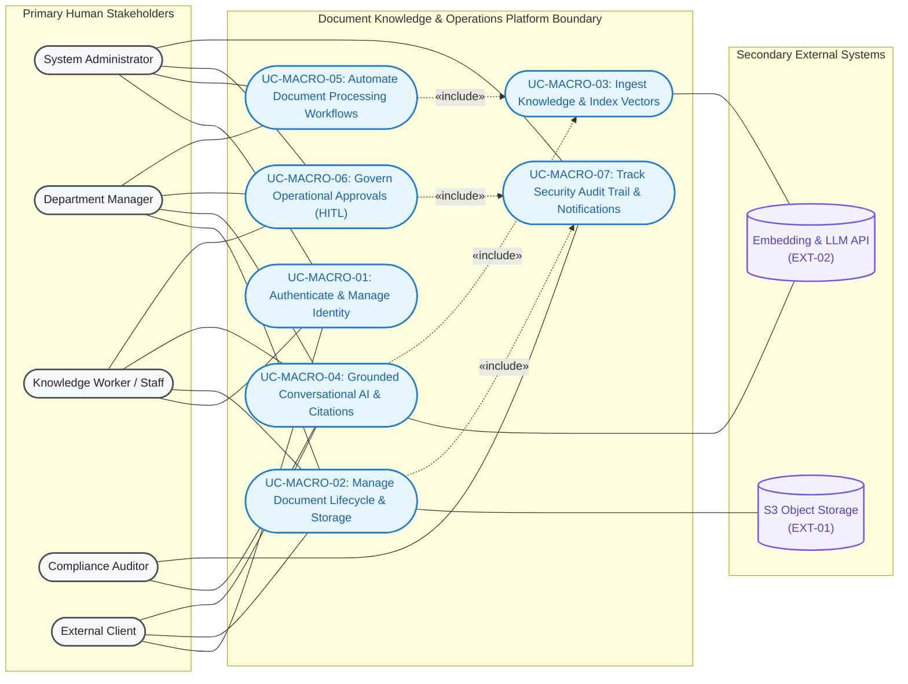
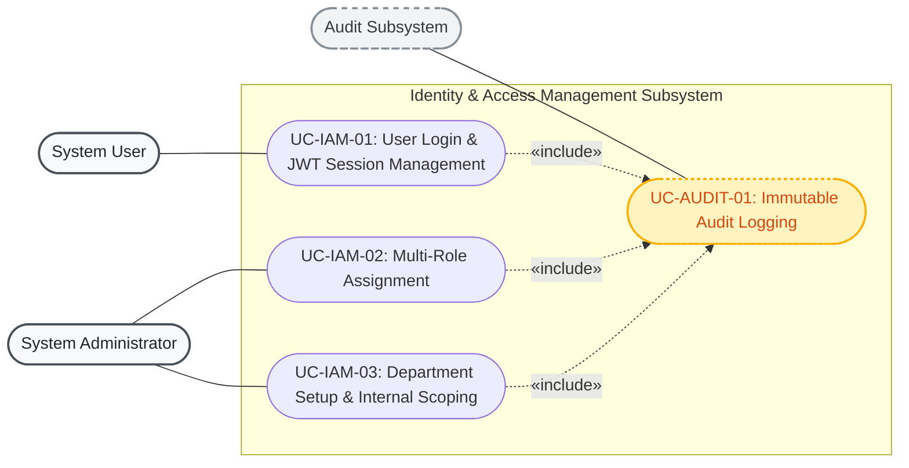
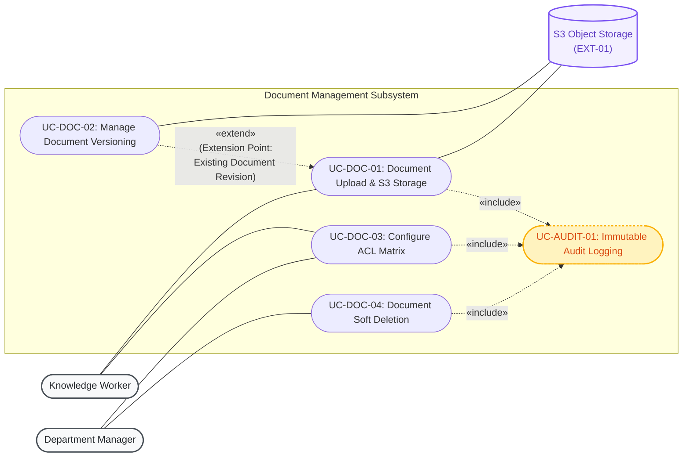
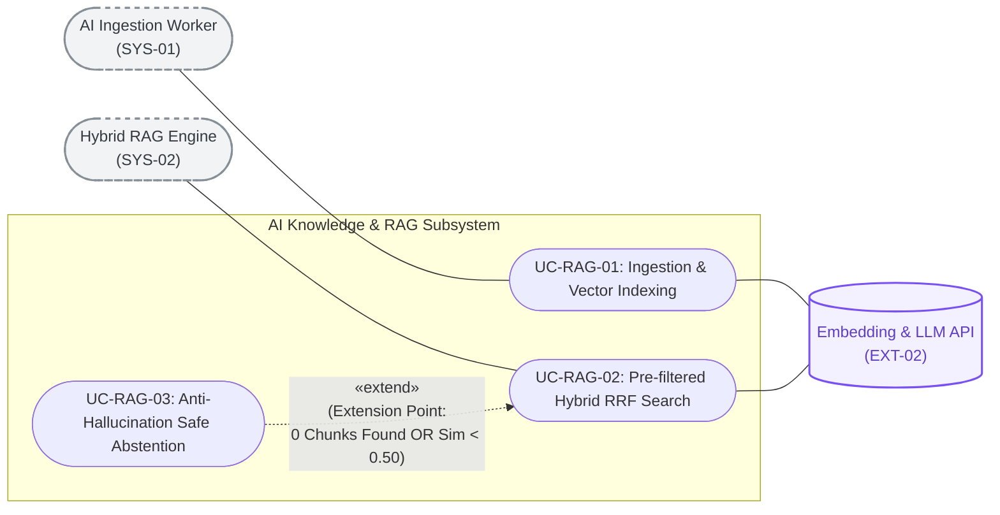
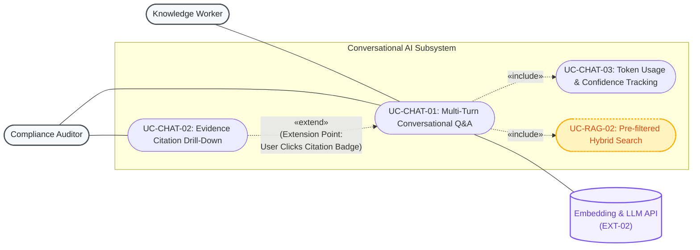
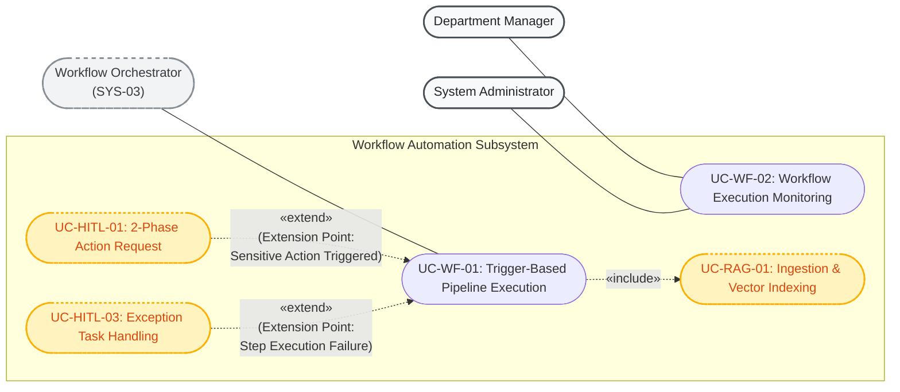
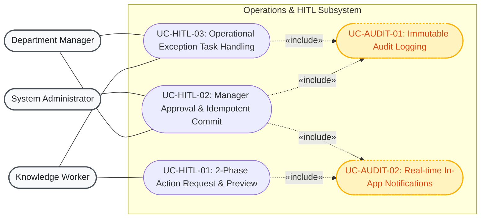
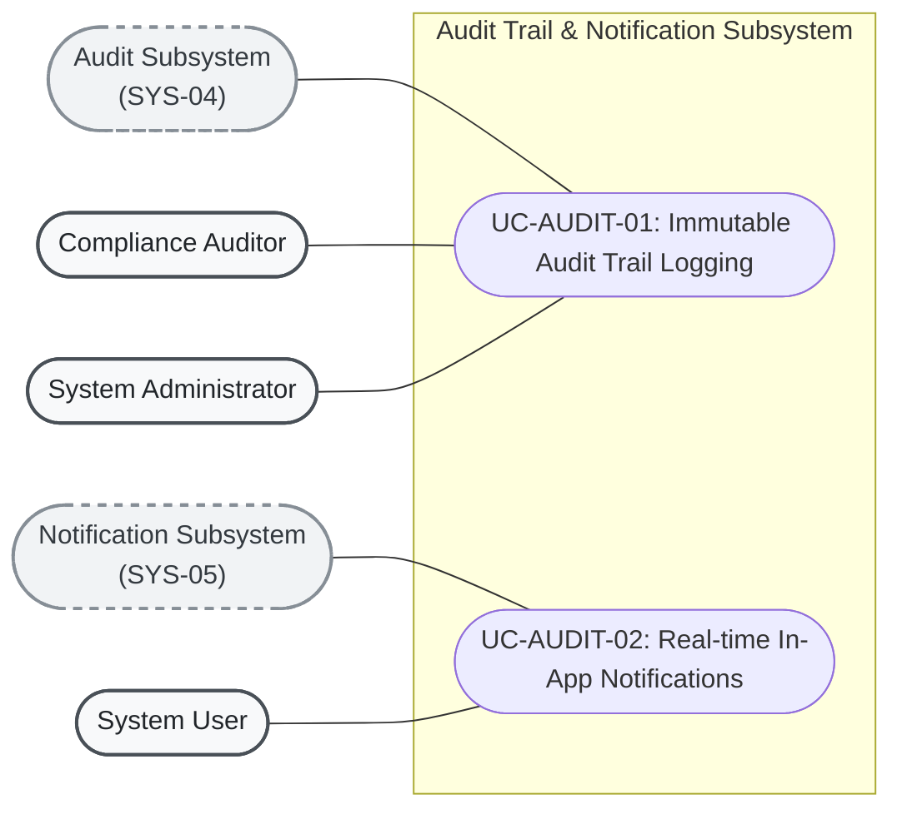

# 3. Use Case Modeling & Architectural Decomposition
## Enterprise Document Knowledge & Operations Platform

> **Source of Truth:** OMG UML 2.5 Modeling Standards, Macro Context Boundary, Master Decomposed Global Use Case Map, and Subsystem Architectural Diagrams.
> **Orchestrated by:** [`MVP.md`](MVP.md)

---

## 1. Standard UML 2.5 Use Case Conventions & Notation Reference

To ensure strict compliance with **OMG UML 2.5 Use Case Modeling Standards**, the diagrams in this specification adhere to the following semantic rules:

```text
┌────────────────────────────────────────────────────────────────────────────────────────────────────────┐
│                                   UML USE CASE RELATIONSHIP STANDARDS                                  │
├───────────────────┬──────────────────────────────────┬─────────────────────────────────────────────────┤
│ Relationship Type │ UML Visual Syntax                │ Exact Standard Semantics & Rules                │
├───────────────────┼──────────────────────────────────┼─────────────────────────────────────────────────┤
│ Association       │ Actor ──── UseCase               │ Solid line representing communication.          │
│                   │                                  │ Actors are outside the system boundary.         │
├───────────────────┼──────────────────────────────────┼─────────────────────────────────────────────────┤
│ «include»         │ BaseUseCase -. «include» .->     │ Mandatory execution. The Base Use Case ALWAYS   │
│                   │ IncludedUseCase                  │ calls the Included Use Case. Arrow points       │
│                   │                                  │ FROM Base TO Included (Base -> Included).       │
├───────────────────┼──────────────────────────────────┼─────────────────────────────────────────────────┤
│ «extend»          │ ExtensionUseCase -. «extend» .-> │ Conditional / optional execution. The Extension │
│                   │ BaseUseCase                      │ Use Case augments the Base Use Case under a     │
│                   │                                  │ specific Extension Point/Condition. Arrow points│
│                   │                                  │ FROM Extension TO Base (Extension -> Base).     │
├───────────────────┼──────────────────────────────────┼─────────────────────────────────────────────────┤
│ Generalization    │ SubActor ───|> BaseActor         │ Inheritance of roles or use cases. Solid line   │
│                   │ ChildUC ───|> ParentUC           │ with closed triangular arrow pointing to parent.│
└───────────────────┴──────────────────────────────────┴─────────────────────────────────────────────────┘
```

> [!IMPORTANT]
> **Strict UML Modeling Rules Applied:**
> 1. **Direction of `«include»`:** Points from the base use case to the included use case (`Base -. "«include»" .-> Included`).
> 2. **Direction of `«extend»`:** Points from the extending use case to the base use case (`Extension -. "«extend»" .-> Base`).
> 3. **No Non-Standard Stereotypes:** Deprecated custom stereotypes (such as `<<persists>>`, `<<calls>>`, `<<trigger>>`, `<<acts on>>`) are strictly replaced with standard UML Actor Associations or valid `«include»`/`«extend»` relationships.
> 4. **External Systems as Actors:** Third-party providers (`S3 Storage`, `LLM API`) are modeled as Secondary Actors outside the system boundary with solid association lines (`UseCase ──── SystemActor`).

---

## 2. High-Level Context Use Case Diagram (Macro Capabilities)

The context use case diagram captures the high-level system boundary, primary human actors, secondary external systems, and macro-level capabilities:



---

## 3. Master Decomposed Use Case Map (Global Architecture)

The macro capabilities are decomposed into **20 concrete functional use cases** organized across **7 Bounded Contexts**, featuring fully standardized `«include»` and `«extend»` relationships with explicit condition points:

```mermaid
flowchart TB
    %% Human Actors
    Admin(["System Admin"]):::actor
    Manager(["Department Manager"]):::actor
    Staff(["Knowledge Worker"]):::actor
    Auditor(["Compliance Auditor"]):::actor

    %% System Actors
    Worker(["AI Ingestion Worker"]):::sysactor
    Engine(["Hybrid RAG Engine"]):::sysactor
    Orchestrator(["Workflow Orchestrator"]):::sysactor
    AuditSub(["Audit Subsystem"]):::sysactor

    %% Bounded Context 1: IAM
    subgraph BC_IAM ["1. Identity & Access Management (IAM)"]
        UC_IAM_01(["UC-IAM-01: User Login & JWT Session"])
        UC_IAM_02(["UC-IAM-02: Multi-Role Assignment"])
        UC_IAM_03(["UC-IAM-03: Department Scoping"])
    end

    %% Bounded Context 2: Document Management
    subgraph BC_DOC ["2. Document Management (DMS)"]
        UC_DOC_01(["UC-DOC-01: Document Upload & S3 Storage"])
        UC_DOC_02(["UC-DOC-02: Manage Document Versioning"])
        UC_DOC_03(["UC-DOC-03: Configure ACL Matrix"])
        UC_DOC_04(["UC-DOC-04: Document Soft Deletion"])
    end

    %% Bounded Context 3: AI Knowledge & RAG
    subgraph BC_RAG ["3. AI Knowledge & Hybrid RAG"]
        UC_RAG_01(["UC-RAG-01: Ingestion & Vector Indexing"])
        UC_RAG_02(["UC-RAG-02: Pre-filtered Hybrid Search"])
        UC_RAG_03(["UC-RAG-03: Anti-Hallucination Safe Abstention"])
    end

    %% Bounded Context 4: Conversational AI
    subgraph BC_CHAT ["4. Conversational AI"]
        UC_CHAT_01(["UC-CHAT-01: Multi-Turn Conversational Q&A"])
        UC_CHAT_02(["UC-CHAT-02: Citation Drill-Down & Verification"])
        UC_CHAT_03(["UC-CHAT-03: Token Usage & Confidence Tracking"])
    end

    %% Bounded Context 5: Workflow Automation
    subgraph BC_WF ["5. Workflow Automation"]
        UC_WF_01(["UC-WF-01: Trigger-Based Pipeline Execution"])
        UC_WF_02(["UC-WF-02: Workflow Execution Monitoring"])
    end

    %% Bounded Context 6: Operations & HITL
    subgraph BC_HITL ["6. Operations & Human-In-The-Loop"]
        UC_HITL_01(["UC-HITL-01: 2-Phase Action Request & Preview"])
        UC_HITL_02(["UC-HITL-02: Manager Approval & Idempotent Commit"])
        UC_HITL_03(["UC-HITL-03: Operational Exception Task Handling"])
    end

    %% Bounded Context 7: Audit & Notifications
    subgraph BC_AUDIT ["7. Audit Trail & Notifications"]
        UC_AUDIT_01(["UC-AUDIT-01: Immutable Audit Trail Logging"])
        UC_AUDIT_02(["UC-AUDIT-02: Real-time In-App Notifications"])
    end

    %% Actor to Use Case Associations
    Admin --- UC_IAM_02
    Admin --- UC_IAM_03
    Admin --- UC_WF_02
    Admin --- UC_AUDIT_01
    Admin --- UC_HITL_02

    Staff --- UC_IAM_01
    Staff --- UC_DOC_01
    Staff --- UC_DOC_03
    Staff --- UC_CHAT_01
    Staff --- UC_HITL_01
    Staff --- UC_HITL_03

    Manager --- UC_DOC_03
    Manager --- UC_DOC_04
    Manager --- UC_HITL_02
    Manager --- UC_HITL_03
    Manager --- UC_WF_02

    Auditor --- UC_CHAT_02
    Auditor --- UC_AUDIT_01

    Worker --- UC_RAG_01
    Engine --- UC_RAG_02
    Orchestrator --- UC_WF_01
    AuditSub --- UC_AUDIT_01

    %% Standard UML Include Relationships (Base -> Included)
    UC_CHAT_01 -. "«include»" .-> UC_RAG_02
    UC_CHAT_01 -. "«include»" .-> UC_CHAT_03
    UC_WF_01 -. "«include»" .-> UC_RAG_01
    UC_IAM_01 -. "«include»" .-> UC_AUDIT_01
    UC_DOC_01 -. "«include»" .-> UC_AUDIT_01
    UC_DOC_03 -. "«include»" .-> UC_AUDIT_01
    UC_DOC_04 -. "«include»" .-> UC_AUDIT_01
    UC_HITL_01 -. "«include»" .-> UC_AUDIT_02
    UC_HITL_02 -. "«include»" .-> UC_AUDIT_01
    UC_HITL_02 -. "«include»" .-> UC_AUDIT_02

    %% Standard UML Extend Relationships (Extension -> Base)
    UC_DOC_02 -. "«extend»\n(On Existing Document)" .-> UC_DOC_01
    UC_RAG_03 -. "«extend»\n(On 0 Chunks Found)" .-> UC_RAG_02
    UC_CHAT_02 -. "«extend»\n(On Citation Click)" .-> UC_CHAT_01
    UC_HITL_01 -. "«extend»\n(On Sensitive Action)" .-> UC_WF_01
    UC_HITL_03 -. "«extend»\n(On Pipeline Failure)" .-> UC_WF_01

    classDef actor fill:#f8f9fa,stroke:#495057,stroke-width:2px,color:#212529;
    classDef sysactor fill:#f1f3f5,stroke:#868e96,stroke-width:2px,stroke-dasharray: 5 5,color:#343a40;
```



---

## 4. Subsystem Use Case Diagrams by Bounded Context

---

### Diagram 1: Identity & Access Management (`IAM_Organization`)



---

### Diagram 2: Document Management & Access Control (`Document_Management`)



---

### Diagram 3: AI Knowledge & Hybrid Retrieval (`AI_Knowledge_RAG`)



---

### Diagram 4: Conversational AI & Citations (`Conversational_AI`)



---

### Diagram 5: Workflow Automation (`Workflow_Automation`)



---

### Diagram 6: Operations & Human-In-The-Loop (`Operations_HITL`)



---

### Diagram 7: Audit Subsystem & Notifications (`Audit_System`)


