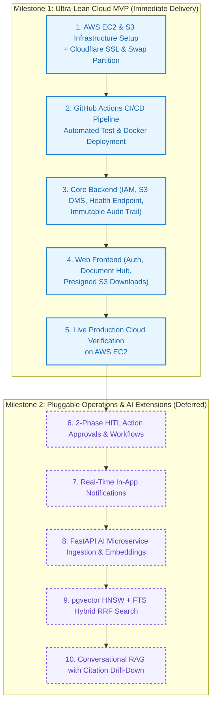

# 6. Engineering Handoff & Implementation Guidelines
## Enterprise Document Knowledge & Operations Platform
### Ultra-Lean Infrastructure-Focused MVP Specification

> **Source of Truth:** Cross-Functional Implementation Guidelines for Cloud/DevOps, Backend, Frontend, and QA & Testing Teams.
> **Orchestrated by:** [`MVP.md`](MVP.md)

---

## 1. Overview & Core MVP Objectives

This specification defines the engineering execution blueprint for the **Ultra-Lean MVP**. The primary objective is **fastest progress to production on AWS Cloud**, allowing the engineering team to focus on mastering cloud infrastructure provisioning, automated CI/CD pipelines, container orchestration, and durable S3 storage.

---

## 2. Engineering Role Guidelines

### 2.1. Cloud & DevOps Engineering (AWS / Docker / GitHub Actions / Cloudflare) — Priority #1 (Core Focus)
- **AWS Compute & Host Setup:** Configure AWS EC2 (Ubuntu 24.04 LTS `t2/t3.micro`) with 30GB gp3 EBS. Allocate a 3GB Swap file (`/swapfile`) to eliminate OOM risks during container execution.
- **Durable Object Storage (AWS S3):** Provision private S3 document bucket (`docs-platform-*`) with Server-Side Encryption (SSE-AES256), public access blocked, and IAM Instance Profile access.
- **Automated CI/CD Pipeline:** Implement GitHub Actions workflow (`.github/workflows/deploy.yml`) on merge to `develop`/`main`:
  1. Run backend unit and integration test suites.
  2. Build and tag multi-stage Docker container images.
  3. Deploy to AWS EC2 via SSH and trigger `docker compose up -d --build --remove-orphans`.
- **Edge Ingress & Zero-Cost SSL:** Route apex domain through Cloudflare Edge with Universal SSL/TLS (Full Strict Mode) and automated HTTPS renewal.
- **Zero-Secret Compliance:** Inject production secrets (JWT secret, DB password, S3 bucket name) via GitHub repository secrets into runtime environment variables; zero credentials in git.

---

### 2.2. Backend Engineering (Java 21 / Spring Boot 3) — Priority #1
- **Architecture & Tactical DDD:** Implement Domain Aggregates, Entities, Value Objects, Outbound Ports, and REST Controllers corresponding to:
  - `UC-IAM-01`: User Login, JWT Generation, and BCrypt validation.
  - `UC-IAM-02`: Multi-Role Assignment.
  - `UC-IAM-03`: Department Setup & internal scoping.
  - `UC-DOC-01`: Streaming file upload & S3 Object Storage adapter with SHA-256 integrity check.
  - `UC-DOC-02`: Document Version snapshots.
  - `UC-DOC-03`: 4-tier ACL matrix (`PUBLIC`, `INTERNAL`, `RESTRICTED`, `CONFIDENTIAL`).
  - `UC-DOC-04`: Soft deletion enforcing `deleted_at IS NULL`.
  - `UC-AUDIT-01`: Asynchronous immutable audit logging via Spring `@EventListener`.
- **S3 Storage Adapter:** Implement `S3StorageAdapter` using the AWS SDK v2, supporting presigned download URLs with configurable expiration ($\le 15\text{ mins}$) and SHA-256 streaming verification.
- **Pre-filtered SQL ACLs:** Enforce document authorization directly in SQL `WHERE` clauses to guarantee zero in-memory data leaks.
- **Health & Diagnostic Endpoint:** Implement `GET /api/v1/health` verifying database pool connectivity and S3 reachability.

---

### 2.3. Frontend Engineering (React 18 / TypeScript / Vite) — Priority #1
- **Authentication & Session:** Build clean login interface reading JWT tokens, storing session state, and handling expired tokens.
- **Document Hub:** Build multi-format document upload (PDF, DOCX, XLSX, TXT) with drag-and-drop, upload progress indicators, document list with department filtering, and presigned S3 download links.
- **Document Details & Versioning:** UI for viewing version history, uploader metadata, and triggering new version uploads.
- **Access Control Configuration:** Modal to set document classification (`PUBLIC`, `INTERNAL`, `RESTRICTED`, `CONFIDENTIAL`) and manage specific access grants.
- **Environment Agnostic Configuration:** Read backend API base URL from Vite environment variables (`VITE_API_BASE_URL`).

---

### 2.4. QA & Testing Engineers
- **Automated Test Suite:**
  - **Unit Tests:** Validate BCrypt hashing, JWT issuance/revocation, domain invariants, and permission checks.
  - **Integration Tests:** Use Testcontainers (PostgreSQL) to verify Pre-filtered SQL queries, transaction rollbacks, and S3 binary streaming.
  - **Cloud Infrastructure Tests:** Verify AWS health checks (`GET /api/v1/health`), S3 presigned URL authorization, SSL certificate validity, and automated GitHub Actions deployment.
  - **Security & ACL Tests:** Verify that unauthorized users and cross-department queries cannot view restricted or confidential documents.

---

## 3. Phased Rollout Sequence

