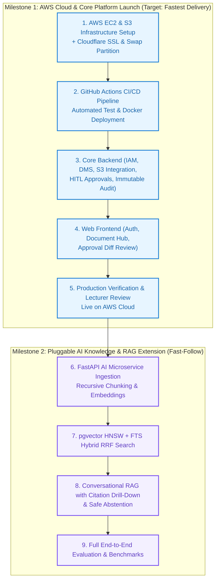

# 6. Engineering Handoff & Implementation Guidelines
## Enterprise Document Knowledge & Operations Platform

> **Source of Truth:** Cross-Functional Implementation Guidelines for Backend, AI & Data, Frontend, and QA & Testing Teams.
> **Orchestrated by:** [`MVP.md`](MVP.md)

---

## 1. Overview & Handoff Principles

This specification suite serves as the formal **Business Analysis & Requirements Source of Truth** for cross-functional engineering execution across Backend, AI, Frontend, and Quality Assurance teams.

---

## 2. Engineering Role Guidelines

### 2.1. Cloud & DevOps Engineering (AWS / Docker / GitHub Actions / Cloudflare) — Priority #1
- **AWS Infrastructure Provisioning:** Configure AWS EC2 (Ubuntu 24.04 LTS `t2/t3.micro`) with 30GB gp3 EBS. Automatically allocate a 3GB Swap memory partition (`/swapfile`) to prevent OOM errors during container execution on 1GB RAM instances.
- **Durable Object Storage (AWS S3):** Provision private S3 document bucket (`docs-platform-*`) with Server-Side Encryption (SSE-AES256), public access completely blocked, and IAM Instance Profile access (no hardcoded keys).
- **Automated CI/CD Pipeline:** Implement GitHub Actions workflow (`.github/workflows/deploy.yml`) executing on merge to `develop`/`main`:
  1. Checkout code and run backend test suites.
  2. Build and tag multi-stage Docker containers.
  3. Deploy to AWS EC2 via SSH and trigger `docker compose up -d --build --remove-orphans`.
- **Edge Ingress & Zero-Cost SSL:** Route apex domain through Cloudflare Edge with Universal SSL/TLS (Full Strict Mode), automated Let's Encrypt renewal, and DDoS Layer 3/4/7 mitigation.
- **Zero-Secret Compliance:** Inject production secrets (JWT secret, DB password, S3 bucket name) exclusively via repository secrets into `.env` at deploy time; zero credentials committed to git.

---

### 2.2. Backend Engineering (Java 21 / Spring Boot 3) — Priority #1
- **Architecture & Tactical DDD:** Implement Domain Aggregates, Entities, Value Objects, Repository Outbound Ports, Application Services, and REST Inbound Controllers corresponding to `UC-IAM-*`, `UC-DOC-*`, `UC-WF-*`, `UC-HITL-*`, and `UC-AUDIT-*` following Tactical Domain-Driven Design (DDD).
- **AWS S3 Storage Port:** Implement `S3StorageAdapter` using the official AWS SDK v2, supporting presigned download URLs with configurable expiration ($\le 15\text{ mins}$) and SHA-256 integrity checks.
- **Security & Authorization:** Enforce functional RBAC via Spring Security annotations (`@PreAuthorize("hasAuthority('...')")`) at the API Gateway / Web Controller layer, and pass authenticated `UserSecurityContext` (`userId`, `departmentId`, `roleIds`, `isInternal`) down to domain use cases and outbound ports.
- **Transactional & Idempotency Boundaries:** Ensure all state-mutating operations execute within `@Transactional` boundaries, verifying the uniqueness of `idempotency_key` in `action_approvals` prior to commit.
- **Audit Subsystem Integration:** Asynchronously dispatch immutable audit events via `@EventListener` interceptors on every state change and sensitive resource query.
- **Health & Diagnostic Endpoint:** Provide `/api/v1/health` verifying database pool connectivity and S3 reachability.

---

### 2.3. Frontend Engineering (React 18 / TypeScript / Vite) — Priority #1
- **User Experience & Navigation:** Build role-aware dashboards and navigation based on permissions received in JWT session payloads.
- **Document Management UI:** Build multi-format document upload (PDF, DOCX, XLSX, TXT) with drag-and-drop, upload progress indicators, version history inspection, and presigned S3 download triggers.
- **2-Phase HITL Approval UI (`UC-HITL-01`, `UC-HITL-02`):** Implement visual Diff Previews rendering staged before/after JSON payloads, requiring manager review notes before submitting approval or rejection.
- **Real-Time Notifications (`UC-AUDIT-02`):** Display real-time in-app notification toasts and unread counters for pending approvals and background indexing tasks.
- **Environment Agnostic Configuration:** Read backend API base URL from Vite environment variables (`VITE_API_BASE_URL`), supporting both local Docker and production AWS/Cloudflare domains.

---

### 2.4. AI & Data Engineering (Python 3.11 / FastAPI / pgvector) — Phase 2 Pluggable Extension
- **Architecture & Clean Ports:** Implement the AI microservice using Clean Architecture / Hexagonal Ports & Adapters (`EmbeddingPort`, `VectorStorePort`, `LlmClientPort`, `RerankerPort`).
- **Ingestion Pipeline (`UC-RAG-01`):** Construct recursive chunking (`chunk_size = 500-1000 tokens`, `overlap = 50-100 tokens`) with source page metadata tracking, batch embedding calculation (1536-dimensional vectors), and dual-indexing (HNSW cosine index + GIN tsvector full-text index).
- **Pre-filtered Hybrid RRF Search (`UC-RAG-02`):** Implement single-SQL hybrid search combining pgvector cosine distance (`<=>`) and full-text search (`tsv @@ plainto_tsquery`) with strict SQL-level ACL `WHERE` clauses, ranked via Reciprocal Rank Fusion (RRF).
- **Prompt Contract & Anti-Hallucination Guard (`UC-RAG-03`, `UC-CHAT-01`):** Construct structured prompt contracts with XML/Markdown delimiters. Enforce automated Safe Abstention returning `NO_ACCESSIBLE_KNOWLEDGE` when retrieved chunks are empty or cosine similarity is below $0.50$.
- **Citation Badges & Drill-Down (`UC-CHAT-02`):** Return verbatim snippets and page references for UI drill-down against source documents.

---

### 2.5. QA & Testing Engineers
- **Traceability Verification:** Map test cases directly to the Requirements Traceability Matrix (RTM).
- **Automated Test Pyramid:**
  - **Unit Tests:** Validate domain invariants, permission evaluations, and idempotency logic.
  - **Integration Tests:** Use Testcontainers (PostgreSQL) to verify Pre-filtered SQL queries, transaction rollbacks, and S3 binary streaming.
  - **Cloud Infrastructure Tests:** Verify AWS health checks, S3 presigned URL authorization, SSL certificate validity, and automated GitHub Actions deployment.
  - **Security & ACL Tests:** Execute automated cross-department penetration test suites to verify that `RESTRICTED` and `CONFIDENTIAL` documents achieve a $0.0\%$ retrieval leakage rate.
  - **E2E & UAT Tests:** Translate `Basic Path`, `Alternative Paths`, and `Business Rules` from use case specifications into automated Playwright / Cypress user flow tests.

---

## 3. Phased Rollout Sequence (Path to Production)

