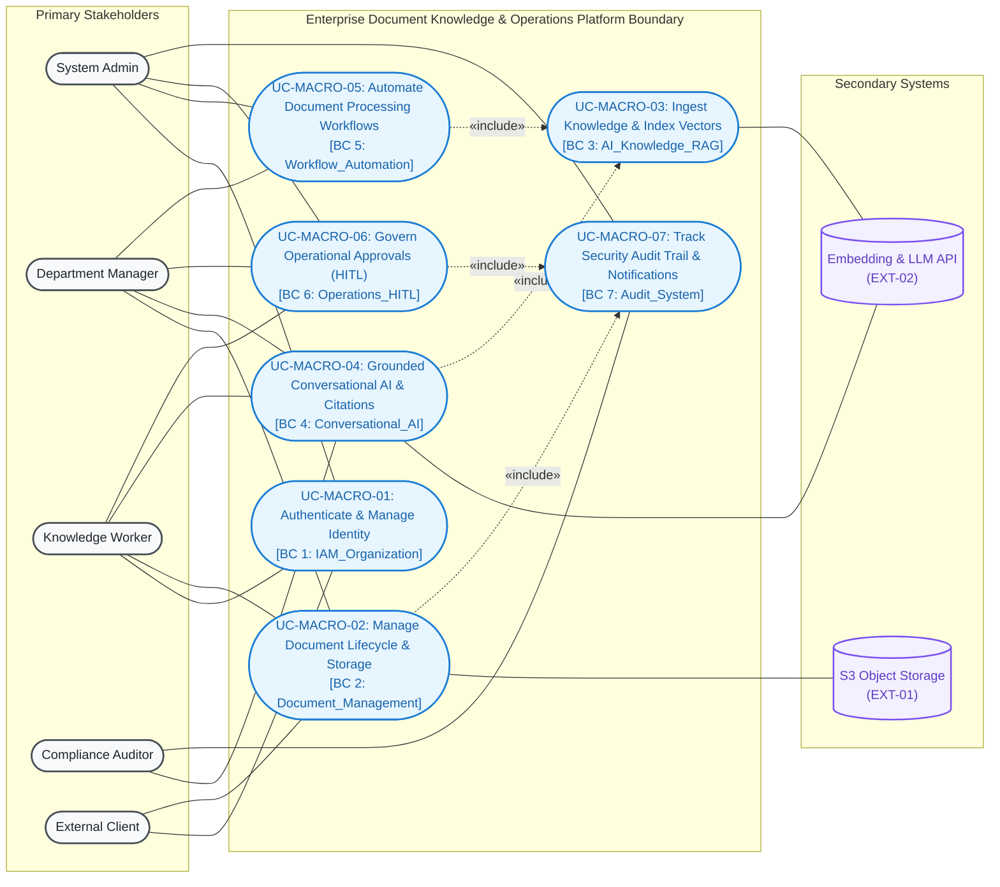

# Enterprise Document Knowledge & Operations Platform
## MVP Master Business Specification & Architecture Orchestrator

> **Document Role:** Master Orchestration & Executive Blueprint.
> Detailed domain specifications and requirements are modularized into dedicated **Source of Truth** files.

---

## 1. Executive Summary & Value Proposition

The **Enterprise Document Knowledge & Operations Platform** is an AI-powered Knowledge Operating System and Workflow Automation Platform designed to eliminate enterprise information silos, prevent AI data leakage, eradicate hallucinations, and bridge conversational intelligence to governed operational actions.

```text
┌──────────────────────────────────────────────────────────────────────────────────────────────────┐
│                                 4 CRITICAL ENTERPRISE BOTTLENECKS                                │
├────────────────────────────────┬────────────────────────────────┬────────────────────────────────┤
│ 1. FRAGMENTED INFORMATION      │ 2. DATA LEAKAGE & SECURITY     │ 3. AI HALLUCINATION            │
│ - Scattered across silos       │ - Off-the-shelf AI lacks ACL   │ - Ungrounded responses         │
│ - 20-30% work time lost        │ - High confidential leak risk  │ - Zero auditability/citation   │
├────────────────────────────────┴────────────────────────────────┴────────────────────────────────┤
│ 4. ACTIONLESS READ-ONLY AI: AI is passive and read-only, lacking safe Human-in-the-Loop workflows │
└──────────────────────────────────────────────────────────────────────────────────────────────────┘
```

### Core Value Propositions:
- **Zero Data Leakage:** Two-tier authorization enforcement with SQL-level Pre-filtered Retrieval.
- **100% Grounded & Verifiable Citations:** Every AI answer is backed by exact evidence citations (Document ID, Version, Page Number, Verbatim Snippet).
- **Sub-25ms Hybrid Search:** Dense Vector Cosine (HNSW) + Sparse Lexical (BM25/FTS) via Reciprocal Rank Fusion (RRF).
- **Controlled Human-in-the-Loop Operations:** 2-phase approval state machine (Prepare / Diff Preview $\rightarrow$ Waiting Approval $\rightarrow$ Idempotent Commit).

---

## 2. Specification Orchestration Map

All detailed requirements, models, and specifications reside in dedicated **Source of Truth** documents:

| Specification Domain | Source of Truth Document | Scope & Key Artifacts |
| :--- | :--- | :--- |
| **Problem & Business Scope** | [**`01_problem_and_business_scope.md`**](01_problem_and_business_scope.md) | 4 Bottlenecks, pain point matrix, problem boundaries, threat model, 4 strategic pillars, 5 value streams, KPIs, 4 business invariants, and MoSCoW framework. |
| **Actors & RBAC Permissions** | [**`02_actor_matrix_and_rbac.md`**](02_actor_matrix_and_rbac.md) | 6 Human personas (`ACT-00` to `ACT-05`), 7 Machine actors (`SYS-01` to `SYS-05`, `EXT-01`, `EXT-02`), UML actor hierarchy, and fine-grained permissions matrix. |
| **Use Case Architecture** | [**`03_use_case_architecture.md`**](03_use_case_architecture.md) | OMG UML 2.5 conventions, Macro Context Diagram, Master Decomposed Global Architecture Map (7 Bounded Contexts, 20 use cases), and 7 Subsystem Diagrams. |
| **Domain Use Case Specifications** | [**`use_cases/`**](use_cases/) | 20 Formal use case specifications across 7 Bounded Contexts (IAM, DMS, RAG, Chat, Workflows, HITL, Audit). |
| **Non-Functional Requirements** | [**`04_non_functional_requirements.md`**](04_non_functional_requirements.md) | Performance & latency (<25ms search, TTFT <800ms), security (zero leakage), reliability (append-only audit, idempotency), and scalability. |
| **Requirements Traceability** | [**`05_requirements_traceability_matrix.md`**](05_requirements_traceability_matrix.md) | Full RTM linking Business Problems $\leftrightarrow$ Use Cases $\leftrightarrow$ DB Tables $\leftrightarrow$ API Endpoints $\leftrightarrow$ Owning Modules. |
| **Engineering Handoff** | [**`06_engineering_handoff.md`**](06_engineering_handoff.md) | Cross-functional implementation guidelines for Backend (Spring Boot 3 / DDD), AI (FastAPI / pgvector), Frontend (React / Vite), and QA Testing. |

---

## 3. High-Level System Architecture & Macro Capabilities

The platform operates across **7 Bounded Contexts**, integrating secondary cloud infrastructure:



---

## 4. Bounded Context Use Case Index

For detailed step-by-step paths, alternative flows, business rules, and pre/post-conditions, refer directly to each bounded context specification:

| Bounded Context | Module File | Contained Use Case Specifications |
| :--- | :--- | :--- |
| **BC 1: IAM & Organization** | [`use_cases/01_iam_organization.md`](use_cases/01_iam_organization.md) | `UC-IAM-01`: User Login & JWT Session Management<br>`UC-IAM-02`: Multi-Role Assignment & Permission Management<br>`UC-IAM-03`: Department Setup & Internal Scoping |
| **BC 2: Document Management** | [`use_cases/02_document_management.md`](use_cases/02_document_management.md) | `UC-DOC-01`: Document Upload & S3 Object Storage<br>`UC-DOC-02`: Manage Document Versioning<br>`UC-DOC-03`: Configure Document Access Control Matrix<br>`UC-DOC-04`: Document Soft Deletion |
| **BC 3: AI Knowledge & RAG** | [`use_cases/03_ai_knowledge_rag.md`](use_cases/03_ai_knowledge_rag.md) | `UC-RAG-01`: Document Ingestion & Vector Indexing<br>`UC-RAG-02`: Pre-filtered Hybrid RRF Search<br>`UC-RAG-03`: Anti-Hallucination Safe Abstention |
| **BC 4: Conversational AI** | [`use_cases/04_conversational_ai.md`](use_cases/04_conversational_ai.md) | `UC-CHAT-01`: Multi-Turn Conversational RAG with Grounded Citations<br>`UC-CHAT-02`: Evidence Citation Drill-Down & Verification<br>`UC-CHAT-03`: Token Usage & Confidence Tracking |
| **BC 5: Workflow Automation** | [`use_cases/05_workflow_automation.md`](use_cases/05_workflow_automation.md) | `UC-WF-01`: Trigger-Based Workflow Pipeline Execution<br>`UC-WF-02`: Workflow Execution Monitoring |
| **BC 6: Operations & HITL** | [`use_cases/06_operations_hitl.md`](use_cases/06_operations_hitl.md) | `UC-HITL-01`: 2-Phase Action Approval Request & Preview<br>`UC-HITL-02`: Manager Action Review, Approval & Idempotent Commit<br>`UC-HITL-03`: Operational Exception Task Management |
| **BC 7: Audit & Notifications**| [`use_cases/07_audit_notifications.md`](use_cases/07_audit_notifications.md) | `UC-AUDIT-01`: Immutable Audit Trail Logging<br>`UC-AUDIT-02`: Real-time In-App Notifications |

---

## 5. Non-Negotiable System Invariants

1. **Pre-filtered Zero-Trust Data Retrieval:** Document ACLs must be evaluated directly at the SQL database layer within the vector retrieval query before chunks are exposed to LLM context ([`04_non_functional_requirements.md`](04_non_functional_requirements.md#nfr-sec-01)).
2. **Evidence-Backed Safe Abstention:** The AI model must explicitly return `NO_ACCESSIBLE_KNOWLEDGE` when no accessible evidence exists, never hallucinating unverified statements ([`use_cases/03_ai_knowledge_rag.md`](use_cases/03_ai_knowledge_rag.md#uc-rag-03)).
3. **2-Phase Human-in-the-Loop Approval:** Sensitive mutations cannot execute unilaterally; they require a staged diff preview and explicit manager approval with idempotent commit guarantees ([`use_cases/06_operations_hitl.md`](use_cases/06_operations_hitl.md#uc-hitl-01)).
4. **Append-Only Audit Immutability:** Audit records are strictly append-only; database users are blocked from updating or deleting rows in `audit_logs` ([`04_non_functional_requirements.md`](04_non_functional_requirements.md#nfr-rel-01)).

---

## 6. Cross-System Architectural References

- **Database Architecture & Schema:** [`../database/schema.dbml`](../database/schema.dbml) & [`../database/V1__init.md`](../database/V1__init.md)
- **Database Modular Schemas:** [`../database/modules/`](../database/modules/)
- **System Architecture Blueprint:** [`../architecture.md`](../architecture.md)
- **Multi-Tier Security & RAG Access Control:** [`../security_and_rag_access_control.md`](../security_and_rag_access_control.md)
