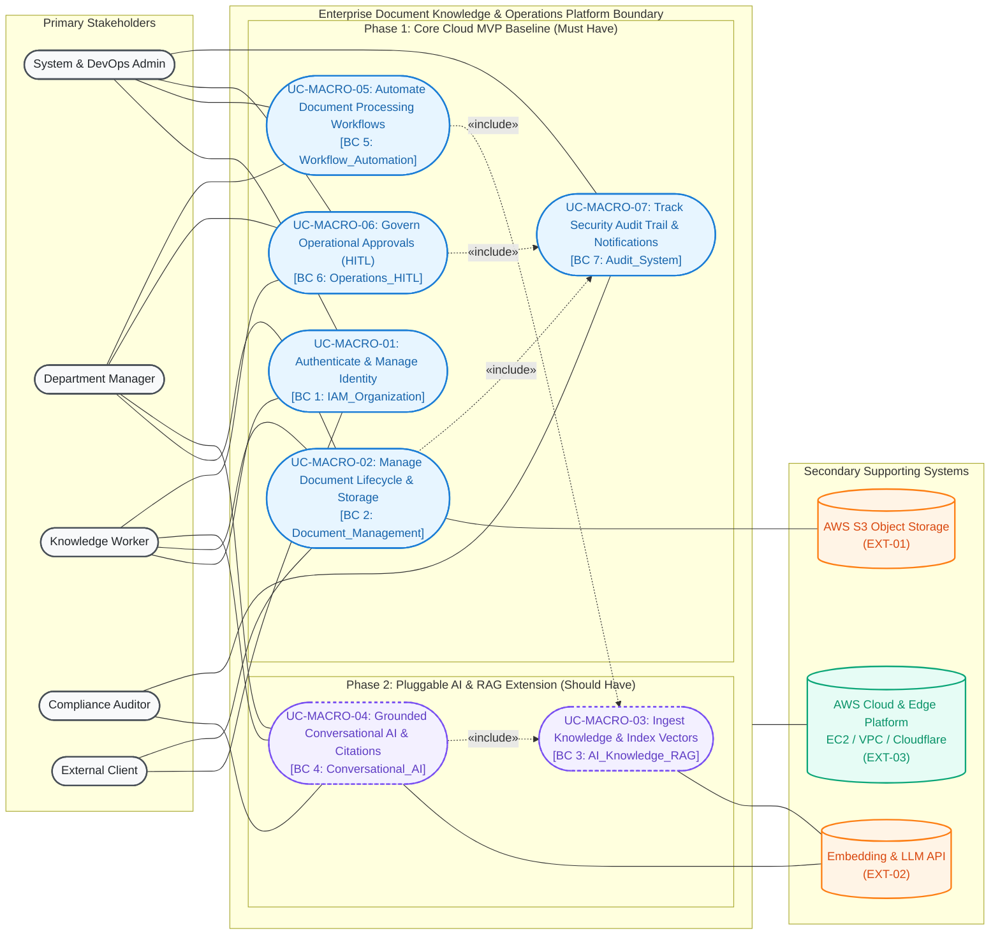

# Enterprise Document Knowledge & Operations Platform
## MVP Master Business Specification & Architecture Orchestrator

> **Document Role:** Master Orchestration & Executive Blueprint.
> Detailed domain specifications and requirements are modularized into dedicated **Source of Truth** files.

---

## 1. Executive Summary & Value Proposition

The **Enterprise Document Knowledge & Operations Platform** is a secure, cloud-native Knowledge Operating System and Workflow Automation Platform designed to eliminate enterprise information silos, enforce strict document access controls, maintain immutable compliance audits, and bridge governed operational actions on cloud infrastructure.

> [!IMPORTANT]
> **Strategic MVP Realignment (Fastest Path to Production on AWS Cloud):**
> Following academic and stakeholder review, **deploying production-grade, highly available, and secure AWS Cloud Infrastructure is prioritized as the primary MVP objective** over complex AI/RAG services. 
> The platform adopts a **Phased Delivery Strategy**:
> - **Phase 1 (Core MVP Target — Fastest Cloud Launch):** Production AWS Cloud Infrastructure (EC2, S3, Docker Compose v2, GitHub Actions CI/CD, Cloudflare SSL), Core Document Lifecycle Management, IAM/RBAC, 2-Phase Human-in-the-Loop (HITL) Approvals, and Immutable Audit Logging.
> - **Phase 2 (Pluggable Fast-Follow Extension):** Decoupled AI Knowledge & Hybrid RAG Microservice (pgvector HNSW, Reciprocal Rank Fusion, grounded citations, anti-hallucination guardrails).

```text
┌──────────────────────────────────────────────────────────────────────────────────────────────────┐
│                                 4 CRITICAL ENTERPRISE BOTTLENECKS                                │
├────────────────────────────────┬────────────────────────────────┬────────────────────────────────┤
│ 1. FRAGMENTED INFORMATION      │ 2. CLOUD DEPLOYMENT & SECURITY │ 3. ACTIONLESS READ-ONLY GAP    │
│ - Scattered across silos       │ - Lack of secure AWS cloud     │ - Systems are passive; no      │
│ - 20-30% work time lost        │   infrastructure & CI/CD       │   governed 2-phase HITL flows  │
├────────────────────────────────┴────────────────────────────────┴────────────────────────────────┤
│ 4. AI FABRICATION & LEAKAGE: Uncontrolled GenAI causes data leaks; requires governed cloud RAG   │
└──────────────────────────────────────────────────────────────────────────────────────────────────┘
```

### Core Value Propositions:
- **Cloud-Ready AWS Architecture:** Production-tested deployment on AWS (EC2, S3, Docker, GitHub Actions CI/CD, Cloudflare Edge) ensuring rapid deployment and low operational overhead.
- **Durable & Secure Document Storage:** AWS S3 integration with Server-Side Encryption (AES256), SHA-256 integrity verification, and presigned temporary URL access.
- **Zero Data Leakage:** Two-tier authorization enforcement with fine-grained Document Access Control Lists (ACLs) evaluated at the database layer.
- **Controlled Human-in-the-Loop Operations:** 2-phase approval state machine (Prepare / Diff Preview $\rightarrow$ Waiting Approval $\rightarrow$ Idempotent Commit).
- **Decoupled Pluggable AI Service:** Clean hexagonal architecture allowing AI & Hybrid RAG to plug in seamlessly as a Phase 2 extension without disrupting core cloud operations.

---

## 2. Specification Orchestration Map

All detailed requirements, models, and specifications reside in dedicated **Source of Truth** documents:

| Specification Domain | Source of Truth Document | Scope & Key Artifacts |
| :--- | :--- | :--- |
| **Problem & Business Scope** | [**`01_problem_and_business_scope.md`**](01_problem_and_business_scope.md) | 4 Bottlenecks, pain point matrix, problem boundaries, threat model, 5 value streams (including AWS Cloud Deployment), KPIs, operating invariants, and re-prioritized MoSCoW framework. |
| **Actors & RBAC Permissions** | [**`02_actor_matrix_and_rbac.md`**](02_actor_matrix_and_rbac.md) | 6 Human personas (`ACT-00` to `ACT-05`), Cloud Administrator, Machine & External System actors (`EXT-01: AWS S3`, `EXT-03: AWS Cloud Platform`), UML actor hierarchy, and fine-grained permissions matrix. |
| **Use Case Architecture** | [**`03_use_case_architecture.md`**](03_use_case_architecture.md) | OMG UML 2.5 conventions, Macro Context Diagram, Master Decomposed Global Architecture Map (7 Bounded Contexts, 20 use cases), and phased subsystem roadmaps. |
| **Domain Use Case Specifications** | [**`use_cases/`**](use_cases/) | 20 Formal use case specifications across 7 Bounded Contexts (Phase 1: IAM, DMS, Workflows, HITL, Audit; Phase 2: RAG, Conversational AI). |
| **Non-Functional Requirements** | [**`04_non_functional_requirements.md`**](04_non_functional_requirements.md) | Cloud Infrastructure & DevOps (AWS EC2, S3, CI/CD, Cloudflare), security (zero leakage, IAM profiles), reliability (append-only audit, idempotency), and performance. |
| **Requirements Traceability** | [**`05_requirements_traceability_matrix.md`**](05_requirements_traceability_matrix.md) | Full RTM linking Business Problems $\leftrightarrow$ Use Cases $\leftrightarrow$ DB Tables $\leftrightarrow$ API Endpoints $\leftrightarrow$ AWS Cloud Infrastructure $\leftrightarrow$ Phase Milestones. |
| **Engineering Handoff** | [**`06_engineering_handoff.md`**](06_engineering_handoff.md) | Cross-functional implementation guidelines for Cloud/DevOps (AWS/Docker/CI-CD), Backend (Spring Boot 3 / DDD), AI (FastAPI / pgvector), Frontend (React / Vite), and QA Testing. |

---

## 3. High-Level System Architecture & Macro Capabilities

The platform operates across **7 Bounded Contexts**, orchestrated on top of production-ready **AWS Cloud Infrastructure & Edge Network**:



---

## 4. Bounded Context Use Case Index & Phased Roadmap

To achieve the fastest path to production on AWS Cloud, use cases are scheduled across two deliberate delivery milestones:

### 4.1. Phase 1: Core Cloud MVP Baseline (Target: Immediate AWS Cloud Launch)
Focuses on deploying core business operations, secure multi-format document management, and cloud infrastructure:

| Bounded Context | Module File | Contained Use Case Specifications | Priority |
| :--- | :--- | :--- | :--- |
| **AWS Cloud Infrastructure** | [**`04_non_functional_requirements.md`**](04_non_functional_requirements.md#4-aws-cloud-infrastructure-deployment--devops-priority-must-have) | `REQ-CLOUD-01` to `REQ-CLOUD-04`: EC2 Containerization, S3 Integration, Cloudflare SSL, GitHub Actions CI/CD | **P0 (Must Have)** |
| **BC 1: IAM & Organization** | [`use_cases/01_iam_organization.md`](use_cases/01_iam_organization.md) | `UC-IAM-01`: User Login & JWT Session Management<br>`UC-IAM-02`: Multi-Role Assignment & Permission Management<br>`UC-IAM-03`: Department Setup & Internal Scoping | **P0 (Must Have)** |
| **BC 2: Document Management** | [`use_cases/02_document_management.md`](use_cases/02_document_management.md) | `UC-DOC-01`: Document Upload & AWS S3 Object Storage<br>`UC-DOC-02`: Manage Document Versioning<br>`UC-DOC-03`: Configure Document Access Control Matrix<br>`UC-DOC-04`: Document Soft Deletion | **P0 (Must Have)** |
| **BC 5: Workflow Automation** | [`use_cases/05_workflow_automation.md`](use_cases/05_workflow_automation.md) | `UC-WF-01`: Trigger-Based Workflow Pipeline Execution<br>`UC-WF-02`: Workflow Execution Monitoring | **P1 (Must Have)** |
| **BC 6: Operations & HITL** | [`use_cases/06_operations_hitl.md`](use_cases/06_operations_hitl.md) | `UC-HITL-01`: 2-Phase Action Approval Request & Preview<br>`UC-HITL-02`: Manager Action Review, Approval & Idempotent Commit<br>`UC-HITL-03`: Operational Exception Task Management | **P1 (Must Have)** |
| **BC 7: Audit & Notifications**| [`use_cases/07_audit_notifications.md`](use_cases/07_audit_notifications.md) | `UC-AUDIT-01`: Immutable Audit Trail Logging<br>`UC-AUDIT-02`: Real-time In-App Notifications | **P0 (Must Have)** |

### 4.2. Phase 2: Pluggable AI Knowledge & RAG Extension (Fast-Follow Phase)
Plugs into the existing AWS cloud platform as decoupled microservice extensions:

| Bounded Context | Module File | Contained Use Case Specifications | Priority |
| :--- | :--- | :--- | :--- |
| **BC 3: AI Knowledge & RAG** | [`use_cases/03_ai_knowledge_rag.md`](use_cases/03_ai_knowledge_rag.md) | `UC-RAG-01`: Document Ingestion & Vector Indexing<br>`UC-RAG-02`: Pre-filtered Hybrid RRF Search<br>`UC-RAG-03`: Anti-Hallucination Safe Abstention | **P2 (Should Have)** |
| **BC 4: Conversational AI** | [`use_cases/04_conversational_ai.md`](use_cases/04_conversational_ai.md) | `UC-CHAT-01`: Multi-Turn Conversational RAG with Grounded Citations<br>`UC-CHAT-02`: Evidence Citation Drill-Down & Verification<br>`UC-CHAT-03`: Token Usage & Confidence Tracking | **P2 (Should Have)** |

---

## 5. Non-Negotiable System Invariants

1. **Cloud Security & Zero Secret Exposure:** No AWS credentials, database passwords, or JWT secrets may be committed to version control. Infrastructure must rely on AWS IAM Instance Profiles or GitHub Actions injected environment secrets.
2. **Binary Storage Integrity & Encryption:** All uploaded documents must be stored in AWS S3 with Server-Side Encryption (AES256) and verified via SHA-256 integrity checksums.
3. **Pre-filtered Zero-Trust Data Retrieval:** Document ACLs must be evaluated directly at the SQL database layer before chunks or data records are exposed to users or external models ([`04_non_functional_requirements.md`](04_non_functional_requirements.md#nfr-sec-01)).
4. **2-Phase Human-in-the-Loop Approval:** Sensitive mutations cannot execute unilaterally; they require a staged diff preview and explicit manager approval with idempotent commit guarantees ([`use_cases/06_operations_hitl.md`](use_cases/06_operations_hitl.md#uc-hitl-01)).
5. **Append-Only Audit Immutability:** Audit records are strictly append-only; database users are blocked from updating or deleting rows in `audit_logs` ([`04_non_functional_requirements.md`](04_non_functional_requirements.md#nfr-rel-01)).
6. **Automated CI/CD Verifiable Deployment:** Every merge to `develop`/`main` must trigger an automated pipeline running unit/integration tests and deploying to AWS Cloud.

---

## 6. Cross-System Architectural References

- **AWS Cloud & Deployment Blueprint:** [`04_non_functional_requirements.md`](04_non_functional_requirements.md#4-aws-cloud-infrastructure-deployment--devops-priority-must-have)
- **AWS Zero-Cost & Enterprise Trade-Off Architecture:** [`../configurations/aws_zero_cost_deployment.md`](../configurations/aws_zero_cost_deployment.md)
- **Database Architecture & Schema:** [`../database/schema.dbml`](../database/schema.dbml) & [`../database/V1__init.md`](../database/V1__init.md)
- **Database Modular Schemas:** [`../database/modules/`](../database/modules/)
- **System Architecture Blueprint:** [`../architecture.md`](../architecture.md)
- **Multi-Tier Security & RAG Access Control:** [`../security_and_rag_access_control.md`](../security_and_rag_access_control.md)
