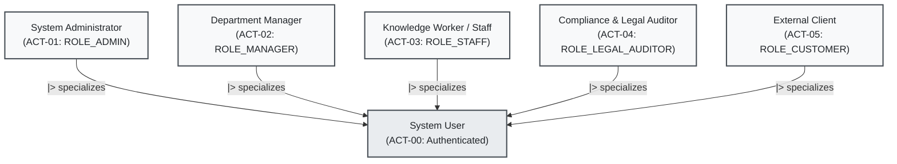
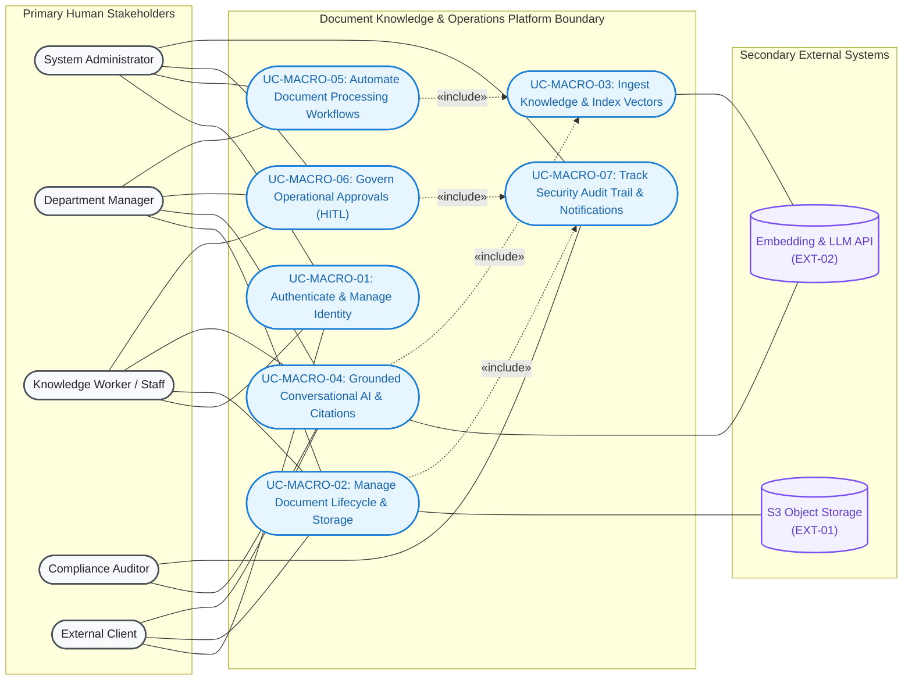
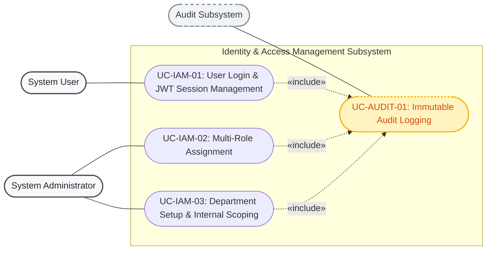
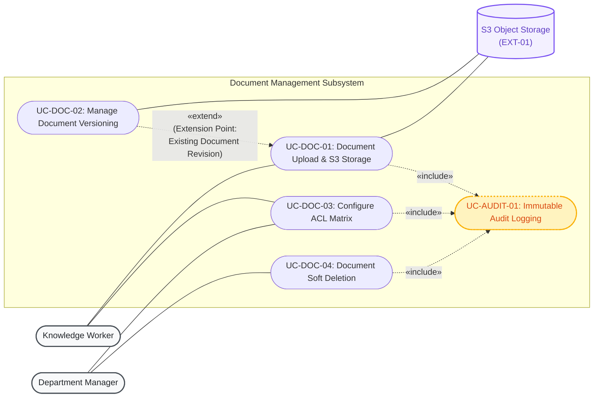
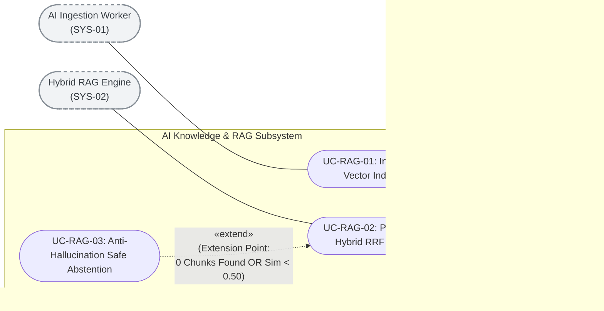
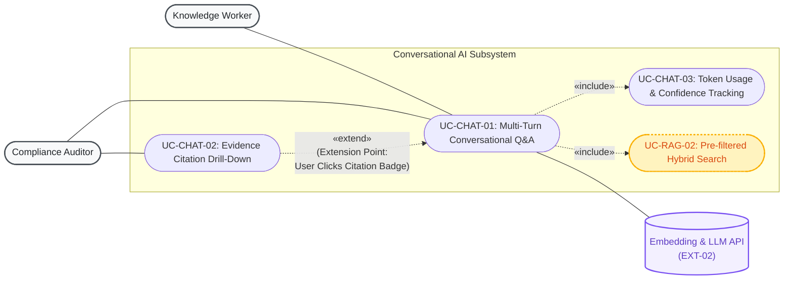
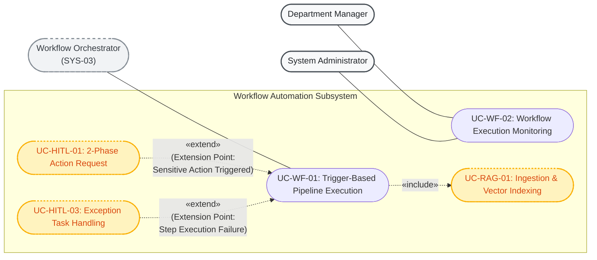
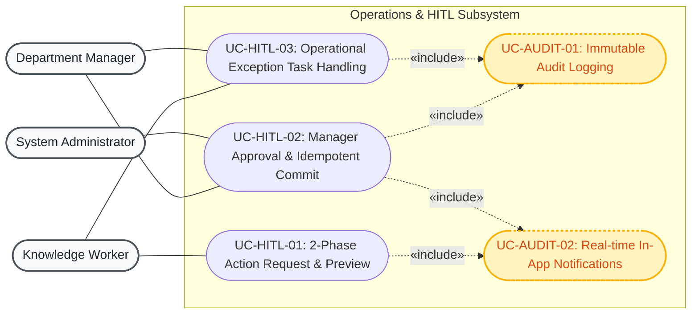
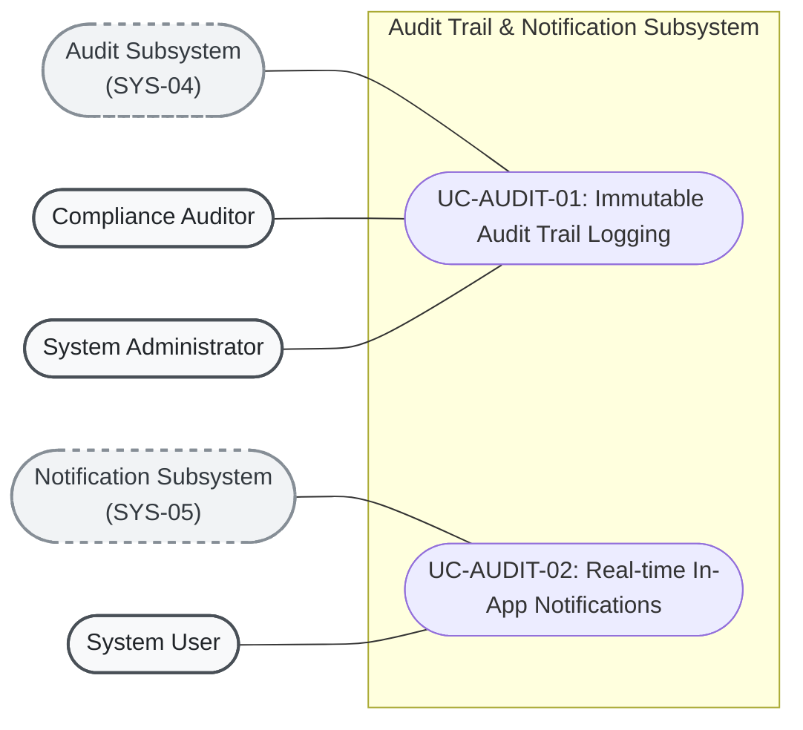

# Business Requirements & MVP Use Case Specifications
## Enterprise Document Knowledge & Operations Platform

---

## 1. Executive Summary & Business Context

### 1.1. Industry Context & 4 Core Enterprise Bottlenecks

In modern enterprises, the volume of internal documents—such as standard operating procedures (SOPs), policy manuals, technical specifications, financial reports, HR records, and legal contracts—is growing exponentially. However, extracting operational value from this knowledge base faces **4 critical bottlenecks**:

```text
┌─────────────────────────────────────────────────────────────────────────────────────────────────┐
│                                 4 CRITICAL ENTERPRISE BOTTLENECKS                                │
├────────────────────────────────┬────────────────────────────────┬───────────────────────────────┤
│ 1. FRAGMENTED INFORMATION      │ 2. DATA LEAKAGE & SECURITY     │ 3. AI HALLUCINATION           │
│ - Scattered across silos       │ - Off-the-shelf AI lacks ACL   │ - Ungrounded responses        │
│ - 20-30% work time lost        │ - High confidential leak risk  │ - Zero auditability/citation  │
├────────────────────────────────┴────────────────────────────────┴───────────────────────────────┤
│ 4. ACTIONLESS READ-ONLY AI: AI is passive and read-only, lacking safe Human-in-the-Loop workflows │
└─────────────────────────────────────────────────────────────────────────────────────────────────┘
```

1. **Fragmented Information & Knowledge Silos:** Institutional knowledge is scattered across cloud drives, email threads, local file servers, and internal chat platforms. Employees spend an average of 1.8 to 2.5 hours per day searching for and verifying operational information.
2. **Data Leakage & Missing Access Control (ACL) in AI:** Generic GenAI and LLM solutions lack document-level access control lists. When employees query an AI assistant, it risks retrieving and exposing confidential payroll, financial, or intellectual property data across organizational boundaries.
3. **AI Hallucination & Zero Auditability:** Language models frequently generate confident yet incorrect statements when ungrounded. Enterprises cannot rely on AI answers without verifiable, verbatim citations and exact page references for legal and operational compliance.
4. **Actionless Read-Only Bottleneck:** Existing AI assistants function purely as static question-answering engines. Enterprises lack an integrated mechanism to transform conversational insights into governed operational actions (e.g., publishing documents, executing approval workflows, modifying business records) with mandatory **Human-in-the-Loop (HITL)** safeguards.

---

### 1.2. Value Proposition

The **Document Knowledge & Operations Platform** is an **AI-powered Knowledge Operating System and Workflow Automation Platform** delivering the following core capabilities:

- **Zero Data Leakage:** Two-tier authorization enforcement. **Pre-filtered Retrieval** filters document permissions directly at the SQL database layer before context is passed to the AI model.
- **100% Grounded & Verifiable Citations:** Every AI response is backed by exact evidence citations (Document ID, Version Number, Page Number, Verbatim Snippet, and Semantic Similarity Score).
- **Sub-25ms Hybrid Search:** Combines Dense Semantic Search (HNSW Vector Cosine) and Sparse Lexical Search (BM25 / Full-Text Search) via Reciprocal Rank Fusion (RRF), achieving high recall with retrieval latency $< 25\text{ ms}$.
- **Controlled Human-in-the-Loop Operations:** A 2-phase approval state machine (Prepare / Diff Preview $\rightarrow$ Waiting Approval $\rightarrow$ Idempotent Commit) ensures high-risk actions are executed safely and idempotently.

---

### 1.3. MVP Scope Definition (MoSCoW Framework)

```text
┌──────────────────────────────────────────────────────────────────────────────────────────────────┐
│                                   MVP SCOPE BY MOSCOW CATEGORY                                   │
├─────────────────────────────────────────┬────────────────────────────────────────────────────────┤
│ MUST HAVE (Core MVP Baseline)           │ SHOULD HAVE (Post-MVP Enhancements)                    │
│ - JWT Authentication & Multi-Role RBAC  │ - Contextual follow-up question suggestions            │
│ - S3 File Storage Pointer & Versioning  │ - Export conversation transcript to PDF / Excel        │
│ - 4-Tier Document ACL Matrix            │ - Advanced metadata filtering (date range, tags)       │
│ - Ingestion Pipeline & pgvector Hybrid  │ - Responsive Dark/Light UI theme toggle                │
│ - Conversational RAG with Citations     ├────────────────────────────────────────────────────────┤
│ - Safe Abstention Guardrail             │ COULD / WONT HAVE (Future Roadmap)                     │
│ - 2-Phase HITL Action Approvals         │ - Advanced OCR for scanned tables and handwritten text │
│ - Immutable Audit Logging               │ - Distributed Tracing (OpenTelemetry) & Token Budgeting│
│ - Real-time In-App Notifications        │ - Auto-scaling Kubernetes deployment on AWS ECS/Fargate│
└─────────────────────────────────────────┴────────────────────────────────────────────────────────┘
```

---

## 2. Actor Matrix & Role-Based Access Control (RBAC)

### 2.1. Human Stakeholders & Personas

| Actor Code | Role Name | System Role (`roles`) | Responsibilities & Business Scope |
| :--- | :--- | :--- | :--- |
| **ACT-00** | **System User** | `Authenticated User` | Base abstract human actor authenticated with a valid JWT session; inherits baseline self-service profile and notification capabilities. |
| **ACT-01** | **System Administrator** | `ROLE_ADMIN` | Manages users, department hierarchy, system configurations, reviews full audit logs, and oversees high-level automated workflows. |
| **ACT-02** | **Department Manager** | `ROLE_MANAGER` | Manages department documents, reviews and approves/rejects sensitive operational actions (HITL Approvals), assigns and tracks operation tasks. |
| **ACT-03** | **Knowledge Worker / Staff** | `ROLE_STAFF` | Uploads documents, manages personal workspaces, queries the AI Assistant within granted ACL permissions, and submits action approval requests. |
| **ACT-04** | **Compliance & Legal Auditor** | `ROLE_LEGAL_AUDITOR` | Queries compliance documents, inspects verbatim AI citations against source materials, and examines immutable audit logs for compliance audits. |
| **ACT-05** | **External Client / Partner** | `ROLE_CUSTOMER` | Limited access to `PUBLIC` documents or specifically shared ACLs; prohibited from accessing internal department knowledge. |

---

### 2.2. Machine & Supporting System Actors

| Actor Code | System Actor Name | Technical Component | Automated Responsibilities |
| :--- | :--- | :--- | :--- |
| **SYS-01** | **AI Ingestion Worker** | `ai` (FastAPI Background Task) | Ingests uploaded files, extracts text, performs recursive chunking, computes 1536d embeddings, and writes HNSW vector & FTS indexes. |
| **SYS-02** | **Hybrid RAG Engine** | `ai` (FastAPI + pgvector + BM25 FTS) | Executes Pre-filtered SQL hybrid retrieval, computes RRF rankings, and prompts LLMs for grounded answers with citation badges. |
| **SYS-03** | **Workflow Orchestrator** | `backend` (Spring Boot App Service) | Coordinates multi-step document pipelines, handles event triggers, and transitions executions into `WAITING_APPROVAL` when required. |
| **SYS-04** | **Audit Subsystem** | `backend` (`@EventListener` & Interceptor)| Immutably records all authentication, CRUD mutations, ACL updates, and HITL decisions into the `audit_logs` table. |
| **SYS-05** | **Notification Subsystem**| `backend` (Notification Service) | Dispatches real-time in-app alerts and pending approval notifications to target users. |
| **EXT-01** | **S3 Object Storage** | AWS S3 / MinIO / Floci Storage | Remote cloud blob storage for binary files (PDF, DOCX, XLSX) and presigned download URLs. |
| **EXT-02** | **Embedding & LLM API** | OpenAI / Gemini API Provider | External AI foundation models for dense vector embeddings and conversational completions. |

---

### 2.3. Actor Hierarchy & Generalization

In UML standards, specialized human actors inherit general capabilities from the base `System User`:



---

### 2.4. Functional Permissions Matrix (Permissions vs. Roles)

Fine-grained permissions follow the standard format `<action>:<resource>` (stored in `permissions` and `role_permissions`):

| Permission Code | Business Meaning | `ADMIN` | `MANAGER` | `STAFF` | `LEGAL_AUDITOR` | `CUSTOMER` |
| :--- | :--- | :---: | :---: | :---: | :---: | :---: |
| `read:documents` | Search, view, and query available documents | Allowed | Allowed | Allowed | Allowed | Allowed *(Public)* |
| `write:documents` | Upload new documents and publish revisions | Allowed | Allowed | Allowed | - | - |
| `delete:documents` | Soft-delete documents from the workspace | Allowed | Allowed | - | - | - |
| `manage:permissions` | Grant or revoke document ACL access | Allowed | Allowed | Allowed *(Own docs)* | - | - |
| `manage:users` | Provision, deactivate, and assign user roles | Allowed | - | - | - | - |
| `manage:workflows` | Define and trigger automated workflows | Allowed | Allowed | - | - | - |
| `approve:actions` | Approve or reject sensitive HITL actions | Allowed | Allowed | - | - | - |
| `read:audit_logs` | Inspect system-wide security audit trail | Allowed | - | - | Allowed | - |

---

## 3. Use Case Modeling & Architectural Decomposition

### 3.1. Standard UML 2.5 Use Case Conventions & Notation Reference

To ensure strict compliance with **OMG UML 2.5 Use Case Modeling Standards**, the diagrams in this specification adhere to the following semantic rules:

```text
┌────────────────────────────────────────────────────────────────────────────────────────────────────────┐
│                                   UML USE CASE RELATIONSHIP STANDARDS                                  │
├───────────────────┬──────────────────────────────────┬─────────────────────────────────────────────────┤
│ Relationship Type │ UML Visual Syntax                │ Exact Standard Semantics & Rules                │
├───────────────────┼──────────────────────────────────┼─────────────────────────────────────────────────┤
│ Association       │ Actor ──── UseCase               │ Solid line representing communication.          │
│                   │                                  │ Actors are outside the system boundary.         │
├───────────────────┼──────────────────────────────────┼─────────────────────────────────────────────────┤
│ «include»         │ BaseUseCase -. «include» .->     │ Mandatory execution. The Base Use Case ALWAYS   │
│                   │ IncludedUseCase                  │ calls the Included Use Case. Arrow points       │
│                   │                                  │ FROM Base TO Included (Base -> Included).       │
├───────────────────┼──────────────────────────────────┼─────────────────────────────────────────────────┤
│ «extend»          │ ExtensionUseCase -. «extend» .-> │ Conditional / optional execution. The Extension │
│                   │ BaseUseCase                      │ Use Case augments the Base Use Case under a     │
│                   │                                  │ specific Extension Point/Condition. Arrow points│
│                   │                                  │ FROM Extension TO Base (Extension -> Base).     │
├───────────────────┼──────────────────────────────────┼─────────────────────────────────────────────────┤
│ Generalization    │ SubActor ───|> BaseActor         │ Inheritance of roles or use cases. Solid line   │
│                   │ ChildUC ───|> ParentUC           │ with closed triangular arrow pointing to parent.│
└───────────────────┴──────────────────────────────────┴─────────────────────────────────────────────────┘
```

> [!IMPORTANT]
> **Strict UML Modeling Rules Applied:**
> 1. **Direction of `«include»`:** Points from the base use case to the included use case (`Base -. "«include»" .-> Included`).
> 2. **Direction of `«extend»`:** Points from the extending use case to the base use case (`Extension -. "«extend»" .-> Base`).
> 3. **No Non-Standard Stereotypes:** Deprecated custom stereotypes (such as `<<persists>>`, `<<calls>>`, `<<trigger>>`, `<<acts on>>`) are strictly replaced with standard UML Actor Associations or valid `«include»`/`«extend»` relationships.
> 4. **External Systems as Actors:** Third-party providers (`S3 Storage`, `LLM API`) are modeled as Secondary Actors outside the system boundary with solid association lines (`UseCase ──── SystemActor`).

---

### 3.2. High-Level Context Use Case Diagram (Macro Capabilities)

The context use case diagram captures the high-level system boundary, primary human actors, secondary external systems, and macro-level capabilities:



---

### 3.3. Master Decomposed Use Case Map (Global Architecture)

The macro capabilities are decomposed into **20 concrete functional use cases** organized across **7 Bounded Contexts**, featuring fully standardized `«include»` and `«extend»` relationships with explicit condition points:

```mermaid
flowchart TB
    %% Human Actors
    Admin(["System Admin"]):::actor
    Manager(["Department Manager"]):::actor
    Staff(["Knowledge Worker"]):::actor
    Auditor(["Compliance Auditor"]):::actor

    %% System Actors
    Worker(["AI Ingestion Worker"]):::sysactor
    Engine(["Hybrid RAG Engine"]):::sysactor
    Orchestrator(["Workflow Orchestrator"]):::sysactor
    AuditSub(["Audit Subsystem"]):::sysactor

    %% Bounded Context 1: IAM
    subgraph BC_IAM ["1. Identity & Access Management (IAM)"]
        UC_IAM_01(["UC-IAM-01: User Login & JWT Session"])
        UC_IAM_02(["UC-IAM-02: Multi-Role Assignment"])
        UC_IAM_03(["UC-IAM-03: Department Scoping"])
    end

    %% Bounded Context 2: Document Management
    subgraph BC_DOC ["2. Document Management (DMS)"]
        UC_DOC_01(["UC-DOC-01: Document Upload & S3 Storage"])
        UC_DOC_02(["UC-DOC-02: Manage Document Versioning"])
        UC_DOC_03(["UC-DOC-03: Configure ACL Matrix"])
        UC_DOC_04(["UC-DOC-04: Document Soft Deletion"])
    end

    %% Bounded Context 3: AI Knowledge & RAG
    subgraph BC_RAG ["3. AI Knowledge & Hybrid RAG"]
        UC_RAG_01(["UC-RAG-01: Ingestion & Vector Indexing"])
        UC_RAG_02(["UC-RAG-02: Pre-filtered Hybrid Search"])
        UC_RAG_03(["UC-RAG-03: Anti-Hallucination Safe Abstention"])
    end

    %% Bounded Context 4: Conversational AI
    subgraph BC_CHAT ["4. Conversational AI"]
        UC_CHAT_01(["UC-CHAT-01: Multi-Turn Conversational Q&A"])
        UC_CHAT_02(["UC-CHAT-02: Citation Drill-Down & Verification"])
        UC_CHAT_03(["UC-CHAT-03: Token Usage & Confidence Tracking"])
    end

    %% Bounded Context 5: Workflow Automation
    subgraph BC_WF ["5. Workflow Automation"]
        UC_WF_01(["UC-WF-01: Trigger-Based Pipeline Execution"])
        UC_WF_02(["UC-WF-02: Workflow Execution Monitoring"])
    end

    %% Bounded Context 6: Operations & HITL
    subgraph BC_HITL ["6. Operations & Human-In-The-Loop"]
        UC_HITL_01(["UC-HITL-01: 2-Phase Action Request & Preview"])
        UC_HITL_02(["UC-HITL-02: Manager Approval & Idempotent Commit"])
        UC_HITL_03(["UC-HITL-03: Operational Exception Task Handling"])
    end

    %% Bounded Context 7: Audit & Notifications
    subgraph BC_AUDIT ["7. Audit Trail & Notifications"]
        UC_AUDIT_01(["UC-AUDIT-01: Immutable Audit Trail Logging"])
        UC_AUDIT_02(["UC-AUDIT-02: Real-time In-App Notifications"])
    end

    %% Actor to Use Case Associations
    Admin --- UC_IAM_02
    Admin --- UC_IAM_03
    Admin --- UC_WF_02
    Admin --- UC_AUDIT_01
    Admin --- UC_HITL_02

    Staff --- UC_IAM_01
    Staff --- UC_DOC_01
    Staff --- UC_DOC_03
    Staff --- UC_CHAT_01
    Staff --- UC_HITL_01
    Staff --- UC_HITL_03

    Manager --- UC_DOC_03
    Manager --- UC_DOC_04
    Manager --- UC_HITL_02
    Manager --- UC_HITL_03
    Manager --- UC_WF_02

    Auditor --- UC_CHAT_02
    Auditor --- UC_AUDIT_01

    Worker --- UC_RAG_01
    Engine --- UC_RAG_02
    Orchestrator --- UC_WF_01
    AuditSub --- UC_AUDIT_01

    %% Standard UML Include Relationships (Base -> Included)
    UC_CHAT_01 -. "«include»" .-> UC_RAG_02
    UC_CHAT_01 -. "«include»" .-> UC_CHAT_03
    UC_WF_01 -. "«include»" .-> UC_RAG_01
    UC_IAM_01 -. "«include»" .-> UC_AUDIT_01
    UC_DOC_01 -. "«include»" .-> UC_AUDIT_01
    UC_DOC_03 -. "«include»" .-> UC_AUDIT_01
    UC_DOC_04 -. "«include»" .-> UC_AUDIT_01
    UC_HITL_01 -. "«include»" .-> UC_AUDIT_02
    UC_HITL_02 -. "«include»" .-> UC_AUDIT_01
    UC_HITL_02 -. "«include»" .-> UC_AUDIT_02

    %% Standard UML Extend Relationships (Extension -> Base)
    UC_DOC_02 -. "«extend»\n(On Existing Document)" .-> UC_DOC_01
    UC_RAG_03 -. "«extend»\n(On 0 Chunks Found)" .-> UC_RAG_02
    UC_CHAT_02 -. "«extend»\n(On Citation Click)" .-> UC_CHAT_01
    UC_HITL_01 -. "«extend»\n(On Sensitive Action)" .-> UC_WF_01
    UC_HITL_03 -. "«extend»\n(On Pipeline Failure)" .-> UC_WF_01

    classDef actor fill:#f8f9fa,stroke:#495057,stroke-width:2px,color:#212529;
    classDef sysactor fill:#f1f3f5,stroke:#868e96,stroke-width:2px,stroke-dasharray: 5 5,color:#343a40;
```



---

### 3.4. Subsystem Use Case Diagrams by Bounded Context

---

#### Diagram 1: Identity & Access Management (`IAM_Organization`)



---

#### Diagram 2: Document Management & Access Control (`Document_Management`)



---

#### Diagram 3: AI Knowledge & Hybrid Retrieval (`AI_Knowledge_RAG`)



---

#### Diagram 4: Conversational AI & Citations (`Conversational_AI`)



---

#### Diagram 5: Workflow Automation (`Workflow_Automation`)



---

#### Diagram 6: Operations & Human-In-The-Loop (`Operations_HITL`)



---

#### Diagram 7: Audit Subsystem & Notifications (`Audit_System`)



---

## 4. Detailed MVP Use Case Specifications

---

### Bounded Context 1: Identity & Access Management (`IAM_Organization`)

---

#### Use Case Specification: `UC-IAM-01`
- **Use Case Name:** User Login & JWT Session Lifecycle Management
- **Stereotype:** Base Use Case
- **Actor(s):** System User (primary), Authentication Subsystem (secondary)
- **Includes:** `UC-AUDIT-01` (Immutable Audit Trail Logging)
- **Extends / Extended By:** None
- **Summary Description:** Authenticates users via email and password, issuing a stateless short-lived JWT Access Token and a long-lived Refresh Token with user permissions.
- **Priority:** Must Have
- **Status:** Complete Specification
- **Pre-Condition:**
  1. User account exists in the `users` table.
  2. User account is active (`enabled = TRUE`).
  3. Authentication Service is operational.
- **Post-Condition(s):**
  1. User receives a valid JWT Access Token and Refresh Token.
  2. Active session record is created in `refresh_tokens`.
  3. Immutable audit log entry with action `LOGIN` and status `SUCCESS` is recorded in `audit_logs` via `UC-AUDIT-01`.
- **Basic Path:**
  1. The user inputs email and password on the login screen.
  2. The user submits the login form.
  3. The Backend API validates payload formats and queries the `users` table.
  4. The Backend API resolves user roles (`user_roles`) and permissions (`role_permissions`).
  5. The Backend API verifies the provided password against the BCrypt hash.
  6. The Backend API creates a JWT Access Token containing `userId`, `departmentId`, `roleIds`, `isInternal`, and `permissions`.
  7. The Backend API generates an opaque secure Refresh Token.
  8. The Backend API inserts the Refresh Token into `refresh_tokens`.
  9. The Backend API invokes `UC-AUDIT-01` to write a successful `LOGIN` record to `audit_logs`.
  10. The Backend API returns HTTP 200 OK with tokens and user profile.
  11. The frontend client securely stores the tokens and redirects to the workspace.
- **Alternative Paths:**
  - 3a. Invalid email format: System returns HTTP 400 Bad Request.
  - 5a. Incorrect password: System increments failed attempt counter, invokes `UC-AUDIT-01` with action `LOGIN_FAILED`, and returns HTTP 401 Unauthorized.
  - 5b. Account disabled (`enabled = FALSE`): System returns HTTP 403 Forbidden ("Account is deactivated").
  - *a. Database connectivity outage: System returns HTTP 503 Service Unavailable without exposing internal traces.
- **Business Rules:**
  - B1: Password must be verified using BCrypt with work factor $\ge 12$.
  - B2: Access Token expiration must be short-lived (1 hour in production, 24 hours in dev).
  - B3: Refresh Token has a 30-day lifetime and supports immediate revocation (`revoked = TRUE`).
  - B4: Account is temporarily locked after 5 consecutive failed login attempts within 15 minutes.
- **Non-Functional Requirements:**
  - NF1: Authentication response time must be $< 200\text{ ms}$.
  - NF2: JWT secret key must be minimum 256-bit (HS256) or 512-bit (HS512), managed via environment secrets.
  - NF3: Passwords in transit must use HTTPS/TLS 1.3 encryption.

---

#### Use Case Specification: `UC-IAM-02`
- **Use Case Name:** Multi-Role Assignment & Permission Management
- **Stereotype:** Base Use Case
- **Actor(s):** System Administrator (`ROLE_ADMIN`) (primary), IAM Subsystem (secondary)
- **Includes:** `UC-AUDIT-01` (Immutable Audit Trail Logging)
- **Extends / Extended By:** None
- **Summary Description:** Enables system administrators to assign multiple roles and fine-grained permissions to users to reflect real organizational responsibilities.
- **Priority:** Must Have
- **Status:** Complete Specification
- **Pre-Condition:**
  1. Administrator is authenticated and possesses `manage:users` permission.
  2. Target user and roles exist in the database.
- **Post-Condition(s):**
  1. Updated role associations are committed to `user_roles`.
  2. Target user's subsequent token refreshes inherit updated permissions.
  3. Audit log entry with action `ASSIGN_ROLES` is appended via `UC-AUDIT-01`.
- **Basic Path:**
  1. The administrator opens the User Management console.
  2. The administrator selects a target user account.
  3. The system displays current roles, department, and granted permissions.
  4. The administrator updates assigned roles (e.g., adding `ROLE_MANAGER`).
  5. The administrator submits the role modification.
  6. The system verifies administrator authorization.
  7. The system updates the `user_roles` associations in a database transaction.
  8. The system invokes `UC-AUDIT-01` to record the change in `audit_logs`.
  9. The system returns HTTP 200 OK with the updated profile.
- **Alternative Paths:**
  - 4a. Administrator attempts to revoke their own `ROLE_ADMIN` role: System rejects with HTTP 400 Bad Request to prevent administrative lockout.
  - 6a. User lacks `manage:users` permission: System returns HTTP 403 Forbidden.
- **Business Rules:**
  - B1: Effective permissions equal the mathematical UNION of all permissions across all assigned roles.
  - B2: Every user must maintain at least one active role.
- **Non-Functional Requirements:**
  - NF1: Role update transaction execution time $< 100\text{ ms}$.
  - NF2: All permission mutations must capture before/after snapshots in audit logs.

---

#### Use Case Specification: `UC-IAM-03`
- **Use Case Name:** Department Setup & Internal Employee Verification
- **Stereotype:** Base Use Case
- **Actor(s):** System Administrator (`ROLE_ADMIN`) (primary), IAM Subsystem (secondary)
- **Includes:** `UC-AUDIT-01` (Immutable Audit Trail Logging)
- **Extends / Extended By:** None
- **Summary Description:** Configures organizational departments and manages the `is_internal` status of users to govern default data isolation boundaries.
- **Priority:** Must Have
- **Status:** Complete Specification
- **Pre-Condition:**
  1. Administrator is authenticated with `ROLE_ADMIN`.
- **Post-Condition(s):**
  1. Department record created or updated in `departments`.
  2. User's `department_id` and `is_internal` flag updated in `users`.
  3. Audit log entry committed via `UC-AUDIT-01`.
- **Basic Path:**
  1. Administrator submits department details (code, name, description).
  2. System validates that department code is unique.
  3. System saves department record in `departments`.
  4. Administrator assigns users to the department and sets `is_internal = TRUE/FALSE`.
  5. System persists user updates and invokes `UC-AUDIT-01` to record the audit log.
- **Alternative Paths:**
  - 2a. Duplicate department code: System returns HTTP 409 Conflict.
- **Business Rules:**
  - B1: Users with `is_internal = FALSE` cannot access `INTERNAL` or `RESTRICTED` documents.
  - B2: Department code must be uppercase alphanumeric (e.g., `HR`, `FIN`, `IT`, `LEGAL`).
- **Non-Functional Requirements:**
  - NF1: Database foreign key constraints must guarantee referential integrity.

---

### Bounded Context 2: Document Management (`Document_Management`)

---

#### Use Case Specification: `UC-DOC-01`
- **Use Case Name:** Document Upload & S3 Object Storage
- **Stereotype:** Base Use Case
- **Actor(s):** Knowledge Worker / Staff (`ROLE_STAFF`) (primary), S3 Storage (`EXT-01`) (secondary)
- **Includes:** `UC-AUDIT-01` (Immutable Audit Trail Logging)
- **Extended By:** `UC-DOC-02` (Manage Document Versioning) at Extension Point `Existing Document Revision`
- **Summary Description:** Uploads raw document files (PDF, DOCX, TXT, XLSX), stores binaries on S3/Floci, computes SHA-256 integrity checksums, creates Version 1 metadata in PostgreSQL, and triggers background AI ingestion.
- **Priority:** Must Have
- **Status:** Complete Specification
- **Pre-Condition:**
  1. User is authenticated with `write:documents` permission.
  2. Object Storage (S3/Floci) is accessible.
- **Post-Condition(s):**
  1. Binary file is saved in S3 at `documents/{doc_id}/v1/{file_name}`.
  2. Record created in `documents` with `current_version = 1` and `processing_status = 'PENDING'`.
  3. Version 1 record created in `document_versions`.
  4. Domain event `DocumentUploadedEvent` is emitted to trigger async processing.
  5. Audit log recorded via `UC-AUDIT-01`.
- **Basic Path:**
  1. User selects a local file and inputs title, description, and security access level.
  2. Client submits a `multipart/form-data` request to `POST /api/v1/documents`.
  3. Backend validates file type, MIME type, and file size ($\le 50\text{ MB}$).
  4. Backend computes the SHA-256 checksum of the incoming stream.
  5. Backend uploads the binary stream to S3 Object Storage (`EXT-01`).
  6. Backend inserts a new row into the `documents` table.
  7. Backend inserts a new row into `document_versions` table referencing Version 1.
  8. Backend publishes `DocumentUploadedEvent` to trigger automated processing (`UC-WF-01`).
  9. Backend invokes `UC-AUDIT-01` to record `UPLOAD_DOC` event in `audit_logs`.
  10. Backend returns HTTP 201 Created with document metadata.
- **Alternative Paths:**
  - 3a. Unsupported file extension: System returns HTTP 415 Unsupported Media Type.
  - 3b. File size exceeds 50MB: System returns HTTP 413 Payload Too Large.
  - 5a. S3 upload failure/timeout: Transaction rolls back, temporary file deleted, returns HTTP 502 Bad Gateway.
- **Business Rules:**
  - B1: Binary BLOBs are strictly prohibited in PostgreSQL; only S3 storage pointers are stored.
  - B2: Default access level is `INTERNAL` scoped to the uploader's department.
  - B3: Checksum SHA-256 must be verified to prevent corrupted uploads.
- **Non-Functional Requirements:**
  - NF1: Upload processing overhead (excluding network transfer) $< 500\text{ ms}$.
  - NF2: SHA-256 hash must be computed in a streaming fashion without loading entire large files into JVM heap.

---

#### Use Case Specification: `UC-DOC-02`
- **Use Case Name:** Manage Document Versioning
- **Stereotype:** Extension Use Case
- **Actor(s):** Document Owner / Manager (primary), S3 Storage (`EXT-01`) (secondary)
- **Extends:** `UC-DOC-01` (Document Upload & S3 Object Storage)
- **Extension Point:** `Existing Document Revision Upload`
- **Condition:** Executed when the user uploads a replacement revision for an existing document record rather than creating a new document.
- **Includes:** `UC-AUDIT-01` (Immutable Audit Trail Logging)
- **Summary Description:** Allows authors to upload updated revisions of an existing document, creating immutable historical snapshots in `document_versions` while updating the active pointer in `documents`.
- **Priority:** Must Have
- **Status:** Complete Specification
- **Pre-Condition:**
  1. User has `write:documents` permission and owns the document or has `EDIT` ACL.
  2. Parent document exists and is not soft-deleted.
- **Post-Condition(s):**
  1. New version record created with `version_number = current_version + 1`.
  2. `documents.current_version` points to the new version.
  3. Historical version records remain intact and immutable.
- **Basic Path:**
  1. User selects "Upload New Version" on the document details page.
  2. User provides new file and change summary note (`change_summary`).
  3. Backend verifies user's edit permissions on the document.
  4. Backend uploads new file to S3 under `documents/{doc_id}/v{next_version}/{file_name}`.
  5. Backend creates a new record in `document_versions`.
  6. Backend updates `documents.current_version`, `storage_key`, `checksum_sha256`, and sets `processing_status = 'PENDING'`.
  7. Backend emits `DocumentVersionCreatedEvent` for re-indexing.
  8. Backend invokes `UC-AUDIT-01` to record version update in `audit_logs`.
  9. Returns HTTP 200 OK with new version details.
- **Alternative Paths:**
  - 3a. User lacks edit permission on this document: Returns HTTP 403 Forbidden.
- **Business Rules:**
  - B1: Historical versions in `document_versions` are immutable and cannot be overwritten.
  - B2: Chunks and embeddings are bound to specific `document_version_id` to prevent version mismatch.
- **Non-Functional Requirements:**
  - NF1: Version transition must be ACID-compliant with zero downtime for readers.

---

#### Use Case Specification: `UC-DOC-03`
- **Use Case Name:** Configure Document Access Control Matrix
- **Stereotype:** Base Use Case
- **Actor(s):** Document Owner / Manager (primary), IAM Subsystem (secondary)
- **Includes:** `UC-AUDIT-01` (Immutable Audit Trail Logging)
- **Extends / Extended By:** None
- **Summary Description:** Configures the 4-tier security classification (`PUBLIC`, `INTERNAL`, `RESTRICTED`, `CONFIDENTIAL`) and explicit ACL entries for users, departments, and roles.
- **Priority:** Must Have
- **Status:** Complete Specification
- **Pre-Condition:**
  1. User is the document uploader, department manager, or system admin.
  2. Target document exists and is active.
- **Post-Condition(s):**
  1. `documents.access_level` is updated.
  2. Records in `document_user_access`, `document_department_access`, and/or `document_role_access` are inserted or removed.
  3. Pre-filtered RAG search immediately reflects updated visibility rules.
- **Basic Path:**
  1. Document owner opens Access Control settings modal.
  2. Owner sets security classification (`PUBLIC`, `INTERNAL`, `RESTRICTED`, or `CONFIDENTIAL`).
  3. For `CONFIDENTIAL` or granular access, owner adds explicit user, department, or role permissions (`VIEW`, `EDIT`, `ADMIN`).
  4. Owner submits access control configuration.
  5. Backend validates permissions and updates ACL tables in a single transaction.
  6. Backend invokes `UC-AUDIT-01` to log `UPDATE_ACL` in `audit_logs`.
  7. System returns HTTP 200 OK.
- **Alternative Paths:**
  - 1a. User is not owner and lacks `manage:permissions`: Returns HTTP 403 Forbidden.
- **Business Rules (Document Access Matrix):**
  - B1: `PUBLIC` is readable by all authenticated users.
  - B2: `INTERNAL` is readable only if `user.is_internal = TRUE`.
  - B3: `RESTRICTED` is readable only if `user.department_id = document.department_id`.
  - B4: `CONFIDENTIAL` requires explicit ACL in `document_user_access`, `document_department_access`, or `document_role_access`, or uploader ownership.
- **Non-Functional Requirements:**
  - NF1: ACL updates must take immediate effect across all AI search queries without cache delay.

---

#### Use Case Specification: `UC-DOC-04`
- **Use Case Name:** Document Soft Deletion
- **Stereotype:** Base Use Case
- **Actor(s):** Document Owner / Admin (primary)
- **Includes:** `UC-AUDIT-01` (Immutable Audit Trail Logging)
- **Extends / Extended By:** None
- **Summary Description:** Soft-deletes a document by populating `deleted_at`, instantly removing it from search results and RAG retrieval pipelines while preserving audit integrity.
- **Priority:** Must Have
- **Status:** Complete Specification
- **Pre-Condition:**
  1. User has `delete:documents` permission or owns the document.
- **Post-Condition(s):**
  1. `documents.deleted_at` timestamp is set to `CURRENT_TIMESTAMP`.
  2. Document is hidden from standard API listings and excluded from vector retrieval.
- **Basic Path:**
  1. User clicks "Delete Document" and confirms action.
  2. Backend sets `deleted_at = CURRENT_TIMESTAMP` in `documents`.
  3. Backend invokes `UC-AUDIT-01` to record `DELETE_DOC` in `audit_logs`.
  4. Returns HTTP 204 No Content.
- **Alternative Paths:**
  - 1a. Document already deleted: Returns HTTP 404 Not Found.
- **Business Rules:**
  - B1: Physical database records and S3 files are retained for compliance retention periods.
  - B2: All SQL queries and RAG retrieval queries must enforce `WHERE deleted_at IS NULL`.
- **Non-Functional Requirements:**
  - NF1: Deletion exclusion in queries must use index filter `WHERE deleted_at IS NULL` to ensure zero performance degradation.

---

### Bounded Context 3: AI Knowledge & Hybrid RAG (`AI_Knowledge_RAG`)

---

#### Use Case Specification: `UC-RAG-01`
- **Use Case Name:** Document Ingestion & Vector Indexing
- **Stereotype:** Base / Included Use Case
- **Actor(s):** AI Ingestion Worker (`SYS-01`) (primary), S3 (`EXT-01`) & Embedding Provider (`EXT-02`) (secondary)
- **Includes:** None
- **Extends / Extended By:** None (Included by `UC-WF-01`)
- **Summary Description:** Asynchronously extracts textual content from uploaded document versions, partitions content into recursive semantic chunks with page metadata, computes 1536-dimensional embeddings, and writes HNSW vector and GIN tsvector indexes into PostgreSQL.
- **Priority:** Must Have
- **Status:** Complete Specification
- **Pre-Condition:**
  1. Document version exists in `PENDING` state with binary file available on S3.
  2. AI Microservice (FastAPI) is healthy and connected to embedding provider.
- **Post-Condition(s):**
  1. Extracted chunks are stored in `document_chunks` with `embedding` and `tsv` data.
  2. Document status transitions to `INDEXED` (or `FAILED` upon error).
- **Basic Path:**
  1. Ingestion Worker picks up pending ingestion job.
  2. Worker downloads document binary from S3 (`EXT-01`).
  3. Worker extracts raw text and structural metadata (page numbers, section headers).
  4. Worker splits text using recursive character chunking (`chunk_size = 500-1000 tokens`, `overlap = 50-100 tokens`).
  5. Worker generates 1536-dimensional dense vector embeddings via Embedding API (`EXT-02`).
  6. Worker inserts chunk records into `document_chunks` with `embedding` and `to_tsvector('simple', content)`.
  7. Worker updates `documents.processing_status = 'INDEXED'`.
  8. Worker logs completion metrics (chunk count, duration, token usage).
- **Alternative Paths:**
  - 3a. Corrupted or encrypted PDF: Extraction fails, `documents.processing_status` set to `FAILED`, error recorded in `operation_tasks`.
  - 5a. Embedding API timeout/rate limit: Worker retries with exponential backoff up to 3 times before failing gracefully.
- **Business Rules:**
  - B1: Chunk tokens must not exceed embedding model context limits.
  - B2: Every chunk must store its source `page_number` for citation verification.
- **Non-Functional Requirements:**
  - NF1: 20-page standard PDF document ingestion must complete within $< 5\text{ seconds}$.
  - NF2: Vector index must use `hnsw` with `vector_cosine_ops`.

---

#### Use Case Specification: `UC-RAG-02`
- **Use Case Name:** Pre-filtered Hybrid RRF Search
- **Stereotype:** Base / Included Use Case
- **Actor(s):** Hybrid RAG Engine (`SYS-02`) (primary), Embedding API (`EXT-02`) (secondary)
- **Includes:** None
- **Extended By:** `UC-RAG-03` (Anti-Hallucination Safe Abstention) at Extension Point `Zero Accessible Knowledge Found`
- **Summary Description:** Executes unified hybrid retrieval combining Dense Vector Search (HNSW Cosine) and Sparse Lexical Search (BM25/FTS) with strict SQL-level pre-filtering against user security context, merging rankings via Reciprocal Rank Fusion (RRF).
- **Priority:** Must Have
- **Status:** Complete Specification
- **Pre-Condition:**
  1. Incoming search request contains valid `query` and authenticated `user_context` (`user_id`, `department_id`, `role_ids`, `is_internal`).
  2. Chunks exist in `document_chunks` with valid embeddings and `tsv` vectors.
- **Post-Condition(s):**
  1. Returns Top-K relevant chunks strictly belonging to documents the user is authorized to read.
  2. Zero data leakage across department or security classification boundaries.
- **Basic Path:**
  1. Search Engine receives query string and user security context.
  2. Search Engine generates query embedding vector via Embedding API (`EXT-02`).
  3. Search Engine executes single SQL query combining vector cosine distance (`<=>`), full-text search (`tsv @@ plainto_tsquery`), and ACL `WHERE` clauses.
  4. Search Engine computes Reciprocal Rank Fusion (RRF) score:
     $$\text{RRF}(d) = \frac{1}{60 + \text{Rank}_{\text{dense}}(d)} + \frac{1}{60 + \text{Rank}_{\text{sparse}}(d)}$$
  5. Search Engine sorts candidate chunks by RRF score and takes Top-K ($K = 5$).
  6. Returns structured chunk results with content, document ID, title, page number, and similarity score.
- **Alternative Paths:**
  - 3a. User has access to 0 matching documents or similarity $< 0.50$: Activates `UC-RAG-03` extension.
- **Business Rules (Pre-filtering Guarantee):**
  - B1: Pre-filtering is mandatory at the SQL layer; Post-filtering in application code is strictly forbidden.
  - B2: Documents marked `deleted_at IS NOT NULL` are excluded unconditionally.
- **Non-Functional Requirements:**
  - NF1: Query execution latency across 100,000 chunks must be $< 25\text{ ms}$.
  - NF2: Zero data leakage rate: $100\%$ precision in access barrier enforcement.

---

#### Use Case Specification: `UC-RAG-03`
- **Use Case Name:** Anti-Hallucination Safe Abstention
- **Stereotype:** Extension Use Case
- **Actor(s):** Hybrid RAG Engine (`SYS-02`) (primary)
- **Extends:** `UC-RAG-02` (Pre-filtered Hybrid RRF Search)
- **Extension Point:** `Zero Accessible Knowledge Found`
- **Condition:** Executed when Pre-filtered retrieval returns 0 accessible chunks or top chunk cosine similarity is $< 0.50$.
- **Includes:** None
- **Summary Description:** Intercepts out-of-scope or unauthorized queries when zero relevant accessible chunks are retrieved, returning a standardized abstention message rather than generating ungrounded responses.
- **Priority:** Must Have
- **Status:** Complete Specification
- **Pre-Condition:**
  1. Pre-filtered retrieval returns 0 chunks or maximum similarity score $< 0.50$.
- **Post-Condition(s):**
  1. LLM text generation is bypassed to save token cost and eliminate hallucination.
  2. User receives standard refusal response code `NO_ACCESSIBLE_KNOWLEDGE`.
- **Basic Path:**
  1. Retrieval pipeline evaluates candidate chunks from `UC-RAG-02`.
  2. Pipeline determines retrieved chunk list is empty or relevance threshold is not met.
  3. Pipeline activates Abstention Guard.
  4. System formats standardized response: *"The system cannot find accessible documents within your permissions to answer this query."*
  5. System returns HTTP 200 with structured abstention payload.
- **Alternative Paths:**
  - 1a. Relevant chunks found: Pipeline continues normal flow.
- **Business Rules:**
  - B1: System must never invent information when evidence is absent.
- **Non-Functional Requirements:**
  - NF1: Abstention decision latency $< 30\text{ ms}$ (no LLM inference cost incurred).

---

### Bounded Context 4: Conversational AI (`Conversational_AI`)

---

#### Use Case Specification: `UC-CHAT-01`
- **Use Case Name:** Multi-Turn Conversational RAG with Grounded Citations
- **Stereotype:** Base Use Case
- **Actor(s):** Knowledge Worker / Auditor (primary), LLM API (`EXT-02`) (secondary)
- **Includes:** `UC-RAG-02` (Pre-filtered Hybrid Search), `UC-CHAT-03` (Token Usage & Confidence Tracking)
- **Extended By:** `UC-CHAT-02` (Evidence Citation Drill-Down) at Extension Point `User Clicks Citation Badge`
- **Summary Description:** Manages conversational sessions, maintaining multi-turn context and generating grounded, factual responses with inline citations using verified retrieved document chunks.
- **Priority:** Must Have
- **Status:** Complete Specification
- **Pre-Condition:**
  1. User has `read:documents` permission and an active conversation session.
- **Post-Condition(s):**
  1. User prompt and AI response stored in `conversation_messages`.
  2. Evidence citations linking chunks to the message stored in `message_citations`.
  3. Token usage and confidence level logged via `UC-CHAT-03`.
- **Basic Path:**
  1. User enters a query in active conversation window.
  2. Client sends request to `POST /api/v1/conversations/{id}/messages`.
  3. Backend loads user context and recent message history (last 3-5 turns).
  4. Backend invokes `UC-RAG-02` to execute Pre-filtered Hybrid Search.
  5. AI Service constructs Prompt Contract with System instructions, Context chunks, and formatting constraints.
  6. LLM Provider (`EXT-02`) generates grounded answer with inline citation tags (e.g., `[1]`, `[2]`).
  7. Backend persists message in `conversation_messages`.
  8. Backend inserts citation records into `message_citations`.
  9. Backend invokes `UC-CHAT-03` to record token metrics and confidence rating.
  10. Backend streams/returns complete answer and citation list to client.
- **Alternative Paths:**
  - 4a. Zero chunks retrieved: `UC-RAG-03` triggers abstention and returns refusal payload.
  - 6a. LLM provider error/timeout: Backend retries with fallback model or returns structured error message.
- **Business Rules:**
  - B1: Every factual claim in the response must correspond to an indexed citation.
  - B2: System prompt must explicitly instruct model not to use prior knowledge outside provided context.
- **Non-Functional Requirements:**
  - NF1: Time to First Token (TTFT) via Server-Sent Events (SSE) $< 800\text{ ms}$.

---

#### Use Case Specification: `UC-CHAT-02`
- **Use Case Name:** Evidence Citation Drill-Down & Verification
- **Stereotype:** Extension Use Case
- **Actor(s):** Knowledge Worker / Compliance Auditor (primary), S3 Storage (`EXT-01`) (secondary)
- **Extends:** `UC-CHAT-01` (Multi-Turn Conversational RAG with Grounded Citations)
- **Extension Point:** `User Clicks Inline Citation Badge`
- **Condition:** Executed on-demand when a user clicks on an inline citation badge `[1]` in the chat UI to inspect evidence.
- **Includes:** None
- **Summary Description:** Allows users to inspect citation badges attached to AI answers, viewing verbatim text snippets, document title, page numbers, similarity score, and opening the original PDF page.
- **Priority:** Must Have
- **Status:** Complete Specification
- **Pre-Condition:**
  1. User is viewing an AI response containing citations.
  2. User has permission to read the cited document.
- **Post-Condition(s):**
  1. Source document snippet and PDF page preview are rendered to the user.
- **Basic Path:**
  1. User clicks on citation badge `[1]` next to an answer sentence.
  2. UI displays citation drawer showing document title, version number, page number, relevance score, and verbatim snippet.
  3. User clicks "View Source PDF".
  4. System verifies document ACL and generates temporary signed S3 URL from S3 Storage (`EXT-01`).
  5. UI opens PDF preview focused directly on the cited page.
- **Alternative Paths:**
  - 4a. User's permission was revoked after message generation: System denies access with HTTP 403 Forbidden.
- **Business Rules:**
  - B1: Citation snippet must match raw chunk text in `document_chunks.content`.
- **Non-Functional Requirements:**
  - NF1: Citation drawer load time $< 50\text{ ms}$.

---

#### Use Case Specification: `UC-CHAT-03`
- **Use Case Name:** Token Usage & Confidence Tracking
- **Stereotype:** Included Use Case
- **Actor(s):** System Administrator (primary), AI Monitoring Subsystem (secondary)
- **Includes:** None
- **Extends / Extended By:** None (Included by `UC-CHAT-01`)
- **Summary Description:** Tracks input prompt tokens, completion tokens, execution latency, and assigns confidence ratings (`LOW`, `MEDIUM`, `HIGH`) to every AI interaction.
- **Priority:** Should Have
- **Status:** Complete Specification
- **Pre-Condition:**
  1. An AI message completion event is processed.
- **Post-Condition(s):**
  1. `conversation_messages` updated with `prompt_tokens`, `completion_tokens`, and `confidence`.
- **Basic Path:**
  1. AI Service parses token usage metadata from LLM provider response.
  2. AI Service calculates confidence rating based on top retrieval cosine similarity scores.
  3. AI Service returns token counts and confidence with response payload.
  4. Backend persists values into database columns.
- **Alternative Paths:**
  - 1a. Token usage metadata missing: System estimates token count using standard tokenizer.
- **Business Rules:**
  - B1: `confidence = HIGH` if top chunk similarity $> 0.82$.
  - B2: `confidence = MEDIUM` if top chunk similarity is between $0.65$ and $0.82$.
  - B3: `confidence = LOW` if top chunk similarity is between $0.50$ and $0.64$.
- **Non-Functional Requirements:**
  - NF1: Zero overhead added to conversational response delivery.

---

### Bounded Context 5: Workflow Automation (`Workflow_Automation`)

---

#### Use Case Specification: `UC-WF-01`
- **Use Case Name:** Trigger-Based Workflow Pipeline Execution
- **Stereotype:** Base Use Case
- **Actor(s):** Workflow Orchestrator (`SYS-03`) (primary), Document Management Subsystem (secondary)
- **Includes:** `UC-RAG-01` (Document Ingestion & Vector Indexing)
- **Extended By:**
  - `UC-HITL-01` (2-Phase Action Request & Preview) at Extension Point `Sensitive Operational Step Triggered`
  - `UC-HITL-03` (Operational Exception Task Handling) at Extension Point `Workflow Step Execution Failure`
- **Summary Description:** Automatically triggers multi-step processing workflows upon system events (e.g., `ON_DOCUMENT_UPLOADED`), orchestrating parsing, indexing, classification, and safety checks according to active workflow definitions.
- **Priority:** Must Have
- **Status:** Complete Specification
- **Pre-Condition:**
  1. A target event is published (e.g., `DocumentUploadedEvent`).
  2. An active workflow template exists in `workflows` for this trigger event.
- **Post-Condition(s):**
  1. A new execution instance is created in `workflow_executions` with `status = 'RUNNING'`.
  2. Step results are sequentially recorded in `step_results` JSONB column.
  3. Status terminates as `COMPLETED` or `FAILED`.
- **Basic Path:**
  1. System detects event `ON_DOCUMENT_UPLOADED` for document `doc-100`.
  2. Orchestrator queries active workflow definition from `workflows`.
  3. Orchestrator instantiates a record in `workflow_executions` with `status = 'RUNNING'`.
  4. Orchestrator executes Step 1 (Text Extraction & Metadata Parsing).
  5. Orchestrator records Step 1 output in `step_results` and advances `current_step`.
  6. Orchestrator invokes `UC-RAG-01` (Vector Embedding & Indexing via AI Service).
  7. Orchestrator records Step 2 output in `step_results`.
  8. Orchestrator sets `status = 'COMPLETED'` and records `completed_at`.
- **Alternative Paths:**
  - 4a. Step 1 encounters sensitive state mutation: System invokes `UC-HITL-01` extension to pause pipeline and await human approval.
  - 4b. Step 1 fails: Orchestrator records error in `error_message`, updates `status = 'FAILED'`, and invokes `UC-HITL-03` extension to create an operation task for manual intervention.
- **Business Rules:**
  - B1: Workflow execution must be idempotent; re-triggering with same payload must not duplicate database states.
- **Non-Functional Requirements:**
  - NF1: End-to-end automated pipeline completion time $< 10\text{ seconds}$ for standard documents.

---

#### Use Case Specification: `UC-WF-02`
- **Use Case Name:** Workflow Execution Monitoring
- **Stereotype:** Base Use Case
- **Actor(s):** Department Manager / System Admin (primary), Workflow Engine (secondary)
- **Includes:** None
- **Extends / Extended By:** None
- **Summary Description:** Provides operational visibility into running and historical workflow execution instances, showing real-time step progress, execution logs, payload data, and error diagnostics.
- **Priority:** Must Have
- **Status:** Complete Specification
- **Pre-Condition:**
  1. User holds `manage:workflows` or `ROLE_ADMIN`/`ROLE_MANAGER`.
- **Post-Condition(s):**
  1. Filtered list of execution instances with step status and timestamps is displayed.
- **Basic Path:**
  1. Manager opens Workflow Operations dashboard.
  2. System fetches list of executions with filters (status, document, date range).
  3. Manager clicks on a specific execution instance.
  4. System displays full execution details: `current_step`, `step_results`, `error_message`, duration.
- **Alternative Paths:**
  - 2a. No executions found for filter: System displays empty state message.
- **Business Rules:**
  - B1: Managers can only view workflows executed within their own department scope.
- **Non-Functional Requirements:**
  - NF1: Execution list query response time $< 150\text{ ms}$.

---

### Bounded Context 6: Operations & Human-In-The-Loop (`Operations_HITL`)

---

#### Use Case Specification: `UC-HITL-01`
- **Use Case Name:** 2-Phase Action Approval Request & Preview
- **Stereotype:** Base / Extension Use Case
- **Actor(s):** Knowledge Worker / Staff / AI Assistant (primary), Notification Subsystem (`SYS-05`) (secondary)
- **Extends:** `UC-WF-01` (Trigger-Based Workflow Pipeline Execution)
- **Extension Point:** `Sensitive Operational Step Triggered`
- **Condition:** Triggered when an automated workflow step or manual action involves sensitive state mutations requiring manager sign-off.
- **Includes:** `UC-AUDIT-02` (Real-time In-App Notifications)
- **Summary Description:** Initiates a 2-Phase Human-in-the-Loop action request for sensitive state modifications (e.g., publishing confidential documents or bulk deletions), staging a diff preview and unique idempotency key without committing changes.
- **Priority:** Must Have
- **Status:** Complete Specification
- **Pre-Condition:**
  1. A sensitive action is initiated that requires human authorization.
- **Post-Condition(s):**
  1. A new approval request is created in `action_approvals` with `status = 'PENDING'`.
  2. Staged changes are stored in `preview_payload` JSONB column.
  3. Associated workflow execution (if any) pauses in `WAITING_APPROVAL` status.
  4. In-App notification with type `ACTION_REQUIRED` is dispatched to designated managers via `UC-AUDIT-02`.
- **Basic Path:**
  1. User or AI agent prepares a sensitive operational command (e.g., `PUBLISH_DOCUMENT`).
  2. System generates before/after state diff and packages it into `preview_payload`.
  3. System generates a unique cryptographically random `idempotency_key`.
  4. System inserts approval record into `action_approvals` table.
  5. System pauses parent workflow execution (`status = 'WAITING_APPROVAL'`).
  6. System invokes `UC-AUDIT-02` to dispatch notification to department managers.
  7. Returns HTTP 202 Accepted with approval request ID.
- **Alternative Paths:**
  - 3a. Duplicate `idempotency_key` submitted: System returns existing approval record without re-creating.
- **Business Rules (2-Phase Safety Invariant):**
  - B1: Direct unapproved commits for sensitive actions are strictly prohibited.
  - B2: `preview_payload` must contain complete reproducible snapshot data.
- **Non-Functional Requirements:**
  - NF1: Approval request creation latency $< 100\text{ ms}$.

---

#### Use Case Specification: `UC-HITL-02`
- **Use Case Name:** Manager Action Review, Approval & Idempotent Commit
- **Stereotype:** Base Use Case
- **Actor(s):** Department Manager / Admin (primary), Notification Subsystem (`SYS-05`) (secondary)
- **Includes:** `UC-AUDIT-01` (Immutable Audit Trail Logging), `UC-AUDIT-02` (Real-time In-App Notifications)
- **Extends / Extended By:** None
- **Summary Description:** Allows authorized managers to review staged diffs, provide review notes, and either approve (executing an idempotent commit to the database) or reject the action.
- **Priority:** Must Have
- **Status:** Complete Specification
- **Pre-Condition:**
  1. Manager is authenticated with `approve:actions` permission.
  2. Approval record exists in `PENDING` status.
- **Post-Condition(s):**
  1. If approved: Staged changes are committed to domain tables, `action_approvals.status = 'COMMITTED'`, parent workflow resumes.
  2. If rejected: `action_approvals.status = 'REJECTED'`, parent workflow cancelled.
  3. Immutable audit log recorded via `UC-AUDIT-01`.
  4. Requestor receives status notification via `UC-AUDIT-02`.
- **Basic Path:**
  1. Manager opens Pending Approvals queue and selects an approval request.
  2. System renders the visual Diff Preview from `preview_payload`.
  3. Manager reviews changes, enters review notes, and clicks "Approve & Commit".
  4. Backend verifies manager authority and checks `idempotency_key`.
  5. Backend executes staged operation in a transactional boundary (`@Transactional`).
  6. Backend records execution output in `execution_result`.
  7. Backend updates `action_approvals.status = 'COMMITTED'`, `reviewed_by_user_id`, `committed_at`.
  8. Backend resumes linked workflow execution.
  9. Backend invokes `UC-AUDIT-01` to log `APPROVE_ACTION` in `audit_logs`.
  10. Backend invokes `UC-AUDIT-02` to notify the requestor.
  11. Returns HTTP 200 OK.
- **Alternative Paths:**
  - 3a. Manager clicks "Reject": Manager enters mandatory rejection reason, system sets `status = 'REJECTED'`, cancels linked workflow, invokes `UC-AUDIT-01` and `UC-AUDIT-02`, and notifies requestor.
  - 4a. Action was already committed (duplicate click/network retry): System detects existing `COMMITTED` status via `idempotency_key` and returns previous result without re-executing.
- **Business Rules:**
  - B1: Only users with `approve:actions` within the appropriate department can approve.
  - B2: Idempotent execution is guaranteed via unique database constraint on `idempotency_key`.
- **Non-Functional Requirements:**
  - NF1: Commit execution must complete within $< 500\text{ ms}$.

---

#### Use Case Specification: `UC-HITL-03`
- **Use Case Name:** Operational Exception Task Management
- **Stereotype:** Base / Extension Use Case
- **Actor(s):** Knowledge Worker / Support Staff (primary), Department Manager (secondary)
- **Extends:** `UC-WF-01` (Trigger-Based Workflow Pipeline Execution)
- **Extension Point:** `Workflow Step Execution Failure`
- **Condition:** Triggered when an automated workflow step encounters an unrecoverable exception requiring human manual correction.
- **Includes:** `UC-AUDIT-01` (Immutable Audit Trail Logging)
- **Summary Description:** Manages operational exception tasks spawned by automated workflow failures or manual requests (e.g., OCR correction, missing document metadata).
- **Priority:** Should Have
- **Status:** Complete Specification
- **Pre-Condition:**
  1. An exception occurs in automated pipeline or a user manually logs a task.
- **Post-Condition(s):**
  1. Task created in `operation_tasks` with assigned priority and assignee.
  2. Audit log recorded via `UC-AUDIT-01`.
- **Basic Path:**
  1. Pipeline failure triggers task creation with title, description, and metadata error logs.
  2. System assigns task to department queue or specific staff user (`assignee_id`).
  3. Assignee updates task status (`PENDING` $\rightarrow$ `IN_PROGRESS` $\rightarrow$ `COMPLETED`).
  4. Assignee submits resolution notes.
  5. System marks task completed and optionally re-triggers failed workflow.
  6. System invokes `UC-AUDIT-01` to record task completion.
- **Alternative Paths:**
  - 3a. Assignee cancels task: Task marked `CANCELLED` with explanation.
- **Business Rules:**
  - B1: Tasks support priorities: `LOW`, `MEDIUM`, `HIGH`, `URGENT`.
- **Non-Functional Requirements:**
  - NF1: Real-time task counter updates on manager dashboard.

---

### Bounded Context 7: Audit & Notifications (`Audit_System`)

---

#### Use Case Specification: `UC-AUDIT-01`
- **Use Case Name:** Immutable Audit Trail Logging
- **Stereotype:** Base / Included Use Case
- **Actor(s):** Audit Subsystem (`SYS-04`) (primary), Legal / Compliance Auditor (secondary)
- **Includes:** None
- **Extends / Extended By:** None (Included by `UC-IAM-01`, `UC-DOC-01`, `UC-DOC-03`, `UC-HITL-02`, etc.)
- **Summary Description:** Automatically records every security-sensitive action, data mutation, and RAG access into an append-only, immutable database audit table with client IP, user agent, timestamps, and before/after details.
- **Priority:** Must Have
- **Status:** Complete Specification
- **Pre-Condition:**
  1. A security, CRUD, or workflow event is triggered in the system.
- **Post-Condition(s):**
  1. An immutable record is appended into `audit_logs`.
  2. Log data is queryable by authorized compliance auditors.
- **Basic Path:**
  1. Application interceptor or domain event listener captures user action.
  2. Subsystem extracts `user_id`, `action`, `resource_type`, `resource_id`, `ip_address`, `user_agent`, and `details` JSONB.
  3. Subsystem inserts row into `audit_logs` table.
  4. Auditor queries `GET /api/v1/audit-logs` with filters (date range, user, action).
  5. System returns audit trail data.
- **Alternative Paths:**
  - 1a. Action performed by internal background worker: `user_id` is recorded as NULL or system bot ID.
- **Business Rules (Audit Immutability Invariant):**
  - B1: The `audit_logs` table is strictly APPEND-ONLY. No `UPDATE` or `DELETE` operations or API endpoints are permitted.
  - B2: Database roles assigned to application backends must not have `DROP` or `TRUNCATE` permissions on `audit_logs`.
- **Non-Functional Requirements:**
  - NF1: Audit logging must execute asynchronously with zero latency penalty on main user request threads.

---

#### Use Case Specification: `UC-AUDIT-02`
- **Use Case Name:** Real-time In-App Notifications
- **Stereotype:** Base / Included Use Case
- **Actor(s):** End User (primary), Notification Subsystem (`SYS-05`) (secondary)
- **Includes:** None
- **Extends / Extended By:** None (Included by `UC-HITL-01`, `UC-HITL-02`)
- **Summary Description:** Delivers real-time notifications to users regarding document indexing completion, pending approval assignments, and task updates.
- **Priority:** Must Have
- **Status:** Complete Specification
- **Pre-Condition:**
  1. A notification event is emitted targeting a specific `user_id`.
- **Post-Condition(s):**
  1. Notification record inserted into `notifications` table (`is_read = FALSE`).
  2. User views and marks notifications as read.
- **Basic Path:**
  1. System generates notification (e.g., "Document X successfully indexed").
  2. Record stored in `notifications` table.
  3. User fetches unread notifications via `GET /api/v1/notifications`.
  4. User clicks "Mark as Read" on a notification.
  5. System updates `notifications.is_read = TRUE`.
- **Alternative Paths:**
  - 4a. User clicks "Mark All as Read": System updates all unread notifications for this user in one query.
- **Business Rules:**
  - B1: Notification types include `INFO`, `SUCCESS`, `WARNING`, and `ACTION_REQUIRED`.
- **Non-Functional Requirements:**
  - NF1: Notification delivery latency $< 500\text{ ms}$.

---

## 5. Non-Functional Requirements (NFRs)

### 5.1. Performance & Latency
- **NFR-PERF-01 (Vector Search Latency):** Query latency for Pre-filtered Vector Search combined with ACL checks on PostgreSQL `pgvector` across a $100,000$ chunk dataset must be **$< 25\text{ ms}$** via HNSW vector indexing and composite B-tree indexes.
- **NFR-PERF-02 (AI Time to First Token - TTFT):** AI Assistant streaming response latency to the first token via Server-Sent Events (SSE) must be **$< 800\text{ ms}$**.
- **NFR-PERF-03 (Ingestion Pipeline Throughput):** Document parsing, recursive chunking, and embedding generation for a standard 20-page PDF document must complete within **$< 5\text{ seconds}$**.

---

### 5.2. Security & Compliance
- **NFR-SEC-01 (Zero Data Leakage Guarantee):** 100% of RAG context retrieval must enforce Pre-filtered SQL access validation. Under no circumstances may confidential chunks from unauthorized departments be retrieved into LLM context.
- **NFR-SEC-02 (Password Hashing & Encryption):** Passwords must be hashed using **BCrypt** with work factor $\ge 12$. All client-to-backend and backend-to-AI communications must use HTTPS/TLS.
- **NFR-SEC-03 (Stateless JWT & Instant Revocation):** Access Tokens must be short-lived (1-24h). Active sessions must be revocable instantly via the `refresh_tokens` revocation flag.

---

### 5.3. Reliability & Idempotency
- **NFR-REL-01 (Audit Trail Immutability):** The `audit_logs` table operates under an Append-only invariant. Application database users must not possess `UPDATE` or `DELETE` grants on audit tables.
- **NFR-REL-02 (HITL Idempotency):** All 2-phase approval commits in `action_approvals` must enforce uniqueness on `idempotency_key` to prevent accidental duplicate state mutations from network retries.
- **NFR-REL-03 (Binary Storage Integrity):** All uploaded files must have their SHA-256 hash verified before and after storage in Object Storage.

---

### 5.4. Scalability & Operational Portability
- **NFR-OPS-01 (Containerization):** 100% of application components (`backend`, `ai`, `database`) must build via multi-stage Dockerfiles and execute in unison via `docker-compose.yaml`.
- **NFR-OPS-02 (S3 API Compatibility):** Object storage integrations must adhere strictly to the AWS S3 API standard, allowing seamless transition between local dev (Floci/MinIO) and production AWS S3 buckets without code modifications.

---

## 6. Requirements Traceability Matrix (RTM)

| Business Problem | Bounded Context | Use Case ID | Stereotype / Relations | Related Database Tables (`schema.dbml`) | Target API Endpoint / Technical Port | Owning Module |
| :--- | :--- | :--- | :--- | :--- | :--- | :--- |
| **Identity Management & Data Security** | `IAM_Organization` | `UC-IAM-01` | Base (includes `UC-AUDIT-01`) | `users`, `roles`, `permissions`, `refresh_tokens` | `POST /api/v1/auth/login` | `backend` (IAM) |
| | | `UC-IAM-02` | Base (includes `UC-AUDIT-01`) | `user_roles`, `role_permissions` | `PUT /api/v1/users/{id}/roles` | `backend` (IAM) |
| | | `UC-IAM-03` | Base (includes `UC-AUDIT-01`) | `departments`, `users` | `POST /api/v1/departments` | `backend` (IAM) |
| **Document Fragmentation & Versioning** | `Document_Management` | `UC-DOC-01` | Base (extended by `UC-DOC-02`, includes `UC-AUDIT-01`) | `documents`, `document_versions` | `POST /api/v1/documents` | `backend` (Document DDD) |
| | | `UC-DOC-02` | Extension of `UC-DOC-01` | `document_versions` | `POST /api/v1/documents/{id}/versions` | `backend` (Document DDD) |
| **Data Leakage via Weak Access Controls**| `Document_Management` | `UC-DOC-03` | Base (includes `UC-AUDIT-01`) | `document_user_access`, `document_dept_access`, `document_role_access` | `PUT /api/v1/documents/{id}/permissions` | `backend` (Document DDD) |
| | | `UC-DOC-04` | Base (includes `UC-AUDIT-01`) | `documents` (`deleted_at`) | `DELETE /api/v1/documents/{id}` | `backend` (Document DDD) |
| **Slow Search & Low Recall** | `AI_Knowledge_RAG` | `UC-RAG-01` | Base / Included by `UC-WF-01` | `document_chunks` (`embedding`, `tsv`) | `POST /api/v1/rag/ingest` | `ai` (`EmbeddingPort`, `PgVectorStore`) |
| **AI Data Leakage & Hallucination** | `AI_Knowledge_RAG` | `UC-RAG-02` | Base / Included by `UC-CHAT-01`, extended by `UC-RAG-03` | `document_chunks`, `documents`, ACL tables | `POST /api/v1/rag/search` | `ai` (Pre-filtered SQL Hybrid RRF) |
| | | `UC-RAG-03` | Extension of `UC-RAG-02` | `audit_logs` | `NO_ACCESSIBLE_KNOWLEDGE` | `ai` (Anti-Hallucination Guard) |
| **Time-Consuming Search & Unverified AI**| `Conversational_AI` | `UC-CHAT-01` | Base (includes `UC-RAG-02`, `UC-CHAT-03`, extended by `UC-CHAT-02`) | `conversations`, `conversation_messages` | `POST /api/v1/conversations/{id}/messages` | `backend` & `ai` (Chat Service) |
| | | `UC-CHAT-02` | Extension of `UC-CHAT-01` | `message_citations`, `document_chunks` | `GET /api/v1/citations/{id}` | `frontend` & `backend` (Citations) |
| | | `UC-CHAT-03` | Included by `UC-CHAT-01` | `conversation_messages` (`tokens`, `confidence`) | `GET /api/v1/conversations/{id}/analytics` | `backend` (Analytics) |
| **Slow Manual Workflows** | `Workflow_Automation` | `UC-WF-01` | Base (includes `UC-RAG-01`, extended by `UC-HITL-01`, `UC-HITL-03`) | `workflows`, `workflow_executions` | `POST /api/v1/workflows/{id}/execute` | `backend` (Workflow Orchestrator) |
| | | `UC-WF-02` | Base | `workflow_executions` | `GET /api/v1/workflow-executions` | `backend` (Workflow Monitor) |
| **AI Lacks Governed Action Capabilities** | `Operations_HITL` | `UC-HITL-01` | Extension of `UC-WF-01` (includes `UC-AUDIT-02`) | `action_approvals` (`preview_payload`, `idempotency_key`) | `POST /api/v1/approvals` | `backend` (HITL Engine) |
| | | `UC-HITL-02` | Base (includes `UC-AUDIT-01`, `UC-AUDIT-02`) | `action_approvals` (`status = COMMITTED`) | `POST /api/v1/approvals/{id}/review` | `backend` (HITL Engine) |
| | | `UC-HITL-03` | Extension of `UC-WF-01` (includes `UC-AUDIT-01`) | `operation_tasks` | `POST /api/v1/tasks` | `backend` (Operations Task) |
| **Lack of Accountability & Auditability**| `Audit_System` | `UC-AUDIT-01` | Included / Base (Append-only) | `audit_logs` (Append-only) | `GET /api/v1/audit-logs` | `backend` (Audit Subsystem) |
| **Disconnected Team Communications** | `Audit_System` | `UC-AUDIT-02` | Included / Base | `notifications` | `GET /api/v1/notifications` | `backend` (Notification Service) |

---

## 7. Engineering Handoff & Implementation Guidelines

This specification serves as the formal **Business Analysis Source of Truth** for cross-functional engineering execution:

1. **Backend Engineering (Java / Spring Boot 3):** Implement Domain Aggregates, Repository Ports, Application Services, and REST Controllers corresponding to `UC-IAM-*`, `UC-DOC-*`, `UC-WF-*`, `UC-HITL-*`, and `UC-AUDIT-*` following Tactical Domain-Driven Design (DDD).
2. **AI Engineering (Python / FastAPI / pgvector):** Implement the Ingestion Pipeline, Prompt Contract, and Pre-filtered Hybrid RRF Search matching `UC-RAG-*` and `UC-CHAT-*`.
3. **Frontend Engineering (React / TypeScript / Vite):** Construct UI views, citation drawers, and approval dialogs based on the `Basic Path` and `Alternative Paths`.
4. **QA & Testing Engineers:** Translate `Basic Path`, `Alternative Paths`, `Business Rules`, and `Non-Functional Requirements` directly into automated end-to-end and User Acceptance Testing (UAT) suites.
