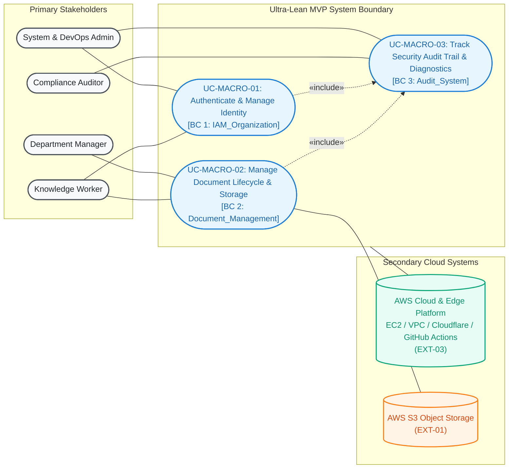

# Enterprise Document Knowledge & Operations Platform
## Ultra-Lean MVP Master Business Specification & Architecture Orchestrator

> **Document Role:** Master Orchestration & Executive Blueprint for Ultra-Lean MVP Delivery.
> **Primary Strategic Objective:** Fastest progress to production on AWS Cloud to focus on learning and mastering cloud infrastructure, container orchestration, and CI/CD deployment.

---

## 1. Executive Summary & Strategic Realignment

The **Enterprise Document Knowledge & Operations Platform** is an enterprise document repository and operational platform engineered to run on production-grade, cost-optimized **AWS Cloud Infrastructure**.

> [!IMPORTANT]
> **Ultra-Lean MVP Focus (Fastest Path to Production & Cloud Mastery):**
> To maximize delivery velocity and focus on **learning, provisioning, and operating cloud infrastructure**, all non-essential and heavy application components (AI/RAG, conversational chat, workflow automation engines, 2-phase HITL approvals, and real-time push notifications) have been **relocated to [`deferred/`](deferred/)**.
>
> The **Ultra-Lean MVP** focuses strictly on:
> 1. **Production AWS Cloud Infrastructure:** Ubuntu EC2 (`t2/t3.micro`), private AWS S3 bucket with SSE-AES256, Docker Compose v2, automated 3GB Swap, Cloudflare SSL (Full Strict Mode), and GitHub Actions CI/CD.
> 2. **Core Authentication & Scoping:** JWT authentication, BCrypt hashing, multi-role RBAC, and department isolation boundaries (`UC-IAM-01..03`).
> 3. **Secure Document Lifecycle & S3 Integration:** Streaming document uploads, presigned temporary S3 download URLs, version snapshots, 4-tier ACL matrix (`PUBLIC`, `INTERNAL`, `RESTRICTED`, `CONFIDENTIAL`), and soft deletion (`UC-DOC-01..04`).
> 4. **Immutable Audit Trail & System Diagnostics:** Append-only database audit log (`UC-AUDIT-01`) and infrastructure health diagnostic endpoint (`GET /api/v1/health`).

```text
┌──────────────────────────────────────────────────────────────────────────────────────────────────┐
│                             ULTRA-LEAN INFRASTRUCTURE-FOCUSED MVP                                │
├────────────────────────────────┬────────────────────────────────┬────────────────────────────────┤
│ 1. AWS CLOUD & CI/CD           │ 2. SECURE S3 STORAGE & DMS     │ 3. IAM & AUDIT GOVERNANCE      │
│ - EC2 + Docker Compose         │ - AWS S3 with SSE-AES256       │ - JWT Session & RBAC           │
│ - Cloudflare SSL Edge          │ - Streaming SHA-256 Checksum   │ - 4-Tier Document ACL Matrix   │
│ - GitHub Actions CI/CD         │ - Presigned Download URLs      │ - Append-Only Audit Logging    │
│ - Automated Health Check       │ - Versioning & Soft Deletion   │ - Zero Secrets in Git          │
└────────────────────────────────┴────────────────────────────────┴────────────────────────────────┘
```

---

## 2. Specification Orchestration Map

Detailed domain specifications and requirements reside in dedicated **Source of Truth** documents:

| Specification Domain | Source of Truth Document | Scope & Key Artifacts |
| :--- | :--- | :--- |
| **Problem & Business Scope** | [**`01_problem_and_business_scope.md`**](01_problem_and_business_scope.md) | Lean MVP boundaries, quantified bottlenecks, AWS Cloud deployment value stream, threat model, and updated MoSCoW framework. |
| **Actors & RBAC Permissions** | [**`02_actor_matrix_and_rbac.md`**](02_actor_matrix_and_rbac.md) | Human personas (`ACT-00` to `ACT-04`), Cloud & System actors (`EXT-01: AWS S3`, `EXT-03: AWS Cloud`), and functional permissions matrix. |
| **Use Case Architecture** | [**`03_use_case_architecture.md`**](03_use_case_architecture.md) | OMG UML 2.5 Macro Context Diagram, Master Decomposed Architecture Map (3 Core Bounded Contexts + Cloud Target), and execution sequence. |
| **Domain Use Cases (Active MVP)** | [**`use_cases/`**](use_cases/) | 8 Active Use Cases: [`01_iam_organization.md`](use_cases/01_iam_organization.md), [`02_document_management.md`](use_cases/02_document_management.md), [`03_audit_trail.md`](use_cases/03_audit_trail.md). |
| **Deferred Specifications** | [**`deferred/`**](deferred/) | Archived future use cases: AI/RAG (`UC-RAG-01..03`), Chat (`UC-CHAT-01..03`), Workflows (`UC-WF-01..02`), HITL Approvals (`UC-HITL-01..03`), and Real-time Notifications (`UC-AUDIT-02`). |
| **Non-Functional Requirements** | [**`04_non_functional_requirements.md`**](04_non_functional_requirements.md) | Cloud Infrastructure & DevOps (AWS EC2, S3, CI/CD, Cloudflare), security (zero secret exposure, SQL pre-filtering), reliability (audit immutability, S3 integrity). |
| **Requirements Traceability** | [**`05_requirements_traceability_matrix.md`**](05_requirements_traceability_matrix.md) | Master RTM linking Business Problems $\leftrightarrow$ Active Use Cases $\leftrightarrow$ DB Tables $\leftrightarrow$ API Endpoints $\leftrightarrow$ AWS Infrastructure. |
| **Engineering Handoff** | [**`06_engineering_handoff.md`**](06_engineering_handoff.md) | Cross-functional implementation guidelines for DevOps (AWS/Docker/CI-CD), Backend (Spring Boot 3 / DDD), and Frontend (React/Vite). |

---

## 3. High-Level System Architecture & Macro Capabilities

The Ultra-Lean MVP operates across **3 Core Bounded Contexts**, hosted on top of production **AWS Cloud Infrastructure & Edge Network**:



---

## 4. Active MVP Use Case Index

The active MVP contains **8 essential use cases** delivering full operational utility while exercising every layer of the cloud infrastructure:

| Bounded Context | Module File | Contained Use Case Specifications | Priority |
| :--- | :--- | :--- | :--- |
| **AWS Cloud Infrastructure** | [**`04_non_functional_requirements.md`**](04_non_functional_requirements.md#4-aws-cloud-infrastructure-deployment--devops-priority-must-have) | `REQ-CLOUD-01` (CI/CD Automated Deployment)<br>`REQ-CLOUD-02` (AWS S3 Durability & SSE-AES256)<br>`REQ-CLOUD-03` (Edge Ingress & Cloudflare SSL)<br>`REQ-CLOUD-04` (Health Diagnostics Endpoint) | **P0 (Must Have)** |
| **BC 1: IAM & Organization** | [`use_cases/01_iam_organization.md`](use_cases/01_iam_organization.md) | `UC-IAM-01`: User Login & JWT Session Lifecycle<br>`UC-IAM-02`: Multi-Role Assignment & Permission Management<br>`UC-IAM-03`: Department Setup & Internal Scoping | **P0 (Must Have)** |
| **BC 2: Document Management** | [`use_cases/02_document_management.md`](use_cases/02_document_management.md) | `UC-DOC-01`: Document Upload & AWS S3 Object Storage<br>`UC-DOC-02`: Manage Document Versioning<br>`UC-DOC-03`: Configure Document Access Control Matrix<br>`UC-DOC-04`: Document Soft Deletion | **P0 (Must Have)** |
| **BC 3: Audit System** | [`use_cases/03_audit_trail.md`](use_cases/03_audit_trail.md) | `UC-AUDIT-01`: Immutable Audit Trail Logging | **P0 (Must Have)** |

---

## 5. Non-Negotiable System Invariants

1. **Cloud Security & Zero Secret Exposure:** Zero AWS access keys, database passwords, or JWT secrets committed to git. All credentials injected via GitHub Actions environment secrets and AWS IAM Instance Profiles.
2. **Binary Storage Integrity & SSE:** All files stored exclusively in private AWS S3 with default Server-Side Encryption (SSE-AES256) and validated via SHA-256 checksums.
3. **Pre-filtered SQL Authorization:** Document ACLs evaluated directly at the SQL database layer (`WHERE` clause) to prevent in-memory data leaks.
4. **Append-Only Audit Immutability:** The `audit_logs` table is strictly append-only; database user roles are blocked from executing `UPDATE`, `DELETE`, `DROP`, or `TRUNCATE`.
5. **Automated CI/CD Verifiable Deployment:** Every merge to `develop`/`main` automatically triggers test runs, Docker builds, and deployment to AWS EC2 via SSH.

---

## 6. Deferred Specifications Reference

For post-MVP feature enhancements and future architectural phases, refer to the preserved specifications in [**`deferred/`**](deferred/):
- **AI Knowledge & Hybrid RAG:** [`deferred/use_cases/03_ai_knowledge_rag.md`](deferred/use_cases/03_ai_knowledge_rag.md)
- **Conversational AI & Citations:** [`deferred/use_cases/04_conversational_ai.md`](deferred/use_cases/04_conversational_ai.md)
- **Workflow Automation:** [`deferred/use_cases/05_workflow_automation.md`](deferred/use_cases/05_workflow_automation.md)
- **Operations & 2-Phase HITL:** [`deferred/use_cases/06_operations_hitl.md`](deferred/use_cases/06_operations_hitl.md)
- **Real-Time Notifications:** [`deferred/use_cases/07_notifications.md`](deferred/use_cases/07_notifications.md)
