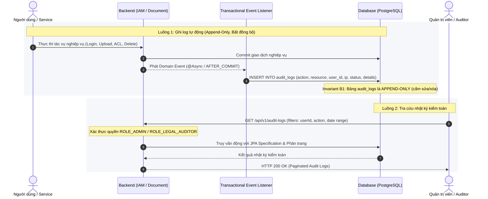

# Use Case Specifications: Audit Subsystem (`Audit_System`)

## Bounded Context 3 (Lean MVP)

> **Source of Truth:** Complete Specification for Immutable Audit Logging Use Case (`UC-AUDIT-01`).
> **Orchestrated by:** [`../MVP.md`](../MVP.md)

---

### Use Case Specification: `UC-AUDIT-01`

- **Use Case Name:** Immutable Audit Trail Logging
- **Stereotype:** Base / Included Use Case
- **Actor(s):** Audit Subsystem (`SYS-04`) (primary), System Admin / Compliance Auditor (secondary)
- **Sequence Diagram:** [`audit/uc-audit-01.md`](./audit/uc-audit-01.md)
- **Includes:** None
- **Extends / Extended By:** None (Included by `UC-IAM-01`, `UC-DOC-01`, `UC-DOC-03`, `UC-DOC-04`)
- **Summary Description:** Automatically records every security-sensitive action, authentication attempt, document upload, ACL change, and soft deletion into an append-only, immutable database audit table with client IP, user agent, timestamps, and before/after details.
- **Priority:** Must Have (P0)
- **Status:** Complete Specification
- **Pre-Condition:**
  1. A security, CRUD, or authentication event is triggered in the system.
- **Post-Condition(s):**
  1. An immutable record is appended into `audit_logs`.
  2. Log data is queryable by authorized administrators and auditors.
- **Basic Path:**
  1. Application interceptor or domain event listener captures user action.
  2. Subsystem extracts `user_id`, `action`, `resource_type`, `resource_id`, `ip_address`, `user_agent`, and `details` JSONB.
  3. Subsystem inserts row into `audit_logs` table.
  4. Admin/Auditor queries `GET /api/v1/audit-logs` with filters (date range, user, action).
  5. System returns audit trail data.
- **Alternative Paths:**
  - 1a. Action performed by internal background worker: `user_id` is recorded as NULL or system bot ID.
- **Business Rules (Audit Immutability Invariant):**
  - B1: The `audit_logs` table is strictly APPEND-ONLY. No `UPDATE` or `DELETE` operations or API endpoints are permitted.
  - B2: Database roles assigned to application backends must not have `DROP` or `TRUNCATE` permissions on `audit_logs`.
- **Non-Functional Requirements:**
  - NF1: Audit logging must execute asynchronously with zero latency penalty on main user request threads.
- **Sequence Flow Diagram:**

