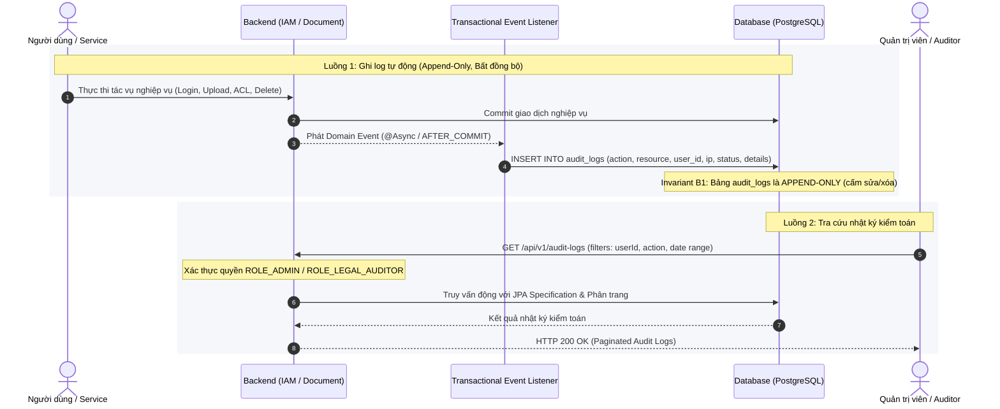

```mermaid
sequenceDiagram
    autonumber
    actor Client as Người dùng / Service
    participant App as Backend (IAM / Document)
    participant Bus as Transactional Event Listener
    participant DB as Database (PostgreSQL)
    actor Auditor as Quản trị viên / Auditor

    %% LUỒNG 1: GHI LOG KIỂM TOÁN TỰ ĐỘNG
    rect rgb(245, 247, 250)
        Note over Client,DB: Luồng 1: Ghi log tự động (Append-Only, Bất đồng bộ)
        Client->>App: Thực thi tác vụ nghiệp vụ (Login, Upload, ACL, Delete)
        App->>DB: Commit giao dịch nghiệp vụ
        App-->>Bus: Phát Domain Event (@Async / AFTER_COMMIT)
        Bus->>DB: INSERT INTO audit_logs (action, resource, user_id, ip, status, details)
        Note over DB: Invariant B1: Bảng audit_logs là APPEND-ONLY (cấm sửa/xóa)
    end

    %% LUỒNG 2: TRUY VẤN TRA CỨU NHẬT KÝ
    rect rgb(245, 247, 250)
        Note over Auditor,DB: Luồng 2: Tra cứu nhật ký kiểm toán
        Auditor->>App: GET /api/v1/audit-logs (filters: userId, action, date range)
        Note over App: Xác thực quyền ROLE_ADMIN / ROLE_LEGAL_AUDITOR
        App->>DB: Truy vấn động với JPA Specification & Phân trang
        DB-->>App: Kết quả nhật ký kiểm toán
        App-->>Auditor: HTTP 200 OK (Paginated Audit Logs)
    end
```
