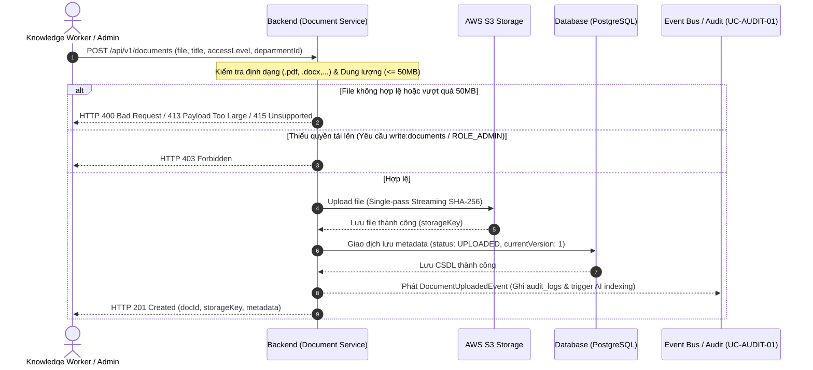

```mermaid
sequenceDiagram
    autonumber
    actor User as Knowledge Worker / Admin
    participant API as Backend (Document Service)
    participant S3 as AWS S3 Storage
    participant DB as Database (PostgreSQL)
    participant Bus as Event Bus / Audit (UC-AUDIT-01)

    User->>API: POST /api/v1/documents (file, title, accessLevel, departmentId)
    Note over API: Kiểm tra định dạng (.pdf, .docx,...) & Dung lượng (<= 50MB)

    alt File không hợp lệ hoặc vượt quá 50MB
        API-->>User: HTTP 400 Bad Request / 413 Payload Too Large / 415 Unsupported
    else Thiếu quyền tải lên (Yêu cầu write:documents / ROLE_ADMIN)
        API-->>User: HTTP 403 Forbidden
    else Hợp lệ
        API->>S3: Upload file (Single-pass Streaming SHA-256)
        S3-->>API: Lưu file thành công (storageKey)
        API->>DB: Giao dịch lưu metadata (status: UPLOADED, currentVersion: 1)
        DB-->>API: Lưu CSDL thành công
        API-->>Bus: Phát DocumentUploadedEvent (Ghi audit_logs & trigger AI indexing)
        API-->>User: HTTP 201 Created (docId, storageKey, metadata)
    end
```
