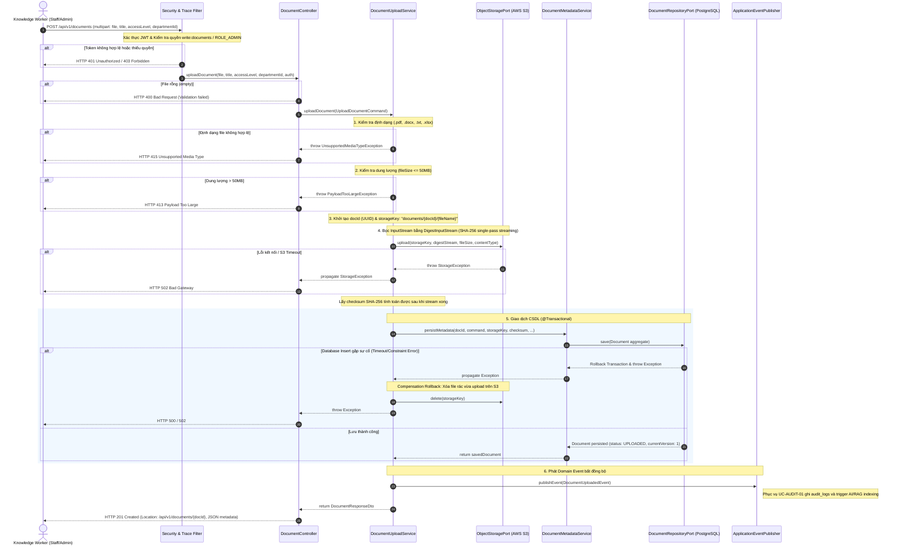

```mermaid
sequenceDiagram
        autonumber
        actor User as Knowledge Worker (Staff/Admin)
        participant Sec as Security & Trace Filter
        participant Ctrl as DocumentController
        participant Svc as DocumentUploadService
        participant S3 as ObjectStoragePort (AWS S3)
        participant Meta as DocumentMetadataService
        participant DB as DocumentRepositoryPort (PostgreSQL)
        participant Bus as ApplicationEventPublisher

        User->>Sec: POST /api/v1/documents (multipart: file, title, accessLevel, departmentId)
        Note over Sec: Xác thực JWT & Kiểm tra quyền write:documents / ROLE_ADMIN
        alt Token không hợp lệ hoặc thiếu quyền
            Sec-->>User: HTTP 401 Unauthorized / 403 Forbidden
        end

        Sec->>Ctrl: uploadDocument(file, title, accessLevel, departmentId, auth)

        alt File rỗng (empty)
            Ctrl-->>User: HTTP 400 Bad Request (Validation failed)
        end

        Ctrl->>Svc: uploadDocument(UploadDocumentCommand)

        Note over Svc: 1. Kiểm tra định dạng (.pdf, .docx, .txt, .xlsx)
        alt Định dạng file không hợp lệ
            Svc-->>Ctrl: throw UnsupportedMediaTypeException
            Ctrl-->>User: HTTP 415 Unsupported Media Type
        end

        Note over Svc: 2. Kiểm tra dung lượng (fileSize <= 50MB)
        alt Dung lượng > 50MB
            Svc-->>Ctrl: throw PayloadTooLargeException
            Ctrl-->>User: HTTP 413 Payload Too Large
        end

        Note over Svc: 3. Khởi tạo docId (UUID) & storageKey: "documents/{docId}/{fileName}"
        Note over Svc,S3: 4. Bọc InputStream bằng DigestInputStream (SHA-256 single-pass streaming)

        Svc->>S3: upload(storageKey, digestStream, fileSize, contentType)
        alt Lỗi kết nối / S3 Timeout
            S3-->>Svc: throw StorageException
            Svc-->>Ctrl: propagate StorageException
            Ctrl-->>User: HTTP 502 Bad Gateway
        end

        Note over Svc: Lấy checksum SHA-256 tính toán được sau khi stream xong

        rect rgb(240, 248, 255)
            Note over Svc,DB: 5. Giao dịch CSDL (@Transactional)
            Svc->>Meta: persistMetadata(docId, command, storageKey, checksum, ...)
            Meta->>DB: save(Document aggregate)
            alt Database Insert gặp sự cố (Timeout/Constraint Error)
                DB-->>Meta: Rollback Transaction & throw Exception
                Meta-->>Svc: propagate Exception
                Note over Svc,S3: Compensation Rollback: Xóa file rác vừa upload trên S3
                Svc->>S3: delete(storageKey)
                Svc-->>Ctrl: throw Exception
                Ctrl-->>User: HTTP 500 / 502
            else Lưu thành công
                DB-->>Meta: Document persisted (status: UPLOADED, currentVersion: 1)
                Meta-->>Svc: return savedDocument
            end
        end

        Note over Svc,Bus: 6. Phát Domain Event bất đồng bộ
        Svc->>Bus: publishEvent(DocumentUploadedEvent)
        Note right of Bus: Phục vụ UC-AUDIT-01 ghi audit_logs và trigger AI/RAG indexing

        Svc-->>Ctrl: return DocumentResponseDto
        Ctrl-->>User: HTTP 201 Created (Location: /api/v1/documents/{docId}, JSON metadata)
```
