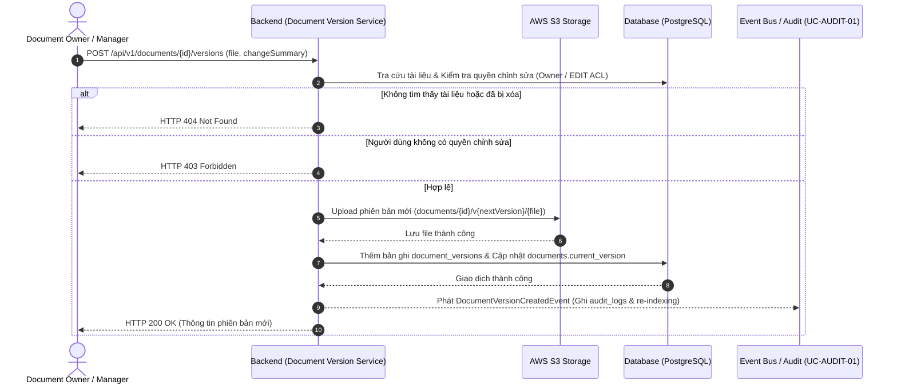

```mermaid
sequenceDiagram
    autonumber
    actor User as Document Owner / Manager
    participant API as Backend (Document Version Service)
    participant S3 as AWS S3 Storage
    participant DB as Database (PostgreSQL)
    participant Bus as Event Bus / Audit (UC-AUDIT-01)

    User->>API: POST /api/v1/documents/{id}/versions (file, changeSummary)
    API->>DB: Tra cứu tài liệu & Kiểm tra quyền chỉnh sửa (Owner / EDIT ACL)

    alt Không tìm thấy tài liệu hoặc đã bị xóa
        API-->>User: HTTP 404 Not Found
    else Người dùng không có quyền chỉnh sửa
        API-->>User: HTTP 403 Forbidden
    else Hợp lệ
        API->>S3: Upload phiên bản mới (documents/{id}/v{nextVersion}/{file})
        S3-->>API: Lưu file thành công
        API->>DB: Thêm bản ghi document_versions & Cập nhật documents.current_version
        DB-->>API: Giao dịch thành công
        API-->>Bus: Phát DocumentVersionCreatedEvent (Ghi audit_logs & re-indexing)
        API-->>User: HTTP 200 OK (Thông tin phiên bản mới)
    end
```
