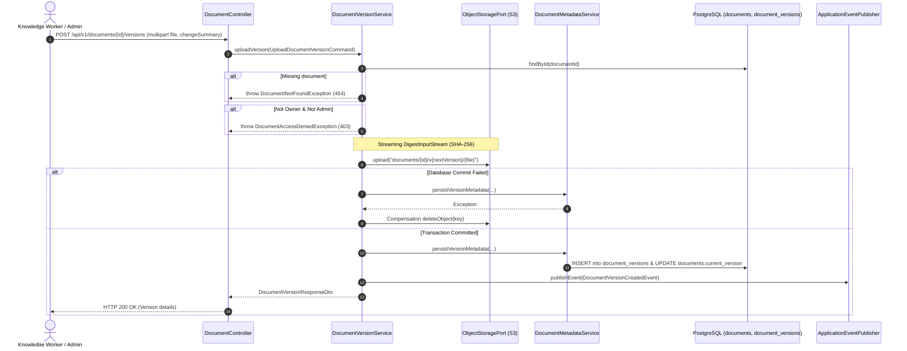

```mermaid
sequenceDiagram
        autonumber
        actor User as Knowledge Worker / Admin
        participant Ctrl as DocumentController
        participant Svc as DocumentVersionService
        participant S3 as ObjectStoragePort (S3)
        participant Meta as DocumentMetadataService
        participant DB as PostgreSQL (documents, document_versions)
        participant Bus as ApplicationEventPublisher

        User->>Ctrl: POST /api/v1/documents/{id}/versions (multipart file, changeSummary)
        Ctrl->>Svc: uploadVersion(UploadDocumentVersionCommand)
        Svc->>DB: findById(documentId)
        alt Missing document
            Svc-->>Ctrl: throw DocumentNotFoundException (404)
        end
        alt Not Owner & Not Admin
            Svc-->>Ctrl: throw DocumentAccessDeniedException (403)
        end
        Note over Svc,S3: Streaming DigestInputStream (SHA-256)
        Svc->>S3: upload("documents/{id}/v{nextVersion}/{file}")
        alt Database Commit Failed
            Svc->>Meta: persistVersionMetadata(...)
            Meta-->>Svc: Exception
            Svc->>S3: Compensation deleteObject(key)
        else Transaction Committed
            Svc->>Meta: persistVersionMetadata(...)
            Meta->>DB: INSERT into document_versions & UPDATE documents.current_version
            Svc->>Bus: publishEvent(DocumentVersionCreatedEvent)
            Svc-->>Ctrl: DocumentVersionResponseDto
            Ctrl-->>User: HTTP 200 OK (Version details)
        end
```
