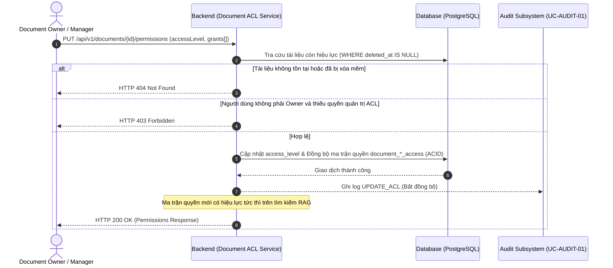

```mermaid
sequenceDiagram
    autonumber
    actor User as Document Owner / Manager
    participant API as Backend (Document ACL Service)
    participant DB as Database (PostgreSQL)
    participant Audit as Audit Subsystem (UC-AUDIT-01)

    User->>API: PUT /api/v1/documents/{id}/permissions (accessLevel, grants[])
    API->>DB: Tra cứu tài liệu còn hiệu lực (WHERE deleted_at IS NULL)

    alt Tài liệu không tồn tại hoặc đã bị xóa mềm
        API-->>User: HTTP 404 Not Found
    else Người dùng không phải Owner và thiếu quyền quản trị ACL
        API-->>User: HTTP 403 Forbidden
    else Hợp lệ
        API->>DB: Cập nhật access_level & Đồng bộ ma trận quyền document_*_access (ACID)
        DB-->>API: Giao dịch thành công
        API-->>Audit: Ghi log UPDATE_ACL (Bất đồng bộ)
        Note over API: Ma trận quyền mới có hiệu lực tức thì trên tìm kiếm RAG
        API-->>User: HTTP 200 OK (Permissions Response)
    end
```
