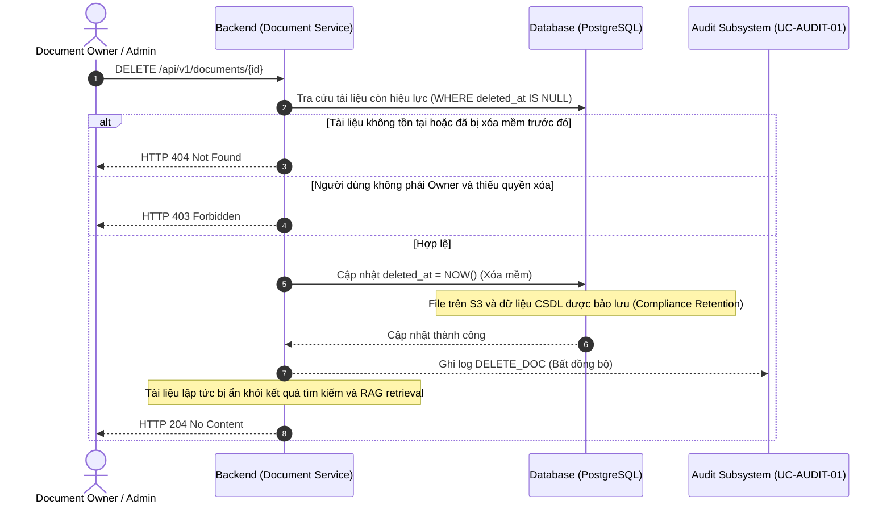

```mermaid
sequenceDiagram
    autonumber
    actor User as Document Owner / Admin
    participant API as Backend (Document Service)
    participant DB as Database (PostgreSQL)
    participant Audit as Audit Subsystem (UC-AUDIT-01)

    User->>API: DELETE /api/v1/documents/{id}
    API->>DB: Tra cứu tài liệu còn hiệu lực (WHERE deleted_at IS NULL)

    alt Tài liệu không tồn tại hoặc đã bị xóa mềm trước đó
        API-->>User: HTTP 404 Not Found
    else Người dùng không phải Owner và thiếu quyền xóa
        API-->>User: HTTP 403 Forbidden
    else Hợp lệ
        API->>DB: Cập nhật deleted_at = NOW() (Xóa mềm)
        Note over DB: File trên S3 và dữ liệu CSDL được bảo lưu (Compliance Retention)
        DB-->>API: Cập nhật thành công
        API-->>Audit: Ghi log DELETE_DOC (Bất đồng bộ)
        Note over API: Tài liệu lập tức bị ẩn khỏi kết quả tìm kiếm và RAG retrieval
        API-->>User: HTTP 204 No Content
    end
```
