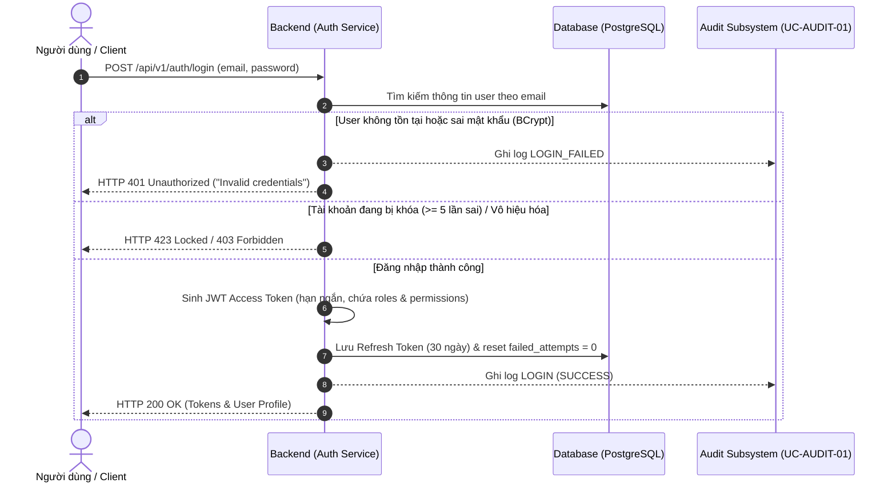
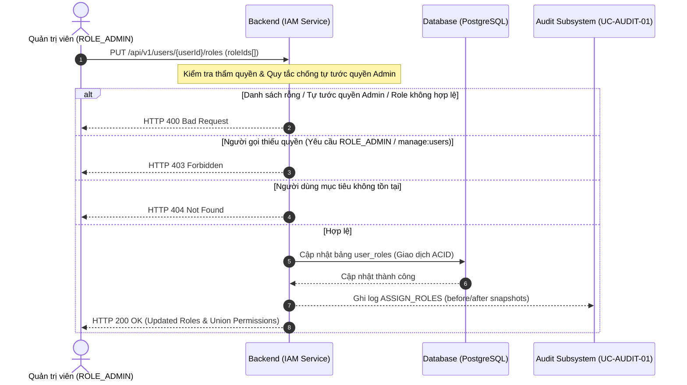
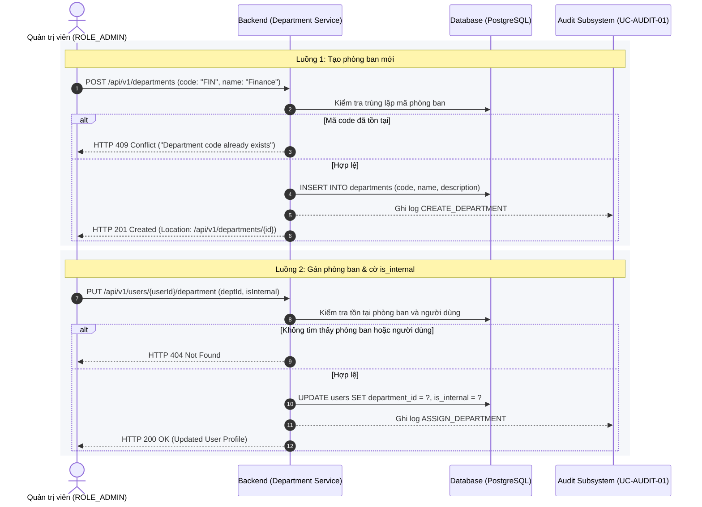

# Use Case Specifications: Identity & Access Management (`IAM_Organization`)
## Bounded Context 1

> **Source of Truth:** Complete Specification for IAM Use Cases (`UC-IAM-01`, `UC-IAM-02`, `UC-IAM-03`).
> **Orchestrated by:** [`../MVP.md`](../MVP.md)

---

### Use Case Specification: `UC-IAM-01`
- **Use Case Name:** User Login & JWT Session Lifecycle Management
- **Stereotype:** Base Use Case
- **Actor(s):** System User (primary), Authentication Subsystem (secondary)
- **Sequence Diagram:** [`uc-iam-01.md`](./uc-iam-01.md)
- **Includes:** `UC-AUDIT-01` (Immutable Audit Trail Logging)
- **Extends / Extended By:** None
- **Summary Description:** Authenticates users via email and password, issuing a stateless short-lived JWT Access Token and a long-lived Refresh Token with user permissions.
- **Priority:** Must Have
- **Status:** Complete Specification
- **Pre-Condition:**
  1. User account exists in the `users` table.
  2. User account is active (`enabled = TRUE`).
  3. Authentication Service is operational.
- **Post-Condition(s):**
  1. User receives a valid JWT Access Token and Refresh Token.
  2. Active session record is created in `refresh_tokens`.
  3. Immutable audit log entry with action `LOGIN` and status `SUCCESS` is recorded in `audit_logs` via `UC-AUDIT-01`.
- **Basic Path:**
  1. The user inputs email and password on the login screen.
  2. The user submits the login form.
  3. The Backend API validates payload formats and queries the `users` table.
  4. The Backend API resolves user roles (`user_roles`) and permissions (`role_permissions`).
  5. The Backend API verifies the provided password against the BCrypt hash.
  6. The Backend API creates a JWT Access Token containing `userId`, `departmentId`, `roleIds`, `isInternal`, and `permissions`.
  7. The Backend API generates an opaque secure Refresh Token.
  8. The Backend API inserts the Refresh Token into `refresh_tokens`.
  9. The Backend API invokes `UC-AUDIT-01` to write a successful `LOGIN` record to `audit_logs`.
  10. The Backend API returns HTTP 200 OK with tokens and user profile.
  11. The frontend client securely stores the tokens and redirects to the workspace.
- **Alternative Paths:**
  - 3a. Invalid email format: System returns HTTP 400 Bad Request.
  - 5a. Incorrect password: System increments failed attempt counter, invokes `UC-AUDIT-01` with action `LOGIN_FAILED`, and returns HTTP 401 Unauthorized.
  - 5b. Account disabled (`enabled = FALSE`): System returns HTTP 403 Forbidden ("Account is deactivated").
  - *a. Database connectivity outage: System returns HTTP 503 Service Unavailable without exposing internal traces.
- **Business Rules:**
  - B1: Password must be verified using BCrypt with work factor $\ge 12$.
  - B2: Access Token expiration must be short-lived (1 hour in production, 24 hours in dev).
  - B3: Refresh Token has a 30-day lifetime and supports immediate revocation (`revoked = TRUE`).
  - B4: Account is temporarily locked after 5 consecutive failed login attempts within 15 minutes.
- **Non-Functional Requirements:**
  - NF1: Authentication response time must be $< 200\text{ ms}$.
  - NF2: JWT secret key must be minimum 256-bit (HS256) or 512-bit (HS512), managed via environment secrets.
  - NF3: Passwords in transit must use HTTPS/TLS 1.3 encryption.
- **Sequence Flow Diagram:**

---

### Use Case Specification: `UC-IAM-02`
- **Use Case Name:** Multi-Role Assignment & Permission Management
- **Stereotype:** Base Use Case
- **Actor(s):** System Administrator (`ROLE_ADMIN`) (primary), IAM Subsystem (secondary)
- **Sequence Diagram:** [`uc-iam-02.md`](./uc-iam-02.md)
- **Includes:** `UC-AUDIT-01` (Immutable Audit Trail Logging)
- **Extends / Extended By:** None
- **Summary Description:** Enables system administrators to assign multiple roles and fine-grained permissions to users to reflect real organizational responsibilities.
- **Priority:** Must Have
- **Status:** Complete Specification
- **Pre-Condition:**
  1. Administrator is authenticated and possesses `manage:users` permission.
  2. Target user and roles exist in the database.
- **Post-Condition(s):**
  1. Updated role associations are committed to `user_roles`.
  2. Target user's subsequent token refreshes inherit updated permissions.
  3. Audit log entry with action `ASSIGN_ROLES` is appended via `UC-AUDIT-01`.
- **Basic Path:**
  1. The administrator opens the User Management console.
  2. The administrator selects a target user account.
  3. The system displays current roles, department, and granted permissions.
  4. The administrator updates assigned roles (e.g., adding `ROLE_MANAGER`).
  5. The administrator submits the role modification.
  6. The system verifies administrator authorization.
  7. The system updates the `user_roles` associations in a database transaction.
  8. The system invokes `UC-AUDIT-01` to record the change in `audit_logs`.
  9. The system returns HTTP 200 OK with the updated profile.
- **Alternative Paths:**
  - 4a. Administrator attempts to revoke their own `ROLE_ADMIN` role: System rejects with HTTP 400 Bad Request to prevent administrative lockout.
  - 6a. User lacks `manage:users` permission: System returns HTTP 403 Forbidden.
- **Business Rules:**
  - B1: Effective permissions equal the mathematical UNION of all permissions across all assigned roles.
  - B2: Every user must maintain at least one active role.
- **Non-Functional Requirements:**
  - NF1: Role update transaction execution time $< 100\text{ ms}$.
  - NF2: All permission mutations must capture before/after snapshots in audit logs.
- **Sequence Flow Diagram:**

---

### Use Case Specification: `UC-IAM-03`
- **Use Case Name:** Department Setup & Internal Employee Verification
- **Stereotype:** Base Use Case
- **Actor(s):** System Administrator (`ROLE_ADMIN`) (primary), IAM Subsystem (secondary)
- **Sequence Diagram:** [`uc-iam-03.md`](./uc-iam-03.md)
- **Includes:** `UC-AUDIT-01` (Immutable Audit Trail Logging)
- **Extends / Extended By:** None
- **Summary Description:** Configures organizational departments and manages the `is_internal` status of users to govern default data isolation boundaries.
- **Priority:** Must Have
- **Status:** Complete Specification
- **Pre-Condition:**
  1. Administrator is authenticated with `ROLE_ADMIN`.
- **Post-Condition(s):**
  1. Department record created or updated in `departments`.
  2. User's `department_id` and `is_internal` flag updated in `users`.
  3. Audit log entry committed via `UC-AUDIT-01`.
- **Basic Path:**
  1. Administrator submits department details (code, name, description).
  2. System validates that department code is unique.
  3. System saves department record in `departments`.
  4. Administrator assigns users to the department and sets `is_internal = TRUE/FALSE`.
  5. System persists user updates and invokes `UC-AUDIT-01` to record the audit log.
- **Alternative Paths:**
  - 2a. Duplicate department code: System returns HTTP 409 Conflict.
- **Business Rules:**
  - B1: Users with `is_internal = FALSE` cannot access `INTERNAL` or `RESTRICTED` documents.
  - B2: Department code must be uppercase alphanumeric (e.g., `HR`, `FIN`, `IT`, `LEGAL`).
- **Non-Functional Requirements:**
  - NF1: Database foreign key constraints must guarantee referential integrity.
- **Sequence Flow Diagram:**

