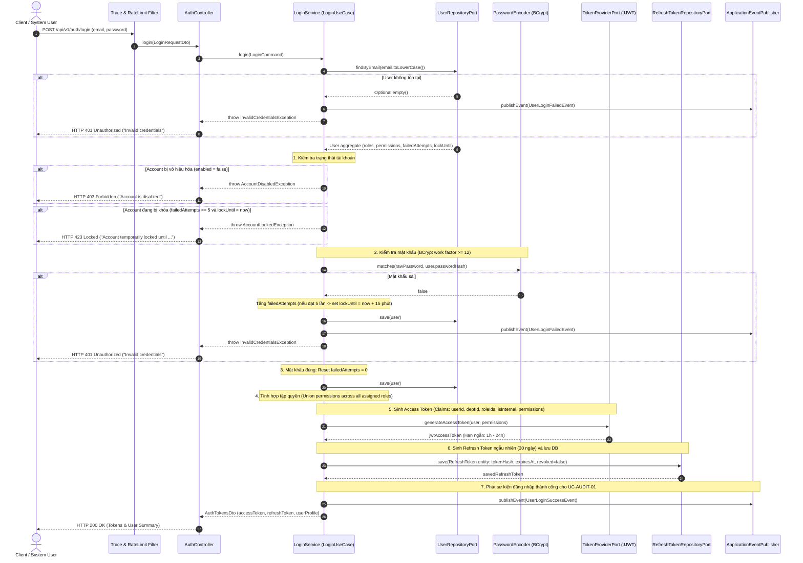

```mermaid
sequenceDiagram
        autonumber
        actor User as Client / System User
        participant Filter as Trace & RateLimit Filter
        participant Ctrl as AuthController
        participant Svc as LoginService (LoginUseCase)
        participant UserRepo as UserRepositoryPort
        participant Hasher as PasswordEncoder (BCrypt)
        participant TokenSvc as TokenProviderPort (JJWT)
        participant RefreshRepo as RefreshTokenRepositoryPort
        participant Bus as ApplicationEventPublisher

        User->>Filter: POST /api/v1/auth/login (email, password)
        Filter->>Ctrl: login(LoginRequestDto)
        Ctrl->>Svc: login(LoginCommand)

        Svc->>UserRepo: findByEmail(email.toLowerCase())
        alt User không tồn tại
            UserRepo-->>Svc: Optional.empty()
            Svc->>Bus: publishEvent(UserLoginFailedEvent)
            Svc-->>Ctrl: throw InvalidCredentialsException
            Ctrl-->>User: HTTP 401 Unauthorized ("Invalid credentials")
        end

        UserRepo-->>Svc: User aggregate (roles, permissions, failedAttempts, lockUntil)

        Note over Svc: 1. Kiểm tra trạng thái tài khoản
        alt Account bị vô hiệu hóa (enabled = false)
            Svc-->>Ctrl: throw AccountDisabledException
            Ctrl-->>User: HTTP 403 Forbidden ("Account is disabled")
        end

        alt Account đang bị khóa (failedAttempts >= 5 và lockUntil > now)
            Svc-->>Ctrl: throw AccountLockedException
            Ctrl-->>User: HTTP 423 Locked ("Account temporarily locked until ...")
        end

        Note over Svc,Hasher: 2. Kiểm tra mật khẩu (BCrypt work factor >= 12)
        Svc->>Hasher: matches(rawPassword, user.passwordHash)
        alt Mật khẩu sai
            Hasher-->>Svc: false
            Note over Svc: Tăng failedAttempts (nếu đạt 5 lần -> set lockUntil = now + 15 phút)
            Svc->>UserRepo: save(user)
            Svc->>Bus: publishEvent(UserLoginFailedEvent)
            Svc-->>Ctrl: throw InvalidCredentialsException
            Ctrl-->>User: HTTP 401 Unauthorized ("Invalid credentials")
        end

        Note over Svc: 3. Mật khẩu đúng: Reset failedAttempts = 0
        Svc->>UserRepo: save(user)

        Note over Svc: 4. Tính hợp tập quyền (Union permissions across all assigned roles)
        Note over Svc,TokenSvc: 5. Sinh Access Token (Claims: userId, deptId, roleIds, isInternal, permissions)
        Svc->>TokenSvc: generateAccessToken(user, permissions)
        TokenSvc-->>Svc: jwtAccessToken (Hạn ngắn: 1h - 24h)

        Note over Svc,RefreshRepo: 6. Sinh Refresh Token ngẫu nhiên (30 ngày) và lưu DB
        Svc->>RefreshRepo: save(RefreshToken entity: tokenHash, expiresAt, revoked=false)
        RefreshRepo-->>Svc: savedRefreshToken

        Note over Svc,Bus: 7. Phát sự kiện đăng nhập thành công cho UC-AUDIT-01
        Svc->>Bus: publishEvent(UserLoginSuccessEvent)

        Svc-->>Ctrl: AuthTokensDto (accessToken, refreshToken, userProfile)
        Ctrl-->>User: HTTP 200 OK (Tokens & User Summary)
```
