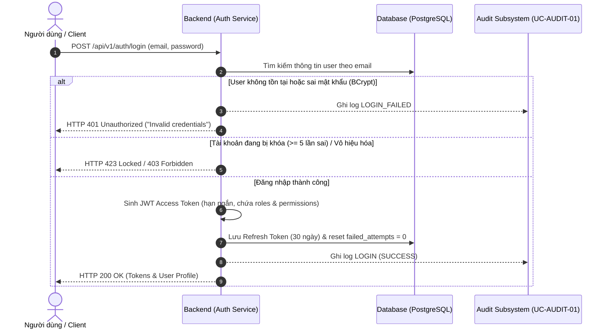

```mermaid
sequenceDiagram
    autonumber
    actor User as Người dùng / Client
    participant API as Backend (Auth Service)
    participant DB as Database (PostgreSQL)
    participant Audit as Audit Subsystem (UC-AUDIT-01)

    User->>API: POST /api/v1/auth/login (email, password)
    API->>DB: Tìm kiếm thông tin user theo email

    alt User không tồn tại hoặc sai mật khẩu (BCrypt)
        API-->>Audit: Ghi log LOGIN_FAILED
        API-->>User: HTTP 401 Unauthorized ("Invalid credentials")
    else Tài khoản đang bị khóa (>= 5 lần sai) / Vô hiệu hóa
        API-->>User: HTTP 423 Locked / 403 Forbidden
    else Đăng nhập thành công
        API->>API: Sinh JWT Access Token (hạn ngắn, chứa roles & permissions)
        API->>DB: Lưu Refresh Token (30 ngày) & reset failed_attempts = 0
        API-->>Audit: Ghi log LOGIN (SUCCESS)
        API-->>User: HTTP 200 OK (Tokens & User Profile)
    end
```
