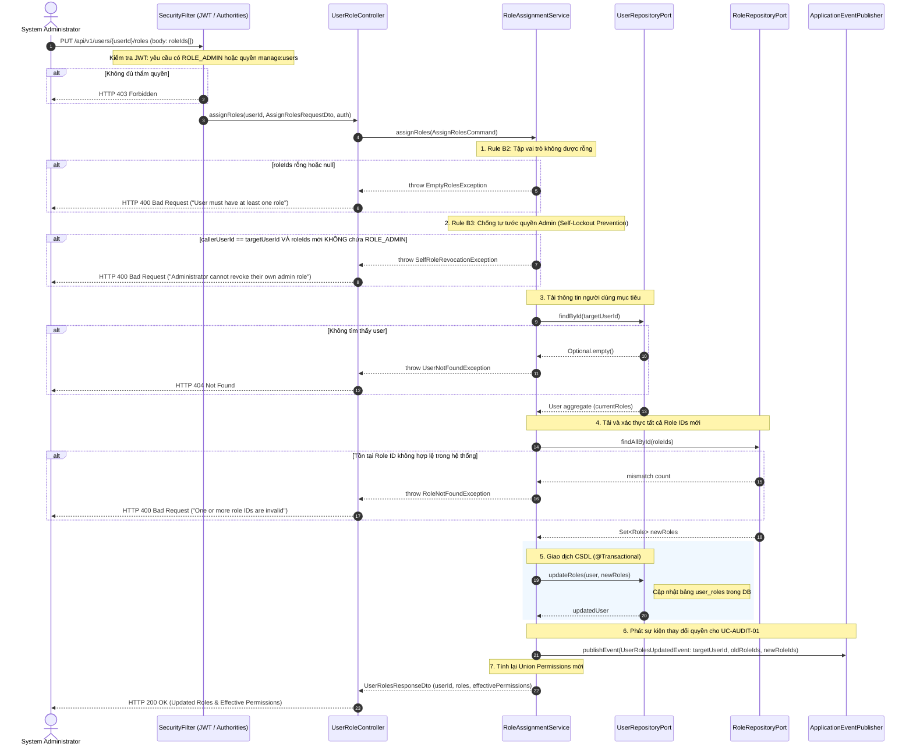

```mermaid
sequenceDiagram
        autonumber
        actor Admin as System Administrator
        participant Sec as SecurityFilter (JWT / Authorities)
        participant Ctrl as UserRoleController
        participant Svc as RoleAssignmentService
        participant UserRepo as UserRepositoryPort
        participant RoleRepo as RoleRepositoryPort
        participant Bus as ApplicationEventPublisher

        Admin->>Sec: PUT /api/v1/users/{userId}/roles (body: roleIds[])
        Note over Sec: Kiểm tra JWT: yêu cầu có ROLE_ADMIN hoặc quyền manage:users
        alt Không đủ thẩm quyền
            Sec-->>Admin: HTTP 403 Forbidden
        end

        Sec->>Ctrl: assignRoles(userId, AssignRolesRequestDto, auth)
        Ctrl->>Svc: assignRoles(AssignRolesCommand)

        Note over Svc: 1. Rule B2: Tập vai trò không được rỗng
        alt roleIds rỗng hoặc null
            Svc-->>Ctrl: throw EmptyRolesException
            Ctrl-->>Admin: HTTP 400 Bad Request ("User must have at least one role")
        end

        Note over Svc: 2. Rule B3: Chống tự tước quyền Admin (Self-Lockout Prevention)
        alt callerUserId == targetUserId VÀ roleIds mới KHÔNG chứa ROLE_ADMIN
            Svc-->>Ctrl: throw SelfRoleRevocationException
            Ctrl-->>Admin: HTTP 400 Bad Request ("Administrator cannot revoke their own admin role")
        end

        Note over Svc,UserRepo: 3. Tải thông tin người dùng mục tiêu
        Svc->>UserRepo: findById(targetUserId)
        alt Không tìm thấy user
            UserRepo-->>Svc: Optional.empty()
            Svc-->>Ctrl: throw UserNotFoundException
            Ctrl-->>Admin: HTTP 404 Not Found
        end
        UserRepo-->>Svc: User aggregate (currentRoles)

        Note over Svc,RoleRepo: 4. Tải và xác thực tất cả Role IDs mới
        Svc->>RoleRepo: findAllById(roleIds)
        alt Tồn tại Role ID không hợp lệ trong hệ thống
            RoleRepo-->>Svc: mismatch count
            Svc-->>Ctrl: throw RoleNotFoundException
            Ctrl-->>Admin: HTTP 400 Bad Request ("One or more role IDs are invalid")
        end
        RoleRepo-->>Svc: Set<Role> newRoles

        rect rgb(240, 248, 255)
            Note over Svc,UserRepo: 5. Giao dịch CSDL (@Transactional)
            Svc->>UserRepo: updateRoles(user, newRoles)
            Note right of UserRepo: Cập nhật bảng user_roles trong DB
            UserRepo-->>Svc: updatedUser
        end

        Note over Svc,Bus: 6. Phát sự kiện thay đổi quyền cho UC-AUDIT-01
        Svc->>Bus: publishEvent(UserRolesUpdatedEvent: targetUserId, oldRoleIds, newRoleIds)

        Note over Svc: 7. Tính lại Union Permissions mới
        Svc-->>Ctrl: UserRolesResponseDto (userId, roles, effectivePermissions)
        Ctrl-->>Admin: HTTP 200 OK (Updated Roles & Effective Permissions)
```
