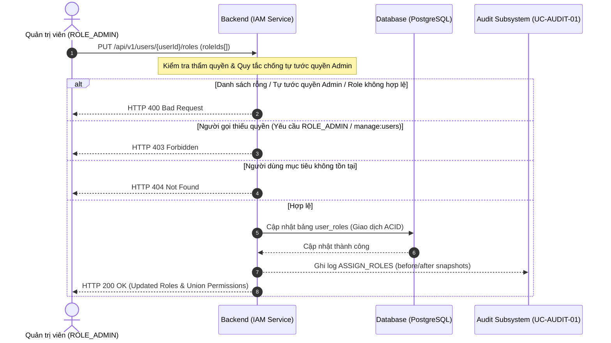

```mermaid
sequenceDiagram
    autonumber
    actor Admin as Quản trị viên (ROLE_ADMIN)
    participant API as Backend (IAM Service)
    participant DB as Database (PostgreSQL)
    participant Audit as Audit Subsystem (UC-AUDIT-01)

    Admin->>API: PUT /api/v1/users/{userId}/roles (roleIds[])
    Note over API: Kiểm tra thẩm quyền & Quy tắc chống tự tước quyền Admin

    alt Danh sách rỗng / Tự tước quyền Admin / Role không hợp lệ
        API-->>Admin: HTTP 400 Bad Request
    else Người gọi thiếu quyền (Yêu cầu ROLE_ADMIN / manage:users)
        API-->>Admin: HTTP 403 Forbidden
    else Người dùng mục tiêu không tồn tại
        API-->>Admin: HTTP 404 Not Found
    else Hợp lệ
        API->>DB: Cập nhật bảng user_roles (Giao dịch ACID)
        DB-->>API: Cập nhật thành công
        API-->>Audit: Ghi log ASSIGN_ROLES (before/after snapshots)
        API-->>Admin: HTTP 200 OK (Updated Roles & Union Permissions)
    end
```
