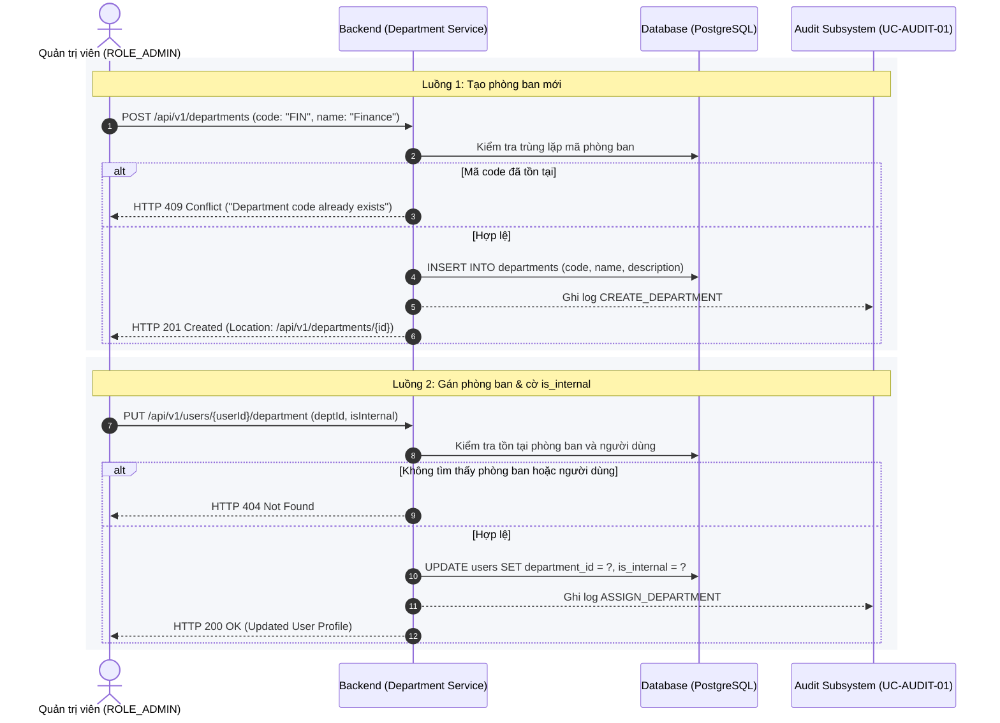

```mermaid
sequenceDiagram
    autonumber
    actor Admin as Quản trị viên (ROLE_ADMIN)
    participant API as Backend (Department Service)
    participant DB as Database (PostgreSQL)
    participant Audit as Audit Subsystem (UC-AUDIT-01)

    %% LUỒNG 1: TẠO PHÒNG BAN MỚI
    rect rgb(245, 247, 250)
        Note over Admin,Audit: Luồng 1: Tạo phòng ban mới
        Admin->>API: POST /api/v1/departments (code: "FIN", name: "Finance")
        API->>DB: Kiểm tra trùng lặp mã phòng ban
        alt Mã code đã tồn tại
            API-->>Admin: HTTP 409 Conflict ("Department code already exists")
        else Hợp lệ
            API->>DB: INSERT INTO departments (code, name, description)
            API-->>Audit: Ghi log CREATE_DEPARTMENT
            API-->>Admin: HTTP 201 Created (Location: /api/v1/departments/{id})
        end
    end

    %% LUỒNG 2: GÁN PHÒNG BAN & TRẠNG THÁI NỘI BỘ
    rect rgb(245, 247, 250)
        Note over Admin,Audit: Luồng 2: Gán phòng ban & cờ is_internal
        Admin->>API: PUT /api/v1/users/{userId}/department (deptId, isInternal)
        API->>DB: Kiểm tra tồn tại phòng ban và người dùng
        alt Không tìm thấy phòng ban hoặc người dùng
            API-->>Admin: HTTP 404 Not Found
        else Hợp lệ
            API->>DB: UPDATE users SET department_id = ?, is_internal = ?
            API-->>Audit: Ghi log ASSIGN_DEPARTMENT
            API-->>Admin: HTTP 200 OK (Updated User Profile)
        end
    end
```
