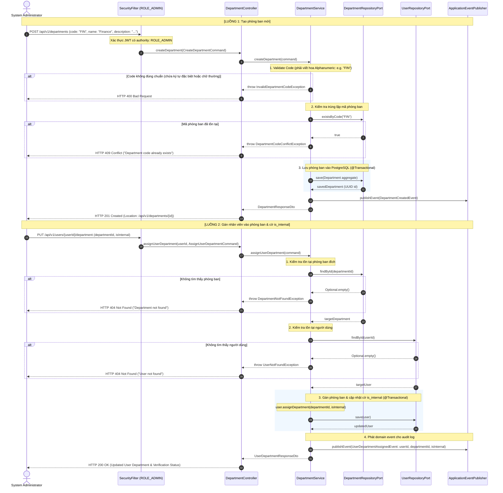

```mermaid
sequenceDiagram
        autonumber
        actor Admin as System Administrator
        participant Sec as SecurityFilter (ROLE_ADMIN)
        participant DeptCtrl as DepartmentController
        participant DeptSvc as DepartmentService
        participant DeptRepo as DepartmentRepositoryPort
        participant UserRepo as UserRepositoryPort
        participant Bus as ApplicationEventPublisher

        %% ==========================================
        %% SUB-FLOW 1: TẠO PHÒNG BAN
        %% ==========================================
        Note over Admin,Bus: [LUỒNG 1: Tạo phòng ban mới]
        Admin->>Sec: POST /api/v1/departments (code: "FIN", name: "Finance", description: "...")
        Note over Sec: Xác thực JWT có authority: ROLE_ADMIN
        Sec->>DeptCtrl: createDepartment(CreateDepartmentCommand)
        DeptCtrl->>DeptSvc: createDepartment(command)

        Note over DeptSvc: 1. Validate Code (phải viết hoa Alphanumeric: e.g. "FIN")
        alt Code không đúng chuẩn (chứa ký tự đặc biệt hoặc chữ thường)
            DeptSvc-->>DeptCtrl: throw InvalidDepartmentCodeException
            DeptCtrl-->>Admin: HTTP 400 Bad Request
        end

        Note over DeptSvc,DeptRepo: 2. Kiểm tra trùng lặp mã phòng ban
        DeptSvc->>DeptRepo: existsByCode("FIN")
        alt Mã phòng ban đã tồn tại
            DeptRepo-->>DeptSvc: true
            DeptSvc-->>DeptCtrl: throw DepartmentCodeConflictException
            DeptCtrl-->>Admin: HTTP 409 Conflict ("Department code already exists")
        end

        rect rgb(240, 248, 255)
            Note over DeptSvc,DeptRepo: 3. Lưu phòng ban vào PostgreSQL (@Transactional)
            DeptSvc->>DeptRepo: save(Department aggregate)
            DeptRepo-->>DeptSvc: savedDepartment (UUID id)
        end

        DeptSvc->>Bus: publishEvent(DepartmentCreatedEvent)
        DeptSvc-->>DeptCtrl: DepartmentResponseDto
        DeptCtrl-->>Admin: HTTP 201 Created (Location: /api/v1/departments/{id})

        %% ==========================================
        %% SUB-FLOW 2: GÁN PHÒNG BAN & IS_INTERNAL
        %% ==========================================
        Note over Admin,Bus: [LUỒNG 2: Gán nhân viên vào phòng ban & cờ is_internal]
        Admin->>Sec: PUT /api/v1/users/{userId}/department (departmentId, isInternal)
        Sec->>DeptCtrl: assignUserDepartment(userId, AssignUserDepartmentCommand)
        DeptCtrl->>DeptSvc: assignUserDepartment(command)

        Note over DeptSvc: 1. Kiểm tra tồn tại phòng ban đích
        DeptSvc->>DeptRepo: findById(departmentId)
        alt Không tìm thấy phòng ban
            DeptRepo-->>DeptSvc: Optional.empty()
            DeptSvc-->>DeptCtrl: throw DepartmentNotFoundException
            DeptCtrl-->>Admin: HTTP 404 Not Found ("Department not found")
        end
        DeptRepo-->>DeptSvc: targetDepartment

        Note over DeptSvc: 2. Kiểm tra tồn tại người dùng
        DeptSvc->>UserRepo: findById(userId)
        alt Không tìm thấy người dùng
            UserRepo-->>DeptSvc: Optional.empty()
            DeptSvc-->>DeptCtrl: throw UserNotFoundException
            DeptCtrl-->>Admin: HTTP 404 Not Found ("User not found")
        end
        UserRepo-->>DeptSvc: targetUser

        rect rgb(240, 248, 255)
            Note over DeptSvc,UserRepo: 3. Gán phòng ban & cập nhật cờ is_internal (@Transactional)
            Note over DeptSvc: user.assignDepartment(departmentId, isInternal)
            DeptSvc->>UserRepo: save(user)
            UserRepo-->>DeptSvc: updatedUser
        end

        Note over DeptSvc,Bus: 4. Phát domain event cho audit log
        DeptSvc->>Bus: publishEvent(UserDepartmentAssignedEvent: userId, departmentId, isInternal)

        DeptSvc-->>DeptCtrl: UserDepartmentResponseDto
        DeptCtrl-->>Admin: HTTP 200 OK (Updated User Department & Verification Status)
```
