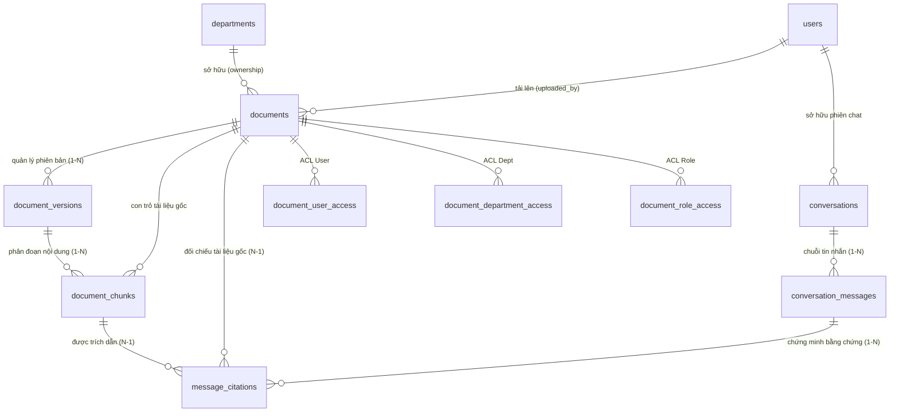

# Thiết Kế Cơ Sở Dữ Liệu Khởi Tạo (Database Schema Specification V1)

> **Dự án:** Nền tảng quản lý tài liệu nội bộ và tự động hóa nghiệp vụ (*Document Knowledge & Operations Platform*)  
> **Tài liệu tham chiếu:** Báo cáo đề tài PBL4 ([`report.docx`](../../reports/foundation_report.docx)), Kiến trúc hệ thống ([`architecture.md`](../architecture.md)), Business MVP ([`MVP.md`](../business/MVP.md)).  
> **Tệp đặc tả DBML nguồn:** [`schema.dbml`](schema.dbml) *(Trực quan hóa trên [dbdiagram.io](https://dbdiagram.io))*.  
> **Hệ quản trị CSDL:** PostgreSQL 16 + Extension `pgvector` (Phase 2).  
> **Lưu trữ nhị phân (Object Storage):** Amazon S3 (mã hóa SSE-AES256, presigned URLs $\le 15$ phút).

---

## 1. Tổng Quan Kiến Trúc Dữ Liệu (Data Architecture Overview)

Hệ thống được thiết kế theo hướng **Domain-Driven Design (DDD) & Modular Bounded Contexts**, phân tách rõ ràng theo chiến lược phân kỳ phát triển:

```text
+---------------------------------------------------------------------------------------------------+
|                     PHASE 1: CORE CLOUD MVP BASELINE (Ưu Tiên Hạ Tầng AWS & Nghiệp Vụ)             |
+-------------------+--------------------+-----------------------+------------------+---------------+
| IAM_Organization  |Document_Management |  Workflow_Automation  | Operations_HITL  | Audit_System  |
| (Users, Depts,    | (Docs S3 Meta,     | (Workflows, Execs,    | (2-Phase Approvals| (Immutable Log|
|  Roles, Perms)    |  Versions, ACL)    |  Execution Pipeline)  |  HITL Tasks)     |  Alerts)      |
+-------------------+--------------------+-----------------------+------------------+---------------+
                                                     |
                                                     v (Pluggable Fast-Follow)
+---------------------------------------------------------------------------------------------------+
|                     PHASE 2: PLUGGABLE AI KNOWLEDGE & RAG EXTENSION (Mở Rộng Sau)                 |
+----------------------------------------+----------------------------------------------------------+
|          AI_Knowledge_RAG              |                   Conversational_AI                      |
| (Semantic Chunks, 1536d HNSW, tsvector)| (Sessions, Message History, Citations, Confidence Guard)  |
+----------------------------------------+----------------------------------------------------------+
```

### Nguyên Tắc Lưu Trữ & Bất Biến (Invariants)
1. **Zero BLOBs in PostgreSQL:** Toàn bộ tệp nhị phân (PDF, DOCX, XLSX, TXT) lưu trực tiếp trên AWS S3. Cơ sở dữ liệu chỉ lưu trữ metadata, bucket, S3 object key, checksum SHA-256 và trạng thái đồng bộ `is_s3_synced`.
2. **Phase 1 Document Lifecycle:** Tài liệu tải lên S3 thành công nhận ngay trạng thái `processing_status = 'UPLOADED'`, cho phép tải xuống và phân quyền nghiệp vụ an toàn mà chưa cần phụ thuộc vào AI worker.
3. **2-Phase HITL Safety Gate:** Các thao tác nghiệp vụ nhạy cảm hoặc phá hủy bắt buộc trải qua phê duyệt 2 pha (Prepare/Diff Preview $\rightarrow$ Waiting Approval $\rightarrow$ Commit) kèm khóa chống lặp `idempotency_key`.
4. **Append-Only Immutable Audit:** Bảng `audit_logs` chỉ hỗ trợ thao tác ghi mới (INSERT), nghiêm cấm UPDATE/DELETE để đảm bảo giá trị pháp lý và truy vết bảo mật.
5. **Soft Delete Compliance:** Bản ghi tài liệu áp dụng cơ chế xóa mềm qua trường `deleted_at` có đánh chỉ mục, không xóa vật lý trực tiếp.

---

## 2. Từ Điển Dữ Liệu (Data Dictionary)

---

### 2.1. Nhóm Phase 1: Core Cloud MVP Baseline

#### A. Phân Hệ IAM & Tổ Chức (`Phase1_IAM_Organization`)

##### 1. `departments` (Phòng ban / Đơn vị tổ chức)
Xác định phạm vi sở hữu tài liệu (`document ownership`) và cách ly dữ liệu giữa các đơn vị.

| Cột | Kiểu | Ràng Buộc | Ý Nghĩa Nghiệp Vụ |
| :--- | :--- | :--- | :--- |
| `id` | `BIGSERIAL` | **PK** | Định danh duy nhất phòng ban |
| `code` | `VARCHAR(50)` | **UNIQUE, NOT NULL** | Mã viết tắt duy nhất (e.g. `IT`, `HR`, `FIN`, `LEGAL`) |
| `name` | `VARCHAR(255)` | **NOT NULL** | Tên phòng ban đầy đủ |
| `description` | `TEXT` | | Chức năng, nhiệm vụ chính |
| `created_at` / `updated_at` | `TIMESTAMPTZ` | **NOT NULL** | Dấu thời gian tạo và cập nhật bản ghi |

##### 2. `users` (Tài khoản người dùng)
Lưu trữ định danh người dùng, mật khẩu băm, phòng ban chủ quản và cờ phân loại bảo mật.

| Cột | Kiểu | Ràng Buộc | Ý Nghĩa Nghiệp Vụ |
| :--- | :--- | :--- | :--- |
| `id` | `BIGSERIAL` | **PK** | Định danh duy nhất người dùng |
| `email` | `VARCHAR(255)` | **UNIQUE, NOT NULL** | Email đăng nhập doanh nghiệp |
| `password_hash` | `VARCHAR(255)` | **NOT NULL** | Chuỗi băm mật khẩu bảo mật (BCrypt/Argon2) |
| `full_name` | `VARCHAR(255)` | **NOT NULL** | Họ và tên hiển thị |
| `department_id` | `BIGINT` | **FK** $\rightarrow$ `departments(id)` | Phòng ban trực thuộc (NULL nếu là đối tác bên ngoài) |
| `enabled` | `BOOLEAN` | **NOT NULL, DEFAULT TRUE** | Trạng thái kích hoạt tài khoản |
| `is_internal` | `BOOLEAN` | **NOT NULL, DEFAULT TRUE** | Phân biệt nhân sự nội bộ hay nhà thầu/khách hàng |
| `created_at` / `updated_at` | `TIMESTAMPTZ` | **NOT NULL** | Dấu thời gian tạo và cập nhật |

##### 3. `roles` (Vai trò hệ thống)
Định nghĩa các nhóm vai trò nghiệp vụ (e.g. `ROLE_ADMIN`, `ROLE_MANAGER`, `ROLE_STAFF`, `ROLE_AUDITOR`).

| Cột | Kiểu | Ràng Buộc | Ý Nghĩa Nghiệp Vụ |
| :--- | :--- | :--- | :--- |
| `id` | `BIGSERIAL` | **PK** | Định danh vai trò |
| `code` | `VARCHAR(50)` | **UNIQUE, NOT NULL** | Mã vai trò chuẩn hóa |
| `name` | `VARCHAR(100)` | **NOT NULL** | Tên vai trò hiển thị |
| `description` | `TEXT` | | Mô tả phạm vi trách nhiệm |
| `created_at` | `TIMESTAMPTZ` | **NOT NULL** | Thời điểm khởi tạo |

##### 4. `permissions` (Quyền hạn chức năng mức hạt mịn)
Định nghĩa quyền hạn cụ thể (e.g. `DOC_READ`, `DOC_WRITE`, `APPROVAL_COMMIT`, `AUDIT_VIEW`).

| Cột | Kiểu | Ràng Buộc | Ý Nghĩa Nghiệp Vụ |
| :--- | :--- | :--- | :--- |
| `id` | `BIGSERIAL` | **PK** | Định danh quyền hạn |
| `code` | `VARCHAR(100)` | **UNIQUE, NOT NULL** | Mã quyền hạn chuẩn hóa |
| `name` | `VARCHAR(150)` | **NOT NULL** | Tên quyền hiển thị |
| `module` | `VARCHAR(50)` | **NOT NULL** | Phân hệ nghiệp vụ (`IAM`, `DMS`, `WORKFLOW`, `AUDIT`) |
| `description` | `TEXT` | | Mô tả chi tiết hành động được phép |
| `created_at` | `TIMESTAMPTZ` | **NOT NULL** | Thời điểm khởi tạo |

##### 5. `user_roles` (Bảng gán vai trò người dùng)
Liên kết Nhiều-Nhiều (N-N) giữa tài khoản người dùng và vai trò.

| Cột | Kiểu | Ràng Buộc | Ý Nghĩa Nghiệp Vụ |
| :--- | :--- | :--- | :--- |
| `user_id` | `BIGINT` | **PK, FK** $\rightarrow$ `users(id)` | ID người dùng được gán vai trò |
| `role_id` | `BIGINT` | **PK, FK** $\rightarrow$ `roles(id)` | ID vai trò được gán |
| `assigned_at` | `TIMESTAMPTZ` | **NOT NULL** | Thời điểm gán vai trò |

##### 6. `role_permissions` (Bảng gán quyền cho vai trò)
Liên kết Nhiều-Nhiều (N-N) giữa vai trò và các quyền hạn chức năng.

| Cột | Kiểu | Ràng Buộc | Ý Nghĩa Nghiệp Vụ |
| :--- | :--- | :--- | :--- |
| `role_id` | `BIGINT` | **PK, FK** $\rightarrow$ `roles(id)` | ID vai trò |
| `permission_id` | `BIGINT` | **PK, FK** $\rightarrow$ `permissions(id)` | ID quyền hạn cấp cho vai trò |
| `granted_at` | `TIMESTAMPTZ` | **NOT NULL** | Thời điểm cấp quyền |

##### 7. `refresh_tokens` (Phiên làm việc JWT)
Quản lý vòng đời token làm mới, hỗ trợ cơ chế thu hồi phiên đăng nhập tức thì.

| Cột | Kiểu | Ràng Buộc | Ý Nghĩa Nghiệp Vụ |
| :--- | :--- | :--- | :--- |
| `id` | `BIGSERIAL` | **PK** | Định danh bản ghi phiên |
| `user_id` | `BIGINT` | **FK** $\rightarrow$ `users(id)` | Người dùng sở hữu phiên |
| `token` | `VARCHAR(512)` | **UNIQUE, NOT NULL** | Chuỗi Refresh Token ngẫu nhiên bảo mật |
| `expiry_date` | `TIMESTAMPTZ` | **NOT NULL** | Thời điểm hết hạn phiên |
| `revoked` | `BOOLEAN` | **NOT NULL, DEFAULT FALSE** | Trạng thái bị thu hồi (đăng xuất/bị khóa) |
| `created_at` | `TIMESTAMPTZ` | **NOT NULL** | Thời điểm phát hành token |

---

#### B. Phân Hệ Quản Lý Tài Liệu & AWS S3 (`Phase1_Document_Management`)

##### 8. `documents` (Tài liệu trung tâm & Con trỏ AWS S3)
Quản lý metadata tài liệu, định danh S3 Object Key, trạng thái toàn vẹn và mức phân loại bảo mật.

| Cột | Kiểu | Ràng Buộc | Ý Nghĩa Nghiệp Vụ |
| :--- | :--- | :--- | :--- |
| `id` | `VARCHAR(64)` | **PK** | Định danh tài liệu duy nhất (UUIDv4) |
| `original_file_name` | `VARCHAR(255)` | **NOT NULL** | Tên tệp gốc kèm phần mở rộng |
| `title` | `VARCHAR(255)` | **NOT NULL** | Tiêu đề nghiệp vụ của tài liệu |
| `description` | `TEXT` | | Tóm tắt hoặc mô tả nội dung tài liệu |
| `file_type` | `Enum` | **NOT NULL** | `PDF`, `DOCX`, `TXT`, `XLSX`, `IMAGE`, `OTHER` |
| `mime_type` | `VARCHAR(100)` | **NOT NULL** | Chuỗi định dạng MIME chuẩn (e.g. `application/pdf`) |
| `file_size_bytes` | `BIGINT` | **NOT NULL** | Kích thước nhị phân chính xác (bytes) |
| `checksum_sha256` | `VARCHAR(64)` | **NOT NULL** | Mã băm SHA-256 chống giả mạo và hỗ trợ deduplication |
| `storage_bucket` | `VARCHAR(128)` | **NOT NULL** | Tên AWS S3 Bucket riêng tư (e.g. `docs-platform-prod`) |
| `storage_key` | `VARCHAR(512)` | **NOT NULL** | Khóa S3 Object Key: `{dept_code}/{doc_id}/{filename}` |
| `is_s3_synced` | `BOOLEAN` | **NOT NULL, DEFAULT TRUE** | Xác nhận tệp đã lưu trữ an toàn trên AWS S3 |
| `processing_status` | `Enum` | **NOT NULL, DEFAULT 'UPLOADED'** | `UPLOADED`, `PENDING`, `PARSING`, `CHUNKED`, `INDEXED`, `FAILED` |
| `current_version` | `INT` | **NOT NULL, DEFAULT 1** | Số hiệu phiên bản hiện hành |
| `department_id` | `BIGINT` | **FK** $\rightarrow$ `departments(id)` | Phòng ban chủ quản tài liệu |
| `uploaded_by_user_id`| `BIGINT` | **FK** $\rightarrow$ `users(id)` | Người tải lên tài liệu |
| `access_level` | `Enum` | **NOT NULL, DEFAULT 'INTERNAL'** | `PUBLIC`, `INTERNAL`, `RESTRICTED`, `CONFIDENTIAL` |
| `metadata` | `JSONB` | **NOT NULL, DEFAULT '{}'** | Metadata động (tác giả, số trang, tags...) |
| `created_at` / `updated_at` | `TIMESTAMPTZ` | **NOT NULL** | Dấu thời gian tạo và cập nhật |
| `deleted_at` | `TIMESTAMPTZ` | **INDEX** | Thời điểm xóa mềm (NULL nếu tài liệu còn hoạt động) |

##### 9. `document_versions` (Lịch sử các phiên bản tệp S3)
Lưu trữ ảnh chụp bất biến của mọi phiên bản tệp trên S3, cho phép truy nguyên hoặc khôi phục.

| Cột | Kiểu | Ràng Buộc | Ý Nghĩa Nghiệp Vụ |
| :--- | :--- | :--- | :--- |
| `id` | `BIGSERIAL` | **PK** | Định danh bản ghi phiên bản |
| `document_id` | `VARCHAR(64)` | **FK** $\rightarrow$ `documents(id)` | Tài liệu cha sở hữu phiên bản |
| `version_number` | `INT` | **NOT NULL** | Số thứ tự phiên bản (1, 2, 3...) |
| `storage_bucket` | `VARCHAR(128)` | **NOT NULL** | Tên AWS S3 Bucket lưu trữ phiên bản này |
| `storage_key` | `VARCHAR(512)` | **NOT NULL** | Đường dẫn S3 Object Key cho phiên bản cụ thể |
| `file_size_bytes` | `BIGINT` | **NOT NULL** | Dung lượng tệp của phiên bản này |
| `checksum_sha256` | `VARCHAR(64)` | **NOT NULL** | Mã băm SHA-256 của tệp phiên bản |
| `is_s3_synced` | `BOOLEAN` | **NOT NULL, DEFAULT TRUE** | Xác nhận đồng bộ nhị phân lên S3 |
| `change_summary` | `VARCHAR(500)` | | Ghi chú tóm tắt nội dung thay đổi ở phiên bản này |
| `uploaded_by_user_id`| `BIGINT` | **FK** $\rightarrow$ `users(id)` | Người tải lên phiên bản này |
| `created_at` | `TIMESTAMPTZ` | **NOT NULL** | Thời điểm khởi tạo phiên bản |

##### 10. Ma Trận Phân Quyền Truy Cập Chi Tiết (Access Control Lists - ACLs)
Chuẩn hóa 3NF thành 3 bảng độc lập, loại bỏ hoàn toàn đa hình (Polymorphic anti-pattern):
- **`document_user_access`:** Cấp quyền cho từng người dùng cá nhân (`document_id`, `user_id`, `permission_level`).
- **`document_department_access`:** Cấp quyền cho toàn bộ nhân sự phòng ban (`document_id`, `department_id`, `permission_level`).
- **`document_role_access`:** Cấp quyền cho các tài khoản mang vai trò nhất định (`document_id`, `role_id`, `permission_level`).
*(Mức quyền `permission_level`: `VIEW` - đọc & tải tệp S3; `EDIT` - sửa metadata & tải phiên bản mới; `ADMIN` - toàn quyền & xóa mềm).*

---

#### C. Phân Hệ Tự Động Hóa Quy Trình (`Phase1_Workflow_Automation`)

##### 11. `workflows` (Mẫu quy trình xử lý tự động)
Định nghĩa kịch bản xử lý tự động khi phát sinh sự kiện tài liệu.

| Cột | Kiểu | Ràng Buộc | Ý Nghĩa Nghiệp Vụ |
| :--- | :--- | :--- | :--- |
| `id` | `VARCHAR(64)` | **PK** | Định danh quy trình (e.g. `wf_doc_indexing`) |
| `name` | `VARCHAR(255)` | **NOT NULL** | Tên hiển thị quy trình |
| `description` | `TEXT` | | Mô tả mục tiêu và luồng xử lý |
| `trigger_event` | `Enum` | **NOT NULL** | `ON_DOCUMENT_UPLOADED`, `ON_DOCUMENT_INDEXED`, `MANUAL_TRIGGER`, `SCHEDULED` |
| `is_active` | `BOOLEAN` | **NOT NULL, DEFAULT TRUE** | Cờ bật/tắt kích hoạt tự động |
| `config_schema` | `JSONB` | **NOT NULL, DEFAULT '{}'** | Cấu hình tham số các bước và điều kiện rẽ nhánh |
| `created_at` / `updated_at` | `TIMESTAMPTZ` | **NOT NULL** | Dấu thời gian tạo và cập nhật |

##### 12. `workflow_executions` (Lịch sử thực thi quy trình)
Ghi nhận tiến trình chạy thực tế, dữ liệu đầu vào và kết quả từng bước.

| Cột | Kiểu | Ràng Buộc | Ý Nghĩa Nghiệp Vụ |
| :--- | :--- | :--- | :--- |
| `id` | `VARCHAR(64)` | **PK** | Định danh phiên chạy quy trình |
| `workflow_id` | `VARCHAR(64)` | **FK** $\rightarrow$ `workflows(id)` | Quy trình mẫu được gọi |
| `document_id` | `VARCHAR(64)` | **FK** $\rightarrow$ `documents(id)` | Tài liệu mục tiêu đang xử lý |
| `status` | `Enum` | **NOT NULL, DEFAULT 'PENDING'** | `PENDING`, `RUNNING`, `WAITING_APPROVAL`, `COMPLETED`, `FAILED`, `CANCELLED` |
| `current_step` | `VARCHAR(100)` | | Tên bước đang thực thi hiện tại |
| `input_payload` | `JSONB` | **NOT NULL, DEFAULT '{}'** | Dữ liệu đầu vào của phiên chạy |
| `step_results` | `JSONB` | **NOT NULL, DEFAULT '{}'** | Dữ liệu đầu ra các bước đã hoàn tất |
| `error_message` | `TEXT` | | Chi tiết thông điệp lỗi nếu thất bại |
| `started_at` / `completed_at` | `TIMESTAMPTZ` | | Thời điểm bắt đầu và kết thúc |

---

#### D. Phân Hệ Tác Vụ Nghiệp Vụ & Phê Duyệt 2 Pha (`Phase1_Operations_HITL`)

##### 13. `action_approvals` (Chốt chặn phê duyệt Human-In-The-Loop 2 Pha)
Đảm bảo các hành động trọng yếu bắt buộc phải được người có thẩm quyền kiểm tra và xác nhận.

| Cột | Kiểu | Ràng Buộc | Ý Nghĩa Nghiệp Vụ |
| :--- | :--- | :--- | :--- |
| `id` | `VARCHAR(64)` | **PK** | Mã phiếu yêu cầu phê duyệt |
| `execution_id` | `VARCHAR(64)` | **FK** $\rightarrow$ `workflow_executions(id)` | Phiên workflow phát sinh yêu cầu |
| `action_type` | `VARCHAR(100)` | **NOT NULL** | Loại thao tác (e.g. `PUBLISH_DOCUMENT`, `PURGE_DOCUMENT`) |
| `status` | `Enum` | **NOT NULL, DEFAULT 'PENDING'** | `PENDING`, `APPROVED`, `REJECTED`, `COMMITTED`, `EXPIRED` |
| `idempotency_key` | `VARCHAR(128)` | **UNIQUE, NOT NULL** | Khóa chống thực thi trùng lặp giao dịch (Exactly-Once) |
| `preview_payload` | `JSONB` | **NOT NULL, DEFAULT '{}'** | Dữ liệu Diff Before/After hiển thị trực quan cho Manager |
| `execution_result`| `JSONB` | **NOT NULL, DEFAULT '{}'** | Kết quả sau khi commit hành động thành công |
| `requested_by_user_id`| `BIGINT` | **FK** $\rightarrow$ `users(id)` | Người khởi tạo yêu cầu thao tác |
| `reviewed_by_user_id` | `BIGINT` | **FK** $\rightarrow$ `users(id)` | Cấp quản lý thực hiện phê duyệt/từ chối |
| `review_notes` | `TEXT` | | Ý kiến nhận xét hoặc lý do bác bỏ bắt buộc |
| `requested_at` / `reviewed_at` / `committed_at` | `TIMESTAMPTZ` | | Dấu thời gian các mốc chuyển trạng thái 2 pha |

##### 14. `operation_tasks` (Tác vụ vận hành cần xử lý thủ công)
Quản lý các công việc nghiệp vụ phát sinh từ lỗi xử lý hoặc yêu cầu soát xét của nhân viên.

| Cột | Kiểu | Ràng Buộc | Ý Nghĩa Nghiệp Vụ |
| :--- | :--- | :--- | :--- |
| `id` | `VARCHAR(64)` | **PK** | Định danh tác vụ (UUID) |
| `title` | `VARCHAR(255)` | **NOT NULL** | Tiêu đề tóm tắt công việc |
| `description` | `TEXT` | | Hướng dẫn hoặc chi tiết yêu cầu |
| `status` | `Enum` | **NOT NULL, DEFAULT 'PENDING'** | `PENDING`, `IN_PROGRESS`, `COMPLETED`, `CANCELLED` |
| `priority` | `Enum` | **NOT NULL, DEFAULT 'MEDIUM'** | `LOW`, `MEDIUM`, `HIGH`, `URGENT` |
| `creator_id` | `BIGINT` | **FK** $\rightarrow$ `users(id)` | Người hoặc tiến trình tạo tác vụ |
| `assignee_id` | `BIGINT` | **FK** $\rightarrow$ `users(id)` | Nhân viên được giao trách nhiệm giải quyết |
| `document_id` | `VARCHAR(64)` | **FK** $\rightarrow$ `documents(id)` | Tài liệu liên quan trực tiếp |
| `execution_id` | `VARCHAR(64)` | **FK** $\rightarrow$ `workflow_executions(id)` | Phiên workflow liên quan |
| `metadata` | `JSONB` | **NOT NULL, DEFAULT '{}'** | Dữ liệu mở rộng (hạn chót SLA, nhãn phân loại) |
| `created_at` / `updated_at` | `TIMESTAMPTZ` | **NOT NULL** | Dấu thời gian khởi tạo và cập nhật |

---

#### E. Phân Hệ Kiểm Toán Bất Biến & Thông Báo (`Phase1_Audit_System`)

##### 15. `audit_logs` (Nhật ký kiểm toán an toàn thông tin)
Ghi nhận chuỗi nhật ký kiểm toán bất biến (Append-Only) phục vụ giám sát tuân thủ và điều tra số.

| Cột | Kiểu | Ràng Buộc | Ý Nghĩa Nghiệp Vụ |
| :--- | :--- | :--- | :--- |
| `id` | `BIGSERIAL` | **PK** | Mã tăng tự động bản ghi log |
| `user_id` | `BIGINT` | **FK** $\rightarrow$ `users(id)` | Người thực hiện hành động (NULL nếu là system daemon) |
| `action` | `VARCHAR(100)` | **NOT NULL** | Động từ hành động (`AUTH_LOGIN`, `DOC_UPLOAD`, `DOC_DOWNLOAD_S3`) |
| `resource_type`| `VARCHAR(100)` | **NOT NULL** | Phân loại tài nguyên (`DOCUMENT`, `USER`, `APPROVAL`, `S3_OBJECT`) |
| `resource_id` | `VARCHAR(64)` | | ID định danh tài nguyên bị tác động |
| `ip_address` | `VARCHAR(45)` | | Địa chỉ IP máy khách (IPv4/IPv6) tại Edge Ingress |
| `user_agent` | `TEXT` | | Thông tin trình duyệt/thiết bị phục vụ pháp y số |
| `status` | `Enum` | **NOT NULL, DEFAULT 'SUCCESS'** | `SUCCESS`, `FAILED` |
| `details` | `JSONB` | **NOT NULL, DEFAULT '{}'** | Payload bất biến (tham số yêu cầu, lỗi, thay đổi diff) |
| `created_at` | `TIMESTAMPTZ` | **NOT NULL** | Thời điểm ghi log (nghiêm cấm sửa hoặc xóa) |

##### 16. `notifications` (Thông báo trong ứng dụng)
Thông báo trạng thái công việc và nhắc nhở phê duyệt tới người dùng.

| Cột | Kiểu | Ràng Buộc | Ý Nghĩa Nghiệp Vụ |
| :--- | :--- | :--- | :--- |
| `id` | `BIGSERIAL` | **PK** | Định danh thông báo |
| `user_id` | `BIGINT` | **FK** $\rightarrow$ `users(id)` | Người dùng nhận thông báo |
| `title` | `VARCHAR(255)` | **NOT NULL** | Tiêu đề thông báo ngắn gọn |
| `message` | `TEXT` | **NOT NULL** | Nội dung chi tiết thông báo |
| `type` | `Enum` | **NOT NULL, DEFAULT 'INFO'** | `INFO`, `SUCCESS`, `WARNING`, `ACTION_REQUIRED` |
| `is_read` | `BOOLEAN` | **NOT NULL, DEFAULT FALSE** | Cờ trạng thái đã đọc |
| `reference_type`| `VARCHAR(100)` | | Loại đối tượng liên quan (`DOCUMENT`, `APPROVAL`, `TASK`) |
| `reference_id` | `VARCHAR(64)` | | ID đối tượng để điều hướng UI nhanh |
| `created_at` | `TIMESTAMPTZ` | **NOT NULL** | Thời điểm gửi thông báo |

---

### 2.2. Nhóm Phase 2: Pluggable AI Knowledge & RAG Extension

*(Các thực thể phục vụ phân đoạn văn bản, lưu trữ vector và hội thoại thông minh khi cắm Microservice AI vào hệ thống).*

##### 17. `document_chunks` (Phân đoạn văn bản & Chỉ mục Vector pgvector)
Lưu trữ các đoạn văn bản trích xuất (500–1000 tokens) kèm vector embedding 1536 chiều và dữ liệu FTS.

| Cột | Kiểu | Ràng Buộc | Ý Nghĩa Nghiệp Vụ |
| :--- | :--- | :--- | :--- |
| `id` | `VARCHAR(64)` | **PK** | Mã chunk duy nhất (`{doc_id}_v{ver}_c{idx}`) |
| `document_id` | `VARCHAR(64)` | **FK** $\rightarrow$ `documents(id)` | Tài liệu gốc |
| `document_version_id`| `BIGINT` | **FK** $\rightarrow$ `document_versions(id)` | Phiên bản tài liệu cụ thể của đoạn |
| `chunk_index` | `INT` | **NOT NULL, DEFAULT 0** | Số thứ tự đoạn trong tài liệu |
| `page_number` | `INT` | | Số trang gốc phục vụ đối chiếu trích dẫn |
| `content` | `TEXT` | **NOT NULL** | Nội dung văn bản trích xuất thô đã chuẩn hóa |
| `token_count` | `INT` | **NOT NULL, DEFAULT 0** | Số lượng token tính bằng tokenizer |
| `metadata` | `JSONB` | **GIN INDEX** | Vị trí trang, tiêu đề mục, bounding box |
| `embedding` | `vector(1536)` | **HNSW INDEX (`cosine`)** | Vector nhúng ngữ nghĩa phục vụ tìm kiếm tương đồng |
| `tsv` | `tsvector` | **GIN INDEX** | Dữ liệu tìm kiếm toàn văn Full-Text Search (FTS) |
| `created_at` | `TIMESTAMPTZ` | **NOT NULL** | Thời điểm sinh đoạn văn bản |

##### 18. `conversations` (Phiên hội thoại hỏi đáp)
Quản lý luồng tương tác và ngữ cảnh trao đổi giữa người dùng và AI Assistant.

| Cột | Kiểu | Ràng Buộc | Ý Nghĩa Nghiệp Vụ |
| :--- | :--- | :--- | :--- |
| `id` | `VARCHAR(64)` | **PK** | Định danh phiên chat |
| `user_id` | `BIGINT` | **FK** $\rightarrow$ `users(id)` | Chủ sở hữu phiên trao đổi |
| `title` | `VARCHAR(255)` | **NOT NULL, DEFAULT 'New Conversation'** | Tiêu đề phiên trò chuyện |
| `status` | `Enum` | **NOT NULL, DEFAULT 'ACTIVE'** | `ACTIVE`, `ARCHIVED`, `DELETED` |
| `created_at` / `updated_at` | `TIMESTAMPTZ` | **NOT NULL** | Thời điểm tạo và tương tác gần nhất |

##### 19. `conversation_messages` (Tin nhắn trong phiên trò chuyện)
Lịch sử tin nhắn, số lượng token tiêu thụ và đánh giá độ tin cậy câu trả lời.

| Cột | Kiểu | Ràng Buộc | Ý Nghĩa Nghiệp Vụ |
| :--- | :--- | :--- | :--- |
| `id` | `VARCHAR(64)` | **PK** | Định danh tin nhắn duy nhất |
| `conversation_id` | `VARCHAR(64)` | **FK** $\rightarrow$ `conversations(id)` | Phiên hội thoại cha |
| `role` | `Enum` | **NOT NULL** | `USER`, `ASSISTANT`, `SYSTEM`, `TOOL` |
| `content` | `TEXT` | **NOT NULL** | Nội dung văn bản tin nhắn |
| `confidence` | `Enum` | | Độ tin cậy AI: `LOW` (< 0.60 Safe Abstention), `MEDIUM`, `HIGH` |
| `prompt_tokens` / `completion_tokens` | `INT` | **NOT NULL, DEFAULT 0** | Lượng token ngữ cảnh và sinh câu trả lời |
| `created_at` | `TIMESTAMPTZ` | **NOT NULL** | Thời điểm gửi tin nhắn |

##### 20. `message_citations` (Bằng chứng trích dẫn nguồn cho câu trả lời)
Đối chiếu minh bạch câu trả lời của AI với đoạn văn bản và tài liệu gốc.

| Cột | Kiểu | Ràng Buộc | Ý Nghĩa Nghiệp Vụ |
| :--- | :--- | :--- | :--- |
| `id` | `BIGSERIAL` | **PK** | Định danh bản ghi trích dẫn |
| `message_id` | `VARCHAR(64)` | **FK** $\rightarrow$ `conversation_messages(id)` | Tin nhắn AI chứa câu trả lời |
| `document_id` | `VARCHAR(64)` | **FK** $\rightarrow$ `documents(id)` | Tài liệu nguồn được trích dẫn |
| `chunk_id` | `VARCHAR(64)` | **FK** $\rightarrow$ `document_chunks(id)` | Đoạn chunk văn bản cụ thể chứng minh luận điểm |
| `relevance_score` | `FLOAT` | **NOT NULL, DEFAULT 0.0** | Điểm số tương đồng ngữ nghĩa / thứ hạng RRF |
| `snippet` | `TEXT` | | Đoạn trích dẫn nguyên văn hiển thị trên giao diện |
| `created_at` | `TIMESTAMPTZ` | **NOT NULL** | Thời điểm ghi nhận trích dẫn |

---

## 3. Chuyên Đề Thiết Kế Cơ Sở Dữ Liệu Cho Cơ Chế RAG & Conversational AI (Deep Dive: How, Why & Insights)

Phân hệ RAG (Retrieval-Augmented Generation) và Conversational AI là trái tim tri thức của nền tảng. Khác với các hệ thống chatbot phổ thông, RAG trong môi trường doanh nghiệp và cơ quan hành chính đòi hỏi **tính bảo mật tuyệt đối (Zero Data Leakage)**, **khả năng truy nguyên chứng cứ (Full Traceability)**, **tính chính xác thuật ngữ (High Precision on Exact Codes)** và **chống ảo giác (Anti-Hallucination Guardrails)**. 

Phần này phân tích toàn diện kiến trúc cơ sở dữ liệu chuyên biệt cho RAG: cách thức dữ liệu vận hành (**HOW**), lý do đằng sau các quyết định thiết kế (**WHY**), và những **INSIGHTS** giá trị rút ra cho bài toán Enterprise Knowledge Operations.

---

### 3.1. Sơ Đồ Thực Thể & Tô-pô Dữ Liệu RAG (RAG Data Topology & Schema Relationships)

Mô hình dữ liệu RAG được thiết kế tối ưu hóa cho mối liên kết giữa Quản lý tài liệu (DMS), Không gian vector ngữ nghĩa (Vector Store), Phân quyền tài nguyên (Resource ACL) và Lịch sử hội thoại (Conversational Audit):



#### Các Ràng Buộc Bất Biến (Schema Invariants)
1. **Phân cấp 3 tầng dữ liệu tài liệu:** `documents` (Định danh thực thể kinh doanh) $\rightarrow$ `document_versions` (Ảnh chụp tệp nhị phân trên S3) $\rightarrow$ `document_chunks` (Đơn vị ngữ nghĩa nhỏ nhất phục vụ Retrieval).
2. **Khóa liên kết trích dẫn kép (Dual-pointer Citation):** Bảng `message_citations` lưu trữ đồng thời cả `chunk_id` và `document_id`. Điều này đảm bảo khi hiển thị trên giao diện, người dùng có thể nhảy thẳng đến trang tài liệu gốc (`page_number`) trên S3 thông qua URL presigned mà không cần thực hiện thêm các câu truy vấn JOIN phức tạp.
3. **Bất biến phiên bản (Version Immutability):** Khi một tài liệu được cập nhật phiên bản mới $v+1$, các đoạn `document_chunks` của phiên bản cũ $v$ **vẫn được giữ nguyên** trong CSDL nếu các tin nhắn cũ trong `message_citations` còn tham chiếu tới, đảm bảo tính toàn vẹn của bằng chứng pháp lý trong quá khứ.

---

### 3.2. Cơ Chế Vận Hành Dữ Liệu RAG (HOW: The Database Execution Lifecycle)

Quy trình dữ liệu RAG tại tầng CSDL diễn ra qua 3 pha khép kín, được bảo vệ bằng các giao dịch và chỉ mục chuyên dụng:

```text
[Tài liệu S3] ──(1. Ingestion Worker)──> [document_chunks: Embedding (HNSW) + FTS (GIN)]
                                                        │
[User Query + Security Context] ────────> [2. SQL-Layer Pre-filtered Hybrid RRF Search]
                                                        │
                                          ┌─────────────┴─────────────┐
                         (Similarity >= 0.50)                     (Similarity < 0.50 / 0 chunks)
                                  │                                           │
                                  ▼                                           ▼
             [Prompt Augmentation + LLM Inference]             [Anti-Hallucination Safe Abstention]
                                  │                                           │
                                  ▼                                           ▼
               [Persist: conversation_messages                   [Persist: conversation_messages
                + message_citations (Audit)]                      with 'NO_ACCESSIBLE_KNOWLEDGE']
```

#### Bước 1: Phân Đoạn & Tạo Chỉ Mục Kép (Dual Index Ingestion)
1. Worker tải tệp nhị phân từ S3, trích xuất cấu trúc văn bản và chia đoạn theo thuật ngữ:
   - Cỡ đoạn (Chunk size): $500 - 1000$ tokens.
   - Độ gối đầu (Overlap): $50 - 100$ tokens nhằm duy trì ngữ cảnh biên giữa các đoạn liền kề.
2. Với mỗi đoạn, hệ thống tính toán và nạp đồng thời vào bảng `document_chunks`:
   - **Vector nhúng (Dense Embedding):** Mảng vector 1536 chiều (tương thích OpenAI `text-embedding-3-small` hoặc mô hình open-source tương đương), đánh chỉ mục **HNSW** (`vector_cosine_ops`).
   - **Chỉ mục toàn văn (Sparse Lexical):** Cột `tsv` kiểu `tsvector` sinh tự động qua hàm `to_tsvector('simple', content)`, đánh chỉ mục **GIN**.
   - **Metadata ngữ cảnh:** Lưu dưới dạng `jsonb` gồm `page_number`, vị trí khối chữ, tiêu đề mục cha (`header_path`), đánh chỉ mục **GIN**.
3. Cập nhật `documents.processing_status = 'INDEXED'`.

#### Bước 2: Truy Vấn Lai Pre-filtered Tại Tầng SQL (The Hybrid RRF Retrieval Engine)
Toàn bộ quá trình lọc quyền truy cập (Security Pre-filtering), so khớp vector tương đồng (Dense Retrieval), so khớp từ khóa chính xác (Sparse FTS) và kết hợp thứ hạng (Reciprocal Rank Fusion) được cô đọng trong **duy nhất một câu lệnh SQL hiệu năng cao**:

```sql
WITH 
-- 1. Tập hợp các tài liệu hợp lệ trong phạm vi quyền hạn của User
accessible_docs AS (
    SELECT d.id
    FROM documents d
    WHERE d.deleted_at IS NULL
      AND d.processing_status = 'INDEXED'
      AND (
          d.access_level = 'PUBLIC'
          OR (d.access_level = 'INTERNAL' AND :is_internal = TRUE)
          OR (d.access_level = 'RESTRICTED' AND d.department_id = :department_id)
          OR (d.uploaded_by_user_id = :user_id)
          OR EXISTS (
              SELECT 1 FROM document_user_access dua 
              WHERE dua.document_id = d.id AND dua.user_id = :user_id
          )
          OR EXISTS (
              SELECT 1 FROM document_department_access dda 
              WHERE dda.document_id = d.id AND dda.department_id = :department_id
          )
          OR EXISTS (
              SELECT 1 FROM document_role_access dra 
              WHERE dra.document_id = d.id AND dra.role_id = ANY(:role_ids)
          )
      )
),
-- 2. Tìm kiếm Dense Vector (Ngữ nghĩa tương đồng bằng khoảng cách Cosine HNSW)
dense_candidates AS (
    SELECT 
        c.id,
        c.document_id,
        c.content,
        c.page_number,
        c.metadata,
        1 - (c.embedding <=> :query_vector) AS cosine_sim,
        ROW_NUMBER() OVER (ORDER BY c.embedding <=> :query_vector ASC) AS dense_rank
    FROM document_chunks c
    JOIN accessible_docs ad ON c.document_id = ad.id
    WHERE c.embedding IS NOT NULL
    LIMIT 30
),
-- 3. Tìm kiếm Sparse Lexical (So khớp từ khóa chính xác bằng Full-Text Search)
sparse_candidates AS (
    SELECT 
        c.id,
        c.document_id,
        c.content,
        c.page_number,
        c.metadata,
        ts_rank_cd(c.tsv, plainto_tsquery('simple', :query_text)) AS fts_score,
        ROW_NUMBER() OVER (ORDER BY ts_rank_cd(c.tsv, plainto_tsquery('simple', :query_text)) DESC) AS sparse_rank
    FROM document_chunks c
    JOIN accessible_docs ad ON c.document_id = ad.id
    WHERE c.tsv @@ plainto_tsquery('simple', :query_text)
    LIMIT 30
),
-- 4. Hợp nhất thứ hạng bằng thuật toán Reciprocal Rank Fusion (RRF k = 60)
fused_ranks AS (
    SELECT 
        COALESCE(d.id, s.id) AS chunk_id,
        COALESCE(d.document_id, s.document_id) AS document_id,
        COALESCE(d.content, s.content) AS content,
        COALESCE(d.page_number, s.page_number) AS page_number,
        COALESCE(d.metadata, s.metadata) AS metadata,
        COALESCE(d.cosine_sim, 0.0) AS cosine_sim,
        (COALESCE(1.0 / (60 + d.dense_rank), 0.0) + COALESCE(1.0 / (60 + s.sparse_rank), 0.0)) AS rrf_score
    FROM dense_candidates d
    FULL OUTER JOIN sparse_candidates s ON d.id = s.id
)
SELECT chunk_id, document_id, content, page_number, metadata, cosine_sim, rrf_score
FROM fused_ranks
ORDER BY rrf_score DESC
LIMIT :top_k;
```

#### Bước 3: Kiểm Soát Độ Tin Cậy & Lưu Vết Trích Dẫn (Persistence & Anti-Hallucination)
1. **Chốt chặn an toàn (Safe Abstention Guard):**
   - Nếu truy vấn trả về $0$ chunks hoặc đoạn có điểm `cosine_sim` cao nhất nhỏ hơn ngưỡng tin cậy cơ sở ($< 0.50$): Hệ thống **không gửi dữ liệu cho LLM suy diễn**, lập tức trả về phản hồi từ chối an toàn: `"Hệ thống không tìm thấy tài liệu phù hợp trong phạm vi quyền hạn được cấp của bạn để trả lời câu hỏi này."`
   - Ghi nhận bản ghi `conversation_messages` với `confidence = 'LOW'` và không tạo bản ghi trích dẫn.
2. **Lưu vết bằng chứng trích dẫn (Citation Persistence):**
   - Khi câu trả lời được sinh ra kèm các nhãn dẫn chứng (e.g. `[1]`, `[2]`), hệ thống ghi nhận từng trích dẫn vào bảng `message_citations` chứa `message_id`, `document_id`, `chunk_id`, `relevance_score` và trích văn `snippet`.
   - Giúp người dùng khi bấm vào huy hiệu trích dẫn có thể mở ngay thanh xem nhanh (drawer) kèm số trang chính xác của tài liệu trên S3.

---

### 3.3. Phân Tích Cơ Sở Thiết Kế (WHY: Architectural Rationale & Trade-offs)

Tại sao lại lựa chọn mô hình CSDL này mà không phải các giải pháp phổ biến khác trên thị trường?

#### 1. Tại sao chọn PostgreSQL + `pgvector` thay vì cơ sở dữ liệu Vector chuyên biệt (Dedicated Vector DB)?

Trong giai đoạn thiết kế, các Vector DB chuyên dụng như Pinecone, Weaviate, Qdrant hay Milvus thường được cân nhắc. Tuy nhiên, đối với hệ thống doanh nghiệp, việc tích hợp `pgvector` trực tiếp trong PostgreSQL mang lại 4 lợi thế áp đảo:

| Tiêu Chí So Sánh | PostgreSQL + `pgvector` (Được Lựa Chọn) | Dedicated Vector DB (Pinecone / Qdrant) |
| :--- | :--- | :--- |
| **Tính Nhất Quán Dữ Liệu (ACID)** | **Tuyệt đối (Strong Consistency):** Chunks, Vector và Document Metadata nằm trong cùng một cơ sở dữ liệu và cùng giao dịch (Transaction). Xóa tài liệu là xóa sạch vector tức thì. | **Nhất quán sau (Eventual Consistency):** Rất dễ gặp lỗi **Dual-Write Hazard**; khi tài liệu bị xóa ở SQL nhưng vector vẫn tồn tại ở Vector DB gây rò rỉ dữ liệu. |
| **Bảo Mật & Lọc Quyền (ACL Filter)** | **Nguyên tử (Atomic In-Engine JOIN):** Kiểm tra quyền truy cập của User dựa trên bảng `documents` và các bảng `ACL` ngay trong quá trình duyệt đồ thị vector. | **Phức tạp & Rủi ro cao:** Phải sao chép metadata quyền người dùng sang Vector DB, vừa chậm trễ đồng bộ vừa khó biểu diễn ma trận ACL phức tạp. |
| **Độ Phức Tạp Vận Hành (Ops Overhead)** | **Đơn giản hóa hạ tầng:** Tái sử dụng cụm PostgreSQL RDS duy nhất, tận dụng sẵn cơ chế Backup PITR, Replication và Monitoring. | **Phình to hạ tầng (Infra Sprawl):** Phải quản lý, cấu hình, cấp tài khoản và giám sát thêm một cụm cơ sở dữ liệu phân tán mới. |
| **Chi Phí Tài Nguyên (Cloud Cost)** | **Tối ưu chi phí tối đa:** Nằm trọn vẹn trong cấu hình RDS hiện hữu, không phát sinh chi phí duy trì cụm cluster chuyên biệt. | Tốn kém chi phí định kỳ (SaaS subscription) hoặc chi phí RAM lớn cho các node máy chủ độc lập. |

#### 2. Tại sao chọn chỉ mục HNSW (Hierarchical Navigable Small World) thay vì IVFFlat?

PostgreSQL `pgvector` hỗ trợ 2 loại chỉ mục chính: `ivfflat` (Inverted File Flat) và `hnsw`. Hệ thống lựa chọn **HNSW** vì các lý do kỹ thuật sau:
- **Khả năng mở rộng không cần Re-indexing:** `ivfflat` chia không gian thành các danh sách cụm (voronoi cells), bắt buộc phải có một tập dữ liệu đủ lớn từ trước để "huấn luyện" (train). Khi số lượng tài liệu tăng nhanh hoặc phân phối embedding thay đổi, `ivfflat` đòi hỏi phải chạy lại lệnh `REINDEX` tốn kém. Ngược lại, HNSW xây dựng đồ thị nhiều tầng theo thời gian thực, cho phép chèn dữ liệu liên tục mà không suy giảm chất lượng tìm kiếm.
- **Tương thích hoàn hảo với Pre-filtering:** Khi kết hợp mệnh đề `WHERE` khắt khe (lọc theo phòng ban và quyền người dùng), `ivfflat` dễ gặp tình trạng các tâm cụm gần nhất không chứa vector nào thỏa mãn bộ lọc, dẫn đến kết quả rỗng giả tạo. HNSW duy trì đường đi đồ thị ổn định, cho Recall vượt trội (>98%) ngay cả khi bộ lọc triệt tiêu phần lớn không gian dữ liệu.
- **Độ trễ truy vấn cực thấp:** Độ trễ tìm kiếm của HNSW là $O(\log N)$, đáp ứng hoàn hảo tiêu chuẩn phi chức năng tìm kiếm $< 25\text{ ms}$ trên tập dữ liệu hàng trăm ngàn chunks.

#### 3. Tại sao bắt buộc dùng Hybrid Search (Dense + Sparse) kết hợp Reciprocal Rank Fusion (RRF)?

Nhiều giải pháp RAG sơ khai chỉ sử dụng thuần túy Dense Vector Search. Điều này dẫn đến sự thất bại nặng nề trong ngữ cảnh doanh nghiệp:
- **Lỗ hổng của Dense Vector (The Semantic Gap vs. Exact Keyword):** Mô hình Embedding hiểu rất tốt sự tương đồng ý nghĩa (ví dụ: *"chế độ nghỉ phép"* tương đồng với *"quy chế thôi việc"*), nhưng lại **hoàn toàn mù quáng trước các định danh chính xác, số hiệu công văn và thuật ngữ kỹ thuật** (ví dụ: *"Thông tư 15/2023/TT-BTTTT"*, *"Hợp đồng số 88/HĐ-VNPT"*, mã sản phẩm *"PKG-990"*).
- **Sức mạnh bù trừ của Sparse Lexical (FTS):** Full-Text Search bằng `tsvector` và `ts_rank_cd` giải quyết triệt để bài toán tìm chính xác các ký hiệu, mã văn bản và định danh duy nhất.
- **Ưu thế của thuật toán RRF so với Weighted Sum:** Điểm số Cosine nằm trong khoảng $[-1, 1]$ (hoặc $[0, 2]$ đối với khoảng cách), trong khi điểm số BM25/FTS nằm trong khoảng $[0, \infty)$. Nếu dùng phép cộng trọng số $S = \alpha S_{\text{dense}} + (1-\alpha) S_{\text{sparse}}$, hệ thống buộc phải chuẩn hóa phân phối điểm số và tinh chỉnh siêu tham số $\alpha$ thủ công cho từng loại văn bản. RRF sử dụng nghịch đảo thứ hạng:
  $$\text{RRF}(d) = \sum_{m \in \{\text{dense}, \text{sparse}\}} \frac{1}{k + r_m(d)}$$
  (với hằng số làm mượt tiêu chuẩn $k = 60$). RRF hoàn toàn không phụ thuộc vào biên độ điểm số thô của từng thuật toán, đảm bảo thứ hạng hợp nhất luôn khách quan, ổn định và kháng nhiễu cực tốt.

#### 4. Tại sao Pre-filtering là tiêu chuẩn bắt buộc và nghiêm cấm Post-filtering?

Trong RAG doanh nghiệp, việc lọc quyền người dùng có thể thực hiện theo 2 cách:
1. **Post-filtering (Lọc sau - Phản mẫu thiết kế):** Hệ thống tìm Top 50 vector gần nhất trong toàn bộ CSDL, sau đó tải về ứng dụng và lọc bỏ các đoạn văn bản mà người dùng không có quyền truy cập.
   - *Hậu quả (Recall Collapse):* Nếu một người dùng cấp thấp đặt câu hỏi về một chủ đề mà 50 tài liệu liên quan nhất đều là tài liệu Tuyệt mật (`CONFIDENTIAL`), thuật toán Post-filter sẽ gạt bỏ toàn bộ 50 kết quả này. Người dùng nhận được kết quả rỗng, mặc dù trong CSDL vẫn có các tài liệu Nội bộ (`INTERNAL`) xếp hạng từ 51 đến 60 có thể trả lời câu hỏi.
   - *Rủi ro an toàn:* Tăng nguy cơ rò rỉ thông tin trong log ứng dụng và phung phí tài nguyên tính toán cho những vector không được phép đọc.
2. **Pre-filtering (Lọc trước tại CSDL - Kiến trúc chuẩn):** Mệnh đề kiểm tra quyền được tích hợp trực tiếp vào câu lệnh SQL duyệt vector. Bộ lập lịch truy vấn của PostgreSQL áp dụng bộ lọc ACL trước hoặc đồng thời với quá trình duyệt đồ thị HNSW, đảm bảo 100% Top-K trả về là tài liệu người dùng **được phép xem**, loại bỏ triệt để hiện tượng Recall Collapse và đảm bảo Zero Data Leakage.

---

### 3.4. Đúc Kết & Bài Học Giá Trị Về RAG Doanh Nghiệp (Key Insights for Enterprise RAG)

Từ kiến trúc cơ sở dữ liệu trên, 5 bài học thực tiễn cốt lõi được đúc kết làm kim chỉ nam cho việc vận hành hệ thống:

```text
┌────────────────────────────────────────────────────────────────────────────────────────────────────┐
│                              5 NGUYÊN TẮC CỐT LÕI CHO ENTERPRISE RAG                               │
├────────────────────────────────┬───────────────────────────────────────────────────────────────────┤
│ 1. Security First (SQL Guard)  │ Phân quyền tài nguyên phải là điều kiện tiên quyết tại tầng CSDL;  │
│                                │ không bao giờ giao phó an toàn dữ liệu cho tầng LLM hay app code.  │
├────────────────────────────────┼───────────────────────────────────────────────────────────────────┤
│ 2. Hybrid Search is Mandatory  │ Dense Vector hiểu ý niệm; Sparse FTS bắt chính xác mã hiệu; RRF   │
│                                │ dung hòa cả hai mà không cần can thiệp trọng số thủ công.          │
├────────────────────────────────┼───────────────────────────────────────────────────────────────────┤
│ 3. Co-location beats Sprawl    │ Tích hợp pgvector cạnh bảng nghiệp vụ loại bỏ hoàn toàn lỗi        │
│                                │ bất đồng bộ phân tán (Dual-Write) và tiết kiệm chi phí hạ tầng.   │
├────────────────────────────────┼───────────────────────────────────────────────────────────────────┤
│ 4. Granular Source Provenance  │ Lưu vết trích dẫn tới tận số trang (page_number) và chunk nguyên bản│
│                                │ là điều kiện bắt buộc để hệ thống có giá trị pháp lý và kiểm toán.│
├────────────────────────────────┼───────────────────────────────────────────────────────────────────┤
│ 5. Safe Abstention over Guess  │ Từ chối trả lời khi thiếu dữ kiện là một tính năng thượng thặng,  │
│                                │ không phải lỗi; giúp triệt tiêu hoàn toàn ảo giác AI (Hallucination).│
└────────────────────────────────┴───────────────────────────────────────────────────────────────────┘
```

1. **Bảo mật là nguyên thủy tầng dữ liệu (Security as a Data-Layer Primitive):**
   Trong hệ thống thông tin quy mô lớn, an toàn dữ liệu không thể trông chờ vào lời nhắc hệ thống (System Prompt) của LLM hay bộ lọc ở tầng ứng dụng. Bảo mật chỉ thực sự được đảm bảo khi nó được thực thi bằng chỉ mục và mệnh đề ràng buộc tại tầng lưu trữ dữ liệu (Database Engine).
2. **Tìm kiếm lai là tiêu chuẩn vàng cho tài liệu quản trị (Hybrid Retrieval as the Standard):**
   Văn bản quy phạm pháp luật, hồ sơ kỹ thuật và hợp đồng kinh tế chứa mật độ mã hiệu, số liệu và từ khóa đặc thù rất cao. Bất kỳ kiến trúc RAG nào chỉ dựa vào vector embedding thuần túy đều sẽ thất bại trong các bài toán đối chiếu thực tế. Kết hợp FTS và Vector qua RRF là giải pháp tối ưu toàn diện.
3. **Sự gắn kết dữ liệu vượt trội hơn phân tán phân tán (Co-location vs. Architectural Sprawl):**
   Việc lưu trữ vector cùng chỗ với dữ liệu quan hệ (ACID RDBMS) giải quyết bài toán lớn nhất của các kỹ sư dữ liệu: **Tính toàn vẹn tham chiếu**. Khi xóa một phòng ban, đổi quyền một người dùng hoặc xóa mềm một tài liệu, các trigger và cascade của PostgreSQL xử lý triệt để trong vài mili-giây, ngăn chặn hoàn toàn hiện tượng "bóng ma vector" (Orphan Vectors) tồn tại trong các Vector DB rời rạc.
4. **Minh bạch dẫn chứng là nền tảng của sự tin cậy (Traceability Breeds Trust):**
   Người dùng doanh nghiệp không tin vào câu trả lời của AI nếu họ không thể tự mình kiểm chứng. Cấu trúc `message_citations` liên kết trực tiếp với `document_chunks` và con trỏ trang `page_number` biến câu trả lời của AI thành một bản tóm lược có giá trị chứng cứ, cho phép người dùng kiểm tra tài liệu gốc trên S3 chỉ bằng một cú nhấp chuột.
5. **Từ chối an toàn là năng lực thượng thặng (Safe Abstention as a Core Capability):**
   Ảo giác (Hallucination) là rủi ro lớn nhất làm sụp đổ độ tin cậy của AI trong vận hành tác nghiệp. Việc thiết lập ngưỡng chặn khoảng cách tương đồng tại tầng truy vấn CSDL để kích hoạt cơ chế từ chối an toàn (`Safe Abstention`) giúp bảo vệ uy tín nghiệp vụ của doanh nghiệp và tiết kiệm tối đa chi phí gọi API suy luận LLM không cần thiết.

