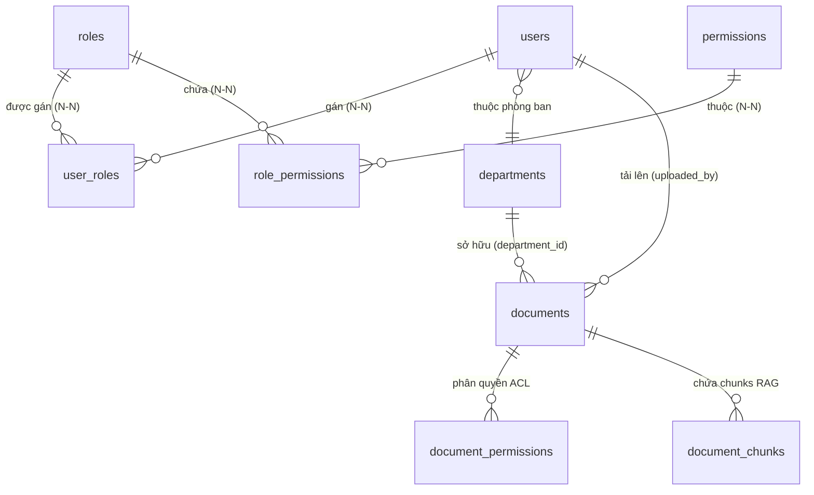

# Kiến Trúc Phân Quyền Đa Tầng & Kiểm Soát Truy Cập Tài Liệu Trong RAG

> **Tài liệu tham chiếu:** [`database/schema.dbml`](database/schema.dbml), [`database/V1__init.md`](database/V1__init.md), [`architecture.md`](architecture.md).  
> **Phạm vi áp dụng:** Phân hệ Định danh & Phân quyền (IAM Backend / Spring Boot 4 / Java 25) và Phân hệ Trí tuệ nhân tạo (AI Assistant & RAG Service / Python FastAPI + pgvector).

---

## 1. Tổng Quan Kiến Trúc Phân Quyền (Authorization Architecture)

Hệ thống triển khai mô hình phân quyền **2 tầng độc lập nhưng liên kết chặt chẽ**:

```text
                                  [ Client HTTP Request + JWT Bearer ]
                                                   │
                                                   ▼
┌────────────────────────────────────────────────────────────────────────────────────────────────────────┐
│ TẦNG 1: FUNCTIONAL RBAC (Spring Security & API Gateway)                                                │
│ - Xác thực người dùng (Authentication) qua JWT Token.                                                  │
│ - Kiểm tra quyền thao tác chức năng (Authorization): User có quyền `read:documents` không?             │
│ - Chặn ngay `403 Forbidden` tại Controller nếu không đủ quyền.                                         │
└──────────────────────────────────────────────────┬─────────────────────────────────────────────────────┘
                                                   │ Cho phép đi tiếp (Forward context)
                                                   ▼
┌────────────────────────────────────────────────────────────────────────────────────────────────────────┐
│ TẦNG 2: RESOURCE-LEVEL ACL & SECURE RAG RETRIEVAL (PostgreSQL pgvector)                                 │
│ - User được phép đọc CỤ THỂ TÀI LIỆU NÀO?                                                              │
│ - Ma trận 4 cấp độ: PUBLIC, INTERNAL, RESTRICTED (theo Department), CONFIDENTIAL (theo ACL).           │
│ - RAG Pre-filtering: Chỉ tìm kiếm vector trên các chunk thuộc tài liệu User được phép đọc.            │
└────────────────────────────────────────────────────────────────────────────────────────────────────────┘
```

---

## 2. Thiết Kế Cơ Sở Dữ Liệu Phân Quyền (IAM & Document ACL)

### 2.1. Cấu Trúc Bảng IAM (Multiple Roles + Fine-Grained Permissions)



1. **`users`**: Lưu thông tin định danh, trạng thái `enabled`, cờ `is_internal` (nhân viên nội bộ), và `department_id`.
2. **`roles`**: Danh mục vai trò nghiệp vụ (ví dụ: `ROLE_ADMIN`, `ROLE_MANAGER`, `ROLE_STAFF`, `ROLE_LEGAL_AUDITOR`).
3. **`permissions`**: Danh mục quyền hạn mức hạt mịn dạng `<action>:<resource>`:
   - `read:documents`: Quyền tra cứu và đọc tài liệu / hỏi RAG.
   - `write:documents`: Quyền tải lên và cập nhật phiên bản tài liệu.
   - `delete:documents`: Quyền xóa tài liệu.
   - `manage:permissions`: Quyền chia sẻ / cấp quyền tài liệu cho người khác.
   - `approve:actions`: Quyền phê duyệt tác vụ HITL.
4. **`user_roles`**: Cho phép một người dùng sở hữu **nhiều vai trò cùng lúc (Multiple Roles)**.
5. **`role_permissions`**: Gán danh sách permissions tương ứng cho từng vai trò.

### 2.2. Ma Trận Quyền Truy Cập Tài Liệu (Document Access Matrix)

Một tài liệu $D$ được phép đọc bởi người dùng $U$ nếu thỏa mãn **ít nhất 1 điều kiện**:

| Cấp độ bảo mật (`access_level`) | Điều kiện người dùng $U$ được phép đọc / RAG retrieve |
| :--- | :--- |
| **`PUBLIC`** | Mọi người dùng có quyền `read:documents` đều được đọc. |
| **`INTERNAL`** | Người dùng có cờ `is_internal = true` (thuộc tổ chức). |
| **`RESTRICTED`** | Người dùng có cùng phòng ban: `U.department_id = D.department_id`. |
| **`CONFIDENTIAL`** / Bất kỳ | Thỏa mãn một trong các điều kiện ACL tường minh:<br>1. $U$ là tác giả tải lên (`D.uploaded_by_user_id = U.id`).<br>2. Có bản ghi trong `document_permissions` khớp `subject_type = 'USER'` và `subject_id = U.id`.<br>3. Có bản ghi trong `document_permissions` khớp `subject_type = 'DEPARTMENT'` và `subject_id = U.department_id`.<br>4. Có bản ghi trong `document_permissions` khớp `subject_type = 'ROLE'` và `subject_id IN (U.role_ids)`. |

---

## 3. Áp Dụng Với Spring Security (Backend Java)

### 3.1. UserPrincipal & GrantedAuthority Mapping

Khi người dùng đăng nhập hoặc gửi JWT Token, hệ thống tổng hợp tất cả **Roles** và **Permissions** vào `UserPrincipal`:
- **Roles** (ví dụ: `ROLE_STAFF`, `ROLE_MANAGER`) và **Permissions** hạt mịn (ví dụ: `read:documents`, `write:documents`) được nạp trực tiếp vào danh sách `GrantedAuthority`.
- Thông tin định danh và ngữ cảnh phân quyền (`userId`, `departmentId`, `roleIds`, `isInternal`) được đóng gói thành `UserSecurityContext` để chuyển tiếp sang các tầng nghiệp vụ và phân hệ AI.

### 3.2. Bảo Vệ API Endpoint Bằng `@PreAuthorize`

Các endpoint được kiểm soát quyền hạn mức chức năng ngay tại tầng Controller thông qua Spring Security annotations:
- Kiểm tra quyền truy cập API: `@PreAuthorize("hasAuthority('read:documents')")`.
- Trích xuất `UserPrincipal` từ `@AuthenticationPrincipal` để chuyển `UserSecurityContext` xuống Use Case / AI Service.

---

## 4. Áp Dụng Với AI / RAG Service (Python FastAPI & pgvector)

### 4.1. Cấu Trúc Payload Context Phân Quyền

Khi Backend gọi sang AI Service (hoặc khi AI Service truy vấn trực tiếp CSDL), payload gửi kèm thông tin định danh:

```json
{
  "query": "Quy định về thời gian phê duyệt hồ sơ thầu dự án là bao lâu?",
  "top_k": 5,
  "user_context": {
    "user_id": 1024,
    "department_id": 3,
    "role_ids": [2, 5],
    "is_internal": true
  }
}
```

### 4.2. Pre-filtered Vector Search (Truy Vấn Lọc Quyền Đồng Thời)

Câu truy vấn kết hợp tính khoảng cách Vector Cosine (`<=>`) và kiểm tra điều kiện phân quyền tài liệu (ACL) trong **duy nhất 1 câu lệnh SQL thực thi trên PostgreSQL**:

```sql
SELECT 
    c.id,
    c.document_id,
    c.chunk_index,
    c.content,
    c.metadata,
    1 - (c.embedding <=> :query_vector) AS similarity_score
FROM document_chunks c
JOIN documents d ON c.document_id = d.id
WHERE d.deleted_at IS NULL
  AND d.processing_status = 'INDEXED'
  AND c.embedding IS NOT NULL
  AND (
    -- 1. Tài liệu Public: Ai có quyền đọc đều xem được
    d.access_level = 'PUBLIC'
    
    -- 2. Tài liệu Nội bộ: User thuộc nội bộ công ty
    OR (d.access_level = 'INTERNAL' AND :is_internal = TRUE)
    
    -- 3. Tài liệu Restricted theo phòng ban
    OR (d.access_level = 'RESTRICTED' AND d.department_id = :department_id)
    
    -- 4. Người tạo tài liệu
    OR (d.uploaded_by_user_id = :user_id)
    
    -- 5. Cấp quyền tường minh qua ACL document_permissions
    OR EXISTS (
        SELECT 1 FROM document_permissions dp
        WHERE dp.document_id = d.id
          AND (
            (dp.subject_type = 'USER' AND dp.subject_id = :user_id)
            OR (dp.subject_type = 'DEPARTMENT' AND dp.subject_id = :department_id)
            OR (dp.subject_type = 'ROLE' AND dp.subject_id = ANY(:role_ids))
          )
    )
  )
ORDER BY c.embedding <=> :query_vector
LIMIT :top_k;
```

### 4.3. Xử Lý Phản Hồi Khi Không Có Tài Liệu Khả Dụng (Anti-Hallucination)

Nếu câu truy vấn sau khi lọc phân quyền trả về **0 chunks**:
1. RAG Pipeline **không gửi context rỗng** cho LLM bịa câu trả lời.
2. Trả về thông điệp tiêu chuẩn kèm mã trạng thái `NO_ACCESSIBLE_KNOWLEDGE`:
   > *"Hệ thống không tìm thấy tài liệu phù hợp trong phạm vi quyền hạn được cấp của bạn để trả lời câu hỏi này."*
3. Ghi vết vào `audit_logs` sự kiện tra cứu thất bại do phạm vi quyền.

---

## 5. Tối Ưu Chỉ Mục CSDL (Database Indexing for Performance)

Để đảm bảo câu truy vấn Vector Search kèm ACL JOIN thực thi dưới 20ms:

```sql
-- 1. Index hỗ trợ JOIN và lọc trạng thái tài liệu
CREATE INDEX IF NOT EXISTS idx_documents_acl_lookup 
ON documents (id, access_level, department_id, uploaded_by_user_id) 
WHERE deleted_at IS NULL AND processing_status = 'INDEXED';

-- 2. Index hỗ trợ bảng phân quyền chi tiết
CREATE INDEX IF NOT EXISTS idx_doc_permissions_composite 
ON document_permissions (document_id, subject_type, subject_id);

-- 3. HNSW Index cho embedding đa chiều
CREATE INDEX IF NOT EXISTS idx_document_chunks_hnsw 
ON document_chunks USING hnsw (embedding vector_cosine_ops);
```

---

## 6. Tổng Kết Danh Mục Kiểm Tra (Verification Checklist)

- [x] Đã chuẩn hóa CSDL sang mô hình Multiple Roles (`users` $\leftrightarrow$ `user_roles` $\leftrightarrow$ `roles` $\leftrightarrow$ `role_permissions` $\leftrightarrow$ `permissions`).
- [x] Đã cập nhật [`database/schema.dbml`](database/schema.dbml) và [`database/V1__init.md`](database/V1__init.md).
- [x] Đã cấu hình phân quyền chức năng hạt mịn `read:documents` với Spring Security `@PreAuthorize`.
- [x] Đã thiết kế cơ chế **Pre-filtered Retrieval** trên `pgvector`, loại bỏ hoàn toàn rủi ro rò rỉ dữ liệu hoặc lỗi Recall Collapse của Post-filtering.
- [x] Đã định nghĩa cơ chế từ chối trả lời an toàn khi không tìm thấy tài liệu trong phạm vi quyền hạn.
